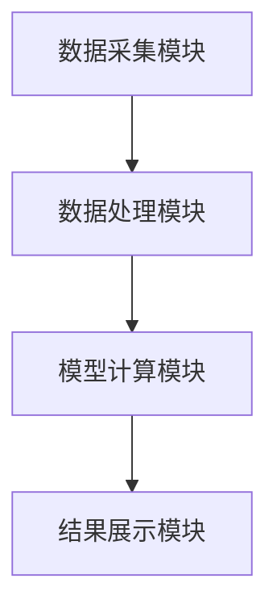
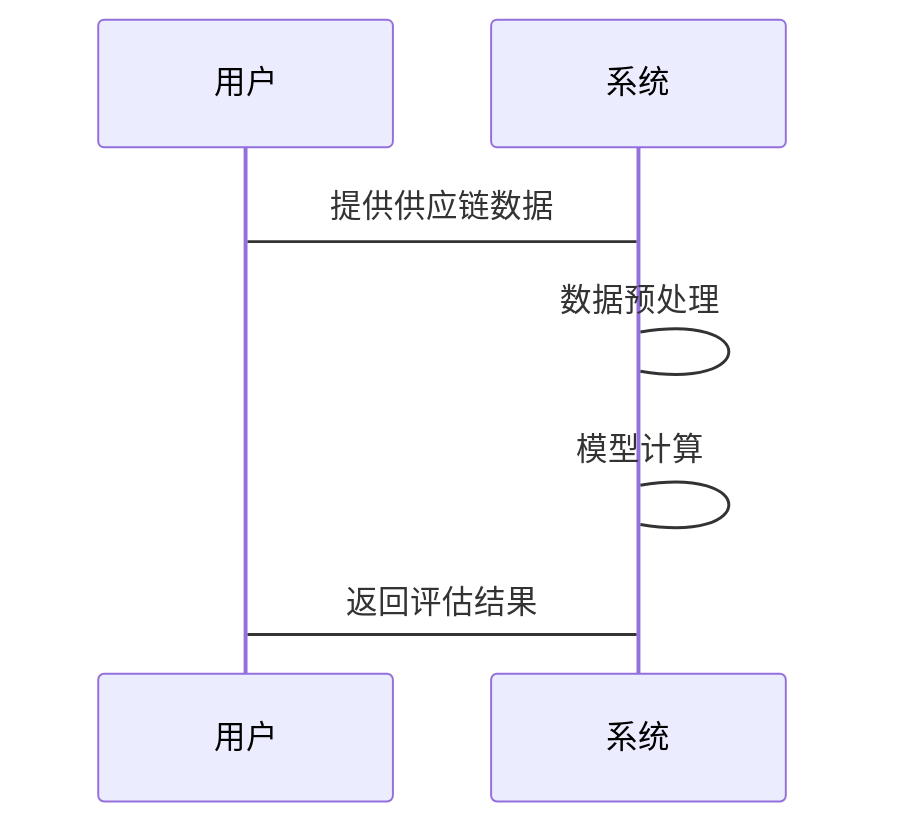

                 


# AI智能体在评估公司供应链弹性中的作用

## 关键词：供应链弹性，AI智能体，风险管理，动态监控，优化决策

## 摘要：  
供应链弹性是企业在面对市场波动、自然灾害等不确定性时维持正常运营的能力。随着全球化的深入，供应链的复杂性增加，传统的供应链管理方法难以应对日益复杂的挑战。AI智能体作为一种新兴的技术工具，能够通过实时数据分析、预测和自适应调整，显著提升供应链弹性的评估和优化能力。本文将从供应链弹性的核心概念、AI智能体的基本原理、算法实现、系统设计、项目实战等方面，详细探讨AI智能体在供应链弹性评估中的作用。

---

## 第一部分：供应链弹性与AI智能体基础

### 第1章：供应链弹性的概念与挑战

#### 1.1 供应链弹性的定义与重要性
供应链弹性是指企业在面对外部环境变化（如市场需求波动、供应商问题、自然灾害等）时，能够快速调整和恢复的能力。弹性供应链能够减少中断对企业的影响，提高企业的抗风险能力。

**供应链弹性的关键特征：**
- **灵活性**：快速调整供应链的生产能力。
- **冗余性**：在关键环节设置备用方案。
- **实时监控**：及时发现和应对潜在风险。
- **自适应性**：根据实时数据动态调整供应链策略。

供应链弹性的重要性体现在企业能够在复杂多变的市场环境中保持稳定运营，降低运营成本，提高客户满意度，并增强企业的长期竞争力。

#### 1.2 供应链弹性评估的挑战
供应链弹性评估涉及多个环节和复杂因素，主要挑战包括：
- **数据获取难度**：供应链涉及多个环节和参与者，数据分散且难以整合。
- **预测准确性**：传统的统计方法难以捕捉供应链中的非线性关系。
- **动态变化**：供应链环境不断变化，静态模型难以适应动态需求。

#### 1.3 AI智能体的基本概念
AI智能体是一种具有感知环境、自主决策和执行任务的智能系统。与传统算法相比，AI智能体具有以下特点：
- **自主性**：能够在没有人工干预的情况下独立运行。
- **反应性**：能够根据环境变化实时调整行为。
- **学习能力**：通过机器学习算法不断优化决策模型。

AI智能体在供应链管理中的应用，能够显著提升供应链弹性的评估和优化能力。

---

### 第2章：AI智能体在供应链管理中的作用

#### 2.1 AI智能体在供应链管理中的应用领域
AI智能体在供应链管理中的应用包括以下几个方面：
- **风险预测**：通过分析历史数据和实时信息，预测供应链中的潜在风险。
- **优化决策**：利用AI智能体的自适应能力，优化供应链的各个环节。
- **动态监控**：实时监控供应链的运行状态，及时发现和解决问题。

#### 2.2 AI智能体的优势与局限性
**AI智能体的优势：**
- **高效性**：能够快速处理大量数据，提高决策效率。
- **准确性**：通过机器学习算法，提高预测的准确性。
- **适应性**：能够根据环境变化自动调整策略。

**AI智能体的局限性：**
- **数据依赖性**：AI智能体的性能依赖于数据的质量和数量。
- **黑箱问题**：AI智能体的决策过程难以解释。
- **技术门槛**：AI智能体的开发和部署需要较高的技术能力。

---

## 第二部分：AI智能体在供应链弹性评估中的核心原理

### 第3章：供应链弹性评估的数学模型

#### 3.1 供应链弹性评估的优化模型
供应链弹性评估的优化模型包括以下几种：
- **线性规划模型**：用于优化供应链中的资源分配问题。
- **非线性规划模型**：用于处理复杂的非线性关系。
- **综合评估模型**：结合多种因素，进行全面评估。

#### 3.2 AI智能体的算法原理
AI智能体的算法主要包括以下几种：
- **神经网络模型**：通过神经网络对供应链数据进行深度学习。
- **强化学习模型**：通过强化学习优化供应链的决策过程。
- **聚类分析模型**：通过聚类分析发现供应链中的潜在问题。

### 第4章：AI智能体的算法实现

#### 4.1 供应链弹性评估的算法流程
供应链弹性评估的算法流程包括以下步骤：
1. **数据预处理**：对数据进行清洗和标准化处理。
2. **模型训练**：利用训练数据训练AI智能体的模型。
3. **模型评估**：通过测试数据评估模型的性能。

#### 4.2 算法实现的代码示例
以下是供应链弹性评估算法的Python代码示例：

```python
import numpy as np
import pandas as pd
from sklearn.neural_network import MLPRegressor

# 数据加载
data = pd.read_csv('supply_chain_data.csv')

# 数据预处理
X = data[['demand', 'lead_time', 'cost']]
y = data['risk_score']

# 模型训练
model = MLPRegressor(hidden_layer_sizes=(100, 10))
model.fit(X, y)

# 模型预测
new_data = np.array([[100, 15, 20]])
predicted_risk = model.predict(new_data)

print(f'预测风险值：{predicted_risk[0]:.2f}')
```

---

## 第三部分：系统设计与架构

### 第5章：供应链弹性评估系统的架构设计

#### 5.1 系统功能模块划分
供应链弹性评估系统的功能模块包括：
- **数据采集模块**：负责采集供应链的相关数据。
- **模型计算模块**：负责对数据进行建模和计算。
- **结果展示模块**：负责展示评估结果。

#### 5.2 系统架构设计
供应链弹性评估系统的架构设计如下：



### 第6章：系统接口与交互设计

#### 6.1 系统接口设计
供应链弹性评估系统的接口设计如下：



---

## 第四部分：项目实战

### 第7章：供应链弹性评估项目的实施

#### 7.1 项目环境配置
供应链弹性评估项目的环境配置包括：
- **Python 3.8及以上版本**
- **TensorFlow 2.0及以上版本**
- **Pandas和NumPy库**

#### 7.2 核心代码实现
以下是供应链弹性评估项目的Python代码实现：

```python
import tensorflow as tf
from tensorflow.keras import layers

# 模型构建
model = tf.keras.Sequential([
    layers.Dense(64, activation='relu', input_shape=(3,)),
    layers.Dense(32, activation='relu'),
    layers.Dense(1, activation='sigmoid')
])

# 模型编译
model.compile(optimizer='adam', loss='binary_crossentropy', metrics=['accuracy'])

# 模型训练
model.fit(X_train, y_train, epochs=100, batch_size=32)
```

#### 7.3 项目小结
通过实际项目的实施，我们可以看到AI智能体在供应链弹性评估中的巨大潜力。AI智能体不仅能够提高供应链弹性的评估效率，还能够帮助企业优化供应链管理策略，降低运营风险。

---

## 总结

供应链弹性是企业在复杂市场环境中保持稳定运营的关键能力。AI智能体作为一种新兴的技术工具，能够通过实时数据分析、预测和自适应调整，显著提升供应链弹性的评估和优化能力。本文通过详细探讨供应链弹性的核心概念、AI智能体的基本原理、算法实现、系统设计和项目实战，展示了AI智能体在供应链弹性评估中的重要作用。未来，随着AI技术的不断发展，AI智能体在供应链管理中的应用将更加广泛，为企业创造更大的价值。

---

## 作者：AI天才研究院/AI Genius Institute & 禅与计算机程序设计艺术 /Zen And The Art of Computer Programming

