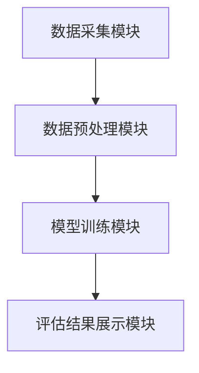
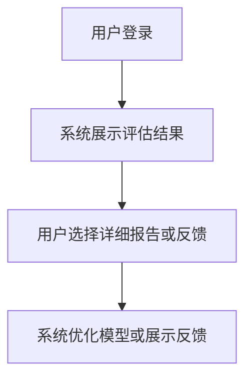

                 


# AI智能体在评估公司创新文化和创新能力中的应用

## 关键词：AI智能体，创新文化，创新能力，企业评估，机器学习

## 摘要：随着人工智能技术的快速发展，AI智能体在企业创新文化和创新能力评估中的应用日益广泛。本文将详细探讨AI智能体的核心原理、算法实现、系统架构设计以及实际项目案例，帮助读者全面了解如何利用AI技术提升企业创新能力评估的效率和准确性。

---

## 第1章：AI智能体与创新文化概述

### 1.1 AI智能体的基本概念

#### 1.1.1 AI智能体的定义与核心特征
AI智能体（Artificial Intelligence Agent，简称AI Agent）是指具有感知环境、自主决策和执行任务能力的智能系统。其核心特征包括：
- **自主性**：能够在没有外部干预的情况下独立运作。
- **反应性**：能够实时感知环境并做出相应的反应。
- **目标导向性**：具有明确的目标，并通过决策和行动来实现这些目标。

#### 1.1.2 AI智能体与传统AI的区别
传统的AI技术（如机器学习和数据挖掘）主要依赖于预定义的规则和数据模式识别，而AI智能体则具备更强的自主性和适应性，能够在动态环境中主动学习和调整策略。

#### 1.1.3 AI智能体在企业中的应用前景
AI智能体在企业中的应用前景广阔，尤其是在创新文化评估和创新能力提升方面。通过AI智能体，企业可以实时监控创新环境，识别潜在的创新机会，并制定相应的策略。

### 1.2 创新文化与创新能力的定义

#### 1.2.1 创新文化的内涵与外延
创新文化是指企业内部鼓励创新、支持员工发挥创造力的文化氛围。它包括组织结构、激励机制、知识共享等多个方面。

#### 1.2.2 创新能力的构成与评估维度
创新能力是指企业在市场中快速响应变化、开发新产品和服务的能力。评估创新能力的维度包括创新投入、创新产出、创新效率等。

#### 1.2.3 企业创新文化与创新能力的关系
企业创新文化是创新能力的基础。良好的创新文化能够激发员工的创造力，从而提升企业的创新能力。

### 1.3 问题背景与研究意义

#### 1.3.1 当前企业创新评估的痛点
当前企业在创新评估中存在以下问题：
- 评估指标单一，难以全面反映创新能力。
- 评估过程耗时长，成本高。
- 数据分析能力有限，难以从海量数据中提取有价值的信息。

#### 1.3.2 AI智能体在创新评估中的优势
AI智能体能够实时分析企业内外部数据，快速识别创新机会，并提供个性化的建议，从而显著提升创新评估的效率和准确性。

#### 1.3.3 本研究的创新点与意义
本研究的创新点在于将AI智能体技术应用于创新文化评估，通过构建动态评估模型，帮助企业实时监控创新能力，从而为企业制定创新战略提供数据支持。

---

## 第2章：AI智能体的核心原理

### 2.1 AI智能体的决策机制

#### 2.1.1 基于规则的决策模型
基于规则的决策模型通过预定义的规则来指导智能体的行动。例如，当某个指标达到阈值时，触发相应的行动。

#### 2.1.2 基于机器学习的决策模型
基于机器学习的决策模型通过训练数据来学习决策模式，并根据新的数据做出预测。这种方法适用于复杂且动态变化的环境。

#### 2.1.3 基于强化学习的决策模型
基于强化学习的决策模型通过与环境的交互来学习最优策略。智能体会根据环境反馈调整自己的行为，以最大化奖励。

### 2.2 创新文化评估的指标体系

#### 2.2.1 创新文化评估的核心维度
- 创新氛围：员工是否愿意提出新想法。
- 创新资源：企业是否提供足够的资源支持创新。
- 创新机制：企业是否有有效的创新管理机制。

#### 2.2.2 指标权重的确定方法
指标权重的确定方法包括层次分析法（AHP）和熵值法等。这些方法可以帮助企业确定各个指标的重要性。

#### 2.2.3 数据来源与数据预处理
数据来源包括企业内部数据（如员工反馈、项目数据）和外部数据（如行业趋势、市场数据）。数据预处理包括数据清洗、特征提取和数据标准化。

---

## 第3章：基于机器学习的创新文化评估模型

### 3.1 模型概述

#### 3.1.1 模型的输入与输出
模型的输入包括员工反馈、项目数据等，输出包括创新文化评估结果和改进建议。

#### 3.1.2 模型的训练与优化
模型的训练采用监督学习方法，使用历史数据进行训练，并通过交叉验证进行优化。

### 3.2 算法实现

#### 3.2.1 数据预处理与特征提取
数据预处理包括去除缺失值和异常值。特征提取包括将文本数据转化为数值特征。

#### 3.2.2 神经网络模型的构建
构建一个深度神经网络模型，包括输入层、隐藏层和输出层。模型采用ReLU激活函数和Adam优化器。

#### 3.2.3 模型训练与评估
模型采用训练集进行训练，并在测试集上进行评估。评估指标包括准确率、召回率和F1分数。

---

## 第4章：AI智能体评估系统架构

### 4.1 系统功能设计

#### 4.1.1 数据采集模块
数据采集模块负责收集企业内外部数据，包括员工反馈、项目数据和市场数据。

#### 4.1.2 模型训练模块
模型训练模块负责对收集到的数据进行预处理和特征提取，并训练评估模型。

#### 4.1.3 评估结果展示模块
评估结果展示模块将模型输出的评估结果以可视化的方式展示给用户，并提供改进建议。

### 4.2 系统架构图

#### 4.2.1 系统架构的Mermaid图


#### 4.2.2 模块之间的交互关系
模块之间的交互关系如下：
1. 数据采集模块将数据传输给数据预处理模块。
2. 数据预处理模块对数据进行清洗和特征提取，并将结果传输给模型训练模块。
3. 模型训练模块训练模型，并将评估结果传输给评估结果展示模块。
4. 评估结果展示模块将结果以可视化的方式展示给用户。

---

## 第5章：项目实战与案例分析

### 5.1 环境安装

#### 5.1.1 安装Python环境
安装Python 3.8及以上版本，并安装必要的库，如TensorFlow、Keras和Scikit-learn。

#### 5.1.2 安装依赖库
运行以下命令安装依赖库：
```bash
pip install numpy pandas scikit-learn tensorflow
```

### 5.2 系统核心实现源代码

#### 5.2.1 数据预处理代码
```python
import pandas as pd
import numpy as np

# 读取数据
data = pd.read_csv('创新文化数据.csv')

# 删除缺失值
data.dropna(inplace=True)

# 去除异常值
data = data[(data['创新投入'] < data['创新投入'].quantile(0.95))]
```

#### 5.2.2 神经网络模型代码
```python
import tensorflow as tf
from tensorflow import keras

# 定义模型
model = keras.Sequential([
    keras.layers.Dense(64, activation='relu'),
    keras.layers.Dense(32, activation='relu'),
    keras.layers.Dense(1, activation='sigmoid')
])

# 编译模型
model.compile(optimizer='adam', loss='binary_crossentropy', metrics=['accuracy'])

# 训练模型
model.fit(x_train, y_train, epochs=10, batch_size=32)
```

#### 5.2.3 评估结果展示代码
```python
import matplotlib.pyplot as plt

# 绘制评估结果
plt.plot(history.history['accuracy'])
plt.title('模型准确率')
plt.xlabel('训练轮数')
plt.ylabel('准确率')
plt.show()
```

### 5.3 案例分析

#### 5.3.1 案例背景
某高科技公司希望评估其创新文化，并通过AI智能体提出改进建议。

#### 5.3.2 数据分析
通过对员工反馈和项目数据的分析，发现公司的创新投入不足，创新氛围较弱。

#### 5.3.3 模型输出
模型评估结果显示，公司的创新文化得分为65分（满分100分），建议增加创新资源投入和优化创新机制。

---

## 第6章：系统交互与流程优化

### 6.1 系统交互设计

#### 6.1.1 用户需求分析
用户需求包括：
- 实时监控创新文化。
- 获取个性化的改进建议。
- 可视化展示评估结果。

#### 6.1.2 系统功能流程
1. 用户登录系统。
2. 系统展示创新文化评估结果。
3. 用户选择查看详细报告或提出反馈。
4. 系统根据反馈优化模型。

### 6.2 系统交互流程图

#### 6.2.1 交互流程的Mermaid图


---

## 第7章：总结与展望

### 7.1 研究总结
本文详细探讨了AI智能体在创新文化评估中的应用，提出了基于机器学习的评估模型，并通过实际案例验证了模型的有效性。

### 7.2 最佳实践 tips
- 在实际应用中，建议企业结合自身特点调整评估指标和模型参数。
- 定期更新模型以适应市场变化和企业需求。

### 7.3 未来展望
未来，随着AI技术的不断发展，AI智能体在创新文化评估中的应用将更加智能化和个性化。同时，如何解决模型的可解释性和数据隐私问题也是未来研究的重要方向。

---

## 作者：AI天才研究院（AI Genius Institute） & 禅与计算机程序设计艺术（Zen And The Art of Computer Programming）

---

### END

