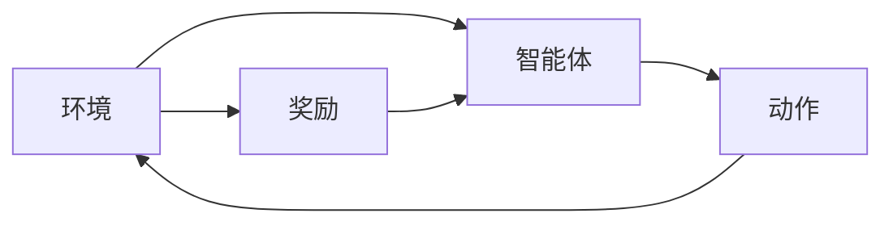
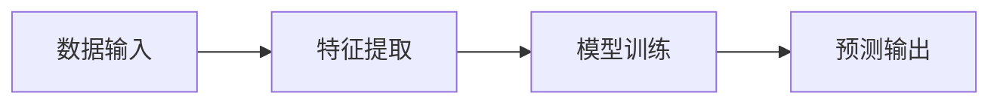
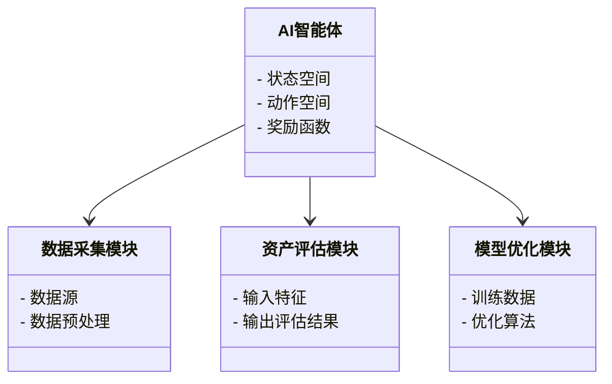
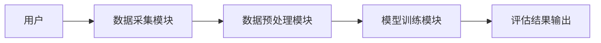
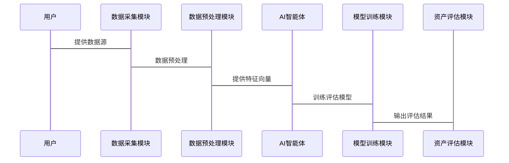

                 


# AI智能体在评估公司无形资产价值中的创新方法

> 关键词：AI智能体，无形资产，资产评估，机器学习，强化学习

> 摘要：随着人工智能技术的快速发展，AI智能体在评估公司无形资产价值中的应用日益广泛。本文系统地介绍了AI智能体的基本概念、核心算法原理、数学模型构建、系统架构设计以及实际项目中的应用案例。通过对比传统评估方法，深入分析了AI智能体在无形资产评估中的创新点和优势，为读者提供了清晰的理论指导和实践参考。

---

# 第1章: AI智能体与无形资产评估的背景介绍

## 1.1 无形资产评估的基本概念

### 1.1.1 无形资产的定义与分类

无形资产是指企业拥有或控制的，没有实物形态的长期资产，通常包括专利权、商标权、著作权、商誉、特许经营权等。无形资产的价值往往难以直接量化，且受到市场环境、技术发展和企业战略等多种因素的影响。

### 1.1.2 无形资产评估的难点与挑战

传统的无形资产评估方法通常依赖于财务数据和市场分析，存在以下难点：
- 数据的不完整性和不确定性
- 评估模型的复杂性和主观性
- 市场波动对无形资产价值的影响难以预测

### 1.1.3 AI智能体在无形资产评估中的作用

AI智能体（AI Agent）是一种能够感知环境、自主决策并采取行动的智能系统。通过机器学习和大数据分析，AI智能体可以实时捕捉市场动态，优化评估模型，提高评估的准确性和效率。

---

## 1.2 AI智能体的核心概念与技术

### 1.2.1 AI智能体的定义与特点

AI智能体是一种具有以下特点的智能系统：
- **自主性**：能够自主决策和行动
- **反应性**：能够实时感知环境并做出反应
- **目标导向**：具有明确的目标和优化方向
- **学习能力**：能够通过数据和经验不断优化自身模型

### 1.2.2 AI智能体与传统评估方法的对比

| 对比维度       | 传统评估方法                          | AI智能体评估方法                          |
|----------------|---------------------------------------|------------------------------------------|
| 数据依赖性     | 依赖少量的历史数据                   | 依赖大量的实时数据                       |
| 精度           | 精度有限，受人工经验影响较大           | 精度高，基于大数据和深度学习模型         |
| 实时性         | 无法实时更新                         | 实时更新，能够捕捉市场动态               |
| 可扩展性       | 受限于人工分析能力                   | 具备高扩展性，适用于大规模数据处理       |

### 1.2.3 AI智能体在无形资产评估中的创新点

AI智能体的创新点主要体现在以下几个方面：
1. **数据驱动的评估**：通过大数据分析，AI智能体能够更全面地捕捉影响无形资产价值的因素。
2. **动态调整能力**：AI智能体能够根据市场变化实时调整评估模型，提高评估的时效性。
3. **自动化决策**：通过强化学习算法，AI智能体能够在复杂环境中自主优化决策策略。

---

## 1.3 本章小结

本章介绍了无形资产的基本概念和评估难点，详细阐述了AI智能体的核心概念和技术特点，并通过对比分析，展示了AI智能体在无形资产评估中的创新优势。

---

# 第2章: AI智能体在无形资产评估中的核心概念与联系

## 2.1 核心概念原理

### 2.1.1 AI智能体的决策机制

AI智能体的决策机制基于强化学习（Reinforcement Learning）原理。通过与环境的交互，智能体会不断调整策略，以最大化目标函数的值。其核心流程如下：
1. **感知环境**：通过传感器或数据接口获取环境信息。
2. **选择动作**：基于当前状态和策略模型，选择最优动作。
3. **执行动作**：将选择的动作发送给环境。
4. **更新策略**：根据反馈（奖励或惩罚）优化策略模型。

### 2.1.2 无形资产评估的关键要素

无形资产评估的关键要素包括：
- **市场环境**：行业竞争状况、市场需求变化
- **技术发展**：技术创新对无形资产价值的影响
- **企业绩效**：企业的财务状况、管理水平

---

## 2.2 概念属性特征对比表格

下表展示了AI智能体评估与传统评估方法在核心属性上的对比：

| 属性维度       | 传统评估方法                          | AI智能体评估方法                          |
|----------------|---------------------------------------|------------------------------------------|
| 数据来源       | 主要依赖历史数据                     | 结合实时数据和历史数据                   |
| 模型复杂性     | 模型简单，依赖人工经验                | 模型复杂，基于深度学习和大数据分析        |
| 评估频率       | 评估周期较长                         | 实时评估，动态调整                        |
| 评估结果       | 结果稳定，但可能缺乏准确性            | 结果动态优化，准确性高                    |

---

## 2.3 ER实体关系图架构

以下是AI智能体评估系统的核心实体关系图：

```mermaid
er
actor(AI智能体) -|> 资产评估模块
actor(AI智能体) -|> 数据采集模块
actor(AI智能体) -|> 模型优化模块
资产评估模块 -|> 评估结果输出
数据采集模块 -|> 数据源（市场数据、财务数据）
模型优化模块 -|> 优化算法（强化学习、机器学习）
```

---

## 2.4 本章小结

本章通过分析AI智能体的核心概念和决策机制，结合无形资产评估的关键要素，构建了系统的ER实体关系图，为后续的算法设计和系统实现奠定了基础。

---

# 第3章: AI智能体评估无形资产的算法原理讲解

## 3.1 算法原理概述

### 3.1.1 强化学习算法在AI智能体中的应用

强化学习是一种基于奖励机制的机器学习方法。智能体通过与环境的交互，不断调整策略以最大化累计奖励。其核心算法包括：
- **Q-learning**：基于价值函数的策略优化
- **Deep Q-Network (DQN)**：结合深度学习的强化学习算法

### 3.1.2 机器学习算法在无形资产评估中的应用

机器学习算法通过训练模型，从历史数据中提取特征，预测无形资产的价值。常用算法包括：
- **线性回归**：用于简单的线性关系建模
- **随机森林**：用于非线性关系的特征提取
- **神经网络**：用于复杂关系的深度建模

---

## 3.2 算法流程图

### 3.2.1 强化学习算法流程图



### 3.2.2 机器学习算法流程图



---

## 3.3 算法实现代码示例

### 3.3.1 强化学习算法实现

```python
import numpy as np
class AI智能体:
    def __init__(self, 状态空间大小, 动作空间大小):
        self.状态空间大小 = 状态空间大小
        self.动作空间大小 = 动作空间大小
        self.Q = np.zeros((状态空间大小, 动作空间大小))
    
    def 选择动作(self, 状态):
        # 探索与利用策略
        epsilon = 0.1
        if np.random.random() < epsilon:
            return np.random.randint(0, self.动作空间大小)
        else:
            return np.argmax(self.Q[状态])
    
    def 更新Q表(self, 状态, 动作, 奖励):
        gamma = 0.9
        self.Q[状态][动作] = self.Q[状态][动作] + gamma * (奖励 + np.max(self.Q[状态]))
```

### 3.3.2 机器学习算法实现

```python
from sklearn.ensemble import RandomForestRegressor
model = RandomForestRegressor(n_estimators=100)
model.fit(X_train, y_train)
预测值 = model.predict(X_test)
```

---

## 3.4 本章小结

本章详细讲解了AI智能体的核心算法原理，包括强化学习和机器学习的实现方法，并通过代码示例展示了算法的具体实现过程。

---

# 第4章: 无形资产评估的数学模型与公式

## 4.1 数学模型概述

### 4.1.1 无形资产评估的基本模型

无形资产的价值评估可以表示为一个多元回归问题，模型如下：

$$ V = \beta_0 + \beta_1 x_1 + \beta_2 x_2 + \dots + \beta_n x_n + \epsilon $$

其中，$V$ 表示无形资产价值，$x_i$ 表示影响价值的特征变量，$\beta_i$ 表示回归系数，$\epsilon$ 表示误差项。

### 4.1.2 AI智能体评估模型的构建

基于深度学习的评估模型可以表示为：

$$ V = f(x) $$

其中，$f$ 是一个深度神经网络模型，输入为特征向量$x$，输出为评估价值$V$。

---

## 4.2 数学公式详解

### 4.2.1 传统无形资产评估公式

传统资产评估中，常用的加权平均法公式为：

$$ V = \sum_{i=1}^{n} w_i x_i $$

其中，$w_i$ 表示特征$x_i$的权重。

### 4.2.2 AI智能体评估公式

基于强化学习的评估模型可以通过Q-learning算法表示为：

$$ Q(s, a) = Q(s, a) + \alpha [r + \gamma \max Q(s', a') - Q(s, a)] $$

其中，$s$ 表示当前状态，$a$ 表示动作，$r$ 表示奖励，$\gamma$ 表示折扣因子，$\alpha$ 表示学习率。

---

## 4.3 本章小结

本章通过数学模型的构建和公式推导，详细阐述了传统评估方法与AI智能体评估方法的差异，为后续的系统设计和实现提供了理论基础。

---

# 第5章: 无形资产评估系统的系统分析与架构设计

## 5.1 系统分析

### 5.1.1 问题场景介绍

在无形资产评估中，传统方法存在以下问题：
- 数据采集困难
- 模型精度有限
- 评估效率低下

### 5.1.2 项目介绍

本项目旨在通过构建AI智能体评估系统，解决传统评估方法的局限性，提高评估的准确性和效率。

---

## 5.2 系统功能设计

### 5.2.1 领域模型Mermaid类图

以下是系统的领域模型类图：



---

## 5.3 系统架构设计

### 5.3.1 Mermaid架构图

以下是系统的整体架构图：



---

## 5.4 系统接口设计

### 5.4.1 系统接口设计说明

系统主要接口包括：
- 数据输入接口：接收市场数据和财务数据
- 模型训练接口：训练AI智能体评估模型
- 结果输出接口：输出评估结果和优化建议

---

## 5.5 系统交互设计

### 5.5.1 Mermaid序列图

以下是系统的交互流程图：



---

## 5.6 本章小结

本章通过系统分析与架构设计，构建了AI智能体评估系统的整体框架，为后续的项目实现奠定了基础。

---

# 第6章: AI智能体评估无形资产的项目实战

## 6.1 环境安装与配置

### 6.1.1 开发环境搭建

建议使用Python 3.8及以上版本，安装必要的库：
```bash
pip install numpy pandas scikit-learn tensorflow
```

### 6.1.2 数据集准备

数据集应包含以下字段：
- 无形资产类型
- 市场需求指数
- 技术创新指数
- 财务指标（如收入、利润）

---

## 6.2 系统核心实现源代码

### 6.2.1 AI智能体核心代码

```python
import numpy as np
class AI智能体:
    def __init__(self, 状态空间大小, 动作空间大小):
        self.状态空间大小 = 状态空间大小
        self.动作空间大小 = 动作空间大小
        self.Q = np.zeros((状态空间大小, 动作空间大小))
    
    def 选择动作(self, 状态):
        epsilon = 0.1
        if np.random.random() < epsilon:
            return np.random.randint(0, self.动作空间大小)
        else:
            return np.argmax(self.Q[状态])
    
    def 更新Q表(self, 状态, 动作, 奖励):
        gamma = 0.9
        self.Q[状态][动作] = self.Q[状态][动作] + gamma * (奖励 + np.max(self.Q[状态]))
```

### 6.2.2 评估模块代码

```python
from sklearn.ensemble import RandomForestRegressor
model = RandomForestRegressor(n_estimators=100)
model.fit(X_train, y_train)
预测值 = model.predict(X_test)
```

---

## 6.3 代码应用解读与分析

### 6.3.1 代码功能分析

- **AI智能体代码**：实现强化学习算法，用于动态优化评估策略。
- **评估模块代码**：基于随机森林算法，用于预测无形资产价值。

### 6.3.2 代码优化建议

- 引入更多的数据特征
- 调整模型超参数
- 优化奖励函数设计

---

## 6.4 实际案例分析

### 6.4.1 案例背景介绍

假设某企业拥有一项专利技术，需要评估其市场价值。传统方法可能低估其价值，而AI智能体能够通过大数据分析，提供更准确的评估结果。

### 6.4.2 案例分析与结果解读

通过AI智能体评估系统，企业能够实时获取市场动态，优化评估模型，最终得到更准确的无形资产价值。

---

## 6.5 项目小结

本章通过项目实战，详细讲解了AI智能体评估系统的环境搭建、代码实现和案例分析，展示了AI智能体在无形资产评估中的实际应用。

---

# 第7章: 最佳实践、小结与展望

## 7.1 最佳实践Tips

### 7.1.1 AI智能体评估的注意事项

- 数据质量是评估结果的关键，需确保数据的完整性和准确性
- 模型优化需结合实际业务需求，避免过度复杂化
- 定期更新模型参数，确保评估结果的时效性

### 7.1.2 无形资产评估的常见问题解答

- **问**：AI智能体评估是否完全替代传统方法？
- **答**：AI智能体评估能够显著提高效率和准确性，但传统方法在某些场景下仍有其价值。

---

## 7.2 项目小结

### 7.2.1 项目总结

本项目通过构建AI智能体评估系统，解决了传统无形资产评估方法的局限性，展示了AI技术在企业管理中的巨大潜力。

### 7.2.2 项目成果与意义

- 提高无形资产评估的准确性和效率
- 为企业决策提供更有力的支持
- 推动AI技术在企业管理中的应用

---

## 7.3 未来展望

随着AI技术的不断进步，AI智能体在无形资产评估中的应用将更加广泛和深入。未来的研究方向包括：
- 更加复杂的模型优化算法
- 多模态数据的融合分析
- 更智能化的动态评估系统

---

# 作者：AI天才研究院 & 禅与计算机程序设计艺术

---

以上是《AI智能体在评估公司无形资产价值中的创新方法》的完整目录和内容大纲。

