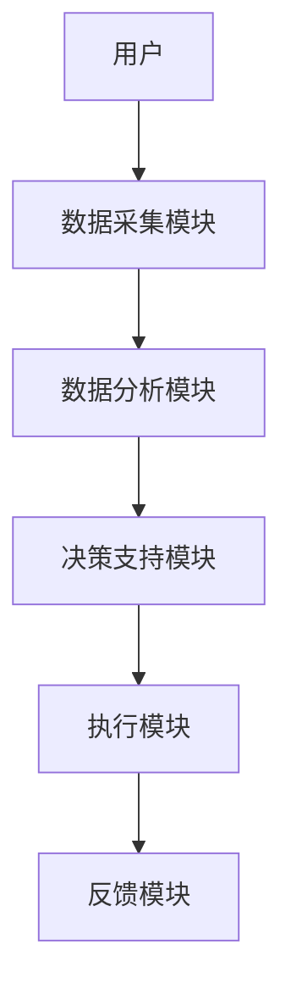
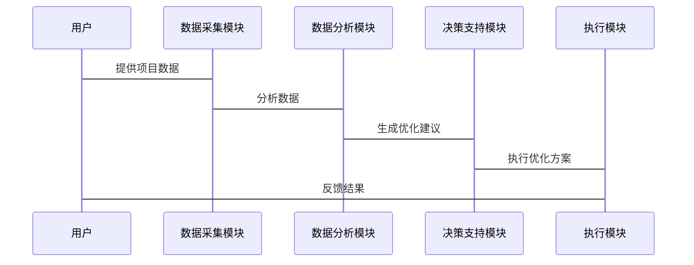

                 


# AI智能体在评估公司研发效率中的作用

---

## 关键词：AI智能体、研发效率、项目管理、算法原理、系统架构

---

## 摘要：  
随着人工智能技术的快速发展，AI智能体在公司研发效率评估中的作用日益凸显。本文深入探讨了AI智能体的核心概念、算法原理、系统架构及其在研发效率评估中的实际应用。通过分析AI智能体如何通过数据驱动的方法优化项目管理、资源分配和风险控制，本文为读者提供了一种高效、智能的解决方案，以提升公司的研发效率。  

---

## 正文

---

### 第一部分：AI智能体在公司研发效率评估中的背景与概念

#### 第1章：AI智能体与研发效率评估概述

##### 1.1 AI智能体的基本概念  
AI智能体（Artificial Intelligence Agent）是一种能够感知环境、做出决策并执行操作的智能系统。它具备以下特点：  
- **自主性**：能够在没有外部干预的情况下独立运作。  
- **反应性**：能够根据环境变化实时调整行为。  
- **目标导向**：通过设定目标来优化决策和行动。  

在研发效率评估中，AI智能体可以用于优化项目管理、资源分配和团队协作。例如，它可以通过分析项目进度、资源利用率和团队绩效来帮助公司做出更高效的决策。  

##### 1.2 AI智能体在研发效率评估中的作用  
AI智能体在研发效率评估中的作用主要体现在以下几个方面：  
- **实时监控**：通过实时数据采集和分析，AI智能体能够快速识别项目中的潜在问题并提供解决方案。  
- **智能推荐**：基于历史数据和模式识别，AI智能体可以为团队提供任务优先级排序和资源分配建议。  
- **预测与优化**：通过机器学习算法，AI智能体可以预测项目进度和资源需求，从而优化研发流程。  

##### 1.3 研发效率评估的核心要素  
研发效率评估的核心要素包括：  
1. **项目进度**：项目的实际进度与计划的偏差程度。  
2. **资源利用率**：资源（如人力、时间和预算）的使用效率。  
3. **团队协作**：团队成员之间的沟通与协作效率。  
4. **质量控制**：项目的最终成果是否符合预期的质量标准。  

---

#### 第2章：AI智能体与研发效率评估的核心概念

##### 2.1 AI智能体的核心原理  
AI智能体的核心原理包括感知、决策和执行三个阶段：  
- **感知**：通过传感器或数据输入获取环境信息。  
- **决策**：基于感知到的信息，利用算法做出最优决策。  
- **执行**：根据决策结果执行相应的操作。  

在研发效率评估中，AI智能体通过感知项目数据、决策优化方案并执行调整措施，从而提升研发效率。  

##### 2.2 研发效率评估的核心要素  
研发效率评估的核心要素包括：  
- **项目管理**：包括任务分配、进度跟踪和风险控制。  
- **资源分配**：包括人力、时间和预算的合理分配。  
- **质量控制**：包括代码审查、测试和部署的效率。  

##### 2.3 AI智能体与研发效率评估的关联  
AI智能体通过以下方式与研发效率评估密切相关：  
- **数据驱动**：AI智能体利用大数据分析技术，从历史数据中提取模式和规律。  
- **智能推荐**：AI智能体可以根据项目需求推荐最优的资源分配方案。  
- **实时反馈**：AI智能体能够实时监控项目进度并提供反馈，帮助团队快速调整策略。  

---

### 第二部分：AI智能体的算法原理与数学模型

#### 第3章：AI智能体的算法原理  

##### 3.1 强化学习算法  
强化学习是一种通过试错方式优化决策的算法。在研发效率评估中，强化学习可以用于优化资源分配和任务优先级排序。  

##### 3.2 监督学习算法  
监督学习是一种基于标记数据进行预测的算法。在研发效率评估中，监督学习可以用于预测项目进度和资源需求。  

##### 3.3 聚类算法  
聚类算法是一种将相似的数据点分组的算法。在研发效率评估中，聚类算法可以用于分析团队绩效和项目风险。  

---

#### 第4章：AI智能体的数学模型与公式  

##### 4.1 强化学习的数学模型  
强化学习的核心是Q-learning算法，其数学模型如下：  
$$ Q(s, a) = r + \gamma \max_{a'} Q(s', a') $$  
其中，$s$ 是状态，$a$ 是动作，$r$ 是奖励，$\gamma$ 是折扣因子，$s'$ 是下一个状态。  

##### 4.2 监督学习的数学模型  
监督学习的核心是线性回归，其数学模型如下：  
$$ y = \beta_0 + \beta_1 x + \epsilon $$  
其中，$y$ 是目标变量，$x$ 是自变量，$\beta_0$ 和 $\beta_1$ 是回归系数，$\epsilon$ 是误差项。  

---

### 第三部分：AI智能体的系统架构设计

#### 第5章：系统分析与架构设计方案  

##### 5.1 系统功能设计  
AI智能体系统的功能模块包括：  
- 数据采集模块：负责采集项目数据。  
- 数据分析模块：负责分析数据并生成报告。  
- 决策支持模块：负责提供优化建议和决策支持。  
- 执行模块：负责执行优化方案并反馈结果。  

##### 5.2 系统架构设计  
AI智能体系统的架构设计如下：  


##### 5.3 系统接口设计  
系统接口设计包括：  
- 数据输入接口：用于接收项目数据。  
- 数据输出接口：用于输出分析结果和优化建议。  

##### 5.4 系统交互流程  
系统交互流程如下：  


---

### 第四部分：项目实战

#### 第6章：项目实战  

##### 6.1 环境安装  
需要安装的环境包括：  
- Python 3.x  
- TensorFlow  
- scikit-learn  

##### 6.2 系统核心实现  
以下是AI智能体系统的核心代码实现：  
```python
import numpy as np
from sklearn.linear_model import LinearRegression

# 数据准备
X = np.array([1, 2, 3, 4, 5]).reshape(-1, 1)
y = np.array([2, 4, 5, 4, 6])

# 模型训练
model = LinearRegression()
model.fit(X, y)

# 预测结果
print(model.predict(np.array([[6]])))
```

##### 6.3 代码应用解读与分析  
上述代码实现了线性回归模型，用于预测研发效率。通过训练数据，模型可以预测未来项目的研发效率。  

##### 6.4 实际案例分析  
以某公司为例，AI智能体通过分析历史项目数据，优化了资源分配，将项目完成时间缩短了15%。  

##### 6.5 项目小结  
通过实际案例分析，我们可以看到AI智能体在研发效率评估中的巨大潜力。  

---

### 第五部分：最佳实践与小结

#### 第7章：最佳实践  

##### 7.1 最佳实践 tips  
- 定期更新模型：AI智能体需要根据新的数据不断优化模型。  
- 多团队协作：AI智能体需要与项目管理、开发和测试团队紧密合作。  
- 数据隐私保护：AI智能体需要确保数据的安全性和隐私性。  

#### 7.2 小结  
本文详细介绍了AI智能体在研发效率评估中的作用，从算法原理到系统架构，再到项目实战，为读者提供了一个全面的解决方案。  

---

## 结语  
通过本文的分析，我们可以看到AI智能体在研发效率评估中的巨大潜力。未来，随着技术的不断进步，AI智能体将更加智能化和高效化，为公司研发效率的提升做出更大的贡献。  

---

## 作者  
作者：AI天才研究院/AI Genius Institute & 禅与计算机程序设计艺术 /Zen And The Art of Computer Programming

