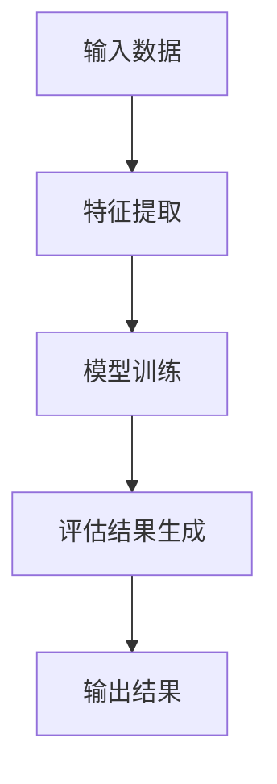
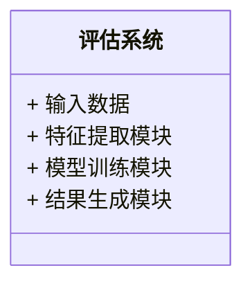
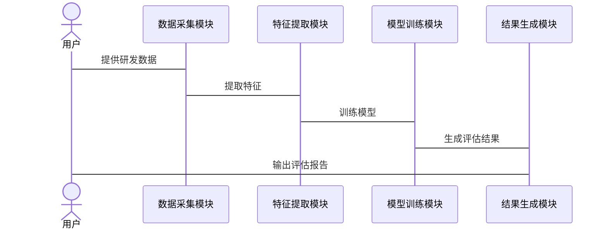

                 


# AI智能体在评估公司研发能力和创新潜力中的应用

> 关键词：AI智能体, 研发能力评估, 创新潜力, 机器学习, 企业评估

> 摘要：  
本文探讨了AI智能体在评估公司研发能力和创新潜力中的应用，分析了其核心概念、算法原理、系统架构，并通过实际案例展示了其在项目中的应用。文章从背景介绍、核心概念、算法实现、系统设计到实战分析，层层深入，为读者提供了一套完整的解决方案，帮助企业在研发能力和创新潜力评估中实现智能化和高效化。

---

# 第一部分: 背景介绍与核心概念

## 第1章: 问题背景与目标

### 1.1 问题背景
在当今快速变化的商业环境中，企业的研发能力和创新潜力是决定其市场竞争力的关键因素。传统的研发能力评估方法通常依赖于人工分析和经验判断，这种方法效率低下、主观性强，难以适应现代企业的复杂需求。如何通过智能化手段快速、准确地评估研发能力和创新潜力，成为企业面临的重要挑战。

### 1.2 问题解决目标
AI智能体作为一种能够感知、学习和决策的智能化系统，能够有效解决传统评估方法的局限性。通过AI智能体，企业可以实时分析研发数据，发现潜在问题，挖掘创新机会，从而提升研发效率和创新能力。

### 1.3 问题解决方法
AI智能体通过以下步骤实现研发能力评估：
1. **数据收集**：整合企业的研发数据、市场数据和专利数据。
2. **特征提取**：从数据中提取关键特征，如研发投入、研发周期、专利数量等。
3. **模型训练**：利用机器学习算法训练评估模型。
4. **结果生成**：输出研发能力评分和创新潜力报告。

### 1.4 边界与外延
AI智能体的评估范围主要集中在研发能力和创新潜力方面，不涉及企业的财务状况和市场表现。其外延包括数据来源的多样性、模型的可解释性和结果的可操作性。

### 1.5 概念结构与核心要素
- **输入**：企业研发数据、市场数据、专利数据。
- **输出**：研发能力评分、创新潜力报告。
- **核心模块**：数据处理、特征提取、模型训练、结果生成。

---

## 第2章: AI智能体的核心概念与原理

### 2.1 核心概念
AI智能体是一种能够感知环境、自主决策的系统，其核心能力包括：
1. **感知能力**：通过数据收集和特征提取，理解企业的研发状况。
2. **学习能力**：利用机器学习算法，从历史数据中学习评估规律。
3. **决策能力**：基于模型输出，生成评估结果并提供优化建议。

### 2.2 AI智能体与其他评估方法的对比

| 方法 | 优点 | 缺点 |
|------|------|------|
| 传统评估 | 简单易懂 | 主观性强，效率低 |
| AI智能体 | 高效准确，可扩展 | 需要大量数据支持，模型复杂 |

### 2.3 ER实体关系图
```mermaid
er
actor: AI智能体
role: 评估公司研发能力
```

### 2.4 智能体的感知与决策机制
AI智能体通过以下步骤实现感知与决策：
1. **数据输入**：接收企业的研发数据。
2. **特征提取**：提取关键特征，如研发投入、研发人员数量。
3. **模型训练**：利用监督学习算法训练评估模型。
4. **结果生成**：输出研发能力评分和创新潜力报告。

---

## 第3章: AI智能体的算法原理

### 3.1 算法原理概述
AI智能体的核心算法包括特征提取、模型训练和结果生成。特征提取通过降维技术（如PCA）实现，模型训练采用机器学习算法（如随机森林），结果生成基于模型预测。

### 3.2 算法流程图


### 3.3 算法实现代码
```python
import pandas as pd
from sklearn.ensemble import RandomForestClassifier
from sklearn.metrics import accuracy_score

# 数据加载
data = pd.read_csv('研发数据.csv')

# 特征提取
features = data[['研发投入', '研发人员', '专利数量']]
target = data['研发能力评分']

# 模型训练
model = RandomForestClassifier()
model.fit(features, target)

# 预测结果
predicted = model.predict(features)
print("模型准确率:", accuracy_score(target, predicted))
```

### 3.4 算法数学模型
随机森林算法的数学模型如下：
$$
y = \sum_{i=1}^{n} \theta_i x_i
$$
其中，$\theta_i$为特征权重，$x_i$为特征值。

---

## 第4章: 系统分析与架构设计

### 4.1 系统架构
AI智能体的系统架构包括数据采集模块、特征提取模块、模型训练模块和结果生成模块。

### 4.2 系统功能设计


### 4.3 系统接口设计
系统接口包括数据输入接口、模型训练接口和结果输出接口。

### 4.4 系统交互流程


---

## 第5章: 项目实战

### 5.1 环境安装
安装必要的Python库：
```bash
pip install pandas scikit-learn mermaid4jupyter
```

### 5.2 核心代码实现
```python
from sklearn.ensemble import RandomForestClassifier
import pandas as pd

# 数据加载
data = pd.read_csv('研发数据.csv')

# 特征提取
features = data[['研发投入', '研发人员', '专利数量']]
target = data['研发能力评分']

# 模型训练
model = RandomForestClassifier()
model.fit(features, target)

# 预测结果
predicted = model.predict(features)
print("模型预测结果:", predicted)
```

### 5.3 实际案例分析
以某科技公司为例，通过AI智能体评估其研发能力和创新潜力，输出具体的评分和建议。

### 5.4 项目总结
通过AI智能体实现研发能力评估，可以提高评估效率和准确性，为企业制定研发战略提供数据支持。

---

## 第6章: 最佳实践与总结

### 6.1 小结
AI智能体在研发能力评估中的应用具有高效、准确和可扩展的优势，能够帮助企业快速识别研发问题并挖掘创新机会。

### 6.2 注意事项
在实际应用中，需注意数据质量、模型可解释性和结果的可操作性。

### 6.3 未来趋势
未来，随着AI技术的不断发展，AI智能体在研发评估中的应用将更加智能化和个性化。

### 6.4 拓展阅读
推荐阅读《机器学习实战》和《AI智能体设计与实现》。

---

作者：AI天才研究院 & 禅与计算机程序设计艺术

---

通过以上结构和内容，读者可以全面了解AI智能体在公司研发能力和创新潜力评估中的应用，从理论到实践，逐步掌握其核心技术和实际应用方法。

