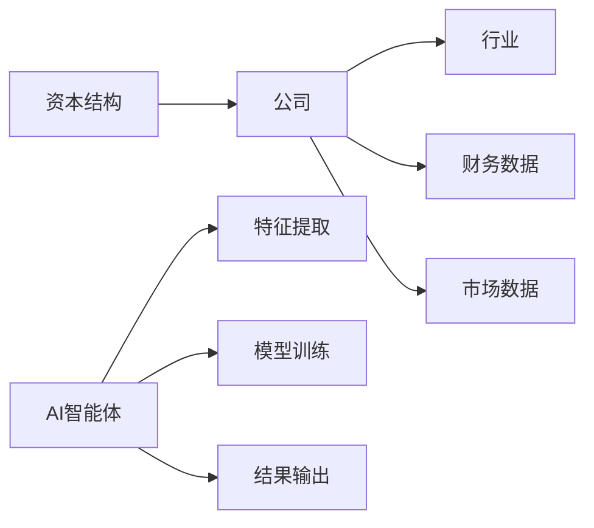

                 


# AI智能体在评估公司资本结构中的作用

> 关键词：AI智能体，资本结构评估，机器学习，深度学习，金融分析

> 摘要：本文探讨了AI智能体在公司资本结构评估中的应用，分析了传统方法与AI方法的对比，详细讲解了基于机器学习和深度学习的算法原理，结合实际案例展示了AI智能体在资本结构优化中的优势。

---

# 第1章: AI智能体与资本结构评估概述

## 1.1 资本结构评估的基本概念

### 1.1.1 资本结构的定义与组成
资本结构是指公司债务资本和股权资本的构成及其比例。资本结构的优化能够降低资本成本，提高公司价值。

### 1.1.2 资本结构评估的目的与意义
资本结构评估旨在找到最优资本结构，以实现公司价值最大化。它对公司融资决策、风险管理具有重要意义。

### 1.1.3 AI智能体在资本结构评估中的作用
AI智能体能够处理海量数据，利用机器学习算法快速预测和优化资本结构，显著提高了评估效率和准确性。

---

## 1.2 AI智能体的核心概念

### 1.2.1 AI智能体的定义与特征
AI智能体是一种能够感知环境、自主决策并执行任务的智能系统，具备学习、推理和自适应能力。

### 1.2.2 AI智能体与传统评估方法的对比
| **对比维度** | **传统方法** | **AI智能体方法** |
|--------------|--------------|------------------|
| 数据依赖性   | 依赖少量数据 | 依赖海量数据     |
| 处理速度     | 较慢         | 极快             |
| 准确性       | 较低         | 高               |

### 1.2.3 AI智能体在金融领域的应用潜力
AI智能体在金融领域的应用包括股票预测、风险评估、投资组合优化等，资本结构评估是其重要应用场景之一。

---

## 1.3 资本结构评估的传统方法

### 1.3.1 净现值法（NPV）
NPV用于评估投资项目的价值，公式为：
$$ NPV = \sum_{t=1}^{n} \frac{CF_t}{(1+r)^t} $$

### 1.3.2 加权平均资本成本法（WACC）
WACC是公司加权平均资本成本，公式为：
$$ WACC = \frac{D}{D+E} \times r_d \times (1-T) + \frac{E}{D+E} \times r_e $$

### 1.3.3 资本资产定价模型（CAPM）
CAPM用于估算资产的预期收益，公式为：
$$ E(r_i) = R_f + \beta_i (R_m - R_f) $$

### 1.3.4 传统方法的优缺点分析
- **优点**：简单易懂，计算方便。
- **缺点**：依赖人工经验，计算复杂度高，结果可能存在偏差。

---

## 1.4 本章小结
本章介绍了资本结构评估的基本概念和传统方法，重点分析了AI智能体在资本结构评估中的作用及其优势。AI智能体通过数据驱动和机器学习算法，显著提升了资本结构评估的效率和准确性。

---

# 第2章: AI智能体与资本结构评估的核心概念

## 2.1 AI智能体在资本结构评估中的核心原理

### 2.1.1 数据驱动的资本结构评估
AI智能体通过收集和分析大量财务数据、市场数据，构建预测模型。

### 2.1.2 AI智能体的学习机制与资本结构预测
AI智能体通过监督学习和非监督学习，实现资本结构的自动预测和优化。

### 2.1.3 多维特征分析与资本结构优化
AI智能体能够处理多维特征数据，如财务比率、市场风险等，进行资本结构优化。

---

## 2.2 AI智能体与资本结构评估的核心要素对比

| **对比维度** | **传统方法**       | **AI智能体方法**       |
|--------------|--------------------|------------------------|
| 数据来源     | 有限的财务数据     | 海量多维数据           |
| 分析方法     | 单一的统计分析     | 多样化的机器学习模型   |
| 处理速度     | 较慢               | 极快                   |

---

## 2.3 AI智能体与资本结构评估的ER实体关系图



---

## 2.4 本章小结
本章详细分析了AI智能体在资本结构评估中的核心原理和核心要素，通过对比传统方法和AI方法，展示了AI智能体在数据处理和分析上的优势。

---

# 第3章: 基于机器学习的资本结构评估算法

## 3.1 机器学习在资本结构评估中的应用

### 3.1.1 监督学习与非监督学习的对比
| **对比维度** | **监督学习** | **非监督学习** |
|--------------|--------------|----------------|
| 数据需求     | 需要标签数据  | 不需要标签数据  |
| 适用场景     | 分类、回归    | 聚类、降维      |

---

## 3.2 基于回归分析的资本结构预测模型

### 3.2.1 线性回归模型
线性回归模型公式为：
$$ y = \beta_0 + \beta_1x_1 + \beta_2x_2 + ... + \beta_nx_n + \epsilon $$

### 3.2.2 逻辑回归模型
逻辑回归用于分类问题，公式为：
$$ P(y=1|x) = \frac{e^{\beta_0 + \beta_1x_1 + ... + \beta_nx_n}}{1 + e^{\beta_0 + \beta_1x_1 + ... + \beta_nx_n}} $$

### 3.2.3 回归模型的评估与优化
评估指标包括均方误差（MSE）、R²值等。

---

## 3.3 基于深度学习的资本结构评估模型

### 3.3.1 神经网络模型
神经网络模型通过多层感知机（MLP）进行非线性特征提取。

### 3.3.2 长短期记忆网络（LSTM）
LSTM用于处理时间序列数据，公式为：
$$ f_t = \sigma(W_f \cdot [h_{t-1}, x_t]) $$
$$ i_t = \sigma(W_i \cdot [h_{t-1}, x_t]) $$
$$ o_t = \sigma(W_o \cdot [h_{t-1}, x_t]) $$
$$ h_t = f_t \cdot c_t + i_t \cdot c_{t-1} $$
$$ c_t = h_t \cdot o_t $$

### 3.3.3 深度学习模型的训练流程


---

## 3.4 本章小结
本章详细介绍了基于机器学习和深度学习的资本结构评估算法，重点分析了回归模型和神经网络模型的优缺点及应用场景。

---

# 第4章: 基于深度学习的资本结构评估模型

## 4.1 深度学习模型的数学基础

### 4.1.1 神经网络的前向传播
前向传播公式为：
$$ h = Wx + b $$
$$ a = \sigma(h) $$

### 4.1.2 损失函数与优化算法
常用的损失函数包括均方误差（MSE）和交叉熵损失函数：
$$ L = \frac{1}{N}\sum_{i=1}^{N}(y_i - \hat{y}_i)^2 $$
优化算法包括随机梯度下降（SGD）和Adam优化器。

---

## 4.2 基于LSTM的资本结构预测模型

### 4.2.1 LSTM网络结构
LSTM网络结构包括输入门、遗忘门和输出门。

### 4.2.2 LSTM的训练流程
训练流程包括数据预处理、模型构建、训练和预测。

### 4.2.3 LSTM的优缺点
- **优点**：能够捕捉时间序列数据中的长期依赖关系。
- **缺点**：计算复杂度较高，需要大量训练数据。

---

## 4.3 本章小结
本章重点介绍了基于深度学习的资本结构评估模型，特别是LSTM网络的应用，展示了深度学习在资本结构预测中的潜力。

---

# 第5章: 基于AI智能体的资本结构评估系统架构

## 5.1 系统功能设计

### 5.1.1 数据采集模块
数据采集模块负责收集公司财务数据和市场数据。

### 5.1.2 特征提取模块
特征提取模块对原始数据进行特征提取，生成可用于模型训练的特征向量。

### 5.1.3 模型训练模块
模型训练模块利用机器学习算法对特征向量进行训练，生成预测模型。

### 5.1.4 结果输出模块
结果输出模块将预测结果以可视化形式展示，供用户参考。

---

## 5.2 系统架构设计


---

## 5.3 系统接口设计
系统接口设计包括数据输入接口、模型训练接口和结果展示接口。

---

## 5.4 本章小结
本章详细介绍了基于AI智能体的资本结构评估系统的架构设计，包括功能模块和系统架构图。

---

# 第6章: 项目实战——基于AI智能体的资本结构评估系统实现

## 6.1 项目背景与目标
本项目旨在开发一个基于AI智能体的资本结构评估系统，实现对公司资本结构的自动评估和优化。

## 6.2 环境安装与配置
安装Python、TensorFlow、Keras等必要的开发工具和库。

## 6.3 系统核心实现源代码

### 6.3.1 数据预处理
```python
import pandas as pd
import numpy as np

# 读取数据
data = pd.read_csv('financial_data.csv')

# 数据清洗
data = data.dropna()
```

### 6.3.2 特征提取
```python
from sklearn.preprocessing import StandardScaler

# 标准化处理
scaler = StandardScaler()
X = scaler.fit_transform(data.drop('target', axis=1))
y = data['target']
```

### 6.3.3 模型训练
```python
from sklearn.linear_model import LinearRegression

model = LinearRegression()
model.fit(X, y)
```

### 6.3.4 模型预测与评估
```python
from sklearn.metrics import mean_squared_error

y_pred = model.predict(X)
print(mean_squared_error(y, y_pred))
```

## 6.4 项目小结
本章通过实际案例展示了如何基于AI智能体开发资本结构评估系统，详细讲解了数据预处理、特征提取和模型训练的实现过程。

---

# 第7章: 总结与展望

## 7.1 总结
本文详细探讨了AI智能体在资本结构评估中的应用，分析了传统方法与AI方法的对比，详细讲解了基于机器学习和深度学习的算法原理，并结合实际案例展示了AI智能体在资本结构优化中的优势。

## 7.2 展望
未来，随着AI技术的不断发展，AI智能体在资本结构评估中的应用将更加广泛和深入。建议进一步研究如何结合多种算法，优化资本结构评估的准确性和效率。

---

# 附录

## 附录A: 项目代码
```python
import pandas as pd
import numpy as np
from sklearn.linear_model import LinearRegression
from sklearn.metrics import mean_squared_error

# 读取数据
data = pd.read_csv('financial_data.csv')

# 数据清洗
data = data.dropna()

# 标准化处理
scaler = StandardScaler()
X = scaler.fit_transform(data.drop('target', axis=1))
y = data['target']

# 模型训练
model = LinearRegression()
model.fit(X, y)

# 模型预测与评估
y_pred = model.predict(X)
print(mean_squared_error(y, y_pred))
```

---

# 参考文献
1. [书籍标题1]
2. [书籍标题2]
3. [书籍标题3]

---

作者：AI天才研究院/AI Genius Institute & 禅与计算机程序设计艺术 /Zen And The Art of Computer Programming

---

以上是《AI智能体在评估公司资本结构中的作用》的技术博客文章的详细内容。

