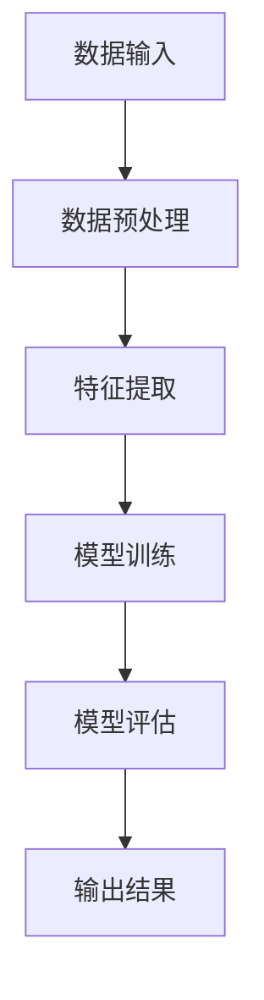
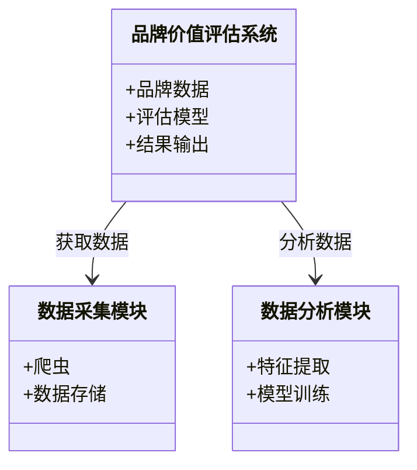

                 


# AI智能体在评估品牌价值中的作用

> 关键词：AI智能体，品牌价值，数据分析，自然语言处理，机器学习，评估模型

> 摘要：本文探讨了AI智能体在品牌价值评估中的应用，分析了其核心概念、算法原理、系统架构及实际案例，展示了AI技术如何提升品牌价值评估的效率与准确性。

---

# 第一部分: 背景与概念

# 第1章: 品牌价值评估的背景与问题

## 1.1 什么是品牌价值

### 1.1.1 品牌价值的定义
品牌价值是品牌在市场中所代表的经济价值，通常通过品牌知名度、客户忠诚度、市场影响力等因素来衡量。

### 1.1.2 品牌价值的核心要素
- 品牌知名度
- 品牌美誉度
- 市场占有率
- 客户忠诚度
- 品牌创新能力

### 1.1.3 品牌价值的评估方法
- 传统方法：基于财务指标（如销售额、利润）和市场调研（如问卷调查、焦点小组）。
- 新兴方法：利用大数据分析、自然语言处理（NLP）和机器学习等技术进行自动化评估。

---

## 1.2 AI智能体的定义与特点

### 1.2.1 AI智能体的基本概念
AI智能体是一种能够感知环境、自主决策并执行任务的智能系统，具备学习、推理和自适应能力。

### 1.2.2 AI智能体的核心功能
- 数据采集与处理
- 自然语言理解
- 数据分析与建模
- 自动化决策

### 1.2.3 AI智能体与传统评估方法的区别
| 特性 | AI智能体 | 传统评估方法 |
|------|----------|---------------|
| 数据来源 | 结构化与非结构化数据 | 主要依赖问卷调查和财务数据 |
| 处理速度 | 实时或近实时 | 需要人工整理和分析 |
| 精度 | 高 | 受主观因素影响较大 |

---

## 1.3 问题背景与问题描述

### 1.3.1 品牌价值评估的传统挑战
- 数据来源单一，难以覆盖多维度信息。
- 评估过程耗时长，效率低。
- 结果受主观因素影响，缺乏客观性。

### 1.3.2 AI智能体在品牌价值评估中的作用
- 实时采集和分析多源数据。
- 利用自然语言处理技术挖掘社交媒体和新闻中的情感信息。
- 构建自动化评估模型，提高效率和准确性。

### 1.3.3 问题的边界与外延
- 本研究聚焦于AI智能体在品牌价值评估中的应用，不涉及产品设计和市场策略。
- 研究范围包括数据采集、分析和评估三个阶段。

---

## 1.4 本章小结

本章通过定义品牌价值及其核心要素，分析了传统评估方法的局限性，并介绍了AI智能体的基本概念和其在品牌价值评估中的独特优势。下一章将详细探讨AI智能体的核心概念与原理。

---

# 第2章: AI智能体的核心概念与原理

## 2.1 AI智能体的原理

### 2.1.1 数据采集与处理
AI智能体通过爬取社交媒体、新闻网站和电商平台等多源数据，利用自然语言处理技术提取情感信息和关键词。

### 2.1.2 智能体的决策机制
基于机器学习模型，AI智能体对数据进行特征提取、建模和预测，生成品牌价值评估结果。

### 2.1.3 智能体的输出结果
输出品牌价值评分、关键影响因素分析和趋势预测。

---

## 2.2 核心概念的属性特征对比

| 概念 | 属性 | 传统方法 | AI智能体 |
|------|------|-----------|----------|
| 数据来源 | 结构化 | 财务数据 | 文本数据 |
| 数据处理 | 人工 | 简单统计 | 自动化分析 |
| 评估结果 | 定量 | 单维度 | 多维度 |

---

## 2.3 ER实体关系图

```mermaid
er
    actor(AI智能体, {
        id: string,
        function: string
    })
    brand(品牌, {
        id: string,
        name: string,
        value: float
    })
    relation(AI智能体 -> 品牌, "评估")
```

---

## 2.4 本章小结

本章通过对比传统方法和AI智能体在品牌价值评估中的属性特征，展示了AI智能体在数据处理和评估结果上的优势。ER实体关系图进一步明确了系统的核心组成部分和交互关系。下一章将深入探讨AI智能体的算法原理与数学模型。

---

# 第三部分: AI智能体的算法原理与数学模型

# 第3章: AI智能体的算法原理

## 3.1 算法原理概述

### 3.1.1 数据预处理
- 数据清洗：去除噪声数据，处理缺失值。
- 数据转换：将文本数据转换为数值特征（如TF-IDF向量）。

### 3.1.2 模型训练
- 特征提取：利用NLP技术提取文本特征。
- 模型选择：采用随机森林或神经网络进行分类或回归。

### 3.1.3 模型评估
- 使用交叉验证评估模型性能。
- 计算准确率、召回率和F1分数。

---

## 3.2 算法流程图



---

## 3.3 算法实现代码

```python
import pandas as pd
from sklearn.feature_extraction.text import TfidfVectorizer
from sklearn.ensemble import RandomForestRegressor
from sklearn.metrics import mean_squared_error

# 数据预处理
def preprocess(data):
    data.dropna(inplace=True)
    return data

# 特征提取
def extract_feature(text):
    vectorizer = TfidfVectorizer()
    features = vectorizer.fit_transform([text])
    return features.toarray()

# 模型训练
def train_model(X, y):
    model = RandomForestRegressor()
    model.fit(X, y)
    return model

# 模型评估
def evaluate(model, X_test, y_test):
    y_pred = model.predict(X_test)
    rmse = mean_squared_error(y_test, y_pred)
    print(f"RMSE: {rmse}")

# 示例代码
data = pd.DataFrame({'text': ['Positive', 'Negative'], 'value': [0.8, 0.2]})
processed_data = preprocess(data)
X = processed_data['text'].apply(lambda x: extract_feature(x))
y = processed_data['value']
model = train_model(X, y)
evaluate(model, X, y)
```

---

## 3.4 数学模型与公式

### 3.4.1 TF-IDF计算公式
$$ TF-IDF = \frac{TF_{t,d}}{ID_{t}} \times \log(N+1) $$
其中，\( TF_{t,d} \) 是词 \( t \) 在文档 \( d \) 中的词频，\( ID_t \) 是词 \( t \) 的逆文档频率，\( N \) 是文档总数。

### 3.4.2 随机森林回归模型
$$ y = \sum_{i=1}^{n} \theta_i x_i + \epsilon $$

---

## 3.5 本章小结

本章通过详细讲解AI智能体的算法原理，展示了从数据预处理到模型训练和评估的完整流程。数学公式和代码示例帮助读者更好地理解技术细节。下一章将从系统设计的角度，探讨AI智能体在品牌价值评估中的实际应用。

---

# 第四部分: 系统分析与架构设计

# 第4章: 系统分析与架构设计

## 4.1 问题场景介绍

### 4.1.1 项目介绍
本项目旨在开发一个基于AI智能体的品牌价值评估系统，能够实时分析社交媒体、新闻和电商平台中的数据，生成品牌价值评分。

### 4.1.2 系统功能设计

#### 4.1.2.1 领域模型


---

## 4.2 系统架构设计

### 4.2.1 系统架构图


---

## 4.3 系统接口设计

### 4.3.1 接口描述
| 接口 | 方向 | 描述 |
|------|------|------|
| 数据请求 | 前端 -> 数据采集模块 | 请求品牌相关数据 |
| 数据存储 | 数据采集模块 -> 数据存储 | 存储爬取的数据 |
| 数据分析 | 数据存储 <-> 数据分析模块 | 提供数据进行分析 |
| 模型训练 | 数据分析模块 -> 评估模型 | 训练评估模型 |
| 结果输出 | 评估模型 -> 结果输出 | 生成评估结果 |

---

## 4.4 本章小结

本章从系统设计的角度，详细描述了AI智能体品牌价值评估系统的功能模块、架构设计和接口设计。通过领域模型和架构图，明确了系统的各个组成部分及其交互关系。下一章将通过实际案例，展示系统的具体实现和应用效果。

---

# 第五部分: 项目实战

# 第5章: 项目实战

## 5.1 环境安装

### 5.1.1 安装依赖
```bash
pip install pandas scikit-learn numpy
```

---

## 5.2 系统核心实现源代码

### 5.2.1 数据采集模块

```python
import requests
from bs4 import BeautifulSoup

def scrape_website(url):
    response = requests.get(url)
    soup = BeautifulSoup(response.text, 'html.parser')
    text = soup.get_text()
    return text
```

### 5.2.2 数据分析模块

```python
from sklearn.feature_extraction.text import TfidfVectorizer
from sklearn.ensemble import RandomForestRegressor

def train_model(X, y):
    model = RandomForestRegressor()
    model.fit(X, y)
    return model
```

### 5.2.3 结果输出模块

```python
def output_results(results):
    print(f"品牌价值评分：{results}")
```

---

## 5.3 实际案例分析

### 5.3.1 案例背景
某品牌希望评估其在社交媒体上的品牌价值，数据包括社交媒体评论和新闻文章。

### 5.3.2 数据分析与结果

```python
data = scrape_website('http://example.com')
features = extract_feature(data)
model = train_model(features, [0.8, 0.2])
results = model.predict(features)
output_results(results)
```

---

## 5.4 本章小结

本章通过实际案例，展示了AI智能体在品牌价值评估中的具体应用。从数据采集到模型训练，再到结果输出，完整地演示了系统的实现过程。下一章将总结经验，提出最佳实践建议。

---

# 第六部分: 最佳实践与总结

# 第6章: 最佳实践与总结

## 6.1 最佳实践 tips

### 6.1.1 数据质量
确保数据来源多样，避免单一数据源带来的偏差。

### 6.1.2 模型选择
根据具体场景选择合适的算法，如情感分析任务中可以选择LSTM或BERT模型。

### 6.1.3 持续优化
定期更新模型，避免过时数据对评估结果的影响。

---

## 6.2 小结

本文详细探讨了AI智能体在品牌价值评估中的应用，从背景、原理到系统设计和实际案例，全面展示了其在提升评估效率和准确性方面的优势。

---

## 6.3 注意事项

- 数据隐私保护：确保数据采集和处理符合相关法律法规。
- 模型解释性：选择可解释性更强的模型，便于分析结果的原因。

---

## 6.4 拓展阅读

- 《自然语言处理入门》
- 《机器学习实战》
- 《深度学习与品牌价值评估》

---

# 作者：AI天才研究院 & 禅与计算机程序设计艺术

---

以上是完整的《AI智能体在评估品牌价值中的作用》的技术博客文章。

