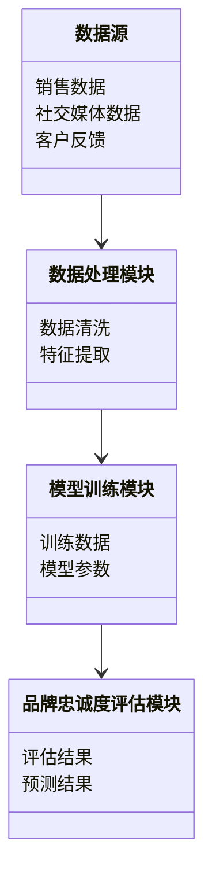
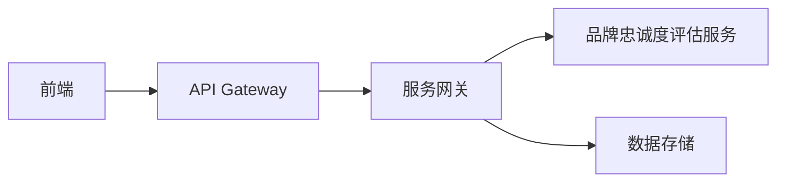

                 


# AI智能体在评估品牌忠诚度中的作用

## 关键词：AI智能体，品牌忠诚度，机器学习，数据挖掘，市场营销，消费者行为

## 摘要：本文探讨AI智能体如何通过数据挖掘和机器学习技术评估品牌忠诚度，分析其在现代市场营销中的应用价值和优势。文章详细介绍了AI智能体在品牌忠诚度评估中的算法原理、系统架构、项目实战及未来展望。

---

# 第一部分: AI智能体在品牌忠诚度评估中的背景与基础

## 第1章: 问题背景与描述

### 1.1 问题背景
#### 1.1.1 品牌忠诚度的定义与重要性
品牌忠诚度是指消费者对特定品牌产品或服务的持续偏好和重复购买行为。高品牌忠诚度意味着消费者更可能在面对竞争对手时坚持选择该品牌，这对企业来说是宝贵的资产，因为它能够带来稳定的收入和长期的市场地位。

#### 1.1.2 传统品牌忠诚度评估的局限性
传统的品牌忠诚度评估方法通常依赖于问卷调查、销售数据和客户反馈分析。这些方法虽然提供了一定的洞见，但存在以下问题：
- 数据收集成本高且耗时长。
- 数据范围有限，难以捕捉消费者行为的动态变化。
- 需要大量人工分析，效率低下。

#### 1.1.3 AI智能体在品牌忠诚度评估中的潜力
AI智能体能够实时处理大量数据，包括社交媒体互动、购买记录、客户反馈等，从而提供更精准和实时的品牌忠诚度评估。此外，AI智能体还能预测消费者行为，帮助企业制定更有效的营销策略。

### 1.2 问题描述
#### 1.2.1 品牌忠诚度评估的核心挑战
- 数据异质性：来自不同渠道的数据格式和性质各不相同，整合难度大。
- 数据量大：需要处理来自多个渠道的海量数据。
- 动态变化：消费者行为受多种因素影响，具有动态性。

#### 1.2.2 AI智能体在评估中的角色定位
AI智能体作为数据处理和分析的工具，能够实时监控消费者行为，识别品牌忠诚度的关键驱动因素，并预测消费者行为的变化趋势。

#### 1.2.3 评估体系的边界与外延
评估体系的边界包括消费者数据的收集范围和数据处理的范围；外延则包括从品牌忠诚度评估到其他市场分析的应用。

### 1.3 问题解决与应用前景
#### 1.3.1 AI智能体在品牌忠诚度评估中的解决方案
通过数据挖掘、机器学习和自然语言处理技术，AI智能体能够从多源数据中提取有用信息，评估品牌忠诚度。

#### 1.3.2 应用场景与实际案例
- 零售业：实时分析顾客购买记录，预测忠诚度。
- 零售业：实时分析顾客购买记录，预测忠诚度。
- 电子商务：分析客户行为，优化推荐策略。

#### 1.3.3 未来发展趋势与潜力
随着AI技术的进步，品牌忠诚度评估将更加智能化、实时化和个性化。

---

## 第2章: 核心概念与联系

### 2.1 AI智能体的定义与特征
#### 2.1.1 AI智能体的基本概念
AI智能体是一种能够感知环境、处理信息、做出决策并采取行动的智能系统，具备自主性、反应性、目标导向和学习能力。

#### 2.1.2 AI智能体的核心特征
- **自主性**：能够独立运作。
- **反应性**：能根据环境变化调整行为。
- **目标导向**：有明确的目标导向。
- **学习能力**：能通过数据和经验不断优化自身。

#### 2.1.3 AI智能体与传统算法的区别
AI智能体不仅执行任务，还能通过与环境交互来改进自身行为，而传统算法只是基于输入数据进行计算。

### 2.2 品牌忠诚度评估的核心要素
#### 2.2.1 品牌忠诚度的层次模型
- **认知忠诚**：消费者对品牌的认识和理解。
- **情感忠诚**：消费者对品牌的情感投入。
- **行为忠诚**：消费者实际购买行为的体现。

#### 2.2.2 影响品牌忠诚度的关键因素
- **产品特性**：产品的质量、价格、创新性。
- **品牌形象**：品牌的声誉、知名度。
- **消费者满意度**：消费者的体验和满意度。
- **竞争对手行为**：竞争对手的市场策略。

#### 2.2.3 数据驱动的评估方法
通过收集和分析消费者数据，包括购买记录、社交媒体互动、投诉和反馈，来评估品牌忠诚度。

### 2.3 AI智能体与品牌忠诚度的关系
#### 2.3.1 AI智能体在品牌忠诚度评估中的作用
AI智能体能够实时分析消费者数据，识别品牌忠诚度的关键影响因素，并预测消费者行为的变化。

#### 2.3.2 AI智能体与其他评估方法的对比
- **传统方法**：依赖于问卷调查和数据分析，耗时且成本高。
- **AI智能体**：实时分析，数据量大，结果精准，能够动态调整评估策略。

#### 2.3.3 实体关系图（ER图）展示


### 2.4 本章小结
本章详细介绍了AI智能体和品牌忠诚度的基本概念，分析了它们之间的关系，并通过ER图展示了品牌忠诚度的层次结构。

---

## 第3章: 算法原理与数学模型

### 3.1 算法原理
#### 3.1.1 基于机器学习的品牌忠诚度评估模型
常用算法包括逻辑回归、随机森林、支持向量机（SVM）和神经网络。这些算法能够从消费者数据中学习，预测品牌忠诚度。

#### 3.1.2 算法流程图展示


### 3.2 数学模型与公式
#### 3.2.1 逻辑回归模型
逻辑回归是一种常用的分类算法，适用于品牌忠诚度的二分类问题。其损失函数为：

$$ L(\theta) = -\frac{1}{m} \sum_{i=1}^{m} [y_i \cdot \ln(h(x_i)) + (1 - y_i) \cdot \ln(1 - h(x_i))] $$

其中，$h(x_i) = \frac{1}{1 + e^{-\theta^T x_i}}$。

#### 3.2.2 随机森林模型
随机森林是一种集成学习算法，通过构建多个决策树并进行投票或平均来提高模型的准确性和稳定性。

---

## 第4章: 系统分析与架构设计方案

### 4.1 问题场景介绍
评估品牌忠诚度的系统需要处理来自多个渠道的消费者数据，包括线上和线下的销售数据、社交媒体互动、客户反馈等。

### 4.2 系统功能设计
#### 4.2.1 领域模型



### 4.3 系统架构设计
#### 4.3.1 系统架构图



### 4.4 系统接口设计
- **数据接口**：与数据库和第三方API接口对接，获取消费者数据。
- **评估接口**：提供品牌忠诚度评估结果的API。

### 4.5 系统交互流程
- **消费者数据采集**：通过API获取销售数据、社交媒体数据等。
- **数据预处理**：清洗数据，提取特征。
- **模型训练**：训练机器学习模型，评估品牌忠诚度。
- **结果展示**：通过前端展示评估结果和预测分析。

---

## 第5章: 项目实战

### 5.1 环境安装
- **Python**：安装Python 3.8及以上版本。
- **库的安装**：使用pip安装numpy、pandas、scikit-learn、matplotlib。

### 5.2 核心代码实现
#### 5.2.1 数据预处理代码

```python
import pandas as pd
import numpy as np

# 加载数据
data = pd.read_csv('customer_data.csv')

# 处理缺失值
data = data.dropna()

# 标准化数据
from sklearn.preprocessing import StandardScaler
scaler = StandardScaler()
data_scaled = scaler.fit_transform(data)
```

#### 5.2.2 模型训练代码

```python
from sklearn.model import LogisticRegression

# 训练逻辑回归模型
model = LogisticRegression()
model.fit(X_train, y_train)

# 预测结果
y_pred = model.predict(X_test)
```

### 5.3 案例分析与详细解读
通过一个具体案例，展示如何利用AI智能体评估品牌忠诚度。例如，分析某零售企业的客户数据，预测客户的忠诚度级别，并提出针对性的营销策略。

---

## 第6章: 最佳实践与小结

### 6.1 本章小结
本文详细介绍了AI智能体在品牌忠诚度评估中的应用，从背景到算法原理，再到系统设计和项目实战，全面阐述了其在现代市场营销中的价值。

### 6.2 注意事项
- 数据隐私保护：在处理消费者数据时，必须遵守相关法律法规。
- 模型解释性：确保模型的可解释性，以便更好地理解和优化模型。
- 模型更新：定期更新模型，以适应市场变化和消费者行为的变化。

### 6.3 拓展阅读
- 《机器学习实战》
- 《数据挖掘导论》
- 《人工智能：一种现代方法》

---

## 第7章: 未来展望

### 7.1 未来发展趋势
- **实时分析**：未来，品牌忠诚度评估将更加实时化，帮助企业快速响应消费者行为的变化。
- **多模态数据融合**：结合文本、图像等多种数据源，提升评估的准确性。
- **个性化评估**：基于消费者的个体特征，提供个性化的品牌忠诚度评估。

### 7.2 挑战与机遇
- **挑战**：数据隐私、模型解释性、数据质量等问题。
- **机遇**：AI技术的进步将推动品牌忠诚度评估的智能化和精准化。

---

## 作者：AI天才研究院/AI Genius Institute & 禅与计算机程序设计艺术 /Zen And The Art of Computer Programming

---

这篇博客详细介绍了AI智能体在品牌忠诚度评估中的作用，从理论到实践，从算法到系统设计，为读者提供了全面的视角。

