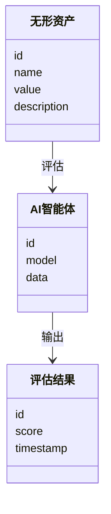
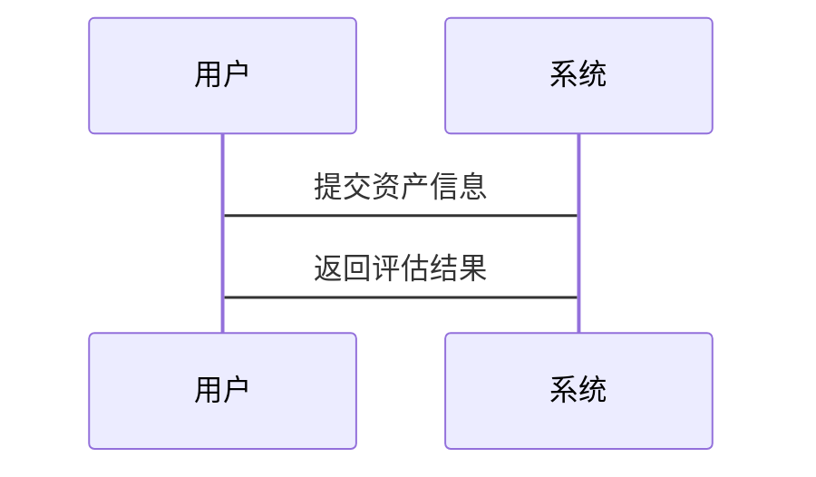

                 


# AI智能体在评估无形资产价值中的作用

> 关键词：AI智能体，无形资产，价值评估，机器学习，系统架构

> 摘要：本文探讨AI智能体在评估无形资产价值中的作用，通过分析无形资产的核心概念，介绍基于机器学习的算法原理，并结合系统架构设计和项目实战，展示AI智能体在无形资产评估中的应用与优势。

---

# 第1章: 无形资产评估的背景与问题

## 1.1 无形资产的定义与特点

### 1.1.1 无形资产的定义
无形资产是指企业拥有的非实物资产，通常包括专利权、商标权、版权、商誉、客户关系、品牌价值等。这些资产的价值难以通过物理形态直接衡量，但对企业整体价值贡献巨大。

### 1.1.2 无形资产的核心特点
- **不可见性**：无形资产缺乏物理形态，难以直接观察和测量。
- **价值波动性**：市场环境、技术进步等因素会导致无形资产价值快速变化。
- **依赖性**：无形资产的价值往往依赖于企业的经营状况和市场表现。

### 1.1.3 无形资产的分类与范围
无形资产可以分为以下几类：
- **知识产权类**：专利、商标、版权等。
- **商誉类**：企业并购中的商誉价值。
- **客户关系类**：客户忠诚度和客户网络的价值。
- **技术类**：技术诀窍、专有技术等。

## 1.2 无形资产评估的难点

### 1.2.1 无形资产评估的复杂性
无形资产评估需要考虑多种因素，包括市场环境、企业战略、技术发展等，这使得评估过程复杂且具有挑战性。

### 1.2.2 传统评估方法的局限性
传统评估方法通常依赖于财务数据和市场分析，难以捕捉无形资产的动态变化和潜在价值。例如，使用折现现金流法（DCF）评估专利时，需要准确预测未来的现金流，这在实际操作中往往难以实现。

### 1.2.3 无形资产价值波动的不确定性
无形资产的价值受市场波动、竞争环境和技术进步的影响，具有高度不确定性，这增加了评估的难度。

## 1.3 AI智能体在无形资产评估中的作用

### 1.3.1 AI智能体的定义与特点
AI智能体是一种具备感知、决策和执行能力的智能系统，能够通过数据驱动的方法进行学习和优化。

### 1.3.2 AI智能体在无形资产评估中的优势
- **数据驱动**：AI智能体能够处理大量数据，发现传统方法难以察觉的模式和趋势。
- **动态评估**：AI智能体可以实时更新评估结果，适应市场变化。
- **高精度**：通过机器学习算法，AI智能体能够提高评估的准确性和可靠性。

### 1.3.3 AI智能体与传统评估方法的结合
AI智能体可以作为传统评估方法的补充，通过数据挖掘和预测模型提高评估结果的科学性和准确性。例如，结合机器学习和DCF模型，可以更精准地预测无形资产的未来现金流。

## 1.4 本章小结
本章介绍了无形资产的定义、特点和分类，分析了传统评估方法的局限性，并探讨了AI智能体在无形资产评估中的作用和优势。

---

# 第2章: AI智能体与无形资产的核心概念

## 2.1 AI智能体的核心概念

### 2.1.1 AI智能体的定义
AI智能体是一种能够感知环境、自主决策并采取行动的智能系统。它具备以下核心特征：
- **感知能力**：通过传感器或数据输入获取信息。
- **决策能力**：基于获取的信息进行分析和决策。
- **执行能力**：根据决策结果执行操作。

### 2.1.2 AI智能体的属性特征
- **学习能力**：通过机器学习算法不断优化自身模型。
- **适应性**：能够适应不同的环境和变化。
- **交互能力**：与人类或其他系统进行有效沟通和协作。

### 2.1.3 AI智能体与传统AI的区别
传统AI通常专注于特定任务（如语音识别、图像分类），而AI智能体具备更强的自主性和适应性，能够处理复杂任务。

## 2.2 无形资产的核心概念

### 2.2.1 无形资产的构成要素
- **法律保护**：专利、商标等的法律保护力度。
- **市场地位**：品牌知名度和市场影响力。
- **技术优势**：技术的先进性和独特性。

### 2.2.2 无形资产的价值评估维度
- **经济价值**：未来现金流的折现值。
- **市场价值**：市场交易中的实际价值。
- **潜在价值**：未来可能的收益潜力。

### 2.2.3 无形资产的生命周期管理
无形资产需要在生命周期中进行动态评估和管理，包括获取、评估、维护和处置。

## 2.3 AI智能体与无形资产的关系

### 2.3.1 AI智能体在无形资产评估中的应用场景
- **数据清洗与预处理**：处理缺失数据和异常值。
- **特征提取**：从大量数据中提取关键特征。
- **模型训练与优化**：构建预测模型并进行参数优化。

### 2.3.2 AI智能体与无形资产价值的关系
AI智能体能够通过数据分析和预测模型，准确评估无形资产的价值，帮助企业在并购、融资等活动中做出更明智的决策。

### 2.3.3 AI智能体对无形资产评估的优化作用
- **提高效率**：AI智能体能够快速处理大量数据，显著提高评估效率。
- **增强准确性**：通过机器学习算法，AI智能体能够发现数据中的潜在规律，提高评估结果的准确性。

## 2.4 本章小结
本章详细探讨了AI智能体和无形资产的核心概念，分析了AI智能体在无形资产评估中的应用场景及其优化作用。

---

# 第3章: AI智能体在无形资产评估中的算法原理

## 3.1 基于机器学习的无形资产评估

### 3.1.1 机器学习在无形资产评估中的应用
机器学习算法可以用于预测无形资产的价值，通过历史数据训练模型，预测未来价值。

### 3.1.2 常见的机器学习算法
- **监督学习**：如线性回归、随机森林、支持向量机（SVM）。
- **无监督学习**：如聚类算法（K-means）。
- **深度学习**：如神经网络。

### 3.1.3 算法选择与优化
选择合适的算法需要考虑数据类型、任务目标和计算资源。例如，对于分类任务，随机森林和SVM是常用算法；对于回归任务，线性回归和神经网络适用。

## 3.2 聚类算法在无形资产评估中的应用

### 3.2.1 聚类算法的定义与特点
聚类算法是一种无监督学习方法，用于将数据分成若干簇，每个簇内的数据相似度较高。

### 3.2.2 K-means算法的原理与实现
K-means算法是一种常用的聚类算法，通过迭代优化中心点位置，将数据分成K个簇。

#### K-means算法步骤
1. 随机选择K个初始中心点。
2. 计算每个数据点到中心点的距离，将数据点分配到最近的簇。
3. 重新计算每个簇的中心点。
4. 重复步骤2和3，直到中心点不再变化或达到预设迭代次数。

### 3.2.3 聚类算法在无形资产评估中的具体应用
例如，可以将企业划分为不同的客户群体，评估不同客户群体的潜在价值。

## 3.3 分类算法在无形资产评估中的应用

### 3.3.1 分类算法的定义与特点
分类算法是一种监督学习方法，用于将数据点分配到预定的类别中。

### 3.3.2 逻辑回归算法的原理与实现
逻辑回归是一种常用的分类算法，适用于二分类问题。

#### 逻辑回归公式
$$ P(y=1|x) = \frac{e^{\beta_0 + \beta_1 x_1 + \dots + \beta_n x_n}}{1 + e^{\beta_0 + \beta_1 x_1 + \dots + \beta_n x_n}} $$

### 3.3.3 分类算法在无形资产评估中的具体应用
例如，可以对专利技术的市场前景进行分类，评估其潜在价值。

## 3.4 算法实现的数学模型与公式

### 3.4.1 K-means算法的数学公式
$$ \text{目标函数} = \sum_{i=1}^{K} \sum_{j \in C_i} \|x_j - \mu_i\|^2 $$
其中，$C_i$是第i个簇，$\mu_i$是簇的中心点。

### 3.4.2 逻辑回归的损失函数
$$ L(\theta) = -\frac{1}{m} \sum_{i=1}^{m} [y_i \cdot \log(h(x_i)) + (1 - y_i) \cdot \log(1 - h(x_i))] $$
其中，$h(x_i) = \frac{e^{\theta^T x_i}}{1 + e^{\theta^T x_i}}$。

## 3.5 本章小结
本章介绍了机器学习在无形资产评估中的应用，详细讲解了聚类和分类算法的原理和实现，并通过实例展示了它们在无形资产评估中的具体应用。

---

# 第4章: AI智能体的系统分析与架构设计

## 4.1 问题场景介绍

### 4.1.1 无形资产评估的复杂性
无形资产评估需要考虑多个因素，包括市场环境、企业战略、技术发展等。

### 4.1.2 企业需求分析
企业需要一个高效、准确的评估系统，能够实时更新评估结果，适应市场变化。

## 4.2 系统功能设计

### 4.2.1 领域模型类图
以下是一个简单的领域模型类图，展示了系统中的主要实体及其关系。



### 4.2.2 系统架构设计
以下是一个AI智能体系统的架构图，展示了系统的各个模块及其交互。

```mermaid
graph TD
    UI --> API Gateway
    API Gateway --> 数据处理模块
    数据处理模块 --> AI模型
    AI模型 --> 评估结果模块
    评估结果模块 --> 数据库
```

## 4.3 系统接口设计

### 4.3.1 API接口设计
系统提供RESTful API接口，支持以下操作：
- POST /api/assets：提交无形资产信息。
- GET /api/assessments/{id}：获取评估结果。

### 4.3.2 数据格式
请求数据格式为JSON，例如：
```json
{
    "asset": {
        "name": "专利A",
        "description": "发明专利，技术领域...",
        "attributes": {
            "市场地位": "高",
            "技术优势": "中"
        }
    }
}
```

## 4.4 系统交互流程

### 4.4.1 交互流程图
以下是一个系统交互的流程图，展示了从用户提交请求到系统返回评估结果的过程。



## 4.5 本章小结
本章分析了AI智能体系统的架构设计和接口设计，展示了系统的各个模块及其交互流程。

---

# 第5章: 项目实战

## 5.1 环境安装

### 5.1.1 安装Python
需要安装Python 3.6及以上版本。

### 5.1.2 安装依赖库
安装必要的Python库，例如：
```bash
pip install numpy pandas scikit-learn matplotlib
```

## 5.2 系统核心实现

### 5.2.1 数据处理模块
```python
import pandas as pd

def preprocess_data(data):
    # 处理缺失值
    data = data.dropna()
    # 标准化数据
    from sklearn.preprocessing import StandardScaler
    scaler = StandardScaler()
    data_scaled = scaler.fit_transform(data)
    return data_scaled
```

### 5.2.2 AI模型训练
```python
from sklearn.cluster import KMeans

def train_model(data):
    model = KMeans(n_clusters=3, random_state=42)
    model.fit(data)
    return model

# 示例数据
data = pd.DataFrame({
    '特征1': [1, 2, 3, 4, 5],
    '特征2': [5, 4, 3, 2, 1]
})
data_scaled = preprocess_data(data)
model = train_model(data_scaled)
```

### 5.2.3 评估结果输出
```python
def evaluate_model(model, data):
    labels = model.predict(data)
    return labels

labels = evaluate_model(model, data_scaled)
print("聚类结果:", labels)
```

## 5.3 案例分析

### 5.3.1 数据来源
假设我们有一个包含专利信息的数据集，包括专利申请时间、申请人信息、技术领域等。

### 5.3.2 实施步骤
1. 数据清洗与预处理。
2. 特征提取与选择。
3. 模型训练与优化。
4. 评估结果分析。

### 5.3.3 分析结果
通过聚类分析，我们可以将专利分为不同的簇，每个簇代表一类无形资产，从而帮助企业更好地管理其无形资产。

## 5.4 本章小结
本章通过一个具体的项目实战，展示了AI智能体在无形资产评估中的实现过程，包括环境配置、核心代码实现和案例分析。

---

# 第6章: 最佳实践与小结

## 6.1 最佳实践

### 6.1.1 数据质量管理
确保数据的准确性和完整性，避免偏差。

### 6.1.2 模型优化
选择合适的算法，进行参数调优，提高模型性能。

### 6.1.3 系统维护
定期更新模型，适应市场变化，确保系统的稳定性和高效性。

## 6.2 小结

### 6.2.1 本文总结
本文详细探讨了AI智能体在无形资产评估中的应用，通过算法原理、系统架构和项目实战，展示了其在提高评估效率和准确性方面的优势。

### 6.2.2 未来展望
随着AI技术的不断发展，AI智能体在无形资产评估中的应用将更加广泛和深入，为企业创造更大的价值。

---

# 附录

## 附录A: 数据集

### 附录A.1 数据来源
数据集来源于公开的专利数据库和企业财务报告。

## 附录B: 工具包

### 附录B.1 Python库
- `numpy`: 数据处理
- `pandas`: 数据分析
- `scikit-learn`: 机器学习算法
- `matplotlib`: 可视化

## 附录C: 参考文献

### 附录C.1 主要参考文献
1. Bishop, C. M. (2006). Pattern Recognition and Machine Learning.
2. Hastie, T., Tibshirani, R., & Friedman, J. (2009). The Elements of Statistical Learning.

---

# 作者

作者：AI天才研究院/AI Genius Institute & 禅与计算机程序设计艺术/Zen And The Art of Computer Programming

