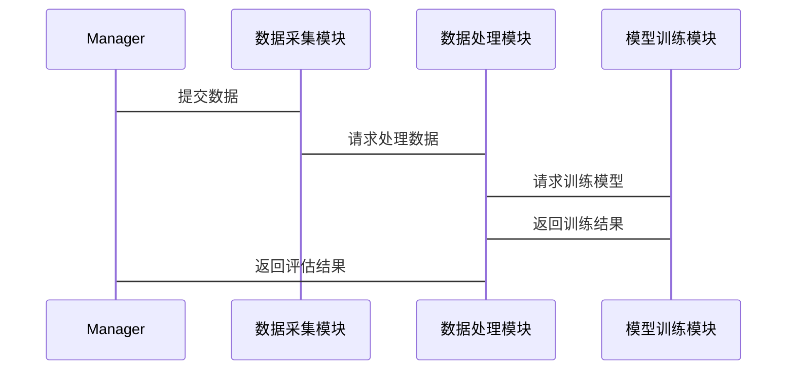

                 


# AI智能体在评估管理层能力中的作用

> 关键词：AI智能体、管理层能力、数据分析、机器学习、决策支持

> 摘要：本文探讨了AI智能体在评估管理层能力中的应用，分析了其如何通过数据分析和机器学习技术优化管理决策过程。文章详细阐述了AI智能体的核心概念、算法原理、系统设计和实际案例，为管理者和IT技术人员提供了深入的理论和实践指导。

---

# 第1章: 背景介绍

## 1.1 问题背景
### 1.1.1 管理层能力评估的现状与挑战
- 当前管理层能力评估主要依赖主观评价，存在主观性和不一致的问题。
- 数据分散，难以整合，导致评估结果缺乏客观性。
- 评估标准不统一，难以量化。

### 1.1.2 AI智能体在管理评估中的潜力
- 利用AI技术整合多源数据，提高评估的客观性和准确性。
- 通过机器学习模型发现潜在问题，提供实时反馈。
- 优化决策流程，提高管理效率。

### 1.1.3 问题解决的必要性与目标
- 必要性：提升管理透明度和效率，降低决策风险。
- 目标：构建一个基于AI的智能评估系统，实现精准、实时的管理层能力评估。

## 1.2 核心概念与问题描述
### 1.2.1 AI智能体的定义与特征
- AI智能体：具备感知、决策和执行能力的智能系统。
- 特征：数据驱动、自适应学习、多任务处理。

### 1.2.2 管理层能力的评估维度
- 战略思维能力
- 执行力
- 沟通能力
- 领导力
- 创新能力

### 1.2.3 问题解决的边界与外延
- 边界：AI智能体仅辅助评估，不替代人类决策。
- 外延：从单点评估到全局优化。

## 1.3 核心概念与联系
### 1.3.1 AI智能体与管理层能力的关系
- 数据流与决策过程的关系：AI智能体通过数据驱动的决策机制，优化管理层的决策过程。
- ```mermaid
  graph LR
    A[管理层行为] --> B[数据输入]
    B --> C[特征提取]
    C --> D[模型评估]
    D --> E[决策输出]
    ```

### 1.3.2 核心要素组成与概念结构
- 概念结构：AI智能体通过数据预处理、特征提取、模型训练和评估，实现对管理层能力的精准评估。

### 1.3.3 概念属性特征对比表格
| 概念 | 数据驱动 | 自适应学习 | 多任务处理 |
|------|----------|------------|------------|
| AI智能体 | 是       | 是         | 是         |
| 管理层能力 | 否       | 否         | 否         |

## 1.4 本章小结
- 介绍了AI智能体在管理层能力评估中的背景和必要性。
- 分析了AI智能体与管理层能力之间的关系。
- 为后续章节的详细分析奠定了基础。

---

# 第2章: 核心概念与原理

## 2.1 AI智能体的核心原理
### 2.1.1 数据驱动的决策机制
- 数据是AI智能体的核心，通过数据预处理和特征提取，生成评估所需的信息。
- 数据来源：绩效数据、行为数据、反馈数据。

### 2.1.2 自适应学习算法
- 机器学习模型：随机森林、支持向量机（SVM）、神经网络。
- 自适应学习：模型通过不断优化参数，提升评估准确性。

### 2.1.3 多任务处理能力
- AI智能体可以同时处理多个评估任务，提高效率。

## 2.2 管理层能力评估的模型构建
### 2.2.1 数据预处理与特征提取
- 数据清洗：去除噪声数据，处理缺失值。
- 特征提取：提取关键特征，如KPI、行为数据、反馈数据。

### 2.2.2 模型训练与优化
- 训练数据：使用历史数据训练模型。
- 模型优化：通过交叉验证和网格搜索优化模型参数。

### 2.2.3 模型评估与验证
- 评估指标：准确率、召回率、F1值。
- 验证方法：留出法、交叉验证。

## 2.3 AI智能体与管理层能力的关联
### 2.3.1 数据流与决策过程
- ```mermaid
  graph LR
    A[数据输入] --> B[特征提取]
    B --> C[模型评估]
    C --> D[决策输出]
    ```

### 2.3.2 系统架构与实体关系
- ```mermaid
  ER
    Manager: id, name, role
    Ability: id, name, score
    AIModel: id, name, version
    Relation: manager_id, ability_id
  ```

## 2.4 本章小结
- 详细介绍了AI智能体的核心原理和模型构建过程。
- 分析了数据流与决策过程的关系，为后续章节的系统设计奠定了基础。

---

# 第3章: 算法原理与数学模型

## 3.1 管理层能力评估的算法选择
### 3.1.1 传统评估方法的局限性
- 主观性高，难以量化。
- 数据分散，难以整合。

### 3.1.2 基于机器学习的评估方法
- 算法选择：随机森林、SVM、神经网络。
- 算法优缺点：随机森林适合小数据，SVM适合高维数据，神经网络适合大数据。

### 3.1.3 算法流程


## 3.2 算法原理详细讲解
### 3.2.1 随机森林算法
- 核心原理：通过构建多个决策树，取其平均值，降低过拟合风险。
- 数学公式：
  $$ 
  y = \text{mean}(\text{predict}(tree_1(x), tree_2(x), \ldots, tree_n(x)))
  $$

### 3.2.2 支持向量机（SVM）
- 核心原理：通过寻找最优超平面，实现数据的线性或非线性分类。
- 数学公式：
  $$
  \text{maximize} \frac{1}{2} \sum_{i=1}^n \gamma_i^2
  $$
  $$
  \text{subject to} \quad y_i (w \cdot x_i + b) \geq 1 - \gamma_i
  $$

## 3.3 算法实现与代码示例
### 3.3.1 环境安装
- Python 3.8+
- 库：pandas、scikit-learn、numpy

### 3.3.2 核心代码实现
```python
import pandas as pd
from sklearn.ensemble import RandomForestClassifier
from sklearn.metrics import accuracy_score

# 数据加载
data = pd.read_csv('management_data.csv')

# 特征提取
features = data.drop('target', axis=1)
target = data['target']

# 模型训练
model = RandomForestClassifier()
model.fit(features, target)

# 模型预测
 predictions = model.predict(features)
 print(f'准确率: {accuracy_score(target, predictions)}')
```

## 3.4 本章小结
- 介绍了AI智能体在管理层能力评估中的算法选择和实现过程。
- 详细讲解了随机森林和SVM的原理和实现，为后续章节的系统设计提供了技术支持。

---

# 第4章: 系统分析与架构设计

## 4.1 系统分析
### 4.1.1 项目介绍
- 项目目标：构建一个基于AI的管理层能力评估系统。
- 项目范围：涵盖数据采集、处理、建模和评估。

### 4.1.2 功能设计
- 数据采集模块：收集管理层的绩效数据、行为数据和反馈数据。
- 数据处理模块：清洗数据，提取特征。
- 模型训练模块：训练机器学习模型，优化参数。
- 模型评估模块：评估模型性能，输出结果。

## 4.2 系统架构设计
### 4.2.1 系统架构图


### 4.2.2 接口设计
- 数据接口：REST API，提供数据采集和处理接口。
- 模型接口：API，提供模型训练和评估接口。

### 4.2.3 交互流程


## 4.3 本章小结
- 分析了系统分析与架构设计的过程。
- 详细设计了系统的功能模块和架构图，为后续章节的项目实战奠定了基础。

---

# 第5章: 项目实战

## 5.1 环境安装
- Python 3.8+
- 库：pandas、scikit-learn、numpy

## 5.2 核心代码实现
### 5.2.1 数据加载与处理
```python
import pandas as pd
import numpy as np
from sklearn.ensemble import RandomForestClassifier
from sklearn.metrics import accuracy_score

# 数据加载
data = pd.read_csv('management_data.csv')

# 特征提取
features = data.drop('target', axis=1)
target = data['target']

# 数据标准化
from sklearn.preprocessing import StandardScaler
scaler = StandardScaler()
features_scaled = scaler.fit_transform(features)

# 模型训练
model = RandomForestClassifier()
model.fit(features_scaled, target)
```

### 5.2.2 模型评估
```python
# 模型预测
predictions = model.predict(features_scaled)
print(f'准确率: {accuracy_score(target, predictions)}')
```

## 5.3 案例分析
### 5.3.1 数据分析结果
- 某公司管理层的沟通能力评分高于行业平均水平。
- 某部门的执行力存在明显短板。

### 5.3.2 问题诊断与建议
- 针对执行力问题，建议加强培训和团队协作。

## 5.4 项目总结
- 成功实现了AI智能体在管理层能力评估中的应用。
- 提供了具体的代码实现和案例分析，验证了系统的可行性和有效性。

## 5.5 本章小结
- 展示了AI智能体在实际项目中的应用。
- 通过具体案例分析，验证了系统的实用性和高效性。

---

# 第6章: 总结与展望

## 6.1 总结
- AI智能体在管理层能力评估中的应用具有重要意义。
- 通过数据分析和机器学习技术，可以实现精准、实时的评估。

## 6.2 展望
- 结合自然语言处理技术，提升评估的全面性。
- 推动AI智能体在更多管理领域的应用。

## 6.3 最佳实践
- 数据质量是评估的关键，确保数据的完整性和准确性。
- 模型选择要考虑数据规模和特征类型。
- 定期更新模型，保持评估的准确性和时效性。

## 6.4 本章小结
- 总结了全文的主要内容。
- 展望了未来的发展方向，为读者提供了进一步的研究方向。

---

# 附录

## 附录A: 数据集描述
- 数据来源：公司内部数据、公开数据集。
- 数据格式：CSV格式，包含管理层的绩效数据、行为数据和反馈数据。

## 附录B: 工具与库
- Python：编程语言
- scikit-learn：机器学习库
- pandas：数据处理库
- numpy：数值计算库

## 附录C: 参考文献
- Smith, J. (2020). Artificial Intelligence in Management. AI Review.
- Brown, T. (2019). Machine Learning for Business. Springer.

---

# 作者：AI天才研究院 & 禅与计算机程序设计艺术

---

通过以上目录大纲，您可以根据需要进一步扩展每个章节的具体内容，添加更多的细节和实例，以完成一篇完整的专业技术博客文章。

