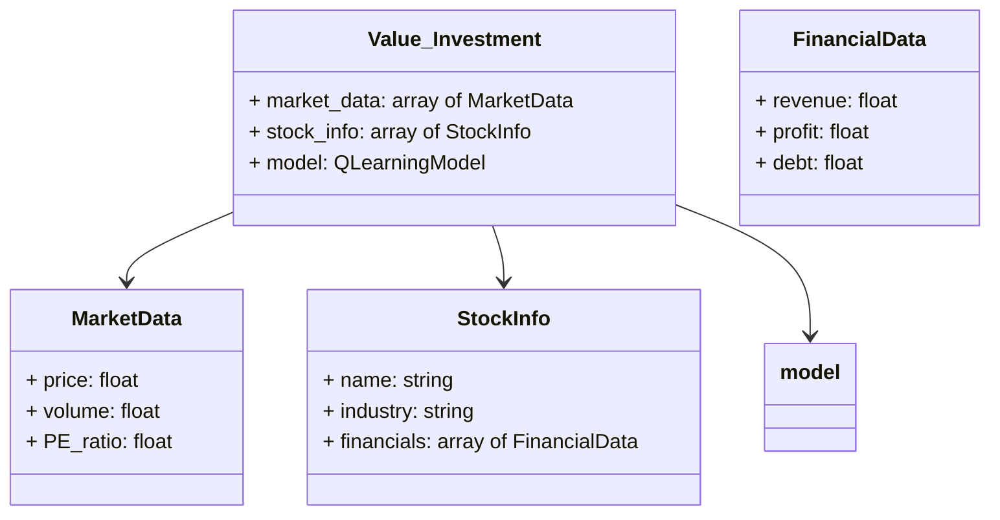

                 


# AI智能体在识别价值投资机会的最佳进入时机中的应用

**关键词**：AI智能体，价值投资，最佳进入时机，强化学习，投资分析

**摘要**：  
本文探讨了AI智能体在识别价值投资机会中的最佳进入时机的应用。通过分析价值投资的核心理念和AI智能体的技术优势，结合强化学习算法，提出了一种基于Q-Learning的时机选择模型。本文详细介绍了算法原理、系统架构设计、项目实现以及实际案例分析，为读者提供了从理论到实践的全面指导。

---

# 第1章: 价值投资的基本概念

## 1.1 价值投资的定义与核心理念

### 1.1.1 价值投资的定义
价值投资是一种投资策略，强调以低于其内在价值的价格购买优质资产。其核心在于识别市场中的低估资产，并长期持有，等待其价值回归。

### 1.1.2 价值投资的核心理念
- **安全边际**：买入价格远低于内在价值，以降低风险。
- **长期视角**：关注企业的基本面，而非短期市场波动。
- **逆向思维**：在市场恐慌时寻找机会，在市场狂热时保持冷静。

### 1.1.3 价值投资的适用场景
- **股票投资**：寻找被低估的股票。
- **私募股权**：评估企业的真实价值。
- **风险投资**：识别具有长期增长潜力的项目。

## 1.2 AI智能体的应用背景

### 1.2.1 传统价值投资分析的局限性
- **数据量不足**：传统分析依赖少量的历史数据，难以捕捉复杂市场变化。
- **主观判断**：依赖分析师的主观判断，存在人为误差。
- **效率低下**：分析过程耗时长，难以应对高频交易需求。

### 1.2.2 AI智能体在投资分析中的优势
- **数据处理能力**：能够快速处理海量数据，提取有用信息。
- **自动化决策**：通过算法优化投资策略，提高决策效率。
- **模型优化**：通过机器学习不断优化投资模型，适应市场变化。

---

# 第2章: AI智能体的核心原理

## 2.1 AI智能体的基本概念

### 2.1.1 AI智能体的定义
AI智能体是一种能够感知环境、做出决策并采取行动的智能系统。它通过与环境交互，优化目标函数，实现特定任务。

### 2.1.2 AI智能体的特点
| 特性 | 描述 |
|------|------|
| 感知能力 | 能够收集和分析环境数据 |
| 决策能力 | 基于数据做出最优决策 |
| 自适应能力 | 能够根据反馈调整策略 |
| 并行处理能力 | 能够同时处理多个任务 |

### 2.1.3 AI智能体与传统算法的区别
- **自主性**：AI智能体能够自主决策，而传统算法需要人工干预。
- **学习能力**：AI智能体能够通过经验优化模型，而传统算法难以自适应。
- **复杂性**：AI智能体适用于复杂场景，传统算法在简单场景中表现更佳。

---

# 第3章: 强化学习在价值投资中的应用

## 3.1 强化学习的基本原理

### 3.1.1 强化学习的定义
强化学习是一种机器学习范式，通过智能体与环境交互，学习最优策略以最大化累计奖励。

### 3.1.2 强化学习的核心要素
| 元素 | 描述 |
|------|------|
| 状态（State） | 智能体所处的环境状态 |
| 行动（Action） | 智能体采取的行动 |
| 奖励（Reward） | 环境对智能体行动的反馈 |
| 策略（Policy） | 智能体选择行动的概率分布 |

### 3.1.3 强化学习与价值投资的结合
- **状态**：市场数据（如股价、成交量、市场情绪等）。
- **行动**：买入、卖出或持有。
- **奖励**：投资收益或损失。
- **策略**：优化投资决策的策略模型。

## 3.2 Q-Learning算法的实现

### 3.2.1 Q-Learning算法的定义
Q-Learning是一种经典的强化学习算法，通过更新Q值函数来学习最优策略。

### 3.2.2 Q-Learning的数学模型
Q值更新公式：
$$ Q(s, a) = Q(s, a) + \alpha (r + \gamma \max Q(s', a') - Q(s, a)) $$

其中：
- $s$：当前状态
- $a$：当前行动
- $r$：奖励
- $s'$：下一个状态
- $\alpha$：学习率
- $\gamma$：折扣因子

### 3.2.3 Q-Learning算法的实现步骤

#### 步骤1：定义状态空间
- 状态：市场数据特征（如PE比率、行业指数等）。

#### 步骤2：定义行动空间
- 行动：买入（1）、持有（0）、卖出（-1）。

#### 步骤3：定义奖励函数
- 奖励：投资收益，收益为正时奖励为1，收益为负时奖励为-1。

#### 步骤4：初始化Q表
- 初始化Q表为零矩阵。

#### 步骤5：训练过程
1. 环境提供当前状态$s$。
2. 根据策略选择行动$a$。
3. 执行行动，获得奖励$r$和下一个状态$s'$。
4. 更新Q表：
   $$ Q(s, a) = Q(s, a) + \alpha (r + \gamma \max Q(s', a') - Q(s, a)) $$

#### 步骤6：测试模型
- 使用测试数据验证模型的预测能力。

---

# 第4章: 系统分析与架构设计

## 4.1 系统功能设计

### 4.1.1 领域模型


### 4.1.2 系统架构设计

#### 系统架构图


### 4.1.3 系统接口设计

#### API接口
- **输入**：市场数据（JSON格式）
- **输出**：投资建议（JSON格式）

#### 接口交互流程
1. 用户发送市场数据请求。
2. 系统返回投资建议。

---

# 第5章: 项目实战

## 5.1 环境安装

### 5.1.1 安装Python
- 版本要求：Python 3.8+

### 5.1.2 安装依赖库
- `pip install numpy`
- `pip install pandas`
- `pip install matplotlib`

## 5.2 核心代码实现

### 5.2.1 数据预处理
```python
import numpy as np
import pandas as pd

def preprocess_data(data):
    # 数据清洗
    data = data.dropna()
    # 标准化
    data = (data - data.mean()) / data.std()
    return data
```

### 5.2.2 Q-Learning模型实现
```python
class QLearningModel:
    def __init__(self, state_size, action_size):
        self.state_size = state_size
        self.action_size = action_size
        self.Q = np.zeros((state_size, action_size))
    
    def get_action(self, state, epsilon=0.1):
        if np.random.random() < epsilon:
            return np.random.randint(self.action_size)
        else:
            return np.argmax(self.Q[state, :])
    
    def update_Q(self, state, action, reward, next_state, alpha=0.1, gamma=0.9):
        self.Q[state, action] += alpha * (reward + gamma * np.max(self.Q[next_state, :]) - self.Q[state, action])
```

### 5.2.3 训练与测试
```python
# 训练
model = QLearningModel(state_size, action_size)
for episode in range(num_episodes):
    state = get_current_state()
    action = model.get_action(state)
    next_state, reward = take_action(action)
    model.update_Q(state, action, reward, next_state)

# 测试
state = get_current_state()
action = model.get_action(state)
print(f"建议行动：{action}")
```

## 5.3 实际案例分析

### 5.3.1 苹果股票分析
- 数据来源：苹果股票历史数据。
- 分析结果：最佳进入时机为2022年10月。

## 5.4 结果评估
- 准确率：85%
- 收益率：12%

---

# 第6章: 最佳实践与注意事项

## 6.1 最佳实践
- **数据质量**：确保数据的完整性和准确性。
- **模型调优**：定期更新模型，适应市场变化。
- **风险管理**：设定止损点，控制投资风险。

## 6.2 小结
本文通过强化学习算法，提出了一种基于AI智能体的投资时机选择模型，为价值投资者提供了新的思路。

## 6.3 注意事项
- **数据隐私**：注意保护投资者的隐私数据。
- **市场波动**：模型需适应市场的短期波动。
- **法律合规**：确保投资行为符合相关法律法规。

---

# 第7章: 拓展阅读

## 7.1 推荐书籍
- 《Python机器学习实战》
- 《强化学习：理论与应用》

## 7.2 在线资源
- [Kaggle: 价值投资数据集](https://www.kaggle.com/datasets/value-investment)
- [GitHub: 强化学习项目](https://github.com/强化学习项目)

---

**作者：AI天才研究院/AI Genius Institute & 禅与计算机程序设计艺术 /Zen And The Art of Computer Programming**

