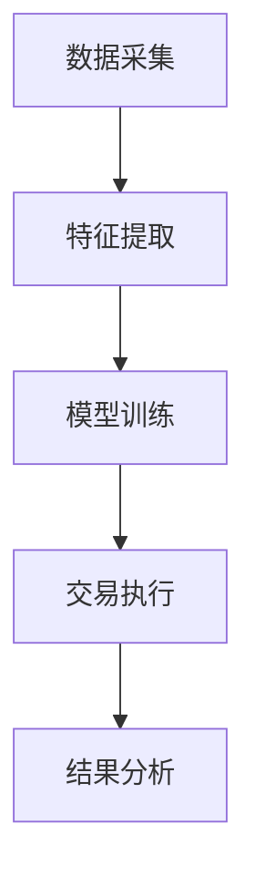

                 


# AI智能体在识别价值投资机会的最佳退出时机中的作用

> 关键词：AI智能体，价值投资，退出时机，投资决策，风险管理

> 摘要：随着人工智能技术的飞速发展，AI智能体在金融领域的应用越来越广泛。本文探讨了AI智能体在识别价值投资机会和确定最佳退出时机中的作用，通过分析其算法原理、数学模型和系统架构，展示了如何利用AI技术提升投资决策的效率和准确性。文章结合实际案例，详细讲解了AI智能体在价值投资中的应用场景，并总结了最佳实践和未来发展方向。

---

## 第1章: AI与价值投资的结合

### 1.1 价值投资的基本概念

#### 1.1.1 价值投资的定义与核心理念
价值投资是一种投资策略，强调以低于内在价值的价格购买优质资产，长期持有，等待其价值回归。其核心理念是寻找市场低估的股票，通过分析公司的基本面，如财务状况、盈利能力、行业地位等，来评估其内在价值。

#### 1.1.2 价值投资的核心要素
价值投资的核心要素包括：
1. **内在价值**：公司未来现金流的现值。
2. **安全边际**：买入价格低于内在价值，以降低风险。
3. **长期视角**：关注企业的长期增长潜力，而非短期价格波动。

#### 1.1.3 价值投资的哲学与实践
价值投资的哲学强调市场先生的非理性，认为市场短期波动不可预测，但长期趋势可以通过基本面分析来把握。实践上，投资者需要耐心、纪律和持续学习。

### 1.2 AI技术在金融领域的应用

#### 1.2.1 AI在金融分析中的作用
AI技术在金融分析中的作用主要体现在数据处理、模式识别和预测模型构建等方面。例如，通过自然语言处理（NLP）分析公司财报，利用机器学习预测股价走势。

#### 1.2.2 AI在投资决策中的优势
AI在投资决策中的优势包括：
1. **数据处理能力**：能够快速处理大量非结构化数据，如新闻、社交媒体和公司财报。
2. **模式识别**：通过历史数据识别潜在的投资机会和风险。
3. **自动化决策**：基于算法自动执行交易策略，减少人为情绪干扰。

#### 1.2.3 AI在风险控制中的应用
AI技术可以帮助投资者实时监控市场风险，识别潜在的市场崩盘信号，并通过动态调整投资组合来降低风险。

### 1.3 智能体在投资决策中的角色

#### 1.3.1 智能体的基本概念
智能体（Agent）是指能够感知环境、做出决策并采取行动的实体。在投资领域，智能体可以是自动化交易系统，能够根据市场变化自动执行买卖指令。

#### 1.3.2 智能体在投资决策中的应用
智能体在投资决策中的应用包括：
1. **实时监控**：持续跟踪市场数据，识别交易机会。
2. **动态调整**：根据市场变化和投资者目标调整投资组合。
3. **风险管理**：实时评估投资组合的风险，采取措施降低潜在损失。

#### 1.3.3 智能体的优势与局限性
智能体的优势在于高效性和准确性，能够快速处理大量数据并做出决策。但其局限性在于依赖数据质量和模型的有效性，可能在市场剧烈波动时表现不佳。

### 1.4 本章小结
本章介绍了价值投资的基本概念、AI技术在金融领域的应用以及智能体在投资决策中的角色，为后续分析奠定了基础。

---

## 第2章: 价值投资机会的识别与分析

### 2.1 价值投资机会的识别方法

#### 2.1.1 基本面分析法
基本面分析法通过分析公司的财务状况、盈利能力、行业地位等因素，评估其内在价值。例如，通过分析市盈率（P/E）和市净率（P/B）等指标，判断股票是否被市场低估。

#### 2.1.2 技术分析法
技术分析法通过分析历史价格和成交量数据，预测未来的价格走势。常用的技术指标包括移动平均线（MA）、相对强弱指数（RSI）和MACD等。

#### 2.1.3 综合分析法
综合分析法结合基本面和技术分析，通过多维度数据综合评估投资机会。例如，同时分析公司的财务状况和市场趋势，制定投资策略。

### 2.2 价值投资机会的量化指标

#### 2.2.1 市盈率（P/E）分析
市盈率是股票价格与每股收益的比率，用于衡量股票的估值。市盈率低于行业平均水平的股票可能被市场低估。

#### 2.2.2 市净率（P/B）分析
市净率是股票价格与每股净资产的比率，用于评估股票的价值。市净率低于1的股票通常被认为是价值型股票。

#### 2.2.3 股息率分析
股息率是股息与股票价格的比率，用于评估股票的分红能力。高股息率的股票通常被视为稳定的收益来源。

### 2.3 AI在价值投资机会识别中的应用

#### 2.3.1 数据挖掘与特征提取
通过AI技术，可以从大量非结构化数据中提取有用的特征，如新闻、社交媒体和公司财报中的关键词。

#### 2.3.2 模型构建与预测
利用机器学习算法，如支持向量机（SVM）和随机森林（Random Forest），构建预测模型，评估股票的内在价值和风险。

#### 2.3.3 结果分析与优化
通过分析模型的预测结果，优化投资组合，降低风险，提高收益。

### 2.4 本章小结
本章详细介绍了价值投资机会的识别方法和量化指标，并探讨了AI技术在其中的应用，展示了如何利用技术提升投资决策的准确性。

---

## 第3章: 最佳退出时机的识别与分析

### 3.1 退出时机的定义与重要性

#### 3.1.1 退出时机的定义
退出时机是指投资者决定卖出股票的时间点，通常在股票价格达到目标价或市场环境发生变化时。

#### 3.1.2 退出时机的重要性
最佳退出时机的确定能够最大化投资收益，降低投资风险。在市场波动较大时，及时退出能够避免损失。

#### 3.1.3 退出时机的选择原则
选择退出时机时需要考虑市场趋势、公司基本面和投资目标等因素，制定合理的退出策略。

### 3.2 退出时机的分析方法

#### 3.2.1 时间序列分析法
时间序列分析法通过分析历史价格数据，预测未来的趋势，识别潜在的退出时机。

#### 3.2.2 趋势分析法
趋势分析法通过分析市场的长期趋势，判断市场是否处于上升或下降周期，制定相应的退出策略。

#### 3.2.3 风险评估法
通过评估市场风险和投资组合的风险，制定退出时机的策略，如设定止损点。

### 3.3 AI在最佳退出时机识别中的应用

#### 3.3.1 数据分析与预测模型
通过AI技术分析市场数据，构建预测模型，判断最佳退出时机。

#### 3.3.2 风险评估与预警系统
AI可以通过实时监控市场数据，评估风险，发出预警信号，指导投资者及时退出。

#### 3.3.3 自适应优化策略
AI智能体可以根据市场变化动态调整退出策略，优化投资组合，提高收益。

### 3.4 本章小结
本章探讨了最佳退出时机的识别方法和分析技巧，并展示了AI技术在其中的应用，为投资者提供了科学的决策支持。

---

## 第4章: AI智能体在投资决策中的算法原理

### 4.1 强化学习在投资决策中的应用

#### 4.1.1 强化学习的基本原理
强化学习是一种通过试错和奖励机制来优化决策的算法。在投资中，智能体通过不断尝试不同的交易策略，学习最优的投资决策。

#### 4.1.2 强化学习在投资中的应用
强化学习可以用于动态资产配置、交易策略优化等领域，帮助投资者在复杂市场中做出最优决策。

#### 4.1.3 强化学习的优势与挑战
强化学习的优势在于能够适应复杂环境，但其挑战在于训练时间和计算资源消耗较大。

### 4.2 时间序列分析法在AI中的应用

#### 4.2.1 时间序列分析的基本原理
时间序列分析通过分析历史数据，预测未来的趋势，识别潜在的市场机会和风险。

#### 4.2.2 常用的时间序列分析方法
常用的时间序列分析方法包括ARIMA、GARCH和LSTM等，其中LSTM在处理长期依赖关系方面表现优异。

#### 4.2.3 时间序列分析在投资中的应用
时间序列分析可以用于预测股票价格、识别市场趋势和评估风险。

### 4.3 本章小结
本章详细介绍了强化学习和时间序列分析在AI中的应用，展示了AI技术在投资决策中的潜力。

---

## 第5章: 数学模型与算法实现

### 5.1 价值投资机会的数学模型

#### 5.1.1 内在价值的计算公式
内在价值可以通过现金流折现模型（DCF）计算：
$$
\text{内在价值} = \sum_{t=1}^{n} \frac{\text{现金流}_t}{(1 + r)^t} + \frac{\text{残值}}{(1 + r)^n}
$$
其中，r为折现率，n为预测的年数。

#### 5.1.2 安全边际的计算
安全边际 = 内在价值 - 股票价格
$$
\text{安全边际} = \text{内在价值} - \text{股票价格}
$$

### 5.2 最佳退出时机的预测模型

#### 5.2.1 价格预测模型
利用LSTM模型预测股票价格：
$$
\text{预测价格}_t = \text{LSTM}(\text{历史价格}_{t-1}, \text{其他因素}_{t-1})
$$

#### 5.2.2 风险评估模型
利用VaR模型评估投资组合的风险：
$$
\text{VaR} = \text{损失的金额}
$$

### 5.3 算法实现步骤

#### 5.3.1 数据预处理
包括数据清洗、标准化和特征提取等步骤。

#### 5.3.2 模型训练
使用训练数据训练模型，优化参数。

#### 5.3.3 模型预测
利用训练好的模型进行预测，识别价值投资机会和最佳退出时机。

#### 5.3.4 模型评估
通过回测和风险评估，评估模型的性能和可靠性。

### 5.4 本章小结
本章详细介绍了价值投资机会和最佳退出时机的数学模型，并展示了算法实现的步骤。

---

## 第6章: 系统架构与项目实战

### 6.1 系统架构设计

#### 6.1.1 系统功能模块
系统功能模块包括数据采集、特征提取、模型训练、交易执行和结果分析。

#### 6.1.2 系统架构图
使用Mermaid图展示系统架构：


### 6.2 项目实战

#### 6.2.1 环境安装
安装必要的Python库，如Pandas、NumPy、TensorFlow和Keras。

#### 6.2.2 系统核心实现源代码
以下是价值投资机会识别的Python代码示例：
```python
import pandas as pd
import numpy as np

def calculate_intrinsic_value(fcf, discount_rate):
    # 现金流折现模型计算内在价值
    return sum(fcf / (1 + discount_rate)**i for i in range(len(fcf)))

def calculate_margin_of_safety(intrinsic_value, market_price):
    return intrinsic_value - market_price

# 示例数据
fcf = [100, 120, 150, 200]
discount_rate = 0.08

intrinsic_value = calculate_intrinsic_value(fcf, discount_rate)
margin_of_safety = calculate_margin_of_safety(intrinsic_value, 100)

print("内在价值:", intrinsic_value)
print("安全边际:", margin_of_safety)
```

#### 6.2.3 代码应用解读与分析
上述代码展示了如何通过现金流折现模型计算内在价值，并计算安全边际。通过分析这些指标，投资者可以识别价值投资机会。

#### 6.2.4 实际案例分析
以某公司为例，分析其内在价值和安全边际，制定投资策略。

### 6.3 本章小结
本章通过系统架构设计和项目实战，展示了如何利用AI技术识别价值投资机会和确定最佳退出时机。

---

## 第7章: 最佳实践与未来展望

### 7.1 最佳实践 tips

#### 7.1.1 数据质量的重要性
高质量的数据是模型准确性的基础，需确保数据的完整性和准确性。

#### 7.1.2 模型的持续优化
市场环境不断变化，需定期优化模型，确保其适应新的市场条件。

#### 7.1.3 风险管理的重要性
在投资决策中，风险管理是至关重要的，需制定合理的止损策略。

### 7.2 小结

### 7.3 注意事项
在实际应用中，需注意市场波动、数据偏差和模型局限性等问题。

### 7.4 拓展阅读
推荐阅读相关书籍和论文，深入学习AI在金融领域的应用。

---

## 作者：AI天才研究院/AI Genius Institute & 禅与计算机程序设计艺术 /Zen And The Art of Computer Programming

---

这篇文章系统地探讨了AI智能体在识别价值投资机会和最佳退出时机中的作用，通过理论分析、算法实现和实际案例展示了AI技术在投资决策中的应用。希望读者能够通过本文，深入了解AI在金融领域的潜力，并在实际投资中灵活运用这些技术。

