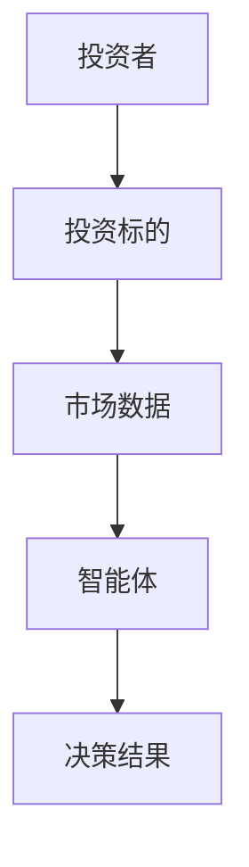
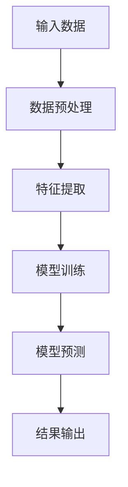
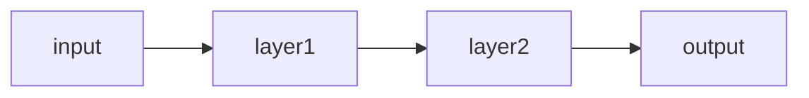

                 


# AI智能体在识别价值投资陷阱中的应用

## 关键词：AI智能体，价值投资，投资陷阱，算法原理，系统架构

## 摘要：  
本文深入探讨AI智能体在识别价值投资陷阱中的应用，从价值投资的基本概念、AI智能体的核心原理到算法实现和系统架构设计，层层剖析。通过具体案例分析和数学模型推导，揭示AI技术在投资领域的巨大潜力，并总结实践经验，为读者提供切实可行的解决方案。

---

## 第一部分: 价值投资与AI智能体的结合

### 第1章: 价值投资与AI智能体概述

#### 1.1 价值投资的基本概念  
价值投资是一种以基本面分析为基础的投资策略，旨在通过识别市场价格与内在价值的偏差，寻找被市场低估的投资标的。其核心理念包括：  
1. **安全边际**：买入价格低于内在价值的资产。  
2. **长期视角**：关注企业的长期盈利能力，而非短期市场波动。  
3. **逆向思维**：在市场恐慌时寻找机会，在市场狂热时保持冷静。  

#### 1.2 AI智能体的基本概念  
AI智能体是一种能够感知环境、做出决策并采取行动的智能系统。其特点包括：  
1. **自主性**：无需人工干预，自动执行任务。  
2. **反应性**：能够实时感知环境变化并做出响应。  
3. **学习能力**：通过数据训练不断优化决策模型。  

#### 1.3 价值投资与AI智能体的结合背景  
1. **信息不对称问题**：传统价值投资依赖于分析师的主观判断，容易受到信息不对称和情绪影响。  
2. **AI智能体的优势**：AI能够快速处理海量数据，识别复杂模式，提高决策的准确性和效率。  
3. **市场陷阱**：当前市场中，虚假信息、市场操纵等陷阱层出不穷，AI智能体能够帮助投资者识别这些风险。  

---

### 第2章: AI智能体在识别价值投资陷阱中的核心概念  

#### 2.1 价值投资陷阱的定义与分类  
价值投资陷阱主要指那些看似具有投资价值但实际上存在重大缺陷的标的。常见的陷阱包括：  
1. **财务造假**：企业通过虚假财务报告掩盖亏损。  
2. **管理层道德风险**：管理层存在腐败或不当行为。  
3. **行业周期性风险**：行业处于衰退期，企业难以持续盈利。  

#### 2.2 AI智能体识别陷阱的核心原理  
1. **感知机制**：通过收集和分析企业的财务数据、市场新闻、行业趋势等信息，识别潜在风险。  
2. **决策机制**：基于机器学习模型，评估标的的价值，判断是否为陷阱。  
3. **执行机制**：根据决策结果，生成投资建议或自动执行交易指令。  

#### 2.3 实体关系图（ER图）  


---

## 第二部分: AI智能体识别价值投资陷阱的算法原理  

### 第3章: 算法概述  
1. **算法的目标**：识别价值投资陷阱，提高投资决策的准确性。  
2. **输入**：企业的财务数据、市场新闻、行业趋势等。  
3. **输出**：投资标的的潜在风险评估报告。  

### 第4章: 算法流程图  


### 第5章: 算法的数学模型  
1. **损失函数**  
$$ L = \frac{1}{n}\sum_{i=1}^{n}(y_i - \hat{y_i})^2 $$  
2. **优化器**  
$$ \theta_{new} = \theta_{old} - \eta \cdot \frac{\partial L}{\partial \theta} $$  

---

## 第三部分: 价值投资陷阱识别系统的系统架构设计  

### 第6章: 系统组成模块  
1. **数据采集模块**：收集企业的财务数据、市场新闻等信息。  
2. **特征提取模块**：提取关键特征，如财务指标、行业趋势等。  
3. **模型训练模块**：训练机器学习模型，识别潜在陷阱。  
4. **结果输出模块**：生成风险评估报告。  

### 第7章: 系统架构图  


---

## 第四部分: 项目实战  

### 第8章: 项目介绍  
1. **项目背景**：介绍项目的目标和意义。  
2. **项目功能**：展示系统的功能模块和实现流程。  

### 第9章: 核心代码实现  
```python
def preprocess_data(data):
    # 数据预处理代码
    return processed_data

def train_model(data):
    # 模型训练代码
    return model

def predict_risk(model, data):
    # 风险预测代码
    return risk_score
```

---

## 第五部分: 总结与展望  

### 第10章: 项目总结  
1. **项目成果**：总结项目的实现效果和应用价值。  
2. **经验与教训**：分享项目实施中的经验和教训。  

### 第11章: 未来展望  
1. **改进方向**：探讨如何进一步优化算法和系统架构。  
2. **新技术应用**：展望AI技术在投资领域的未来发展方向。  

---

## 作者：AI天才研究院/AI Genius Institute & 禅与计算机程序设计艺术 /Zen And The Art of Computer Programming

