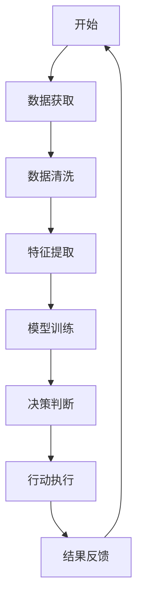
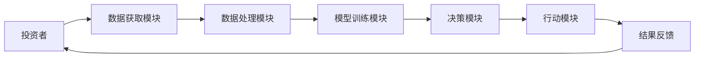
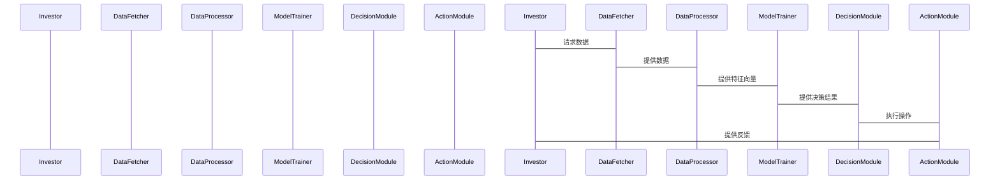

                 


# AI智能体在识别价值陷阱和价值机会中的作用

---

## 关键词

AI智能体, 价值识别, 强化学习, 系统架构, 价值陷阱, 价值机会

---

## 摘要

在当今快速变化的商业环境中，识别价值陷阱和价值机会的能力变得至关重要。AI智能体作为一种先进的人工智能系统，能够通过复杂的算法和数据处理能力，帮助我们高效地识别潜在的价值陷阱和机会。本文从背景介绍、核心概念、算法原理、系统架构、项目实战等多个方面，详细分析了AI智能体在价值识别中的作用，并通过实际案例展示了其在实践中的应用价值。

---

## 第一部分：背景介绍

### 第1章：问题背景与概念解析

#### 1.1 问题背景

在商业和投资领域，识别价值陷阱和价值机会是至关重要的任务。价值陷阱是指表面上看似有吸引力但实际上存在潜在风险或问题的项目或投资标的。而价值机会则是指那些被市场低估或未被充分认识到的高潜力项目或标的。传统的价值识别方法依赖于人工分析和经验判断，但这种方法效率低下，容易受到主观因素的影响，且难以在大数据环境下快速响应。

AI智能体作为一种能够自主感知、决策和行动的智能系统，能够通过大数据分析和机器学习算法，帮助我们更高效地识别价值陷阱和机会。它不仅可以处理海量数据，还能通过不断学习和优化，提高识别的准确性和效率。

#### 1.2 问题描述

价值陷阱和机会的识别涉及多个方面，包括数据收集、特征提取、模式识别和决策判断等。传统方法在以下方面存在明显局限性：

1. **数据处理能力有限**：人工分析难以处理海量数据，且容易遗漏关键信息。
2. **主观性较强**：分析结果受主观判断影响，缺乏客观性和一致性。
3. **效率低下**：人工分析耗时长，难以满足实时性需求。

AI智能体可以通过以下方式解决这些问题：

1. **自动化数据处理**：利用自然语言处理（NLP）和计算机视觉等技术，自动提取数据中的关键信息。
2. **数据驱动决策**：通过机器学习算法，基于数据进行模式识别和预测，减少主观性。
3. **实时响应**：AI智能体能够实时处理数据，快速识别潜在的机会和陷阱。

#### 1.3 问题解决

AI智能体的核心优势在于其强大的数据处理能力和自主决策能力。通过结合强化学习和深度学习算法，AI智能体可以在复杂的环境中自主学习和优化，从而更准确地识别价值陷阱和机会。例如，在金融领域，AI智能体可以通过分析市场数据和公司财务报表，识别出那些被市场低估的股票，或者发现那些存在财务风险的公司。

#### 1.4 边界与外延

尽管AI智能体在价值识别中具有巨大潜力，但其应用也存在一定的边界。例如，AI智能体的性能依赖于数据质量和模型训练的效果，如果数据存在偏差或噪声，可能会影响识别的准确性。此外，AI智能体的应用还受到计算资源和算法复杂度的限制。

#### 1.5 概念结构与核心要素

AI智能体的价值识别系统通常包括以下几个核心要素：

1. **数据源**：包括市场数据、公司财务数据、新闻报道等。
2. **数据处理模块**：负责数据的清洗、转换和特征提取。
3. **模型训练模块**：利用机器学习算法对数据进行训练，生成识别模型。
4. **决策模块**：基于模型输出，判断是否存在价值陷阱或机会。
5. **行动模块**：根据决策结果，执行相应的操作，例如发出警报或推荐投资标的。

---

## 第二部分：核心概念与联系

### 第2章：AI智能体的核心概念

#### 2.1 AI智能体的定义与特征

AI智能体是一种能够感知环境、自主决策并采取行动的智能系统。与传统算法相比，AI智能体具有以下显著特征：

1. **自主性**：能够自主进行感知、决策和行动，无需人工干预。
2. **反应性**：能够实时响应环境变化，快速调整策略。
3. **学习能力**：通过机器学习算法不断优化模型，提高识别能力。
4. **适应性**：能够根据环境变化自适应调整行为策略。

#### 2.2 AI智能体的感知、决策与行动机制

AI智能体的感知、决策与行动机制是其核心功能模块。以下是对每个模块的详细说明：

1. **感知模块**：
   - 负责从环境中获取信息，例如市场数据、新闻报道等。
   - 使用自然语言处理（NLP）和计算机视觉等技术提取关键信息。
   - 示例：通过NLP分析新闻报道，提取公司财务状况和市场情绪。

2. **决策模块**：
   - 基于感知模块获取的信息，结合预训练的模型，判断是否存在价值陷阱或机会。
   - 示例：通过强化学习算法，优化投资组合，避免价值陷阱。

3. **行动模块**：
   - 根据决策结果，执行相应的操作，例如发出警报、推荐投资标的或调整交易策略。
   - 示例：当识别出价值机会时，自动执行买入指令。

#### 2.3 实体关系图

以下是AI智能体在价值识别中的实体关系图：

```mermaid
erDiagram
    actor 投资者
    actor 系统管理员
    actor 数据源提供者
    class 数据源
    class 数据处理模块
    class 模型训练模块
    class 决策模块
    class 行动模块
   投资者 --> 数据处理模块
   投资者 --> 模型训练模块
   投资者 --> 决策模块
   投资者 --> 行动模块
   系统管理员 --> 数据处理模块
   系统管理员 --> 模型训练模块
   系统管理员 --> 决策模块
   系统管理员 --> 行动模块
   数据源 --> 数据处理模块
   数据源 --> 模型训练模块
```

---

## 第三部分：算法原理讲解

### 第3章：AI智能体的算法基础

#### 3.1 理论基础

AI智能体的算法基础主要包括以下几种：

1. **强化学习（Reinforcement Learning）**：
   - 强化学习是一种通过试错机制来优化决策的算法。
   - 示例：在股票交易中，AI智能体通过不断尝试不同的交易策略，逐步优化投资组合。

2. **深度学习（Deep Learning）**：
   - 深度学习通过多层神经网络模型，自动提取数据中的特征。
   - 示例：利用卷积神经网络（CNN）分析图像数据，识别潜在的价值机会。

3. **自然语言处理（NLP）**：
   - NLP技术用于处理文本数据，提取关键信息。
   - 示例：通过NLP分析新闻报道，识别市场趋势和公司财务状况。

#### 3.2 算法流程

以下是AI智能体在价值识别中的算法流程：



#### 3.3 Python实现

以下是基于强化学习的AI智能体的Python代码示例：

```python
import numpy as np
import gym

# 创建环境
env = gym.make('StockTrading-v0')

# 初始化智能体
class Agent:
    def __init__(self, state_space, action_space):
        self.state_space = state_space
        self.action_space = action_space
        self.model = self.build_model()

    def build_model(self):
        # 构建强化学习模型
        # 示例：简单策略网络
        pass

    def act(self, state):
        # 根据状态选择动作
        pass

    def learn(self, state, action, reward, next_state):
        # 强化学习算法更新模型
        pass

# 初始化智能体
agent = Agent(env.observation_space, env.action_space)

# 开始训练
for episode in range(1000):
    state = env.reset()
    total_reward = 0
    done = False
    while not done:
        action = agent.act(state)
        next_state, reward, done, info = env.step(action)
        agent.learn(state, action, reward, next_state)
        total_reward += reward
    print(f"Episode {episode}, Total Reward: {total_reward}")
```

---

## 第四部分：系统分析与架构设计

### 第4章：系统分析与架构设计

#### 4.1 系统架构设计

以下是AI智能体系统的架构设计：



#### 4.2 接口设计

以下是系统主要接口的描述：

1. **数据获取接口**：
   - 接收外部数据源提供的数据，例如市场数据、新闻报道等。
   - 示例：`get_market_data(api_key)`。

2. **模型训练接口**：
   - 接收数据处理模块输出的特征向量，训练模型并输出决策结果。
   - 示例：`train_model(data, labels)`。

3. **决策接口**：
   - 根据模型输出的决策结果，执行相应的操作，例如发出警报或推荐投资标的。
   - 示例：`make_decision(action)`。

#### 4.3 交互流程

以下是系统交互流程：



---

## 第五部分：项目实战

### 第5章：项目实战

#### 5.1 环境安装

以下是项目实战所需的环境安装步骤：

1. 安装Python和相关库：
   ```bash
   pip install numpy gym tensorflow
   ```

2. 安装股票交易环境：
   ```bash
   pip install gym[stocks]
   ```

#### 5.2 核心代码实现

以下是基于强化学习的股票交易智能体的Python代码实现：

```python
import gym
import numpy as np

class Agent:
    def __init__(self, state_space, action_space):
        self.state_space = state_space
        self.action_space = action_space
        self.model = self.build_model()

    def build_model(self):
        # 示例：简单策略网络
        model = Sequential()
        model.add(Dense(32, activation='relu', input_dim=self.state_space.shape[0]))
        model.add(Dense(self.action_space.n, activation='softmax'))
        model.compile(optimizer='adam', loss='sparse_categorical_crossentropy')
        return model

    def act(self, state):
        # 返回动作
        return self.model.predict(state)[0].argmax()

    def remember(self, state, action, reward, next_state):
        # 记忆经验
        pass

    def replay(self, batch_size):
        # 回放经验
        pass

# 初始化环境
env = gym.make('StockTrading-v0')
state_space = env.observation_space
action_space = env.action_space

# 初始化智能体
agent = Agent(state_space, action_space)

# 开始训练
for episode in range(100):
    state = env.reset()
    total_reward = 0
    done = False
    while not done:
        action = agent.act(state)
        next_state, reward, done, info = env.step(action)
        agent.remember(state, action, reward, next_state)
        agent.replay(32)
        total_reward += reward
    print(f"Episode {episode}, Total Reward: {total_reward}")
```

#### 5.3 案例分析

以下是AI智能体在股票交易中的应用案例分析：

1. **环境初始化**：
   ```python
   env = gym.make('StockTrading-v0')
   ```

2. **智能体训练**：
   ```python
   agent = Agent(env.observation_space, env.action_space)
   ```

3. **训练过程**：
   ```python
   for episode in range(100):
       state = env.reset()
       total_reward = 0
       done = False
       while not done:
           action = agent.act(state)
           next_state, reward, done, info = env.step(action)
           agent.remember(state, action, reward, next_state)
           agent.replay(32)
           total_reward += reward
       print(f"Episode {episode}, Total Reward: {total_reward}")
   ```

4. **结果分析**：
   - 训练完成后，可以观察每个 episode 的总奖励值，评估模型的性能。
   - 如果总奖励值逐渐增加，说明模型逐渐学会了如何识别价值机会和避免价值陷阱。

---

## 第六部分：总结与展望

### 第6章：总结与展望

#### 6.1 总结

本文详细介绍了AI智能体在识别价值陷阱和价值机会中的作用。通过背景介绍、核心概念、算法原理、系统架构和项目实战等多个方面，展示了AI智能体在价值识别中的巨大潜力和实际应用价值。AI智能体通过自动化数据处理、机器学习算法和自主决策能力，能够帮助我们更高效地识别潜在的价值陷阱和机会。

#### 6.2 最佳实践

在实际应用中，建议从以下几个方面入手：

1. **数据质量**：确保数据源的多样性和准确性，避免数据偏差。
2. **模型优化**：根据具体应用场景，选择合适的算法，并不断优化模型。
3. **系统监控**：实时监控系统运行状态，及时发现和解决问题。
4. **风险管理**：建立完善的风控机制，避免因模型误判导致的损失。

#### 6.3 展望

未来，随着人工智能技术的不断发展，AI智能体在价值识别中的应用将更加广泛和深入。我们可以期待以下发展：

1. **多模态数据处理**：结合文本、图像等多种数据源，提高识别精度。
2. **强化学习优化**：通过强化学习算法的不断优化，提升决策的准确性和效率。
3. **实时响应**：实现更快速的实时响应，满足动态变化的市场需求。

---

## 作者信息

作者：AI天才研究院/AI Genius Institute & 禅与计算机程序设计艺术 /Zen And The Art of Computer Programming

