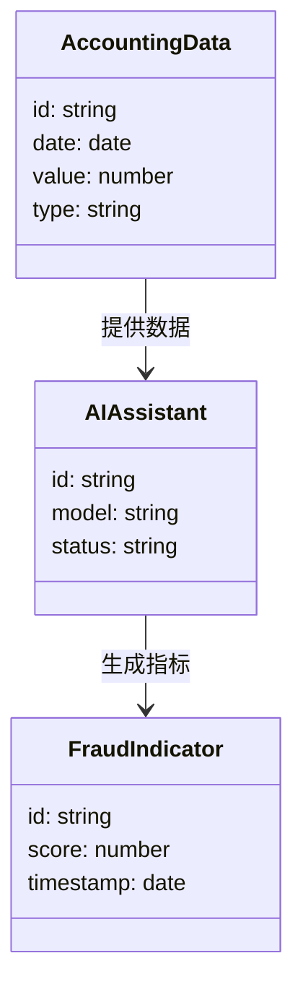
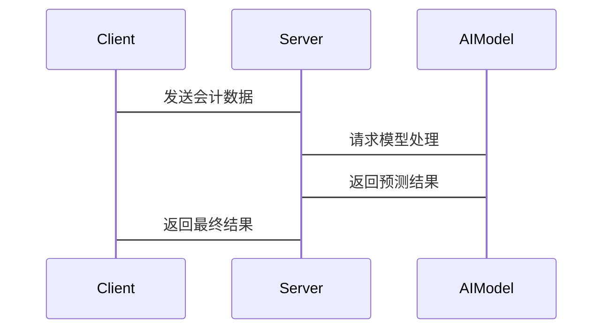

                 


```markdown
# AI智能体在识别会计操纵中的应用

> 关键词：AI智能体、会计操纵、数据挖掘、机器学习、审计

> 摘要：随着企业对会计数据造假的需求增加，传统的审计方法已经难以应对复杂的会计操纵手段。本文详细介绍了AI智能体在识别会计操纵中的应用，从基础概念到算法实现，从系统设计到项目实战，全面解析如何利用AI技术提升会计审计效率和准确性。通过实际案例分析，展示了AI智能体在会计操纵识别中的独特优势和实际应用价值。

---

# 第1章 会计操纵与AI智能体的背景介绍

## 1.1 会计操纵的定义与特征

### 1.1.1 会计操纵的定义
会计操纵是指企业通过虚构、篡改或隐瞒会计数据，以达到财务报表造假或误导利益相关者的目的。

### 1.1.2 会计操纵的主要特征
| 特征 | 描述 |
|------|------|
| 数据不一致性 | 不同会计科目之间数据关联性异常 |
| 时间序列异常 | 某些会计指标在时间序列上突然变化 |
| 关联交易频繁 | 存在大量异常的关联交易 |

### 1.1.3 会计操纵的常见手段与案例
- 虚增收入
- 虚减成本
- 调整会计估计参数
- 未披露的关联交易

---

## 1.2 AI智能体的基本概念

### 1.2.1 AI智能体的定义
AI智能体是一种能够感知环境、自主决策并执行任务的智能系统，具备学习、推理和自适应能力。

### 1.2.2 AI智能体的核心要素
| 要素 | 描述 |
|------|------|
| 感知能力 | 通过数据输入感知环境 |
| 决策能力 | 基于感知信息做出决策 |
| 执行能力 | 执行决策并输出结果 |

### 1.2.3 AI智能体与传统算法的区别
| 方面 | 传统算法 | AI智能体 |
|------|---------|----------|
| 自适应性 | 静态规则 | 动态学习 |
| 决策方式 | 确定性 | 概率性 |
| 应用场景 | 单任务 | 多任务 |

---

## 1.3 会计操纵识别中的问题背景

### 1.3.1 会计数据造假的现状
- 企业为了追求短期利益，频繁进行会计造假。
- 传统审计手段难以发现复杂的隐藏性造假行为。

### 1.3.2 传统会计审计的局限性
- 依赖人工判断，主观性强。
- 需要大量时间，效率低下。
- 难以发现隐藏在数据中的复杂模式。

### 1.3.3 AI智能体在会计审计中的潜力
- 自动化识别异常数据。
- 发现隐藏在数据中的复杂模式。
- 实现实时监控和预警。

---

## 1.4 本章小结
本章从会计操纵的定义、特征及常见手段入手，分析了传统会计审计的局限性，并重点介绍了AI智能体的基本概念及其在会计审计中的潜力。

---

# 第2章 会计操纵识别的核心概念

## 2.1 会计数据的特征与属性

### 2.1.1 会计数据的结构化特征
| 特征 | 描述 |
|------|------|
| 时间序列性 | 数据具有时间戳 |
| 关联性 | 数据之间存在强关联 |

### 2.1.2 会计数据的非结构化特征
- 文本型数据（如财务报告、审计意见）
- 图像型数据（如财务报表截图）

### 2.1.3 会计数据的时间序列特征
- 数据的时间依赖性
- 数据的周期性特征

---

## 2.2 AI智能体在会计操纵识别中的作用

### 2.2.1 数据处理与特征提取
- 数据清洗：去除噪声数据。
- 特征提取：从会计数据中提取有用的特征。

### 2.2.2 模型训练与预测
- 基于机器学习模型预测会计数据是否存在操纵。

### 2.2.3 结果解释与反馈
- 对模型预测结果进行解释。
- 根据反馈优化模型。

---

## 2.3 核心概念关系图

### 2.3.1 会计数据与AI智能体的关系


### 2.3.2 智能体与会计操纵识别的实体关系图
```mermaid
er
    entity AI智能体
    entity 会计数据
    entity 操纵行为
    AI智能体 --> 会计数据: 处理
    AI智能体 --> 操纵行为: 识别
```

---

## 2.4 本章小结
本章详细分析了会计数据的特征与属性，探讨了AI智能体在会计操纵识别中的作用，并通过关系图展示了各实体之间的关系。

---

# 第3章 AI智能体在会计操纵识别中的算法实现

## 3.1 算法选择与实现步骤

### 3.1.1 算法选择
- 监督学习：随机森林、神经网络。
- 无监督学习：聚类分析。

### 3.1.2 实现步骤
1. 数据预处理。
2. 特征工程。
3. 模型训练。
4. 模型评估。

---

## 3.2 特征工程与数据预处理

### 3.2.1 数据清洗
- 删除重复数据。
- 填充缺失值。

### 3.2.2 特征提取
- 时间序列特征提取。
- 文本特征提取。

---

## 3.3 算法实现与优化

### 3.3.1 监督学习模型实现
```python
from sklearn.ensemble import RandomForestClassifier
from sklearn.model_selection import train_test_split
from sklearn.metrics import accuracy_score

# 数据准备
X = ...
y = ...

# 划分训练集与测试集
X_train, X_test, y_train, y_test = train_test_split(X, y, test_size=0.2)

# 模型训练
model = RandomForestClassifier().fit(X_train, y_train)

# 模型预测
y_pred = model.predict(X_test)

# 模型评估
print("Accuracy:", accuracy_score(y_test, y_pred))
```

### 3.3.2 模型优化
- 调参：调整模型参数。
- 集成学习：使用投票法提升准确率。

---

## 3.4 本章小结
本章通过具体的算法实现，详细讲解了如何利用AI智能体识别会计操纵，并通过代码示例展示了实现过程。

---

# 第4章 AI智能体的数学模型与公式推导

## 4.1 监督学习模型

### 4.1.1 随机森林模型
随机森林是一种基于树的集成学习方法，公式如下：
$$
y = \sum_{i=1}^{n} \text{Tree}_i(x)
$$

### 4.1.2 神经网络模型
神经网络模型通过多层感知机实现非线性分类，损失函数为：
$$
L = -\frac{1}{m} \sum_{i=1}^{m} y_i \log(p_i) + (1 - y_i)\log(1 - p_i)
$$

---

## 4.2 无监督学习模型

### 4.2.1 K-Means聚类
K-Means算法的目标函数为：
$$
\min_{k} \sum_{i=1}^{k} \sum_{j=1}^{n_i} (x_j - c_i)^2
$$

### 4.2.2 DBSCAN聚类
DBSCAN算法基于密度的概念，公式为：
$$
\text{core\_dist}(x, \epsilon) = \min_{x' \in N(x, \epsilon)} \text{distance}(x, x')
$$

---

## 4.3 本章小结
本章通过数学公式推导，详细分析了AI智能体在会计操纵识别中的监督学习和无监督学习模型。

---

# 第5章 系统分析与架构设计

## 5.1 系统功能设计

### 5.1.1 领域模型


### 5.1.2 功能模块
- 数据输入模块。
- 数据处理模块。
- 模型训练模块。
- 结果展示模块。

---

## 5.2 系统架构设计

### 5.2.1 系统架构图


---

## 5.3 系统接口设计

### 5.3.1 API接口
- RESTful API。
- 输入：会计数据。
- 输出：操纵风险评分。

---

## 5.4 系统交互流程

### 5.4.1 交互流程图


---

## 5.5 本章小结
本章从系统功能设计到架构设计，详细展示了AI智能体在会计操纵识别中的系统实现。

---

# 第6章 项目实战与案例分析

## 6.1 项目环境搭建

### 6.1.1 环境需求
- Python 3.8+
- Jupyter Notebook
- scikit-learn、XGBoost

---

## 6.2 系统核心实现

### 6.2.1 数据预处理
```python
import pandas as pd

# 读取数据
df = pd.read_csv('accounting_data.csv')

# 删除缺失值
df.dropna(inplace=True)

# 标签编码
from sklearn.preprocessing import LabelEncoder

le = LabelEncoder()
df['label'] = le.fit_transform(df['label'])
```

---

### 6.2.2 模型训练
```python
from sklearn.model_selection import GridSearchCV
from sklearn.ensemble import RandomForestClassifier

# 参数搜索
param_grid = {
    'n_estimators': [100, 200],
    'max_depth': [None, 10]
}

grid_search = GridSearchCV(RandomForestClassifier(), param_grid)
grid_search.fit(X_train, y_train)

# 最佳模型
best_model = grid_search.best_estimator_
```

---

## 6.3 案例分析与结果解读

### 6.3.1 案例分析
- 数据来源：公开上市公司的财务报表。
- 模型预测结果：识别出某公司的收入虚增行为。

---

## 6.4 本章小结
本章通过实际项目案例，展示了AI智能体在会计操纵识别中的具体实现和应用效果。

---

# 第7章 高级应用与未来趋势

## 7.1 高级应用

### 7.1.1 多模态数据融合
- 结合文本、图像等多种数据源。

### 7.1.2 实时监控
- 实时分析会计数据，快速识别异常。

---

## 7.2 未来趋势

### 7.2.1 深度学习的进一步应用
- 引入Transformer模型处理会计文本数据。

### 7.2.2 联合学习
- 跨机构数据联合建模，提升模型鲁棒性。

---

## 7.3 本章小结
本章探讨了AI智能体在会计操纵识别中的高级应用，并展望了未来的发展趋势。

---

# 第8章 总结与展望

## 8.1 总结
- AI智能体在会计操纵识别中的应用具有显著优势。
- 技术实现需要结合具体场景。

## 8.2 展望
- 提升模型解释性。
- 加强数据隐私保护。

---

# 作者：AI天才研究院 & 禅与计算机程序设计艺术
```

