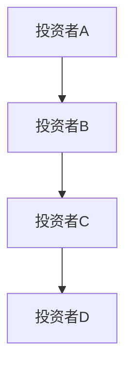
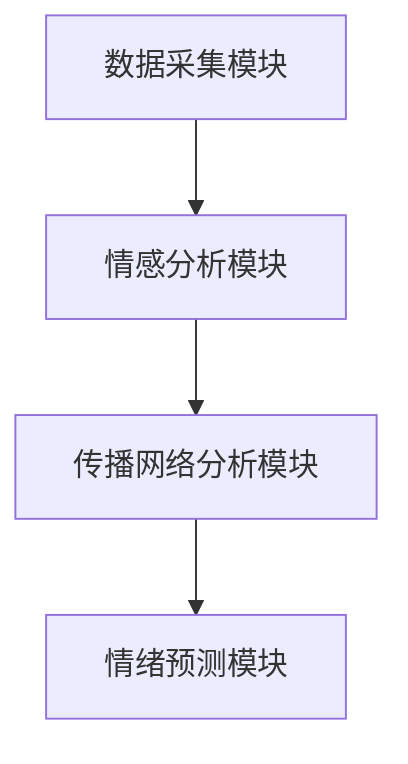
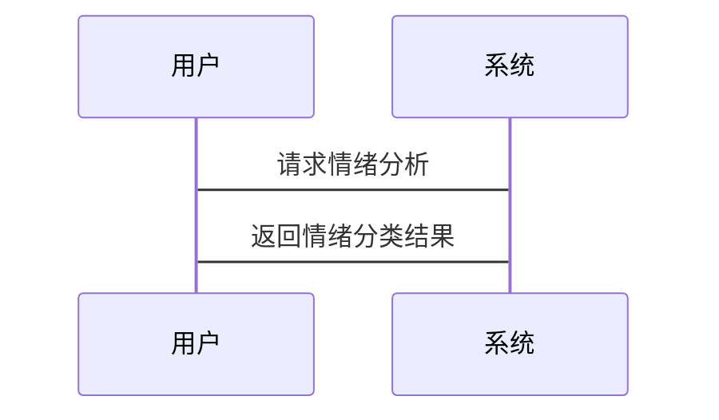

                 


# AI智能体在识别市场情绪传染中的应用

> 关键词：AI智能体，市场情绪传染，情感分析，社会网络分析，情绪预测，深度学习

> 摘要：本文探讨了AI智能体在识别市场情绪传染中的应用。通过分析市场情绪传染的基本概念、传播机制以及AI智能体在情绪识别和预测中的技术原理，本文旨在揭示如何利用先进的AI技术来理解和预测市场情绪的传播。文章从理论基础到实际应用，详细介绍了情绪识别的核心算法、系统架构设计以及项目实战，为读者提供全面的技术指导。

---

# 第1章: 市场情绪传染与AI智能体概述

## 1.1 市场情绪传染的基本概念

### 1.1.1 市场情绪传染的定义
市场情绪传染是指投资者在金融市场中的情绪通过信息传播、社交互动等方式影响其他投资者的行为，从而引发连锁反应的现象。这种情绪传播可以是正面的（如乐观情绪）或负面的（如恐慌情绪），并对市场价格产生显著影响。

### 1.1.2 市场情绪传染的传播机制
市场情绪传染的传播机制包括以下几个关键环节：
- **信息传播**：通过社交媒体、新闻媒体等渠道传播市场相关信息。
- **情绪感染**：个体在接收到信息后，情绪受到感染并发生改变。
- **行为反馈**：情绪变化导致投资者行为的变化，进一步影响市场价格。

### 1.1.3 市场情绪传染的核心要素
市场情绪传染的核心要素包括：
- **信息源**：信息的来源（如社交媒体、新闻、专家意见）。
- **传播路径**：信息传播的渠道和网络结构。
- **情绪特征**：情绪的强度、类型和传播速度。

## 1.2 AI智能体在市场情绪传染中的作用

### 1.2.1 AI智能体的基本概念
AI智能体是一种能够感知环境、自主决策并执行任务的智能系统。在市场情绪传染的识别中，AI智能体可以通过分析海量数据，实时监测市场情绪的变化。

### 1.2.2 AI智能体在情绪识别中的优势
AI智能体在情绪识别中的优势包括：
- **高效性**：能够快速处理海量数据。
- **准确性**：通过深度学习算法实现高精度的情绪识别。
- **实时性**：能够实时监测市场情绪的变化。

### 1.2.3 AI智能体与市场情绪传染的结合
AI智能体与市场情绪传染的结合主要体现在以下几个方面：
- **情绪监测**：实时监测市场参与者的的情绪变化。
- **情绪预测**：基于历史数据和算法模型，预测情绪的传播趋势。
- **行为干预**：通过智能决策影响市场参与者的行为。

## 1.3 本书的研究目标与内容框架

### 1.3.1 研究目标
本书的研究目标是探讨AI智能体在识别市场情绪传染中的应用，分析市场情绪传染的传播机制，并提出基于AI技术的解决方案。

### 1.3.2 内容框架
- 第1章：市场情绪传染与AI智能体概述。
- 第2章：市场情绪传染的核心概念与原理。
- 第3章：AI智能体的情绪识别技术。
- 第4章：市场情绪传染的预测与建模。
- 第5章：AI智能体的系统架构与实现。
- 第6章：项目实战与案例分析。
- 第7章：总结与展望。

### 1.3.3 预期成果
通过本书的研究和实践，读者将能够理解市场情绪传染的基本原理，并掌握基于AI智能体的情绪识别和预测技术。

---

# 第2章: 市场情绪传染的核心概念与原理

## 2.1 情绪传染的传播模型

### 2.1.1 社会网络分析
社会网络分析是研究情绪传播的重要工具。通过分析社交网络的结构，可以揭示情绪传播的关键节点和路径。



### 2.1.2 情绪传播的数学模型
情绪传播的数学模型可以表示为：
$$ P(t+1) = \alpha P(t) + (1-\alpha) \cdot \text{外部影响} $$
其中，$\alpha$ 是传播系数，$P(t)$ 表示第 $t$ 时刻的情绪概率。

### 2.1.3 情绪传染的特征分析
情绪传染的特征包括传播速度、传播范围和传播强度。

## 2.2 市场情绪传染的关键影响因素

### 2.2.1 社交媒体的影响
社交媒体是情绪传播的重要渠道，通过分析社交媒体上的文本和情感，可以揭示市场情绪的变化。

### 2.2.2 市场参与者的心理因素
投资者的心理因素（如风险偏好、情绪稳定性）会影响情绪的传播和扩散。

### 2.2.3 信息传播的速度与广度
信息传播的速度和广度直接影响情绪传染的范围和强度。

## 2.3 情绪传染的边界与外延

### 2.3.1 情绪传染的边界条件
情绪传染的边界条件包括信息的真实性、传播渠道的可信度以及市场参与者的认知能力。

### 2.3.2 情绪传染的外延范围
情绪传染的外延范围包括从个体情绪变化到市场整体波动的传播过程。

### 2.3.3 情绪传染与其他市场行为的关系
情绪传染与其他市场行为（如价格波动、交易量变化）密切相关，是影响市场行为的重要因素。

---

# 第3章: AI智能体的情绪识别技术

## 3.1 情感分析的算法原理

### 3.1.1 基于规则的情感分析
基于规则的情感分析通过预定义的规则和情感词典来判断文本的情感倾向。

### 3.1.2 基于机器学习的情感分析
基于机器学习的情感分析使用训练好的模型（如SVM、随机森林）来分类文本的情感。

### 3.1.3 基于深度学习的情感分析
基于深度学习的情感分析使用神经网络（如LSTM、Transformer）来捕捉文本的情感特征。

## 3.2 情绪识别的核心算法

### 3.2.1 LSTM网络在情绪识别中的应用
LSTM网络通过捕捉时间序列中的长-term依赖关系，能够有效识别文本中的情绪变化。

### 3.2.2 Transformer模型在情绪识别中的应用
Transformer模型通过自注意力机制，能够捕捉文本中的全局信息，提高情绪识别的准确性。

### 3.2.3 图神经网络在情绪识别中的应用
图神经网络通过建模社交网络的结构，能够更好地理解情绪传播的网络效应。

## 3.3 情绪识别的优化策略

### 3.3.1 数据增强技术
数据增强技术包括同义词替换、句式变换等，能够提高模型的泛化能力。

### 3.3.2 模型调优方法
模型调优方法包括参数优化、正则化、早停等，能够提高模型的性能。

### 3.3.3 多模态数据融合
多模态数据融合通过结合文本、语音、图像等多种数据源，能够提高情绪识别的准确性。

---

# 第4章: 市场情绪传染的预测与建模

## 4.1 情绪传染的预测方法

### 4.1.1 时间序列分析
时间序列分析通过分析历史情绪数据，预测未来的情绪变化趋势。

### 4.1.2 预测模型的选择
预测模型的选择需要考虑数据特征、模型复杂度和预测精度。

### 4.1.3 模型评估指标
模型评估指标包括准确率、召回率、F1值等。

## 4.2 基于AI智能体的情绪传染预测模型

### 4.2.1 模型设计思路
基于AI智能体的情绪传染预测模型需要结合情感分析和传播网络的特征。

### 4.2.2 模型实现步骤
- 数据收集：收集社交媒体、新闻等数据。
- 数据预处理：清洗、标注数据。
- 模型训练：训练情感分析模型和传播网络模型。
- 模型预测：预测市场情绪的变化。

### 4.2.3 模型的优缺点分析
- 优点：高精度、实时性。
- 缺点：数据依赖性强、模型复杂度高。

## 4.3 情绪传染预测的数学模型

### 4.3.1 情绪传播的概率模型
情绪传播的概率模型可以表示为：
$$ P(\text{传播}) = \beta \cdot \text{情感强度} + (1-\beta) \cdot \text{传播路径} $$
其中，$\beta$ 是传播权重。

### 4.3.2 情绪传播的扩散方程
情绪传播的扩散方程可以表示为：
$$ \frac{\partial P}{\partial t} = D \cdot \frac{\partial^2 P}{\partial x^2} $$
其中，$D$ 是扩散系数。

### 4.3.3 情绪传播的网络模型
情绪传播的网络模型可以通过图神经网络来建模，捕捉网络中的情绪传播路径。

---

# 第5章: AI智能体的系统架构与实现

## 5.1 系统架构设计

### 5.1.1 系统功能模块划分
系统功能模块包括数据采集、情感分析、传播网络分析、情绪预测等。

### 5.1.2 系统功能模块的交互流程


### 5.1.3 系统功能模块的实现细节
- 数据采集模块：通过API接口获取社交媒体数据。
- 情感分析模块：使用预训练的情感分析模型进行分类。
- 传播网络分析模块：通过图神经网络建模传播网络。
- 情绪预测模块：基于历史数据和传播网络模型进行预测。

## 5.2 系统架构设计

### 5.2.1 系统架构的分层设计
系统架构的分层设计包括数据层、算法层和应用层。

### 5.2.2 系统架构的实现步骤
- 数据层：存储原始数据和预处理数据。
- 算法层：实现情感分析和传播网络分析的算法。
- 应用层：提供用户界面和API接口。

### 5.2.3 系统架构的优缺点分析
- 优点：模块化设计，便于维护和扩展。
- 缺点：需要较高的开发和维护成本。

## 5.3 系统接口设计

### 5.3.1 系统接口的设计原则
系统接口设计需要遵循标准化、易用性和可扩展性的原则。

### 5.3.2 系统接口的具体实现
- 数据接口：提供RESTful API接口。
- 情感分析接口：提供情绪分类结果。
- 传播网络接口：提供传播路径和概率。

## 5.4 系统交互设计

### 5.4.1 系统交互流程


### 5.4.2 系统交互的具体实现
- 用户通过API接口提交数据。
- 系统返回情绪分类结果和传播路径。

---

# 第6章: 项目实战与案例分析

## 6.1 项目环境搭建

### 6.1.1 环境搭建步骤
- 安装Python、TensorFlow、PyTorch等工具。
- 安装社交媒体API接口。

### 6.1.2 环境搭建注意事项
- 确保Python版本与库版本兼容。
- 配置API密钥和访问权限。

## 6.2 核心代码实现

### 6.2.1 情感分析模型的实现
```python
import tensorflow as tf
from tensorflow.keras import layers

model = tf.keras.Sequential()
model.add(layers.Embedding(input_dim= vocabulary_size, output_dim= embedding_dim))
model.add(layers.LSTM(units= lstm_units))
model.add(layers.Dense(units=1, activation='sigmoid'))
model.compile(optimizer='adam', loss='binary_crossentropy', metrics=['accuracy'])
```

### 6.2.2 传播网络模型的实现
```python
import networkx as nx
from sklearn.manifold import TSNE

G = nx.Graph()
G.add_edges_from([(i, j) for i in range(n) for j in range(i+1, n)])
nx.draw(G, pos=TSNE().fit_transform(G.nodes()))
```

### 6.2.3 情绪预测模型的实现
```python
import numpy as np
from sklearn.linear_model import LogisticRegression

X_train, y_train = ...  # 训练数据
model = LogisticRegression()
model.fit(X_train, y_train)
```

## 6.3 案例分析与结果展示

### 6.3.1 案例分析
通过分析某次市场情绪传染事件，展示AI智能体的应用效果。

### 6.3.2 结果展示
展示情绪识别和预测的准确率、召回率等指标。

## 6.4 项目小结

### 6.4.1 项目总结
总结项目的实现过程和主要成果。

### 6.4.2 项目经验
分享项目中的经验和教训。

---

# 第7章: 总结与展望

## 7.1 总结

### 7.1.1 核心观点回顾
回顾本文的核心观点，包括市场情绪传染的定义、传播机制以及AI智能体的应用。

### 7.1.2 技术总结
总结AI智能体在情绪识别和预测中的技术优势。

## 7.2 展望

### 7.2.1 未来研究方向
提出未来的研究方向，包括更复杂的情绪传播模型和多模态数据融合。

### 7.2.2 应用前景
展望AI智能体在市场情绪传染识别中的广泛应用前景。

---

# 作者：AI天才研究院/AI Genius Institute & 禅与计算机程序设计艺术 /Zen And The Art of Computer Programming

---

**附录：** 包含所有代码的详细实现和数据集的描述。

