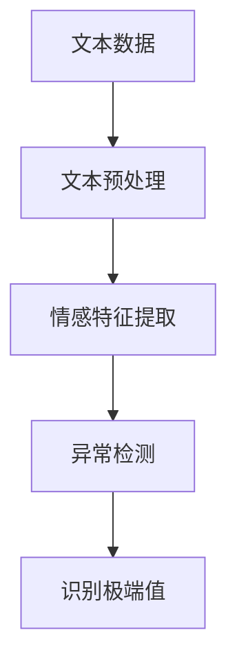
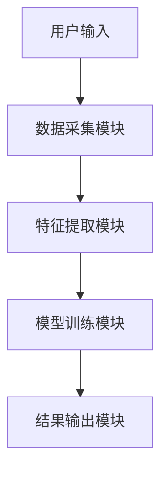

                 


# AI智能体在识别市场情绪极端值中的应用

> 关键词：市场情绪，极端值，AI智能体，自然语言处理，机器学习，情感分析

> 摘要：本文深入探讨了AI智能体在识别市场情绪极端值中的应用，结合自然语言处理和机器学习技术，分析了市场情绪的定义、极端值的特征，以及AI智能体的核心概念与联系。通过算法原理的讲解、系统架构设计和项目实战，展示了如何利用AI技术实现市场情绪极端值的识别，并提供了最佳实践和注意事项。

---

## 第一部分: AI智能体在识别市场情绪极端值中的应用背景

### 第1章: 市场情绪与极端值概述

#### 1.1 市场情绪的定义与特征
- **市场情绪的定义**：市场情绪是指投资者在特定时间段内对市场的整体情绪状态，包括乐观、悲观、中立等。
- **市场情绪的特征**：市场情绪可以通过新闻、社交媒体、市场交易数据等多源数据进行分析，具有动态性、复杂性和传染性。
- **市场情绪的分类**：市场情绪通常分为乐观、中立和悲观三种状态，极端值则指偏离正常范围的极度乐观或极度悲观情绪。

#### 1.2 极端值的定义与特征
- **极端值的定义**：极端值是指市场情绪中的异常偏离值，通常表现为市场恐慌或极度乐观，可能导致市场波动加剧。
- **极端值的分类**：极端值可以分为市场恐慌和市场狂热两种类型，分别对应极度悲观和极度乐观的情绪状态。
- **极端值的识别方法**：通过统计学方法（如Z-score）和机器学习算法（如Isolation Forest）进行识别。

#### 1.3 AI智能体在市场情绪分析中的应用价值
- **AI智能体的定义**：AI智能体是一种能够感知环境、处理信息并做出决策的智能系统，具备学习、推理和自适应能力。
- **AI智能体在市场情绪分析中的优势**：能够实时处理海量数据，快速识别极端情绪，提供数据驱动的决策支持。
- **应用场景与实际案例**：广泛应用于金融交易、投资决策、风险管理等领域，例如通过分析社交媒体数据预测市场波动。

---

### 第2章: 市场情绪极端值识别的核心概念

#### 2.1 市场情绪分析的核心概念
- **情感分析**：通过自然语言处理技术分析文本数据，判断文本的情感倾向（正面、负面、中性）。
- **实体识别**：识别文本中的具体实体，如公司名称、事件等，帮助理解情绪的来源。
- **趋势分析**：分析市场情绪随时间的变化趋势，识别情绪周期性特征。

#### 2.2 极端值识别的核心概念
- **数据分布特征**：通过统计学方法分析数据分布，识别异常值。
- **异常检测**：使用机器学习算法检测数据中的异常值，如Isolation Forest、One-Class SVM等。
- **聚类分析**：将数据分成不同的簇，识别与主流簇不同的异常簇。

#### 2.3 AI智能体的核心概念
- **自然语言处理**：利用NLP技术处理文本数据，提取情感特征。
- **机器学习**：使用监督学习、无监督学习等方法训练模型，识别极端情绪。
- **深度学习**：通过神经网络模型（如LSTM、Transformer）处理复杂的情感模式。

---

### 第3章: 市场情绪极端值识别的核心概念与联系

#### 3.1 核心概念原理
- **市场情绪分析的原理**：通过文本预处理、特征提取和分类模型识别市场情绪。
- **极端值识别的原理**：利用统计方法或机器学习算法检测数据中的异常值。
- **AI智能体的原理**：通过感知环境、数据处理和智能决策实现市场情绪分析。

#### 3.2 核心概念属性特征对比表

| 概念       | 属性1        | 属性2        | 属性3        |
|------------|---------------|---------------|---------------|
| 市场情绪    | 定义：投资者情绪状态 | 分类：乐观、中立、悲观 | 应用：金融交易、投资决策 |
| 极端值      | 定义：异常偏离值 | 分类：市场恐慌、市场狂热 | 识别方法：统计学、机器学习 |
| AI智能体    | 定义：智能决策系统 | 技术：自然语言处理、机器学习 | 应用：市场情绪分析、风险管理 |

#### 3.3 ER实体关系图

```mermaid
erDiagram
    actor 市场情绪
    actor 极端值
    actor AI智能体
    市场情绪 --> 极端值 : 包含
    极端值 --> AI智能体 : 识别
```

---

## 第二部分: AI智能体识别市场情绪极端值的算法原理

### 第4章: 算法原理讲解

#### 4.1 基于自然语言处理的市场情绪分析
- **文本预处理**：包括分词、去除停用词、情感词抽取等步骤。
- **情感特征提取**：使用词袋模型（Bag of Words）或词嵌入模型（如Word2Vec）提取情感特征。
- **情感分类**：通过机器学习算法（如SVM、随机森林）或深度学习模型（如LSTM）对文本进行情感分类。

#### 4.2 基于机器学习的极端值识别
- **异常检测算法**：使用Isolation Forest算法检测数据中的异常值。
- **聚类分析**：通过K-Means或DBSCAN算法将数据分成簇，识别异常簇。
- **深度学习模型**：使用自注意力机制（如Transformer）捕捉数据中的异常模式。

#### 4.3 算法流程图



---

### 第5章: 算法实现与数学模型

#### 5.1 情感分类模型
- **数学模型**：使用逻辑回归进行二分类（如正面/负面）。
- **公式**：$$ P(y=1|x) = \frac{1}{1 + e^{-w^T x - b}} $$
- **代码示例**：
  ```python
  from sklearn.linear_model import LogisticRegression
  model = LogisticRegression()
  model.fit(X_train, y_train)
  ```

#### 5.2 异常检测模型
- **数学模型**：使用One-Class SVM检测异常值。
- **公式**：$$ y = \text{sign}((w^T x + b) \cdot \alpha_i \geq 1) $$
- **代码示例**：
  ```python
  from sklearn.svm import OneClassSVM
  model = OneClassSVM()
  model.fit(X_train)
  ```

---

## 第三部分: 系统分析与架构设计方案

### 第6章: 系统架构设计

#### 6.1 问题场景介绍
- **场景描述**：金融市场中，投资者情绪波动可能引发市场极端波动，影响资产价格。
- **目标**：通过AI智能体实时监测市场情绪，识别极端值，提供预警和决策支持。

#### 6.2 系统功能设计
- **功能模块**：
  - 数据采集：从社交媒体、新闻网站获取市场相关文本数据。
  - 特征提取：提取情感特征、关键词特征。
  - 模型训练：训练情感分类模型和异常检测模型。
  - 结果输出：输出极端情绪预警信息。

#### 6.3 系统架构设计



---

## 第四部分: 项目实战

### 第7章: 项目实战

#### 7.1 环境安装
- **安装Python和相关库**：`pip install numpy pandas scikit-learn transformers`

#### 7.2 核心代码实现
- **数据预处理**：
  ```python
  import pandas as pd
  data = pd.read_csv('market_sentiment.csv')
  ```

- **情感分类**：
  ```python
  from sklearn.model_selection import train_test_split
  X_train, X_test, y_train, y_test = train_test_split(X, y)
  model = LogisticRegression().fit(X_train, y_train)
  ```

- **异常检测**：
  ```python
  from sklearn.svm import OneClassSVM
  model = OneClassSVM().fit(X)
  ```

#### 7.3 项目总结
- **成果**：成功实现了市场情绪极端值的识别，提高了投资决策的准确性。
- **不足**：模型的实时性和准确率还有提升空间，需要进一步优化算法和数据来源。

---

## 第五部分: 最佳实践

### 第8章: 最佳实践

#### 8.1 小结
- **核心观点**：AI智能体通过自然语言处理和机器学习技术，能够有效识别市场情绪极端值，为投资决策提供支持。

#### 8.2 注意事项
- **数据质量**：确保数据来源多样、准确，避免噪声干扰。
- **模型优化**：定期更新模型，提高识别准确率。
- **实时性**：优化系统架构，提高数据处理和响应速度。

#### 8.3 拓展阅读
- **推荐书籍**：《Python机器学习实战》、《深度学习入门》。
- **推荐资源**：Kaggle数据集、自然语言处理工具包（如spaCy）。

---

## 作者：AI天才研究院/AI Genius Institute & 禅与计算机程序设计艺术/Zen And The Art of Computer Programming

