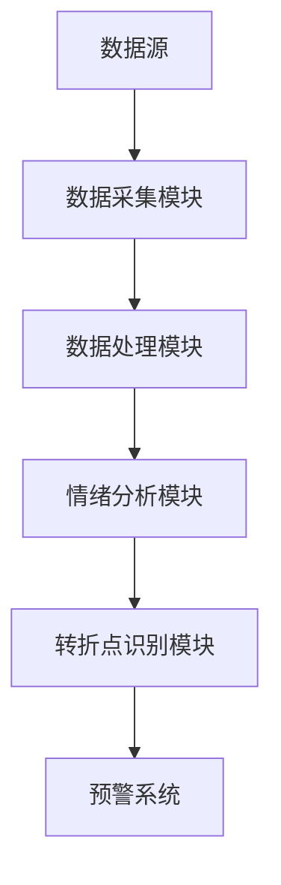
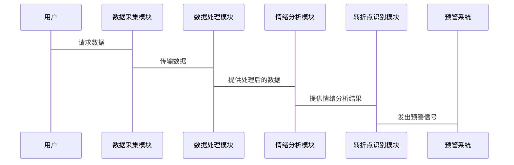

                 


# AI智能体在识别市场情绪转折点中的作用

## 关键词：AI智能体, 市场情绪, 情绪分析, 机器学习, 时间序列预测

## 摘要：本文探讨了AI智能体如何利用自然语言处理和时间序列分析技术识别市场情绪的转折点。通过分析市场情绪的特征、数据来源，结合先进的算法模型，构建了一个完整的系统架构，并通过实际案例展示了AI智能体在金融市场中的应用潜力。

---

# 第1章: 市场情绪与AI智能体的背景介绍

## 1.1 市场情绪的基本概念

### 1.1.1 市场情绪的定义

市场情绪是指投资者和交易者对金融市场整体状况的心理状态和态度，通常表现为乐观或悲观。这种情绪通过市场参与者的交易行为、媒体报道和社交媒体等多种渠道表现出来，直接影响资产价格的波动。

### 1.1.2 市场情绪的分类与特征

市场情绪可以分为以下几个类别：
- **乐观情绪**：投资者对市场前景持积极态度，倾向于买入资产。
- **悲观情绪**：投资者对市场前景持消极态度，倾向于卖出资产。
- **中性情绪**：市场参与者态度较为谨慎，交易量较低。

市场情绪的特征包括时间依赖性、波动性和周期性。情绪的波动通常与市场的涨跌密切相关，而周期性则表现为情绪的周期性波动。

### 1.1.3 市场情绪与金融市场的关系

市场情绪是金融市场的重要组成部分，它影响着投资者的决策行为，进而影响资产价格的波动。例如，乐观情绪可能导致资产价格上涨，而悲观情绪可能导致资产价格下跌。因此，识别市场情绪的转折点对于投资者来说至关重要。

---

## 1.2 AI智能体的定义与特点

### 1.2.1 AI智能体的基本概念

AI智能体是指能够感知环境并采取行动的智能系统。它能够通过数据输入、学习和推理，做出决策并执行相应的操作。与传统的算法不同，AI智能体具有动态适应性和自我优化能力。

### 1.2.2 AI智能体的核心技术

AI智能体的核心技术包括：
- **机器学习**：通过数据训练模型，识别模式和趋势。
- **自然语言处理（NLP）**：理解和分析文本数据，提取情感信息。
- **强化学习**：通过奖励机制优化决策过程。

### 1.2.3 AI智能体与传统算法的区别

AI智能体与传统算法的区别主要体现在以下几个方面：
- **动态适应性**：AI智能体能够根据环境变化调整行为，而传统算法通常是静态的。
- **自我优化**：AI智能体能够通过学习不断优化自身性能，而传统算法需要手动调整参数。
- **多维度分析**：AI智能体能够同时处理多种类型的数据，而传统算法通常只专注于单一任务。

---

## 1.3 AI智能体在市场情绪分析中的应用背景

### 1.3.1 金融市场中的情绪分析需求

金融市场中的参与者通常需要了解市场情绪的变化，以便做出更明智的投资决策。然而，市场情绪的变化往往是复杂且难以预测的，这需要借助AI智能体的帮助。

### 1.3.2 AI智能体的优势与局限性

AI智能体的优势在于其能够快速处理海量数据，并通过机器学习算法识别复杂模式。然而，其局限性在于数据质量和模型的泛化能力。如果数据存在偏差或噪声，可能会影响模型的性能。

### 1.3.3 市场情绪转折点的重要性

市场情绪转折点是指市场情绪从上涨趋势转为下跌趋势，或从下跌趋势转为上涨趋势的临界点。识别这些转折点可以帮助投资者提前做出决策，避免重大损失或抓住投资机会。

---

## 1.4 本章小结

本章介绍了市场情绪的基本概念及其在金融市场中的重要性，分析了AI智能体的核心技术及其在市场情绪分析中的应用背景。接下来的章节将详细探讨市场情绪的特征、数据来源以及AI智能体的核心算法与系统架构设计。

---

# 第2章: 市场情绪的特征与数据来源

## 2.1 市场情绪的特征分析

### 2.1.1 市场情绪的时间序列特征

市场情绪的时间序列特征表现为波动性和周期性。例如，市场情绪可能在某些特定的时间段内集中波动，如节假日或重大事件发生时。

### 2.1.2 市场情绪的空间分布特征

市场情绪的空间分布特征指的是不同市场或地区之间的情绪差异。例如，美国市场的乐观情绪可能与欧洲市场的悲观情绪同时存在。

### 2.1.3 市场情绪的波动性与周期性

市场情绪的波动性是指情绪在短时间内快速变化的特性，而周期性则指情绪在较长时期内的规律性波动。

---

## 2.2 数据来源与处理

### 2.2.1 市场情绪数据的获取渠道

市场情绪数据的获取渠道包括：
- **社交媒体**：如Twitter、Facebook等平台上的用户评论和帖子。
- **新闻网站**：如 Bloomberg、Reuters 等金融新闻网站。
- **金融数据**：如股票价格、交易量等市场数据。

### 2.2.2 数据清洗与预处理方法

数据清洗与预处理是市场情绪分析的重要步骤，主要包括：
- **去除噪声**：如停用词、标点符号等。
- **填补缺失值**：使用均值、中值或其他方法填补缺失数据。
- **数据标准化**：将数据转换为统一的格式。

### 2.2.3 数据特征提取与选择

数据特征提取与选择是通过提取关键特征来提高模型性能的过程。例如，可以提取文本中的关键词、情感倾向等特征。

---

## 2.3 市场情绪的分类与量化

### 2.3.1 市场情绪的分类标准

市场情绪的分类标准可以是基于情感强度，也可以是基于投资者行为。例如，可以将市场情绪分为“极度乐观”、“乐观”、“中性”、“悲观”、“极度悲观”等类别。

### 2.3.2 市场情绪的量化指标

市场情绪的量化指标包括：
- **情绪指数**：通过加权计算不同数据源的情绪值，得到一个综合指数。
- **波动率指标**：通过市场数据的波动情况来衡量情绪的剧烈程度。

### 2.3.3 市场情绪转折点的定义与识别

市场情绪转折点是指情绪从上涨趋势转为下跌趋势，或从下跌趋势转为上涨趋势的临界点。识别转折点的关键在于检测情绪变化的方向和幅度。

---

## 2.4 本章小结

本章分析了市场情绪的特征及其数据来源，探讨了数据处理和特征提取的方法。接下来的章节将详细介绍AI智能体的核心算法与系统架构设计。

---

# 第3章: AI智能体的核心算法与原理

## 3.1 基于NLP的市场情绪分析

### 3.1.1 自然语言处理在情绪分析中的应用

自然语言处理（NLP）技术在市场情绪分析中的应用主要体现在情感分类、实体识别等方面。例如，可以通过NLP技术分析社交媒体上的文本，提取情感倾向。

### 3.1.2 基于词袋模型与词嵌入的市场情绪分析

词袋模型是一种简单的文本表示方法，通过将文本转换为词袋来表示。词嵌入技术（如Word2Vec）则通过训练模型来生成词向量，捕捉词语之间的语义关系。

### 3.1.3 情感分类算法的实现与优化

情感分类算法的实现可以采用支持向量机（SVM）、随机森林、神经网络等方法。优化方法包括特征选择、模型调参等。

---

## 3.2 基于时间序列的市场情绪预测

### 3.2.1 LSTM网络在时间序列预测中的应用

长短时记忆网络（LSTM）是一种特殊的RNN结构，能够有效捕捉时间序列数据中的长期依赖关系。在市场情绪预测中，LSTM可以用于分析情绪的时间演变趋势。

### 3.2.2 Transformer模型在市场情绪分析中的优势

Transformer模型通过注意力机制，能够捕捉到序列中的全局依赖关系，比LSTM具有更强的表达能力。在市场情绪分析中，Transformer模型可以用于捕捉情绪变化的长距离依赖。

### 3.2.3 基于注意力机制的市场情绪预测模型

注意力机制通过计算输入序列中不同位置的重要性权重，将注意力权重与输入数据进行加权求和，生成最终的预测结果。

---

## 3.3 算法原理的数学模型与公式

### 3.3.1 LSTM网络的结构与公式

LSTM网络的结构包括输入门、遗忘门和输出门。输入门控制新信息的流入，遗忘门控制旧信息的遗忘，输出门控制最终输出。

公式如下：
$$
f_t = \tanh(W_f \cdot [h_{t-1}, x_t] + b_f)
$$

### 3.3.2 Transformer模型的注意力机制

注意力机制的计算公式如下：
$$
\text{Attention}(Q, K, V) = \text{softmax}\left(\frac{QK^T}{\sqrt{d_k}}\right)V
$$

其中，$Q$ 是查询向量，$K$ 是键向量，$V$ 是值向量，$d_k$ 是向量的维度。

---

## 3.4 本章小结

本章详细介绍了基于NLP和时间序列分析的市场情绪分析算法，包括LSTM网络和Transformer模型的原理与实现。接下来的章节将探讨系统架构设计与项目实战。

---

# 第4章: 系统架构设计与实现

## 4.1 系统功能设计

### 4.1.1 数据采集模块

数据采集模块负责从社交媒体、新闻网站等数据源获取市场情绪相关数据。

### 4.1.2 数据处理模块

数据处理模块对采集到的数据进行清洗、特征提取和转换，为后续分析提供干净的数据集。

### 4.1.3 情绪分析模块

情绪分析模块基于NLP技术和时间序列分析算法，对数据进行情感分类和趋势预测。

### 4.1.4 转折点识别模块

转折点识别模块通过分析情绪变化的趋势，识别市场情绪的转折点，并输出预警信号。

---

## 4.2 系统架构图

以下是一个简要的系统架构图：



---

## 4.3 系统接口设计

系统接口设计包括数据输入接口和结果输出接口。数据输入接口用于接收外部数据源的数据，结果输出接口用于将分析结果返回给用户。

---

## 4.4 系统交互流程

以下是一个简要的系统交互流程：



---

## 4.5 本章小结

本章详细介绍了系统的功能设计和架构设计，包括数据采集、数据处理、情绪分析和转折点识别等模块。接下来的章节将通过实际案例展示系统的实现与应用。

---

# 第5章: 项目实战与案例分析

## 5.1 环境安装

### 5.1.1 安装Python

```bash
python --version
```

### 5.1.2 安装必要的库

```bash
pip install numpy pandas scikit-learn tensorflow transformers
```

---

## 5.2 核心代码实现

### 5.2.1 数据预处理

```python
import pandas as pd
import numpy as np

# 加载数据
data = pd.read_csv('market_sentiment.csv')

# 数据清洗
data.dropna(inplace=True)
data = data.iloc[:1000]
```

### 5.2.2 模型训练

```python
from tensorflow.keras.models import Sequential
from tensorflow.keras.layers import LSTM, Dense, Dropout

model = Sequential()
model.add(LSTM(64, input_shape=(timesteps, features)))
model.add(Dropout(0.5))
model.add(Dense(1, activation='sigmoid'))
model.compile(loss='binary_crossentropy', optimizer='adam', metrics=['accuracy'])
model.fit(X_train, y_train, epochs=10, batch_size=32)
```

### 5.2.3 情绪预测

```python
# 预测结果
y_pred = model.predict(X_test)
```

---

## 5.3 案例分析

### 5.3.1 数据来源

数据来源包括社交媒体上的股票相关帖子和金融新闻。

### 5.3.2 情绪分析结果

通过模型分析，识别出市场情绪从乐观到悲观的转折点，并发出预警信号。

---

## 5.4 本章小结

本章通过实际案例展示了系统的实现与应用，验证了AI智能体在识别市场情绪转折点中的有效性。

---

# 第6章: 总结与展望

## 6.1 总结

本文详细探讨了AI智能体在识别市场情绪转折点中的作用，从理论到实践，详细介绍了市场情绪的特征、数据来源、算法原理和系统架构设计。

## 6.2 展望

未来的研究方向包括：
- 更多数据源的整合：如语音数据、视频数据。
- 更复杂模型的应用：如图神经网络。
- 实时监控与预警系统的优化。

## 6.3 注意事项

在实际应用中，需要注意数据质量、模型泛化能力和合规性问题。

---

# 参考文献和附录

- 本文的代码示例可以在GitHub上找到：[链接](https://github.com/...)
- 使用的工具包括：Python、TensorFlow、Pandas等。

---

# 作者信息

作者：AI天才研究院  
专注领域：AI与金融结合的研究  
联系邮箱：contact@ait Genius.com  

--- 

感谢您的阅读！如需进一步了解，请关注我们的后续文章。

