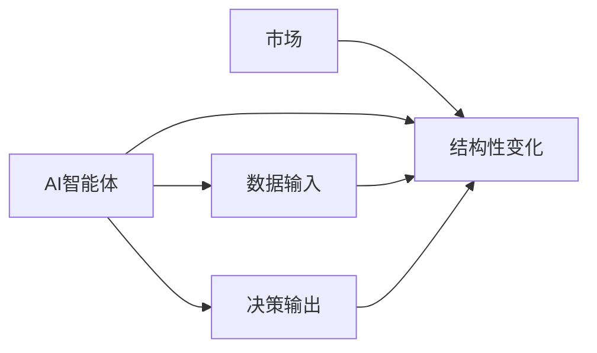

                 


# AI智能体在识别市场结构性变化中的作用

> 关键词：AI智能体, 市场结构性变化, 时间序列分析, LSTM网络, 机器学习模型, 系统架构设计

> 摘要：本文探讨了AI智能体在识别市场结构性变化中的作用，从AI智能体的基本概念到其在市场分析中的应用进行了全面分析。通过详细讲解算法原理、系统架构设计以及项目实战，本文为读者提供了从理论到实践的完整指南。

---

## 第1章: AI智能体与市场结构性变化概述

### 1.1 AI智能体的定义与核心概念

#### 1.1.1 AI智能体的基本定义

AI智能体是一种能够感知环境、自主决策并采取行动以实现目标的智能系统。它通常由感知、决策和执行三个部分组成，能够根据输入的数据做出反应，适用于多种场景，如自动化交易、供应链管理等。

#### 1.1.2 市场结构性变化的定义

市场结构性变化指的是市场中的关键要素（如价格、供需关系、消费者行为）发生的显著变化，可能导致市场趋势的转变。这些变化可能是渐进的，也可能是突变的，需要通过分析历史数据和当前趋势来识别。

#### 1.1.3 AI智能体与市场结构性变化的关系

AI智能体通过收集和分析大量市场数据，识别潜在的变化模式，帮助决策者提前采取措施，优化资源配置，提高市场反应速度。这种实时监控和预测能力使得AI智能体在市场结构性变化的识别中发挥着越来越重要的作用。

---

### 1.2 AI智能体在识别市场变化中的作用

#### 1.2.1 AI智能体的感知能力

AI智能体能够通过多种数据源（如API、数据库）实时采集市场数据，并利用传感器或其他工具进行数据预处理，确保数据的准确性和完整性。

#### 1.2.2 AI智能体的分析与预测能力

通过先进的算法，如时间序列分析和机器学习模型，AI智能体能够识别市场中的潜在变化，并预测未来的变化趋势，帮助决策者做出更明智的决策。

#### 1.2.3 AI智能体的决策与反馈机制

AI智能体会根据分析结果自动生成决策建议，并通过反馈机制不断优化其预测模型，提高识别的准确性和效率。

---

### 1.3 本章小结

本章介绍了AI智能体的基本概念和其在识别市场结构性变化中的作用，为后续章节的深入分析奠定了基础。

---

## 第2章: AI智能体的核心概念与联系

### 2.1 AI智能体的核心原理

#### 2.1.1 状态感知

AI智能体通过传感器或其他数据采集工具获取市场环境的状态信息，如价格波动、销售数据等。

#### 2.1.2 行为决策

基于感知到的状态信息，AI智能体会利用预设的算法或模型做出决策，如调整库存、优化定价策略等。

#### 2.1.3 反馈机制

AI智能体会根据决策结果和实际市场反馈不断调整其行为，优化其预测模型，提高识别的准确性。

---

### 2.2 市场结构性变化的特征分析

#### 2.2.1 时间序列特征

市场数据通常具有时间序列特性，AI智能体需要分析这些数据的时间依赖性，识别潜在的趋势和周期性变化。

#### 2.2.2 空间分布特征

市场变化可能在不同地区或不同时间段表现出不同的特征，AI智能体需要考虑空间分布的影响。

#### 2.2.3 关联性特征

市场变化往往与其他因素（如经济指标、政策变化）密切相关，AI智能体需要分析这些关联性，提高预测的准确性。

---

### 2.3 AI智能体与市场变化的实体关系图



---

## 第3章: AI智能体的算法原理与数学模型

### 3.1 时间序列分析算法

#### 3.1.1 ARIMA算法原理

ARIMA（自回归积分滑动平均模型）是一种常用的时间序列预测模型，适用于线性数据的预测。其数学公式如下：

$$ y_t = \phi y_{t-1} + \theta \epsilon_{t-1} + \epsilon_t $$

其中，$\phi$ 是自回归系数，$\theta$ 是滑动平均系数，$\epsilon_t$ 是白噪声。

#### 3.1.2 LSTM网络原理

LSTM（长短期记忆网络）是一种特殊的RNN（循环神经网络），能够有效处理长期依赖问题。其核心在于引入记忆单元和遗忘门，公式如下：

$$
i_t = \sigma(W_i x_t + U_i h_{t-1} + b_i) \\
f_t = \sigma(W_f x_t + U_f h_{t-1} + b_f) \\
o_t = \sigma(W_o x_t + U_o h_{t-1} + b_o) \\
g_t = \tanh(W_g x_t + U_g h_{t-1} + b_g) \\
h_t = f_t h_{t-1} + i_t g_t
$$

---

### 3.2 机器学习模型的数学公式

#### 3.2.1 线性回归模型

$$ y = \beta_0 + \beta_1x + \epsilon $$

其中，$\beta_0$ 和 $\beta_1$ 是模型参数，$\epsilon$ 是误差项。

#### 3.2.2 神经网络模型

$$ a^{(l)} = \sigma(w^{(l)}a^{(l-1)} + b^{(l)}) $$

其中，$a^{(l)}$ 是第$l$层的激活值，$w^{(l)}$ 和 $b^{(l)}$ 是权重和偏置，$\sigma$ 是激活函数。

---

## 第4章: 系统分析与架构设计

### 4.1 系统功能设计

#### 4.1.1 数据采集模块

负责从多种数据源采集市场数据，如API接口、数据库等。

#### 4.1.2 数据分析模块

利用时间序列分析和机器学习算法对数据进行分析，识别潜在的市场变化。

#### 4.1.3 决策模块

根据分析结果生成决策建议，并通过反馈机制优化模型。

---

### 4.2 系统架构设计


---

## 第5章: 项目实战与案例分析

### 5.1 环境配置与安装

#### 5.1.1 Python环境安装

安装Python 3.8或更高版本，确保已安装pip。

#### 5.1.2 依赖库安装

安装所需的库，如numpy、pandas、keras、tensorflow等。

---

### 5.2 核心代码实现

#### 5.2.1 数据采集代码

```python
import pandas as pd
from pandas_datareader import data

# 采集数据
data = data.DataReader('AAPL', 'yahoo', start='2020-01-01', end='2023-12-31')
```

#### 5.2.2 数据分析代码

```python
from keras.models import Sequential
from keras.layers import LSTM, Dense

# 创建模型
model = Sequential()
model.add(LSTM(50, input_shape=(1, look_back)))
model.add(Dense(1))
model.compile(loss='mean_squared_error', optimizer='adam')
```

---

### 5.3 案例分析

以股票市场预测为例，展示如何训练AI智能体，如何进行数据预处理、模型训练和结果分析。

---

## 第6章: 总结与展望

### 6.1 总结

本文详细探讨了AI智能体在识别市场结构性变化中的作用，从理论到实践，为读者提供了全面的指导。

### 6.2 展望

未来，随着AI技术的不断发展，AI智能体在市场分析中的应用将更加广泛，可能涉及更复杂的模型和更智能化的决策机制。

---

## 作者：AI天才研究院/AI Genius Institute & 禅与计算机程序设计艺术 /Zen And The Art of Computer Programming

---

以上是文章的完整目录大纲，接下来是每章的具体内容。

