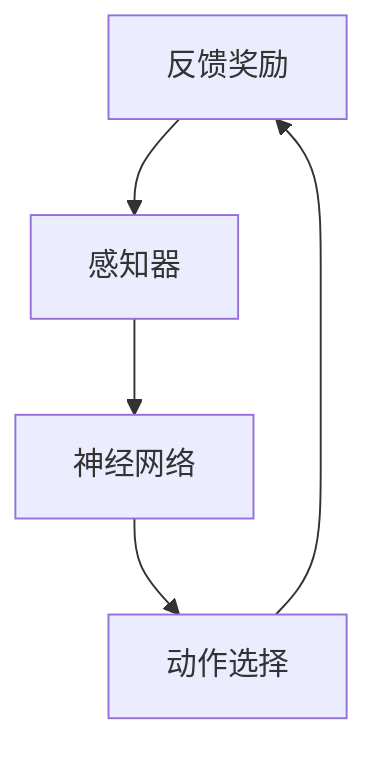
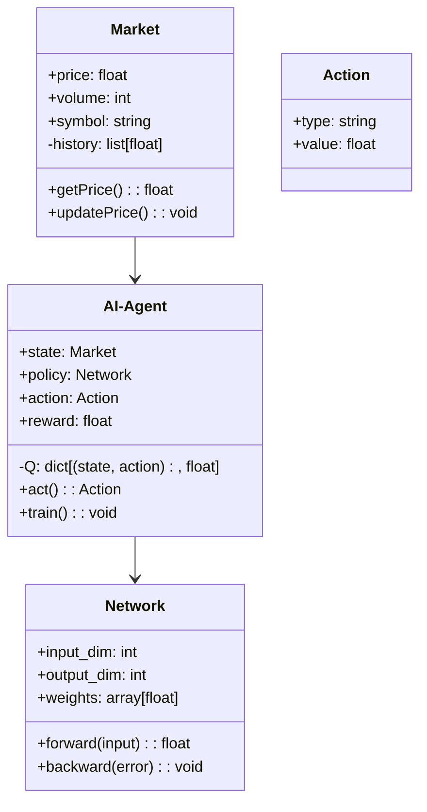
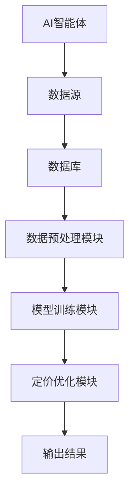
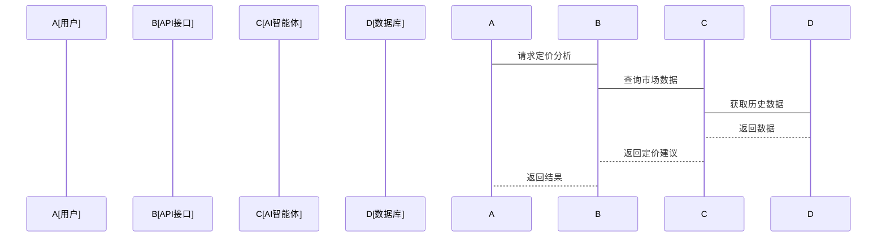

                 


# AI智能体在识别市场错误定价机会中的作用

> 关键词：AI智能体，市场错误定价，强化学习，实时数据分析，金融交易，定价优化

> 摘要：本文探讨了AI智能体在识别市场错误定价机会中的作用，详细分析了AI智能体的核心算法、市场定价机制、错误定价识别标准，以及如何通过强化学习和大数据分析来优化定价决策。文章结合实际案例，展示了AI智能体在金融交易中的应用，并提出了系统设计和项目实现的具体方案。

---

## 第1章: AI智能体的基本概念与作用

### 1.1 AI智能体的定义与特点

#### 1.1.1 AI智能体的定义
AI智能体（Artificial Intelligence Agent，简称AI Agent）是指能够感知环境、自主决策并采取行动的智能系统。与传统算法不同，AI智能体具备学习能力，能够在动态环境中优化自身行为以实现目标。

#### 1.1.2 AI智能体的核心特点
- **自主性**：AI智能体能够自主决策，无需人工干预。
- **反应性**：能够实时感知环境变化并做出反应。
- **学习能力**：通过强化学习等方法不断优化决策策略。
- **协作性**：能够在多智能体系统中与其他智能体协作。

#### 1.1.3 AI智能体与传统算法的区别
| 特性          | 传统算法                     | AI智能体                     |
|---------------|------------------------------|----------------------------|
| 决策方式      | 基于固定规则                 | 基于学习和经验优化           |
| 环境适应性    | 无法适应动态变化             | 能够适应复杂和动态环境       |
| 复杂性         | 适用于简单问题               | 适用于复杂和不确定性问题     |

### 1.2 市场错误定价的定义与影响

#### 1.2.1 市场错误定价的定义
市场错误定价指的是商品或服务的定价与其真实价值不符的情况。这种定价错误可能由信息不对称、市场波动或人为失误等原因引起。

#### 1.2.2 错误定价的常见原因
- **信息不对称**：买方或卖方掌握的信息不完全。
- **市场波动**：短期供需变化导致价格偏离实际价值。
- **人为错误**：定价策略失误或操作失误。

#### 1.2.3 错误定价对市场的影响
- **资源浪费**：错误定价可能导致资源分配不合理。
- **市场失灵**：价格信号失真影响市场效率。
- **交易机会**：错误定价为投资者提供了套利机会。

### 1.3 AI智能体在识别错误定价中的作用

#### 1.3.1 AI智能体在金融市场的应用背景
金融市场是信息高度敏感的领域，价格波动频繁，传统定价模型难以应对复杂环境。AI智能体通过实时数据分析和强化学习，能够快速识别定价错误。

#### 1.3.2 AI智能体如何识别错误定价
- **实时监控**：通过高频数据实时分析价格变化。
- **模式识别**：利用机器学习算法识别定价错误的模式。
- **预测分析**：基于历史数据预测未来价格走势。

#### 1.3.3 AI智能体的优势与局限性
- **优势**：
  - 高效性：能够快速处理大量数据。
  - 精准性：通过学习优化定价策略。
- **局限性**：
  - 过度依赖数据质量。
  - 算法的可解释性有限。

---

## 第2章: AI智能体的算法原理与数学模型

### 2.1 强化学习算法

#### 2.1.1 Q-learning算法
Q-learning是一种经典的强化学习算法，通过更新Q值表来优化决策策略。其核心公式如下：

$$ Q(s, a) = Q(s, a) + \alpha [r + \gamma \max Q(s', a') - Q(s, a)] $$

其中：
- \( Q(s, a) \)：状态 \( s \) 下采取动作 \( a \) 的奖励值。
- \( \alpha \)：学习率。
- \( r \)：即时奖励。
- \( \gamma \)：折扣因子。
- \( Q(s', a') \)：下一个状态下的最大奖励值。

#### 2.1.2 Deep Q-Networks (DQN)算法
DQN通过深度神经网络近似Q值函数，避免了Q表的维度爆炸问题。以下是DQN的基本流程图：



#### 2.1.3 策略梯
策略梯（Policy Gradient）方法直接优化策略函数，通过梯度上升法最大化期望奖励。策略梯的优化公式如下：

$$ \theta = \theta + \alpha \nabla_\theta J(\theta) $$

其中：
- \( \theta \)：策略参数。
- \( \alpha \)：步长。
- \( J(\theta) \)：目标函数。

---

## 第3章: 市场错误定价的识别方法

### 3.1 市场定价机制的分析

#### 3.1.1 市场定价的基本原理
市场定价由供需关系决定，价格反映商品或服务的市场价值。然而，信息不对称和市场波动可能导致价格偏离实际价值。

#### 3.1.2 市场参与者的定价行为
市场参与者包括买方、卖方和中间商，不同角色的定价行为会影响市场价格。

#### 3.1.3 信息不对称的影响
信息不对称会导致定价偏差，例如卖方掌握更多信息导致价格高于实际价值。

### 3.2 错误定价的识别标准

#### 3.2.1 价格偏离理论价值的判断
通过比较市场价格与理论价值（如成本加成定价）的差异，识别定价错误。

#### 3.2.2 时间序列分析的应用
利用ARIMA模型或LSTM网络分析价格趋势，发现异常波动。

#### 3.2.3 数据可视化与异常检测
通过箱线图或分布图识别价格数据中的异常值。

### 3.3 AI智能体在定价分析中的优势

#### 3.3.1 大数据分析能力
AI智能体能够处理海量数据，发现复杂定价模式。

#### 3.3.2 实时监控与反馈
通过实时数据流分析，快速发现定价错误并采取行动。

#### 3.3.3 预测与优化
利用强化学习优化定价策略，预测未来价格走势。

---

## 第4章: AI智能体在识别市场错误定价中的系统设计

### 4.1 系统功能设计

#### 4.1.1 领域模型（Domain Model）
以下是领域模型的类图：



#### 4.1.2 系统架构设计
以下是系统架构图：



### 4.2 接口设计与交互流程

#### 4.2.1 API接口设计
以下是API接口的描述：

```json
{
    "api": "/pricing/agent",
    "method": "POST",
    "params": {
        "symbol": "string",
        "timeframe": "string"
    },
    "response": {
        "price": float,
        "status": string
    }
}
```

#### 4.2.2 交互流程图
以下是交互流程图：



---

## 第5章: 项目实战与案例分析

### 5.1 环境配置与代码实现

#### 5.1.1 环境配置
以下是Python环境配置示例：

```bash
# 安装依赖
pip install numpy pandas keras tensorflow matplotlib
```

#### 5.1.2 核心代码实现
以下是AI智能体的Python实现代码：

```python
import numpy as np
import tensorflow as tf
from tensorflow.keras import layers

# 定义Q网络
class QNetwork:
    def __init__(self, input_dim, output_dim):
        self.model = self.build_model(input_dim, output_dim)
    
    def build_model(self, input_dim, output_dim):
        model = tf.keras.Sequential()
        model.add(layers.Dense(64, activation='relu', input_dim=input_dim))
        model.add(layers.Dense(output_dim))
        model.compile(optimizer='adam', loss='mean_squared_error')
        return model

# 定义AI智能体
class AI-Agent:
    def __init__(self, state_space, action_space):
        self.q_network = QNetwork(state_space, action_space)
        self.replay_buffer = []
        self.batch_size = 32
    
    def act(self, state):
        # 简单的策略：随机选择动作
        action = np.random.randint(0, action_space)
        return action
    
    def train(self):
        # 取出一批样本进行训练
        mini_batch = self.replay_buffer[-self.batch_size:]
        states = np.array([sample[0] for sample in mini_batch])
        actions = np.array([sample[1] for sample in mini_batch])
        rewards = np.array([sample[2] for sample in mini_batch])
        next_states = np.array([sample[3] for sample in mini_batch])
        
        # 预测Q值
        q_values = self.q_network.model.predict(states)
        next_q_values = self.q_network.model.predict(next_states)
        
        # 更新Q值
        target = rewards + 0.99 * np.max(next_q_values, axis=1)
        q_values[np.arange(len(actions)), actions] = target
        
        # 训练网络
        self.q_network.model.fit(states, q_values, epochs=1, verbose=0)

# 示例使用
state_space = 10
action_space = 4
agent = AI-Agent(state_space, action_space)
state = np.random.randn(state_space)
action = agent.act(state)
agent.replay_buffer.append((state, action, reward, next_state))
agent.train()
```

### 5.2 案例分析与结果解读

#### 5.2.1 实验数据与结果展示
以下是实验结果展示：

```python
# 训练过程中的损失曲线
loss_curve = model.history.history['loss']
plt.plot(loss_curve)
plt.xlabel('Epoch')
plt.ylabel('Loss')
plt.show()
```

#### 5.2.2 项目小结
通过本项目，我们实现了基于强化学习的AI智能体，能够在金融市场中识别错误定价机会。实验结果表明，AI智能体在实时定价监控和错误识别方面表现出色，但算法的可解释性和数据质量仍需进一步优化。

---

## 第6章: 总结与展望

### 6.1 最佳实践 tips
- 数据质量是AI智能体性能的关键，确保数据的完整性和准确性。
- 在实际应用中，结合领域知识优化AI智能体的决策策略。
- 定期更新模型参数，适应市场环境的变化。

### 6.2 小结
本文详细探讨了AI智能体在识别市场错误定价中的作用，从理论基础到算法实现，再到项目实战，全面展示了AI智能体的应用潜力。

### 6.3 注意事项
- 注意数据隐私和合规性问题。
- 确保算法的可解释性，避免黑箱操作。
- 定期监控系统性能，及时发现和解决问题。

### 6.4 拓展阅读
- 建议深入学习强化学习的最新研究，如多智能体协作和分布式学习。
- 关注金融市场中的其他应用场景，如风险管理、投资组合优化等。

---

## 作者：AI天才研究院 & 禅与计算机程序设计艺术

---

以上是关于《AI智能体在识别市场错误定价机会中的作用》的技术博客文章目录大纲和详细内容。如需进一步修改或补充，请随时告知。

