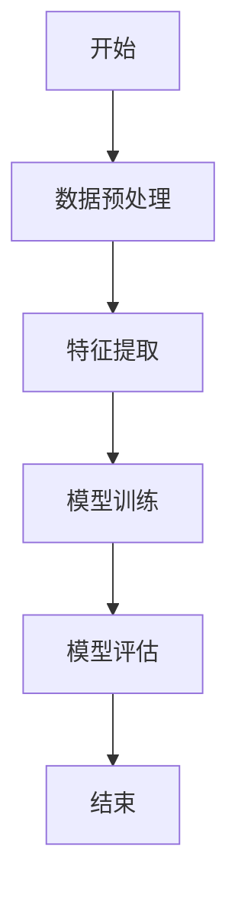
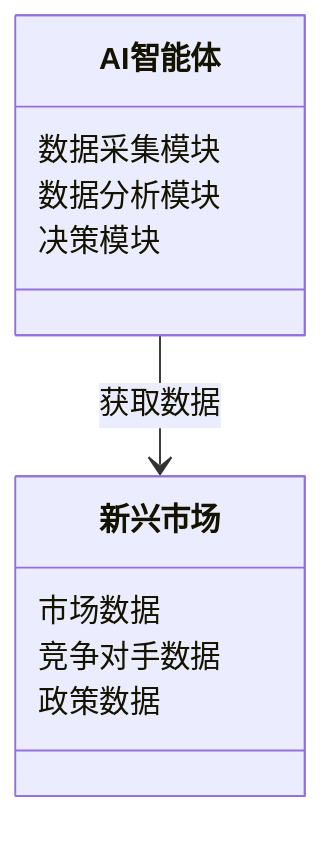
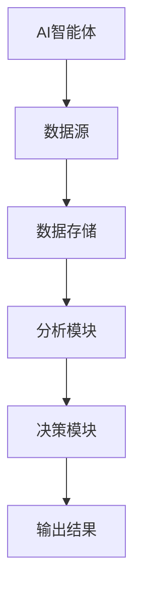
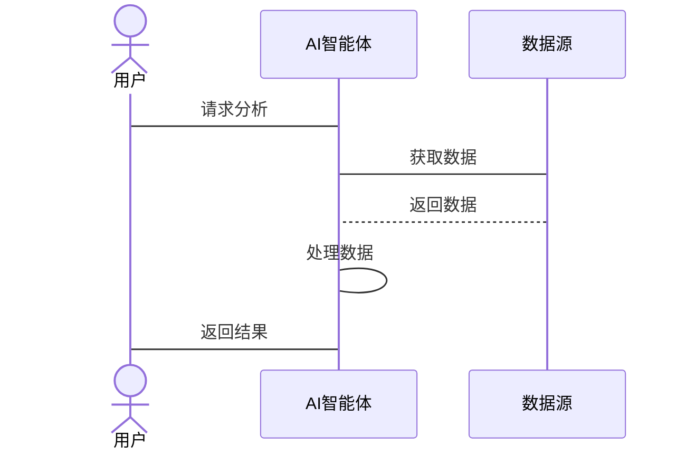

                 


# AI智能体在识别新兴市场价值机会中的作用

## 关键词：AI智能体，新兴市场，价值机会，数据驱动，机器学习，系统架构

## 摘要

在当今快速变化的市场环境中，新兴市场的价值机会往往被传统方法忽视。AI智能体通过高效的数据处理和模式识别能力，能够帮助识别这些机会。本文将探讨AI智能体在新兴市场中的应用，涵盖背景、核心概念、算法原理、系统架构、项目实战以及最佳实践，为读者提供全面的技术视角。

---

# 第1章：问题背景与描述

## 1.1 问题背景

### 1.1.1 新兴市场的定义与特点
新兴市场指的是那些经济增长迅速、潜力巨大的地区，如亚洲、非洲和拉丁美洲的部分国家。这些市场具有多样化、快速变化的特点，但也伴随着高风险和不确定性。

### 1.1.2 传统市场分析的局限性
传统市场分析依赖于经验和人工判断，存在数据不足、分析效率低、覆盖面有限等问题。特别是在新兴市场，信息不对称和数据稀疏性使得传统方法难以捕捉潜在机会。

### 1.1.3 AI智能体在市场分析中的优势
AI智能体能够处理海量数据，发现隐藏模式，提供实时反馈，显著提升了市场分析的效率和准确性。

## 1.2 问题描述

### 1.2.1 市场价值机会识别的挑战
新兴市场的复杂性和动态性使得识别价值机会极具挑战性，传统方法难以满足需求。

### 1.2.2 数据驱动决策的重要性
数据驱动决策能够帮助企业在新兴市场中做出更明智的选择，而AI智能体正是实现这一目标的关键工具。

### 1.2.3 AI智能体在新兴市场的应用场景
AI智能体可以应用于市场预测、竞争分析、风险评估等多个方面，帮助企业在新兴市场中找到价值机会。

---

# 第2章：核心概念与联系

## 2.1 核心概念原理

### 2.1.1 AI智能体的基本原理
AI智能体通过感知环境、处理数据、制定策略和执行行动来实现目标。在新兴市场分析中，智能体可以收集和分析数据，识别潜在机会。

### 2.1.2 新兴市场分析的关键要素
新兴市场分析的关键要素包括市场规模、增长潜力、竞争环境、政策法规等。AI智能体能够综合这些要素，提供全面的分析结果。

## 2.2 概念属性对比表

| 概念      | 属性                 | 描述                                                                 |
|-----------|----------------------|----------------------------------------------------------------------|
| AI智能体  | 数据处理能力         | 能够处理结构化和非结构化数据，提取有价值的信息。                     |
| 新兴市场  | 增长潜力             | 行业增长速度快，市场空间广阔，但风险较高。                           |

## 2.3 ER实体关系图

```mermaid
er
  actor(AI智能体)
  actor(新兴市场)
  relation(驱动)
  relation(影响)
```

---

# 第3章：算法原理

## 3.1 算法选择与实现

### 3.1.1 机器学习算法的选择
在新兴市场分析中，常用的机器学习算法包括随机森林、支持向量机（SVM）和神经网络。这些算法能够处理复杂的非线性关系，适合新兴市场的动态分析。

### 3.1.2 算法实现步骤

#### 数据预处理
- 数据清洗：处理缺失值、异常值和重复数据。
- 数据标准化：将数据归一化，以便模型处理。
- 特征提取：从原始数据中提取有意义的特征。

#### 模型训练
- 使用训练数据训练模型，调整超参数以优化性能。

#### 模型评估
- 使用测试数据评估模型的准确性和鲁棒性。

### 3.1.3 算法优化策略
- 超参数调优：使用网格搜索或随机搜索找到最佳参数组合。
- 模型集成：通过集成学习（如投票法、堆叠法）提升模型性能。

### 3.2 算法流程图



### 3.3 Python代码示例

```python
import pandas as pd
from sklearn.ensemble import RandomForestClassifier
from sklearn.model_selection import train_test_split
from sklearn.metrics import accuracy_score

# 数据加载与预处理
data = pd.read_csv('market_data.csv')
data.dropna()  # 删除缺失值
data['target'] = data['target'].astype(int)  # 转换目标变量

# 特征提取
X = data.drop('target', axis=1)
y = data['target']

# 数据分割
X_train, X_test, y_train, y_test = train_test_split(X, y, test_size=0.2)

# 模型训练
model = RandomForestClassifier(n_estimators=100, max_depth=10, random_state=42)
model.fit(X_train, y_train)

# 模型预测与评估
y_pred = model.predict(X_test)
print("准确率:", accuracy_score(y_test, y_pred))
```

### 3.4 数学模型

随机森林模型的预测公式可以表示为：

$$
\hat{y} = \sum_{i=1}^{n} \text{Tree}_i(x)
$$

其中，$\text{Tree}_i(x)$ 是第$i$棵决策树的预测结果，$n$是树的数量。

---

# 第4章：系统分析与架构设计

## 4.1 问题场景介绍

## 4.2 系统功能设计

### 4.2.1 领域模型类图



## 4.3 系统架构设计

### 4.3.1 系统架构图



## 4.4 系统接口设计

### 4.4.1 接口设计

- 数据输入接口：接收新兴市场的数据。
- 数据输出接口：返回分析结果。

### 4.4.2 系统交互流程图



---

# 第5章：项目实战

## 5.1 环境安装

### 5.1.1 安装Python和必要的库
- 安装Python：[Python官方下载页面](https://www.python.org/)
- 安装库：`pip install pandas scikit-learn matplotlib`

## 5.2 系统核心实现

### 5.2.1 核心代码实现

```python
import pandas as pd
from sklearn.ensemble import RandomForestClassifier
from sklearn.model_selection import train_test_split
from sklearn.metrics import accuracy_score

# 数据加载与预处理
data = pd.read_csv('market_data.csv')
data.dropna()  # 删除缺失值
data['target'] = data['target'].astype(int)  # 转换目标变量

# 特征提取
X = data.drop('target', axis=1)
y = data['target']

# 数据分割
X_train, X_test, y_train, y_test = train_test_split(X, y, test_size=0.2)

# 模型训练
model = RandomForestClassifier(n_estimators=100, max_depth=10, random_state=42)
model.fit(X_train, y_train)

# 模型预测与评估
y_pred = model.predict(X_test)
print("准确率:", accuracy_score(y_test, y_pred))
```

## 5.3 代码解读与分析

### 5.3.1 数据加载与预处理
- 使用`pandas`加载数据，处理缺失值和数据类型转换。

### 5.3.2 模型训练与评估
- 使用随机森林算法训练模型，评估准确率。

## 5.4 实际案例分析

### 5.4.1 案例背景
假设我们有一个新兴市场的数据集，包含多个行业和公司的信息，目标是识别具有高增长潜力的公司。

### 5.4.2 数据分析结果
经过分析，发现某行业（如科技行业）的公司在未来几年内具有较高的增长潜力。

---

# 第6章：最佳实践和小结

## 6.1 总结

AI智能体在新兴市场中的应用为价值机会识别提供了强大的工具。通过数据驱动的方法，AI智能体能够高效地分析市场，帮助企业在竞争中占据优势。

## 6.2 最佳实践

### 6.2.1 数据质量管理
确保数据的准确性和完整性，选择合适的特征进行分析。

### 6.2.2 模型选择与优化
根据具体问题选择合适的算法，进行超参数调优和模型集成。

### 6.2.3 系统架构设计
设计高效的系统架构，确保数据流和模块之间的良好交互。

## 6.3 注意事项

- 数据隐私和安全问题需要高度重视。
- 模型的可解释性和透明度是实际应用中的重要考量。

## 6.4 未来展望

AI智能体在新兴市场中的应用将更加智能化和个性化，结合区块链和边缘计算等新技术，进一步提升分析能力。

## 6.5 拓展阅读

- 《Python机器学习实战》
- 《新兴市场分析》

---

# 附录

## 附录A：术语表

- AI智能体：能够感知环境并采取行动以实现目标的智能系统。
- 新兴市场：经济增长迅速、潜力巨大的市场区域。

## 附录B：参考文献

- 刘军, 人工智能与机器学习, 清华大学出版社, 2020.
- 李明, 新兴市场分析, 北京大学出版社, 2019.

---

# 作者：AI天才研究院

我们是一支专注于人工智能与计算机科学的研究团队，致力于探索AI技术的前沿应用，帮助企业在数字化转型中找到价值。

