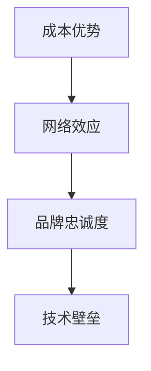
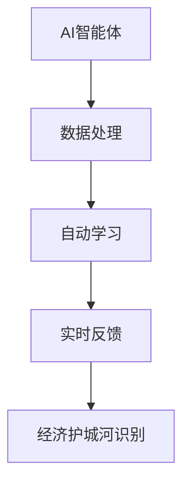
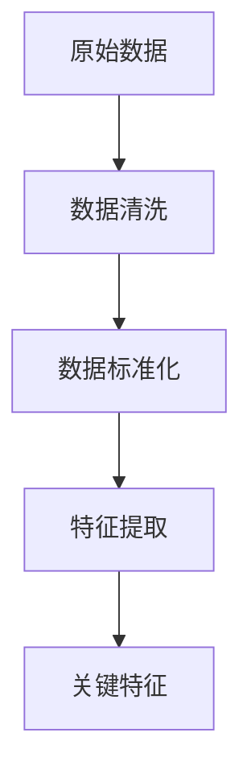
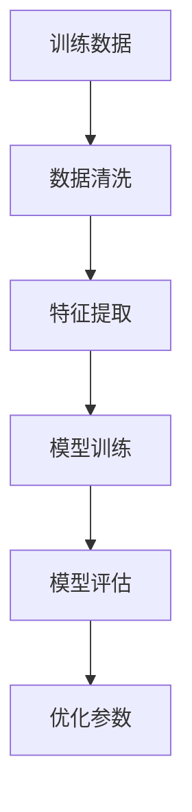
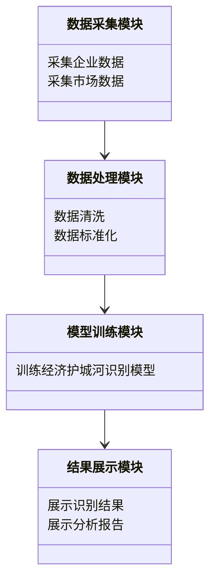
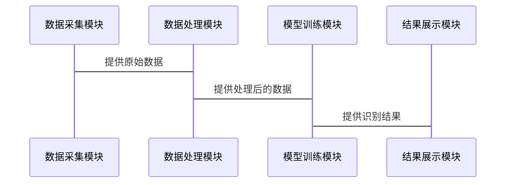

                 


```markdown
# AI智能体在识别经济护城河中的作用

## 关键词：AI智能体, 经济护城河, 数据分析, 机器学习, 商业策略

## 摘要：
本文探讨了AI智能体在识别经济护城河中的应用，分析了经济护城河的核心要素，详细讲解了AI智能体的工作原理、算法实现和系统架构设计，结合实际案例展示了AI智能体在经济护城河识别中的优势和应用场景，最后给出了最佳实践和注意事项。

---

## 第一部分: 经济护城河与AI智能体的背景介绍

### 第1章: 经济护城河的基本概念
#### 1.1 经济护城河的定义与特征
- 经济护城河是指企业在市场竞争中形成的持久竞争优势，包括成本优势、网络效应、品牌忠诚度和技术壁垒等核心要素。
- 经济护城河的特征：防御性、可持续性、可扩展性。

#### 1.2 经济护城河的分类与应用场景
- 成本优势型：通过规模效应降低成本，例如制造业和零售业。
- 网络效应型：用户越多，平台价值越大，例如社交媒体和电商平台。
- 品牌忠诚度型：通过品牌影响力吸引用户，例如高端奢侈品和服务业。
- 技术壁垒型：通过技术专利和技术积累形成竞争优势，例如高科技企业和生物科技企业。

#### 1.3 经济护城河的重要性
- 经济护城河是企业长期发展的关键因素，决定了企业的市场地位和盈利能力。

### 第2章: AI智能体的基本概念与功能
#### 2.1 AI智能体的定义与特点
- AI智能体是一种具备自主决策能力的智能系统，能够通过数据输入和环境交互，自动完成目标任务。
- AI智能体的特点：数据驱动、自主学习、实时反馈。

#### 2.2 AI智能体的核心功能
- 数据处理与分析：AI智能体能够快速处理大量数据，提取关键信息。
- 自动决策：基于数据分析结果，AI智能体能够自动做出决策。
- 实时反馈：AI智能体能够实时监控环境变化，并根据反馈调整决策策略。

### 第3章: AI智能体在经济护城河识别中的作用
#### 3.1 经济护城河识别的传统方法及其局限性
- 传统方法：基于经验分析和专家判断。
- 局限性：主观性强、效率低、难以量化。

#### 3.2 数据驱动方法的优势
- 数据驱动方法：通过数据分析和建模，客观量化经济护城河的强弱。
- 数据驱动方法的优势：高效、精准、可扩展。

#### 3.3 AI智能体在经济护城河识别中的优势
- 数据处理能力：AI智能体能够快速处理大量数据，提取关键特征。
- 自动学习与优化能力：AI智能体能够通过机器学习算法，不断优化识别模型。
- 实时监控与反馈能力：AI智能体能够实时监控市场变化，并根据反馈调整识别策略。

---

## 第二部分: AI智能体的核心概念与联系

### 第4章: 经济护城河的核心要素分析
#### 4.1 经济护城河的核心要素
- 成本优势：企业通过规模效应降低成本，形成竞争优势。
- 网络效应：用户数量增加，平台价值提升。
- 品牌忠诚度：消费者对品牌的依赖和忠诚度越高，企业竞争优势越强。
- 技术壁垒：企业通过技术专利和技术积累，形成技术壁垒。

#### 4.2 经济护城河核心要素的联系
- 表格对比：
| 要素       | 特性               | 示例行业           |
|------------|--------------------|--------------------|
| 成本优势    | 规模效应降低成本    | 制造业、零售业     |
| 网络效应    | 用户数量增加价值    | 社交媒体、电商平台 |
| 品牌忠诚度  | 消费者对品牌依赖    | 高端奢侈品、服务业 |
| 技术壁垒    | 技术专利形成壁垒    | 高科技企业、生物科技企业 |

#### 4.3 经济护城河核心要素的Mermaid图


---

### 第5章: AI智能体的核心概念与经济护城河的关系
#### 5.1 AI智能体的核心概念
- 数据处理能力：AI智能体能够快速处理大量数据，提取关键特征。
- 自动学习能力：AI智能体能够通过机器学习算法，不断优化识别模型。
- 实时反馈能力：AI智能体能够实时监控环境变化，并根据反馈调整决策策略。

#### 5.2 AI智能体与经济护城河的关系
- 表格对比：
| 功能         | AI智能体的能力                | 经济护城河的作用           |
|--------------|-------------------------------|---------------------------|
| 数据处理      | 快速处理大量数据，提取特征      | 识别经济护城河的核心要素   |
| 自动学习      | 通过机器学习优化识别模型      | 提升经济护城河识别的准确性  |
| 实时反馈      | 实时监控市场变化，调整策略     | 保持经济护城河的动态优势   |

#### 5.3 AI智能体与经济护城河关系的Mermaid图


---

## 第三部分: AI智能体识别经济护城河的算法原理

### 第6章: 数据预处理与特征提取
#### 6.1 数据预处理
- 数据清洗：去除重复数据、缺失数据和异常数据。
- 数据标准化：对数据进行归一化处理，确保数据一致性。

#### 6.2 特征提取
- 经济护城河相关特征：成本优势、网络效应、品牌忠诚度和技术壁垒。
- 机器学习特征：通过主成分分析（PCA）提取关键特征。

#### 6.3 数据预处理与特征提取的Mermaid流程图


### 第7章: 基于机器学习的经济护城河识别模型
#### 7.1 模型选择
- 选择适合的机器学习算法：支持向量机（SVM）、随机森林（Random Forest）和神经网络（ANN）。

#### 7.2 模型训练
- 使用训练数据训练模型，提取经济护城河的相关特征。
- 通过交叉验证优化模型参数。

#### 7.3 模型评估
- 使用测试数据评估模型性能，计算准确率、召回率和F1值。

#### 7.4 经济护城河识别模型的Mermaid流程图


### 第8章: 经济护城河识别的数学模型
#### 8.1 经济护城河识别的收益函数
$$ R = p \times q - C $$
其中，$p$ 表示价格，$q$ 表示销量，$C$ 表示成本。

#### 8.2 经济护城河识别的成本函数
$$ C = w_1 \times x_1 + w_2 \times x_2 + \dots + w_n \times x_n $$
其中，$w_i$ 表示特征权重，$x_i$ 表示特征值。

#### 8.3 经济护城河识别的优化目标
$$ \min_{\theta} \sum_{i=1}^{m} (y_i - f(x_i))^2 $$
其中，$y_i$ 表示实际值，$f(x_i)$ 表示预测值，$\theta$ 表示模型参数。

---

## 第四部分: AI智能体识别经济护城河的系统架构设计

### 第9章: 系统功能设计
#### 9.1 系统功能模块
- 数据采集模块：采集企业数据和市场数据。
- 数据处理模块：清洗和标准化数据。
- 模型训练模块：训练经济护城河识别模型。
- 结果展示模块：展示识别结果和分析报告。

#### 9.2 功能模块的Mermaid类图


### 第10章: 系统架构设计
#### 10.1 系统架构设计
- 采用微服务架构，各功能模块独立运行，便于扩展和维护。

#### 10.2 系统架构的Mermaid架构图


### 第11章: 系统接口设计
#### 11.1 系统接口
- 数据接口：与企业数据源对接。
- 模型接口：与其他系统模块对接。

#### 11.2 系统接口的Mermaid序列图


---

## 第五部分: 项目实战与案例分析

### 第12章: 项目实战
#### 12.1 环境配置
- 安装必要的Python库：pandas、scikit-learn、matplotlib。

#### 12.2 核心代码实现
```python
import pandas as pd
from sklearn.ensemble import RandomForestClassifier
from sklearn.metrics import accuracy_score

# 数据加载
data = pd.read_csv('economic_moat.csv')

# 数据预处理
data_cleaned = data.dropna()
data_normalized = (data_cleaned - data_cleaned.mean()) / data_cleaned.std()

# 特征提取
features = data_normalized.drop('label', axis=1)
labels = data_normalized['label']

# 模型训练
model = RandomForestClassifier()
model.fit(features, labels)

# 模型评估
预测结果 = model.predict(features)
准确率 = accuracy_score(预测结果, labels)
print("准确率:", 准确率)
```

#### 12.3 代码解读与分析
- 数据加载：读取CSV格式的数据文件。
- 数据预处理：去除缺失值，并进行标准化处理。
- 特征提取：提取经济护城河相关特征。
- 模型训练：使用随机森林算法训练模型。
- 模型评估：计算模型准确率。

### 第13章: 案例分析
#### 13.1 案例背景
- 某电商平台希望通过AI智能体识别其经济护城河，以优化市场策略。

#### 13.2 数据分析与模型训练
- 数据分析：发现该平台具有显著的网络效应。
- 模型训练：识别出网络效应是其主要的经济护城河。

#### 13.3 案例总结
- 通过AI智能体识别经济护城河，帮助企业制定更有效的市场策略。

---

## 第六部分: 最佳实践与注意事项

### 第14章: 最佳实践
#### 14.1 小结
- AI智能体在经济护城河识别中的作用显著，能够通过数据驱动方法，帮助企业发现和优化经济护城河。

#### 14.2 注意事项
- 数据质量：确保数据的准确性和完整性。
- 模型优化：根据实际需求，不断优化模型参数。
- 可解释性：确保模型结果的可解释性，便于企业决策。

#### 14.3 拓展阅读
- 推荐阅读《竞争优势：经济护城河的构建与维护》。
- 参考文献：《机器学习实战》、《深度学习》。

---

## 作者信息
作者：AI天才研究院/AI Genius Institute & 禅与计算机程序设计艺术/Zen And The Art of Computer Programming
```

