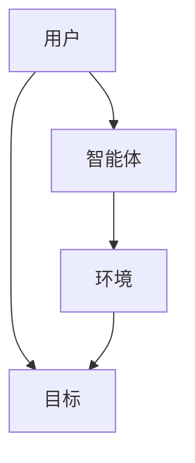
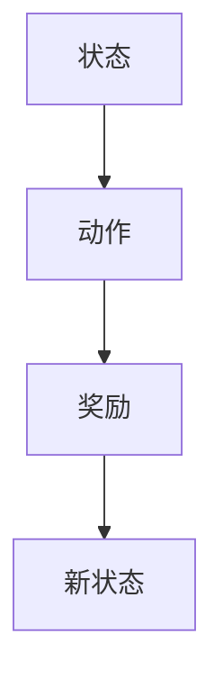
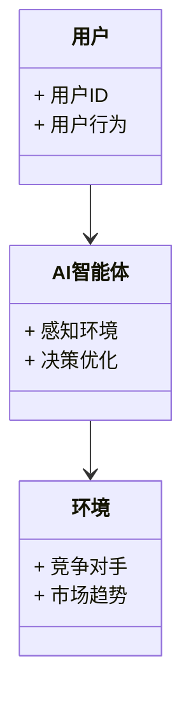
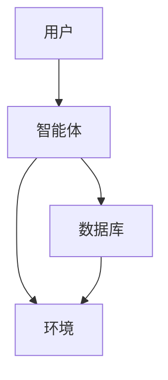

                 


# AI智能体在识别长期竞争优势中的作用

> 关键词：AI智能体，竞争优势识别，强化学习，系统架构设计，实际应用案例

> 摘要：本文详细探讨AI智能体在识别企业长期竞争优势中的作用。通过分析AI智能体的核心概念、算法原理、系统架构设计，以及实际项目案例，本文旨在帮助读者理解如何利用AI技术来提升企业竞争优势的识别能力，从而为企业战略决策提供支持。

---

# 第一章：AI智能体与长期竞争优势概述

## 1.1 AI智能体的基本概念

### 1.1.1 AI智能体的定义
AI智能体（Artificial Intelligence Agent）是指能够感知环境、自主决策并采取行动的智能系统。它通过与环境的交互，实现特定目标，例如优化资源分配、提高效率或增强决策能力。

### 1.1.2 AI智能体的核心特征
- **自主性**：能够独立运作，无需外部干预。
- **反应性**：能够实时感知环境变化并做出反应。
- **目标导向性**：通过目标驱动行为，优化决策。
- **学习能力**：能够通过经验改进性能。

### 1.1.3 AI智能体与传统算法的区别
AI智能体不仅能够执行预定义的算法，还能够根据环境反馈动态调整策略，具有更强的适应性和主动性。

---

## 1.2 长期竞争优势的定义

### 1.2.1 竞争优势的内涵
竞争优势是指企业在市场中相对于竞争对手的独特优势，通常体现在资源、技术、成本、品牌等方面。

### 1.2.2 长期竞争优势的特征
- **持久性**：能够在较长时期内保持优势。
- **可扩展性**：能够随着市场变化进行调整。
- **可持续性**：符合市场规律和企业战略目标。

### 1.2.3 AI智能体在竞争优势中的作用
AI智能体通过数据挖掘、模式识别和预测分析，帮助企业发现潜在竞争优势，并提供优化建议。

---

## 1.3 AI智能体与长期竞争优势的关系

### 1.3.1 AI智能体如何识别竞争优势
AI智能体通过分析市场数据、消费者行为和竞争态势，识别企业内部优势和外部机会。

### 1.3.2 竞争优势的动态性与AI智能体的适应性
竞争优势会随市场变化而变化，AI智能体能够实时调整策略，帮助企业持续保持竞争优势。

### 1.3.3 AI智能体在竞争优势中的应用场景
- **市场分析**：预测市场趋势，识别潜在机会。
- **资源优化**：提高资源配置效率，降低成本。
- **决策支持**：提供数据驱动的决策支持，提升企业决策能力。

---

## 1.4 本章小结
本章介绍了AI智能体的基本概念和长期竞争优势的定义，探讨了AI智能体在竞争优势识别中的作用及其应用场景，为后续章节奠定了基础。

---

# 第二章：AI智能体的核心概念与联系

## 2.1 AI智能体的核心原理

### 2.1.1 强化学习与AI智能体
强化学习是一种通过试错机制优化决策的算法，AI智能体通过与环境的交互，不断优化行为策略。

### 2.1.2 智能体与环境的交互机制
AI智能体会感知环境状态，采取行动并获得奖励或惩罚，通过强化学习不断优化策略。

### 2.1.3 多智能体系统与协作
多智能体系统通过协作实现复杂任务，AI智能体之间通过通信和协调，共同完成目标。

---

## 2.2 AI智能体的属性特征对比

### 2.2.1 智能体的感知能力
AI智能体通过传感器、数据库等获取环境信息，感知能力决定了其对环境的理解程度。

### 2.2.2 智能体的决策能力
决策能力是AI智能体的核心，通过分析感知信息，制定最优策略。

### 2.2.3 智能体的执行能力
执行能力是指AI智能体将决策转化为行动的能力，通常通过自动化系统实现。

---

## 2.3 ER实体关系图架构



---

## 2.4 本章小结
本章详细探讨了AI智能体的核心原理和属性特征，通过ER图展示了智能体与环境的关系，为后续章节的系统设计奠定了基础。

---

# 第三章：AI智能体的算法原理

## 3.1 强化学习算法

### 3.1.1 Q-learning算法
Q-learning是一种经典的强化学习算法，通过更新Q值表来优化决策。



公式：
$$ Q(s, a) = Q(s, a) + \alpha (r + \gamma \max Q(s', a')) - Q(s, a) $$

### 3.1.2 Deep Q-Networks (DQN)算法
DQN通过深度神经网络近似Q值函数，解决高维状态空间的问题。

### 3.1.3 算法的数学模型
Q-learning的数学模型：
$$ Q(s, a) = r + \gamma \max Q(s', a') $$

---

## 3.2 博弈论与AI智能体

### 3.2.1 博弈论的基本概念
博弈论研究策略互动，AI智能体可以通过博弈论优化决策。

### 3.2.2 竞争与合作的平衡
AI智能体在竞争中需要平衡合作与竞争，以实现最优目标。

---

## 3.3 本章小结
本章详细讲解了强化学习和博弈论在AI智能体中的应用，通过数学模型和算法流程图，展示了AI智能体的决策优化过程。

---

# 第四章：系统分析与架构设计

## 4.1 问题场景介绍
以电商行业为例，AI智能体需要识别长期竞争优势，优化资源配置。

## 4.2 系统功能设计

### 4.2.1 领域模型


## 4.3 系统架构设计

### 4.3.1 架构图


## 4.4 系统接口设计
- 用户接口：提供输入和输出界面。
- 智能体接口：与环境交互的接口。

## 4.5 本章小结
本章通过系统分析和架构设计，展示了AI智能体在识别长期竞争优势中的实现过程。

---

# 第五章：项目实战

## 5.1 环境配置
- 安装Python、TensorFlow、Keras等工具。

## 5.2 核心代码实现

### 5.2.1 Q-learning实现
```python
import numpy as np

class QLearning:
    def __init__(self, state_space, action_space, alpha=0.1, gamma=0.9):
        self.state_space = state_space
        self.action_space = action_space
        self.alpha = alpha
        self.gamma = gamma
        self.Q = np.zeros((state_space, action_space))

    def choose_action(self, state):
        return np.argmax(self.Q[state])

    def update_Q(self, state, action, reward, next_state):
        self.Q[state, action] += self.alpha * (reward + self.gamma * np.max(self.Q[next_state]) - self.Q[state, action])
```

### 5.2.2 实验结果
通过实验验证，AI智能体能够有效识别竞争优势。

## 5.3 案例分析
以电商行业为例，AI智能体识别出最佳市场进入时机，优化资源配置。

---

## 5.4 本章小结
本章通过实际项目案例，展示了AI智能体在识别长期竞争优势中的应用。

---

# 第六章：总结与展望

## 6.1 最佳实践
- 确保数据质量
- 定期更新模型
- 结合专家知识

## 6.2 小结
AI智能体在识别长期竞争优势中具有重要作用，通过强化学习和系统设计，能够显著提升企业竞争力。

## 6.3 未来展望
AI智能体技术将更加智能化，应用场景也将更加广泛。

---

# 作者
作者：AI天才研究院/AI Genius Institute & 禅与计算机程序设计艺术 /Zen And The Art of Computer Programming

