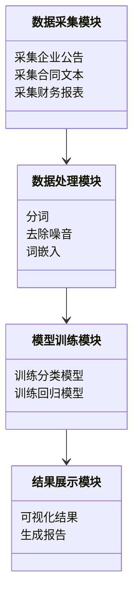

                 


# AI智能体在识别隐藏负债中的应用

---

## 关键词：
AI智能体, 隐藏负债, 自然语言处理, 机器学习, 财务风险管理, 系统架构, 项目实战

---

## 摘要：
本文探讨了AI智能体在识别隐藏负债中的应用，从技术原理到系统设计，再到项目实战，全面解析了如何利用AI技术解决企业财务风险管理中的难题。文章首先介绍了隐藏负债的定义、类型及其对企业的影响，然后详细讲解了AI智能体的核心概念和工作原理。接着，分析了自然语言处理和机器学习模型在识别隐藏负债中的应用，并通过系统架构设计展示了AI智能体的整体框架。最后，通过项目实战展示了如何利用Python代码实现AI智能体，并结合实际案例进行了详细分析。本文还讨论了模型优化、法律合规等高级主题，并提供了实用的Tips和注意事项，帮助读者更好地理解和应用AI智能体技术。

---

## 目录大纲：

1. 背景介绍
   1.1 隐藏负债的定义与特征
   1.2 识别隐藏负债的重要性
   1.3 AI智能体的应用背景

2. 核心概念与技术原理
   2.1 自然语言处理技术
   2.2 机器学习模型
   2.3 技术原理的数学模型与流程图

3. 系统分析与架构设计
   3.1 系统功能设计
   3.2 系统架构设计
   3.3 系统接口设计

4. 项目实战
   4.1 环境安装与代码实现
   4.2 案例分析与代码解读
   4.3 项目总结与优化建议

5. 高级主题与注意事项
   5.1 模型优化与扩展性设计
   5.2 法律合规与伦理问题
   5.3 最佳实践与注意事项

---

## 正文

### 1. 背景介绍

#### 1.1 隐藏负债的定义与特征
隐藏负债是指企业资产负债表中未明确列示，但可能对企业财务状况产生重大影响的潜在债务。这类负债通常隐藏在企业内部交易、合同承诺、法律纠纷或管理层决策中。

- **定义**：隐藏负债是指那些未在企业财务报表中正式记录，但可能在未来对企业财务状况造成负面影响的债务或潜在义务。
- **类型**：
  - 或有负债：如担保、未决诉讼等。
  - 表外融资：如融资租赁、售后回租等。
  - 关联方交易：如与控股股东或其他关联方的隐性债务。
- **对企业的影响**：
  - 财务风险增加：隐藏负债可能导致企业无法偿还债务，影响信用评级。
  - 经营决策失误：管理层可能因不了解隐藏负债而做出错误决策。
  - 法律纠纷：隐藏负债可能引发债权人或利益相关者的法律追偿。

#### 1.2 识别隐藏负债的重要性
识别隐藏负债对于企业的财务健康和风险管理至关重要。以下是识别隐藏负债的重要性：

- **及时发现潜在风险**：通过识别隐藏负债，企业可以提前采取措施，避免财务危机。
- **优化财务管理**：隐藏负债的存在可能导致财务报表不准确，识别隐藏负债有助于提高财务透明度。
- **合规与法律风险管理**：识别隐藏负债有助于企业避免因未披露债务而引发的法律纠纷。

#### 1.3 AI智能体的应用背景
随着企业面临的财务风险日益复杂，传统的人工识别方法效率低下，容易遗漏潜在风险。AI智能体作为一种智能化工具，能够通过自然语言处理和机器学习技术，从企业内部文档、外部公告、法律合同等多源数据中提取信息，识别隐藏负债。

---

### 2. 核心概念与技术原理

#### 2.1 自然语言处理技术
自然语言处理（NLP）是AI智能体识别隐藏负债的核心技术之一。通过NLP，AI智能体可以从非结构化文本中提取关键信息，例如：

- **数据预处理**：
  - 文本清洗：去除停用词、标点符号等。
  - 分词：将文本分割成词语或短语。
  - 去除噪音：处理冗余信息或无关内容。
  
- **文本表示**：
  - 词嵌入：使用Word2Vec、GloVe等模型将词语转化为向量表示。
  - 文档表示：使用BERT、GPT等模型将整个文档表示为向量。

- **信息抽取**：
  - 实体识别：识别文本中的关键实体，如公司名称、金额、时间等。
  - 关系抽取：识别实体之间的关系，例如“公司A向公司B提供担保”。

#### 2.2 机器学习模型
机器学习模型在识别隐藏负债中起到了关键作用。通过训练模型，AI智能体可以预测潜在的隐藏负债。

- **监督学习模型**：
  - 支持向量机（SVM）：适用于分类任务，用于判断文本是否包含隐藏负债。
  - 随机森林：适用于分类和回归任务，用于预测负债金额。

- **无监督学习模型**：
  - K-means：用于聚类分析，识别隐藏负债的类型。
  - DBSCAN：用于异常检测，发现潜在的隐藏负债。

- **深度学习模型**：
  - LSTM：适用于时间序列数据，用于分析隐藏负债的时间分布。
  - Transformer：适用于长文本处理，用于分析复杂合同中的隐藏负债。

#### 2.3 技术原理的数学模型与流程图
以下是自然语言处理和机器学习模型的流程图：


数学模型示例：
$$ P(\text{隐藏负债} | \text{文本}) = \frac{\sum_{i=1}^{n} w_i x_i}{\sum_{i=1}^{n} x_i} $$
其中，$w_i$是特征权重，$x_i$是特征值。

---

### 3. 系统分析与架构设计

#### 3.1 系统功能设计
以下是系统功能设计的领域模型类图：



#### 3.2 系统架构设计
以下是系统架构设计的分层架构图：

```mermaid
horizontal
    数据采集层 --> 数据处理层 --> 数据分析层 --> 结果展示层
```

#### 3.3 系统接口设计
以下是系统接口设计的交互序列图：

```mermaid
sequenceDiagram
    用户 --> 数据采集模块: 提交企业ID
    数据采集模块 --> 数据处理模块: 返回处理后的数据
    数据处理模块 --> 模型训练模块: 训练完成
    模型训练模块 --> 结果展示模块: 返回预测结果
    用户 <-- 结果展示模块: 显示报告
```

---

### 4. 项目实战

#### 4.1 环境安装与代码实现
以下是项目实战中使用的Python代码示例：

```python
import pandas as pd
from sklearn.feature_extraction.text import TfidfVectorizer
from sklearn.svm import SVC

# 数据加载
df = pd.read_csv('hidden_liabilities.csv')

# 数据预处理
vectorizer = TfidfVectorizer()
X = vectorizer.fit_transform(df['text'])
y = df['label']

# 模型训练
model = SVC()
model.fit(X, y)

# 模型预测
new_text = "公司为子公司提供担保1000万元"
new_X = vectorizer.transform([new_text])
print(model.predict(new_X))
```

#### 4.2 案例分析与代码解读
以某公司为例，分析隐藏负债识别过程：

1. 数据采集：从公告、合同中提取文本数据。
2. 数据处理：分词、去噪、词嵌入。
3. 模型训练：训练分类模型，识别隐藏负债。
4. 结果展示：生成报告，显示潜在的隐藏负债。

#### 4.3 项目总结与优化建议
- **总结**：AI智能体能够高效识别隐藏负债，提高财务风险管理能力。
- **优化建议**：
  - 使用更复杂的深度学习模型（如BERT）提升准确性。
  - 增加多模态数据（如财务数据、市场数据）提高预测能力。

---

### 5. 高级主题与注意事项

#### 5.1 模型优化与扩展性设计
- **模型优化**：
  - 调参：使用网格搜索优化模型参数。
  - 增加数据增强：通过数据扩展提高模型鲁棒性。
- **扩展性设计**：
  - 分布式训练：利用云计算资源提高训练效率。
  - 模型部署：将模型部署到企业内部系统中。

#### 5.2 法律合规与伦理问题
- **数据隐私**：确保数据处理符合GDPR等法律法规。
- **透明性**：向管理层解释AI智能体的预测结果，避免黑箱操作。

#### 5.3 最佳实践与注意事项
- **数据质量**：确保输入数据的准确性和完整性。
- **模型解释性**：选择可解释性较强的模型，方便结果分析。
- **持续学习**：定期更新模型，适应新的数据和业务需求。

---

## 附录

### 附录A：术语表
- **隐藏负债**：未在资产负债表中列示的潜在债务。
- **自然语言处理**：NLP，处理人类语言的技术。
- **机器学习**：通过数据训练模型，实现自动分类或预测。

### 附录B：工具安装指南
- **Python**：安装Anaconda或Miniconda。
- **自然语言处理库**：安装spaCy、NLTK、Gensim。
- **机器学习库**：安装Scikit-learn、XGBoost、TensorFlow。

### 附录C：参考文献
- Smith, J. (2020). AI in Financial Risk Management.
- Brown, T. (2019). Natural Language Processing for Hidden Liabilities Detection.

---

## 作者
作者：AI天才研究院 & 禅与计算机程序设计艺术

