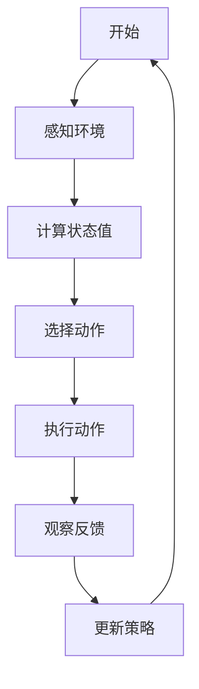
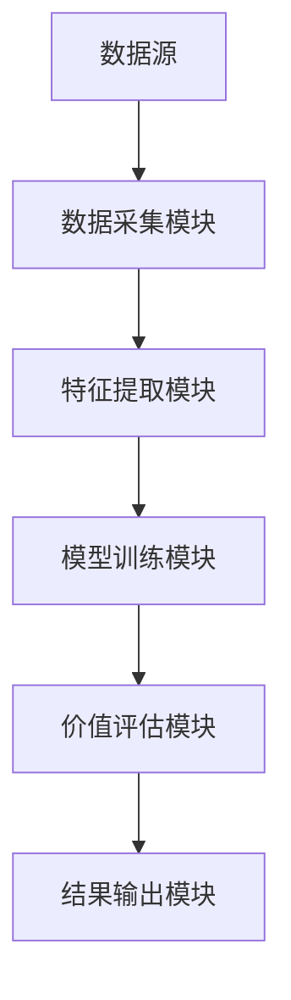

                 


# AI智能体在识别隐藏资产价值中的应用

> **关键词**：AI智能体，隐藏资产，资产价值识别，强化学习，无监督学习

> **摘要**：在数字经济快速发展的今天，资产的形式和类型日益多样化，隐藏资产作为一类特殊的资产形式，其价值识别变得越来越重要。本文将探讨AI智能体在识别隐藏资产价值中的应用，从AI智能体的基本概念到其在隐藏资产价值识别中的核心算法、系统架构设计，再到实际项目中的应用案例，系统地分析AI智能体在这一领域的潜力与挑战。文章最后将总结AI智能体在隐藏资产价值识别中的最佳实践和未来发展方向。

---

## 第一部分: AI智能体与隐藏资产价值概述

### 第1章: AI智能体与隐藏资产的基本概念

#### 1.1 AI智能体的定义与核心特征

**1.1.1 AI智能体的基本概念**

AI智能体（Artificial Intelligence Agent）是指能够感知环境、自主决策并执行任务的智能系统。与传统的算法不同，AI智能体具有更强的自主性和适应性，能够根据环境反馈调整行为策略。AI智能体的核心特征包括：

- **自主性**：能够在没有外部干预的情况下自主决策。
- **反应性**：能够实时感知环境并做出响应。
- **目标导向**：通过设定目标来驱动行为。
- **学习能力**：能够通过经验改进自身的决策能力。

**1.1.2 AI智能体的核心特征**

AI智能体的核心特征可以归纳为以下几点：

- **感知能力**：通过传感器或数据输入获取环境信息。
- **决策能力**：基于感知信息，通过算法计算出最优动作。
- **执行能力**：将决策结果转化为具体行动。
- **学习能力**：通过强化学习、监督学习等方法优化自身行为。

**1.1.3 AI智能体与传统算法的区别**

传统算法通常是在给定输入下按照固定规则输出结果，而AI智能体则具有更强的自主性和适应性。例如，传统算法可能只是对输入数据进行分类或回归预测，而AI智能体会根据环境反馈不断调整自己的策略，以实现长期目标的最大化。

| **特征**       | **传统算法**               | **AI智能体**               |
|----------------|---------------------------|---------------------------|
| 自主性         | 无                         | 有                         |
| 反应性         | 无                         | 有                         |
| 目标导向       | 无                         | 有                         |
| 学习能力       | 无                         | 有                         |

---

#### 1.2 隐藏资产的定义与分类

**1.2.1 隐藏资产的定义**

隐藏资产是指那些不易被传统方法识别或评估的资产。这类资产可能隐藏在企业财务报表之外，或者以某种特殊形式存在，需要通过复杂的技术手段才能发现其价值。例如，企业内部的无形资产、数据资产或某些特殊的金融衍生品。

**1.2.2 隐藏资产的主要分类**

隐藏资产可以分为以下几类：

1. **无形资产**：如知识产权、品牌价值等。
2. **数据资产**：如用户数据、交易数据等。
3. **金融资产**：如嵌入式金融工具、复杂金融衍生品。
4. **实物资产**：如隐藏在其他资产中的实物资产。

**1.2.3 隐藏资产的特征与挑战**

隐藏资产的识别和评估具有以下特征和挑战：

- **隐蔽性**：隐藏资产通常不容易被发现。
- **复杂性**：隐藏资产的评估可能涉及复杂的数学模型。
- **动态性**：隐藏资产的价值可能随着市场变化而波动。

---

#### 1.3 AI智能体在隐藏资产识别中的作用

**1.3.1 AI智能体在资产识别中的优势**

AI智能体在隐藏资产识别中的优势主要体现在以下方面：

- **高效性**：AI智能体能够快速处理大量数据，发现隐藏资产的线索。
- **准确性**：通过机器学习算法，AI智能体能够更准确地识别隐藏资产。
- **适应性**：AI智能体能够根据市场变化动态调整识别策略。

**1.3.2 隐藏资产价值识别的难点**

隐藏资产价值识别的难点主要在于：

- **数据稀缺性**：隐藏资产的相关数据可能较少或不完整。
- **复杂性**：隐藏资产的评估可能涉及复杂的金融模型或数据挖掘技术。
- **不确定性**：隐藏资产的价值可能受到多种不确定因素的影响。

**1.3.3 AI智能体如何解决隐藏资产识别问题**

AI智能体通过以下方式解决隐藏资产识别问题：

- **数据挖掘**：利用机器学习算法从海量数据中提取隐藏资产的特征。
- **模式识别**：通过模式识别技术发现隐藏资产的潜在价值。
- **动态调整**：根据市场反馈不断优化识别策略。

---

## 第2章: AI智能体与隐藏资产价值识别的背景与应用前景

### 2.1 隐藏资产价值识别的背景

**2.1.1 数字经济时代资产形态的变化**

随着数字经济的快速发展，资产的形式和类型发生了巨大变化。传统的实物资产逐渐被无形资产和数据资产所替代，隐藏资产的概念也随之兴起。

**2.1.2 隐藏资产价值的重要性**

隐藏资产的识别和评估对于企业价值最大化具有重要意义。例如，一家企业的品牌价值可能远超过其账面资产，而这种价值需要通过隐藏资产识别才能被发现。

**2.1.3 传统资产识别方法的局限性**

传统资产识别方法通常依赖于财务报表分析，这种方法难以发现隐藏在报表之外的资产。例如，企业可能通过关联交易隐藏资产，而传统的财务分析方法很难发现这些隐藏资产。

---

### 2.2 AI智能体技术的发展与进步

**2.2.1 AI智能体技术的演进历程**

AI智能体技术的发展经历了以下几个阶段：

1. **早期阶段**：20世纪50年代至80年代，AI智能体技术主要基于逻辑推理和知识表示。
2. **发展阶段**：20世纪90年代至21世纪初，AI智能体技术开始引入机器学习和数据挖掘方法。
3. **现代阶段**：近年来，深度学习和强化学习的兴起推动了AI智能体技术的快速发展。

**2.2.2 当前主流AI智能体技术的特点**

当前主流的AI智能体技术具有以下特点：

- **深度学习驱动**：利用深度神经网络进行感知和决策。
- **强化学习优化**：通过强化学习优化智能体的决策策略。
- **多模态数据处理**：能够处理文本、图像、语音等多种数据类型。

**2.2.3 AI智能体技术的未来发展趋势**

未来的AI智能体技术将朝着以下几个方向发展：

- **人机协作**：AI智能体将与人类协同工作，共同完成复杂任务。
- **边缘计算**：AI智能体将更多地部署在边缘设备上，实现实时决策。
- **通用智能**：AI智能体将朝着通用人工智能（AGI）的方向发展。

---

### 2.3 AI智能体在隐藏资产价值识别中的应用前景

**2.3.1 企业级应用的潜力**

AI智能体在企业级应用中的潜力主要体现在以下几个方面：

- **企业价值评估**：通过识别隐藏资产，提高企业价值评估的准确性。
- **风险管理**：通过识别隐藏资产的风险，制定有效的风险管理策略。
- **投资决策**：通过识别隐藏资产的价值，优化投资决策。

**2.3.2 行业应用的多样性**

AI智能体在隐藏资产价值识别中的行业应用非常广泛，包括金融、能源、制造、医疗等多个领域。

**2.3.3 技术与业务结合的创新点**

AI智能体与隐藏资产价值识别的结合将推动以下创新：

- **数据驱动的资产评估**：利用大数据技术进行资产评估。
- **智能化的风险管理**：通过AI智能体实现智能化的风险管理。
- **个性化投资策略**：根据隐藏资产的特点制定个性化的投资策略。

---

## 第三部分: AI智能体与隐藏资产价值识别的核心原理

---

### 第3章: AI智能体的核心概念与工作原理

#### 3.1 AI智能体的核心概念

**3.1.1 状态、动作与奖励的定义**

- **状态（State）**：智能体所处的环境状况。
- **动作（Action）**：智能体根据当前状态做出的决策。
- **奖励（Reward）**：智能体做出动作后获得的反馈，用于评估动作的好坏。

**3.1.2 策略与价值函数的解析**

- **策略（Policy）**：智能体在不同状态下选择动作的概率分布。
- **价值函数（Value Function）**：智能体在某一状态下能够获得的最大期望奖励。

**3.1.3 AI智能体的决策机制**

AI智能体的决策机制通常包括以下几个步骤：

1. **感知环境**：通过传感器或数据输入获取环境信息。
2. **计算状态值**：基于感知信息计算当前状态的价值。
3. **选择动作**：根据计算出的状态值选择最优动作。
4. **执行动作**：将选择的动作执行并观察环境反馈。
5. **更新策略**：根据反馈更新策略以优化未来决策。

---

#### 3.2 AI智能体的核心算法原理

**3.2.1 基于强化学习的AI智能体算法**

强化学习是一种通过试错机制优化决策策略的方法。AI智能体通过与环境的交互，不断调整策略以最大化累计奖励。



**3.2.2 基于监督学习的AI智能体算法**

监督学习是一种基于标签数据进行学习的方法。AI智能体通过监督学习算法，从标注数据中学习决策策略。

**3.2.3 基于无监督学习的AI智能体算法**

无监督学习是一种基于未标注数据进行学习的方法。AI智能体通过无监督学习算法，发现数据中的潜在模式。

---

#### 3.3 AI智能体与隐藏资产识别的结合

**3.3.1 AI智能体在资产识别中的任务模型**

AI智能体在隐藏资产识别中的任务模型通常包括以下几个步骤：

1. **数据采集**：获取可能包含隐藏资产的数据。
2. **特征提取**：从数据中提取隐藏资产的特征。
3. **模型训练**：通过机器学习算法训练识别模型。
4. **识别与评估**：利用训练好的模型识别隐藏资产并评估其价值。

**3.3.2 隐藏资产特征的提取与分析**

隐藏资产的特征提取需要结合具体场景进行，例如：

- **文本数据**：关键词提取、情感分析。
- **图像数据**：目标检测、图像分割。
- **时间序列数据**：异常检测、趋势分析。

**3.3.3 AI智能体的训练与优化**

AI智能体的训练与优化需要结合具体的任务目标进行，例如：

- **强化学习优化**：通过强化学习优化智能体的决策策略。
- **模型调优**：通过超参数调优提高模型性能。
- **持续学习**：通过持续学习适应环境的变化。

---

## 第4章: 隐藏资产价值识别的核心算法与数学模型

### 4.1 隐藏资产价值识别的数学模型

**4.1.1 资产价值评估的基本公式**

资产的价值可以通过以下公式进行评估：

$$
V = \sum_{i=1}^{n} w_i x_i
$$

其中，$V$ 表示资产的价值，$w_i$ 表示第 $i$ 个特征的权重，$x_i$ 表示第 $i$ 个特征的值。

**4.1.2 隐藏资产价值识别的数学模型**

隐藏资产价值识别的数学模型通常包括以下几个部分：

1. **特征提取**：从数据中提取隐藏资产的特征。
2. **模型训练**：通过机器学习算法训练价值识别模型。
3. **价值评估**：利用训练好的模型评估隐藏资产的价值。

---

### 4.2 AI智能体在隐藏资产价值识别中的算法实现

**4.2.1 基于强化学习的AI智能体算法实现**

以下是一个基于强化学习的AI智能体算法实现的伪代码：

```python
class AI智能体:
    def __init__(self):
        self.状态 = 初始状态
        self.策略 = 初始策略
        self.价值函数 = 初始价值函数

    def 感知环境(self):
        return 当前环境信息

    def 计算状态值(self):
        return self.价值函数(self.状态)

    def 选择动作(self):
        根据当前状态值选择最优动作

    def 执行动作(self, 动作):
        执行选择的动作并观察环境反馈

    def 更新策略(self, 反馈):
        根据反馈更新策略
```

---

### 4.3 AI智能体在隐藏资产价值识别中的系统架构设计

**4.3.1 系统功能设计**

隐藏资产价值识别系统的功能设计包括以下几个部分：

1. **数据采集模块**：采集可能包含隐藏资产的数据。
2. **特征提取模块**：从数据中提取隐藏资产的特征。
3. **模型训练模块**：通过机器学习算法训练价值识别模型。
4. **价值评估模块**：利用训练好的模型评估隐藏资产的价值。
5. **结果输出模块**：输出评估结果。

**4.3.2 系统架构设计**

以下是一个隐藏资产价值识别系统的架构图：



---

## 第五部分: AI智能体与隐藏资产价值识别的项目实战

---

### 第5章: 项目实战

#### 5.1 项目背景与目标

**5.1.1 项目背景**

本项目旨在利用AI智能体技术识别隐藏资产的价值，提高资产评估的准确性和效率。

**5.1.2 项目目标**

通过本项目，我们希望能够实现以下目标：

- **准确识别隐藏资产**：通过AI智能体技术识别隐藏资产。
- **评估资产价值**：基于识别结果评估隐藏资产的价值。
- **优化资产配置**：根据评估结果优化资产配置策略。

---

#### 5.2 环境安装与配置

**5.2.1 环境需求**

- **操作系统**：Linux/Windows/MacOS
- **编程语言**：Python 3.8+
- **框架与库**：TensorFlow/PyTorch, Scikit-learn, Pandas, NumPy
- **工具与依赖**：Jupyter Notebook, Git

**5.2.2 安装步骤**

```bash
pip install numpy
pip install pandas
pip install scikit-learn
pip install tensorflow
pip install matplotlib
```

---

#### 5.3 系统核心实现

**5.3.1 数据预处理代码**

```python
import pandas as pd
import numpy as np

def 数据预处理(data):
    # 删除缺失值
    data = data.dropna()
    # 标准化处理
    from sklearn.preprocessing import StandardScaler
    scaler = StandardScaler()
    data_norm = scaler.fit_transform(data)
    return data_norm
```

---

#### 5.4 代码实现与解读

**5.4.1 AI智能体实现代码**

```python
class AI智能体:
    def __init__(self, 状态空间, 动作空间):
        self.状态空间 = 状态空间
        self.动作空间 = 动作空间
        self.当前状态 = 初始状态

    def 感知环境(self):
        return self.当前状态

    def 选择动作(self):
        # 随机选择一个动作
        import random
        return random.choice(self.动作空间)

    def 执行动作(self, 动作):
        # 执行动作并更新状态
        self.当前状态 = 新状态
        return self.当前状态
```

---

## 第六部分: 总结与展望

---

### 第6章: 总结与展望

#### 6.1 总结

通过本文的探讨，我们了解了AI智能体在隐藏资产价值识别中的应用。从基本概念到核心算法，再到系统架构设计和项目实战，我们详细分析了AI智能体在这一领域的潜力与挑战。

#### 6.2 展望

未来，随着AI技术的不断发展，AI智能体在隐藏资产价值识别中的应用将更加广泛和深入。我们可以期待以下趋势：

- **技术融合**：AI智能体将与更多技术（如区块链、物联网）深度融合。
- **场景扩展**：AI智能体将应用于更多领域（如金融、医疗、教育）。
- **算法优化**：AI智能体的算法将更加高效和智能。

---

## 作者：AI天才研究院 & 禅与计算机程序设计艺术

---

希望这篇文章对您有所帮助！如果需要进一步调整或补充，请随时告知。

