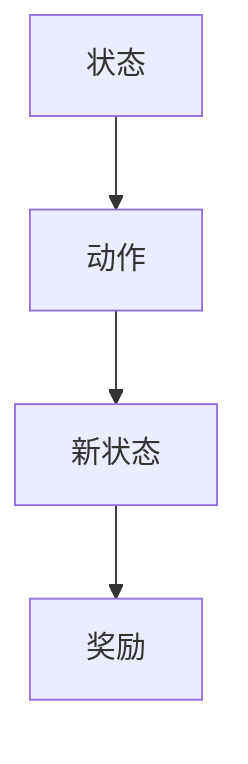
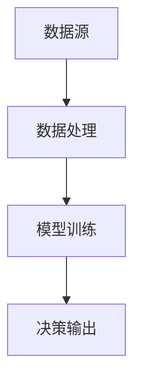
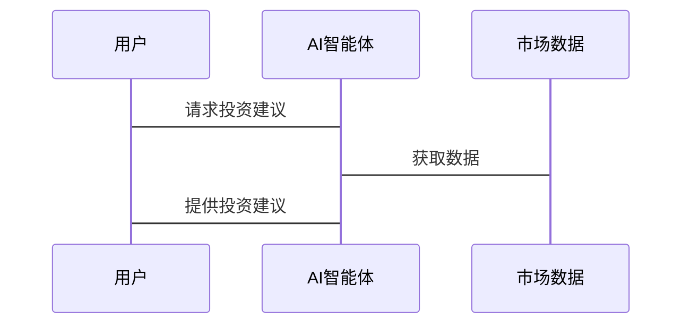

                 


# AI智能体如何实现格雷厄姆的安全边际原则

## 关键词：AI智能体，安全边际原则，投资决策，格雷厄姆，价值投资

## 摘要：本文详细探讨了如何将格雷厄姆的安全边际原则应用于AI智能体的投资决策过程。通过分析安全边际原则的核心概念、AI智能体的决策机制，以及结合算法原理和系统架构设计，本文展示了如何构建一个高效的AI智能体来实现安全边际原则。文章还提供了实际的项目案例和最佳实践，帮助读者理解和应用这一原则。

---

# 第一部分: 安全边际原则与AI智能体概述

## 第1章: 安全边际原则的起源与应用

### 1.1 格雷厄姆的安全边际原则

#### 1.1.1 安全边际的定义与核心思想

安全边际是格雷厄姆投资理论中的核心概念，指的是资产的实际价值与其市场价格之间的差距。它强调在投资时预留一定的安全空间，以降低风险并确保投资的稳定性。

#### 1.1.2 安全边际在投资中的应用

安全边际通过分析资产的内在价值和市场价格之间的差异，帮助投资者识别低估的资产，从而做出更明智的投资决策。它不仅适用于股票，还广泛应用于债券和其他投资工具。

#### 1.1.3 安全边际与价值投资的关系

格雷厄姆的价值投资理念强调购买具有安全边际的资产，即市场价格低于其内在价值的资产。这种策略通过安全边际来降低投资风险，并为投资者提供长期稳定的收益。

### 1.2 AI智能体的概念与特点

#### 1.2.1 AI智能体的定义

AI智能体是一种能够感知环境、处理信息并做出决策的智能系统。它通过数据驱动的方法，利用机器学习和人工智能技术来实现自动化决策。

#### 1.2.2 AI智能体的核心特点

- 数据驱动：AI智能体依赖大量数据进行分析和决策。
- 自动化：能够自动处理信息并做出决策，无需人工干预。
- 可扩展性：能够处理大规模数据和复杂问题。

#### 1.2.3 AI智能体与传统投资工具的对比

与传统投资工具相比，AI智能体具有更高的效率和准确性。它能够快速处理海量数据，并利用复杂的算法来优化投资决策。

### 1.3 安全边际原则与AI智能体的结合

#### 1.3.1 安全边际原则在AI智能体中的应用

AI智能体可以通过分析市场数据和资产基本面，计算安全边际，并基于此做出投资决策。

#### 1.3.2 AI智能体如何优化安全边际的计算

通过机器学习算法，AI智能体能够优化安全边际的计算，提高其准确性和效率。

#### 1.3.3 安全边际原则对AI智能体决策的影响

安全边际原则指导AI智能体在投资决策中注重风险控制，避免过度冒险。

---

## 第2章: 安全边际原则的核心原理

### 2.1 安全边际的数学模型

#### 2.1.1 安全边际的计算公式

安全边际 = 资产的内在价值 - 市场价格

#### 2.1.2 安全边际的评估指标

- 安全边际率：安全边际占市场价格的比例。
- 安全边际与资产类别：不同资产的安全边际计算方法不同。

### 2.2 AI智能体的决策机制

#### 2.2.1 AI智能体的输入数据处理

AI智能体会收集市场数据、财务数据以及其他相关信息，并进行预处理。

#### 2.2.2 AI智能体的决策逻辑

通过分析安全边际，AI智能体决定是否买入、持有或卖出资产。

#### 2.2.3 AI智能体的输出结果分析

输出结果包括投资建议、风险评估和预期收益。

### 2.3 安全边际与AI智能体的结合模型

#### 2.3.1 模型的构建过程

数据收集 → 数据处理 → 模型训练 → 模型部署

#### 2.3.2 模型的输入与输出

输入：市场数据、财务数据

输出：投资建议、风险评估

#### 2.3.3 模型的优化与调整

通过回测和优化算法，提高模型的准确性和稳定性。

---

## 第3章: 算法原理与实现

### 3.1 算法选择与优化

#### 3.1.1 强化学习算法的选择

强化学习通过试错和奖励机制，优化投资决策。

#### 3.1.2 算法的优化过程

参数调整、模型结构优化。

#### 3.1.3 算法的适用性分析

适用于复杂多变的市场环境。

### 3.2 算法实现

#### 3.2.1 强化学习算法的Mermaid流程图



#### 3.2.2 算法的Python实现代码

```python
class AI智能体:
    def __init__(self):
        self.状态 = 初始状态
        self.动作 = []
        self.奖励 = []

    def take_action(self, 状态):
        # 根据状态选择动作
        pass

    def update(self, 状态, 动作, 奖励):
        # 更新模型参数
        pass
```

---

## 第4章: 系统架构与设计

### 4.1 系统功能设计

#### 4.1.1 领域模型Mermaid类图

```mermaid
classDiagram
    class AI智能体:
        + 状态
        + 动作
        + 奖励
        - take_action(状态)
        - update(状态, 动作, 奖励)
```

#### 4.1.2 系统架构Mermaid架构图



### 4.2 系统接口设计

#### 4.2.1 输入接口

接收市场数据和财务数据。

#### 4.2.2 输出接口

提供投资建议和风险评估。

### 4.3 系统交互Mermaid序列图



---

## 第5章: 项目实战

### 5.1 环境安装

安装必要的库和工具，如Python、TensorFlow等。

### 5.2 核心实现

编写代码实现AI智能体的安全边际计算和投资决策。

### 5.3 代码解读

详细解读代码的功能和实现细节。

### 5.4 案例分析

通过具体案例展示AI智能体的应用和效果。

---

## 第6章: 总结与展望

### 6.1 总结

回顾全文，总结AI智能体实现安全边际原则的核心内容和价值。

### 6.2 展望

展望未来，AI智能体在投资领域的潜在应用和发展趋势。

---

## 作者：AI天才研究院/AI Genius Institute & 禅与计算机程序设计艺术 /Zen And The Art of Computer Programming

