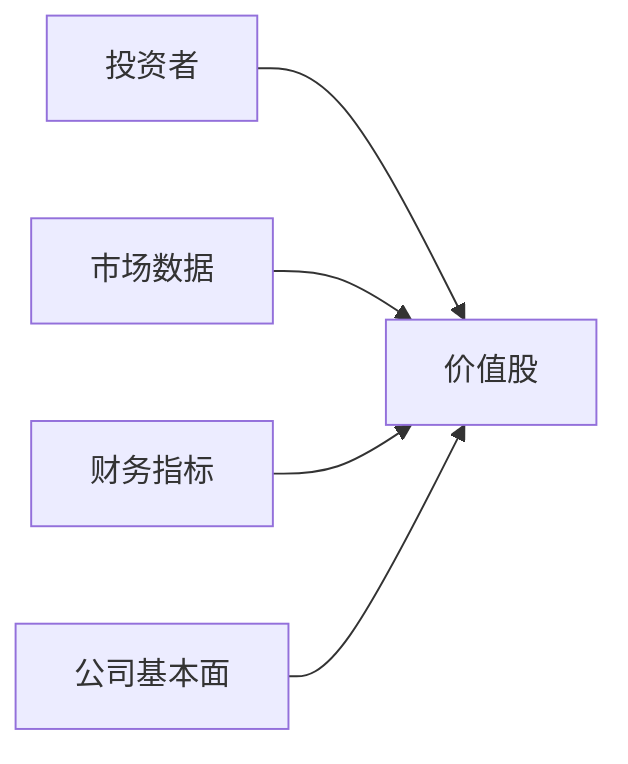
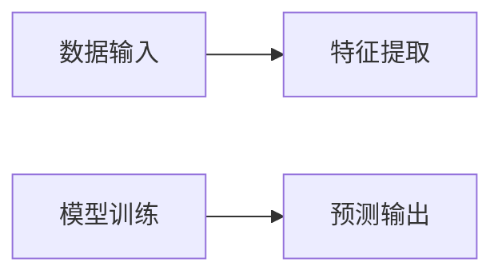

                 


# AI智能体如何识别被低估的价值股

---

## 关键词：
- AI智能体
- 价值股识别
- 金融数据分析
- 机器学习
- 股票预测

---

## 摘要：
本文详细探讨了AI智能体在识别被低估的价值股中的应用。通过分析市场数据、财务指标和公司基本面，结合时间序列分析、机器学习和深度学习等算法，构建了一个高效的AI系统。该系统能够自动化筛选、分析和预测，帮助投资者发现潜在的价值股。文章从背景、算法原理到系统架构，再到项目实战，全面解析了AI智能体在金融领域的应用，并提供了实际案例和最佳实践。

---

# 第一部分: AI智能体与价值股识别的背景与基础

## 第1章: AI智能体与价值股识别概述

### 1.1 AI智能体的基本概念
#### 1.1.1 AI智能体的定义与特点
- **定义**：AI智能体是一种能够感知环境、做出决策并执行任务的智能系统，具备自主性、反应性、目标导向和学习能力。
- **特点**：
  - 自主性：无需人工干预，自动执行任务。
  - 反应性：能根据环境变化调整行为。
  - 目标导向：以特定目标为导向，优化决策。
  - 学习能力：通过数据和经验提升性能。

#### 1.1.2 AI智能体在金融领域的应用
- **应用领域**：
  - 股票预测：利用历史数据和模式识别预测股价走势。
  - 风险评估：通过机器学习模型评估投资风险。
  - 自动交易：开发算法交易系统，快速做出交易决策。
- **优势**：
  - 高效性：快速处理大量数据，提供实时分析。
  - 准确性：通过复杂算法提高预测准确性。
  - 持续性：24/7运行，不间断监控市场动态。

#### 1.1.3 价值股识别的核心概念
- **价值股定义**：指市场价格低于其内在价值的股票，具有较高的投资潜力。
- **识别方法**：
  - 技术分析：通过K线图、均线等技术指标判断股价走势。
  - 基本面分析：分析公司财务报表、行业地位等基本面因素。
  - 市场情绪分析：利用新闻、社交媒体等数据判断市场情绪。

---

### 1.2 价值股的定义与特征
#### 1.2.1 价值股的定义
- **定义**：价值股是指市场价格低于其内在价值，具有长期增长潜力的股票。通常表现为低市盈率、低市净率，高股息率。

#### 1.2.2 价值股的市场特征
- **低估值**：市盈率（P/E）和市净率（P/B）低于行业平均水平。
- **高股息率**：股息收益率较高，吸引追求稳定收益的投资者。
- **行业地位**：公司通常在行业内具有较强的竞争力和较高的市场份额。

#### 1.2.3 价值股识别的挑战与机遇
- **挑战**：
  - 数据噪声：市场数据复杂，存在噪声和不确定性。
  - 市场波动：短期波动可能掩盖长期价值。
  - 竞争性：价值股往往被机构投资者紧盯，竞争激烈。
- **机遇**：
  - 数据驱动：利用大数据分析发现潜在价值股。
  - 技术进步：AI和机器学习的进步提高了识别效率和准确性。

---

### 1.3 AI在金融分析中的应用现状
#### 1.3.1 AI在金融分析中的典型应用
- **股票预测**：利用LSTM和随机森林等算法预测股价走势。
- **风险评估**：通过聚类分析和回归模型评估投资组合风险。
- **新闻 sentiment 分析**：利用自然语言处理技术分析新闻情绪对股价的影响。

#### 1.3.2 AI在价值股识别中的优势
- **高效性**：AI能够快速处理海量数据，发现隐藏的模式。
- **准确性**：通过机器学习模型，提高识别的准确性和稳定性。
- **实时性**：AI系统能够实时监控市场动态，及时发现价值股。

#### 1.3.3 当前AI技术的局限性
- **数据质量**：依赖高质量的数据，数据不足或噪声大可能影响结果。
- **模型泛化能力**：模型可能过拟合特定数据，导致在实际应用中表现不佳。
- **市场变化**：市场环境的快速变化可能影响模型的稳定性。

---

## 第2章: 价值股识别的核心概念与联系

### 2.1 核心概念原理
#### 2.1.1 数据驱动的金融分析
- **定义**：基于大量数据进行分析，寻找数据中的模式和规律。
- **方法**：
  - 时间序列分析：分析股价的波动趋势。
  - 统计建模：利用回归分析、聚类分析等方法进行预测。

#### 2.1.2 市场情绪与价值股的关系
- **市场情绪**：投资者情绪对股价的影响。
- **关系**：价值股通常在市场情绪低落时被低估，而在情绪高涨时被高估。

#### 2.1.3 财务指标与股价预测的关联
- **财务指标**：如净利润率、ROE（净资产收益率）、ROA（资产回报率）等。
- **关联**：财务指标能够反映公司的盈利能力，进而影响股价。

---

### 2.2 核心概念属性特征对比
#### 2.2.1 价值股与成长股的对比分析
| 特性        | 价值股             | 成长股             |
|-------------|--------------------|--------------------|
| 定义        | 价格低于内在价值   | 高增长潜力         |
| 财务指标    | 低市盈率、低市净率   | 高收入增长率       |
| 投资策略    | 价值投资           | 长期增长投资       |

#### 2.2.2 市场波动与价值股稳定性
- **市场波动**：短期波动可能掩盖价值股的真正价值。
- **稳定性**：价值股在长期表现稳定，但短期可能受波动影响。

#### 2.2.3 财务健康指标与价值股质量
- **财务健康指标**：如资产负债率、流动比率等。
- **价值股质量**：健康的财务指标是价值股的重要特征。

---

### 2.3 ER实体关系图架构


---

## 第3章: AI智能体识别价值股的算法原理

### 3.1 算法原理概述
#### 3.1.1 时间序列分析
- **定义**：分析随时间变化的数据序列，预测未来趋势。
- **方法**：ARIMA、LSTM等模型。

#### 3.1.2 机器学习模型
- **监督学习**：如随机森林、SVM用于分类和回归。
- **无监督学习**：如聚类分析用于市场分割。

#### 3.1.3 深度学习方法
- **神经网络**：如LSTM用于时间序列预测。
- **卷积神经网络**：用于图像识别，如K线图分析。

---

### 3.2 算法流程图


---

### 3.3 算法实现代码
```python
import numpy as np
import pandas as pd
from sklearn.ensemble import RandomForestRegressor
from sklearn.metrics import mean_squared_error

# 加载数据
data = pd.read_csv('stock_data.csv')

# 特征工程
features = data[['PE', 'PB', 'ROE', 'EPS', ' revenue_growth']]
target = data['price']

# 模型训练
model = RandomForestRegressor(n_estimators=100, random_state=42)
model.fit(features, target)

# 预测
predictions = model.predict(features)
print(f"均方误差: {mean_squared_error(target, predictions)}")
```

---

## 第4章: AI智能体识别价值股的系统架构与实现

### 4.1 系统架构设计


---

## 第5章: 项目实战

### 5.1 环境安装
- **Python**：3.8+
- **库**：numpy, pandas, scikit-learn, LSTM模型。

### 5.2 核心实现代码
```python
import numpy as np
import pandas as pd
from keras.models import Sequential
from keras.layers import LSTM, Dense

# 加载数据
data = pd.read_csv('stock_data.csv')
features = data[['PE', 'PB', 'ROE', 'EPS', 'revenue_growth']]
target = data['price']

# 数据预处理
features_train = np.array(features).reshape(-1, len(features.columns), 1)
target_train = np.array(target).reshape(-1, 1)

# LSTM模型
model = Sequential()
model.add(LSTM(64, input_shape=(len(features.columns), 1)))
model.add(Dense(1))
model.compile(loss='mean_squared_error', optimizer='adam')

# 训练
model.fit(features_train, target_train, epochs=100, batch_size=32)
```

---

## 第6章: 最佳实践与小结

### 6.1 最佳实践
- **数据质量**：确保数据准确、完整。
- **模型优化**：定期更新模型，避免过拟合。
- **风险管理**：结合风险控制策略，降低投资风险。

### 6.2 小结
本文详细介绍了AI智能体在识别被低估的价值股中的应用，从背景、算法到系统架构，再到项目实战，全面解析了AI在金融领域的潜力和挑战。通过实际案例和代码实现，展示了如何利用AI技术提升投资决策的效率和准确性。

---

## 作者：
**AI天才研究院/AI Genius Institute**  
**禅与计算机程序设计艺术 /Zen And The Art of Computer Programming**

