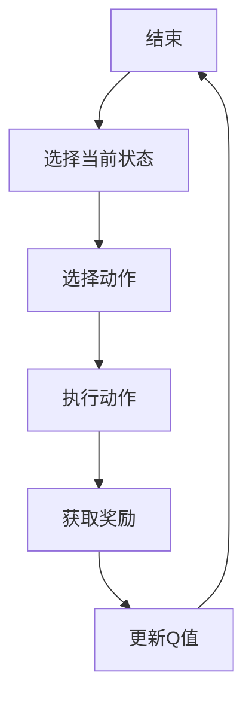
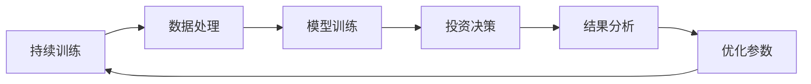
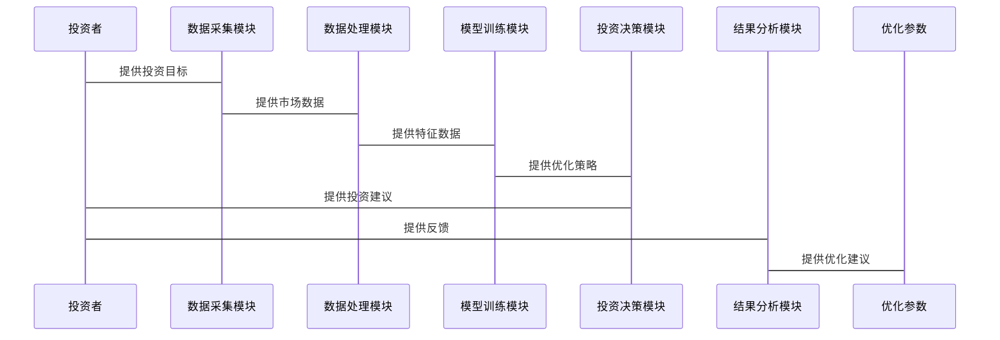

                 


# AI智能体实现巴菲特的焦点投资策略

> 关键词：AI智能体，巴菲特投资策略，强化学习，价值投资，投资决策

> 摘要：本文详细探讨了如何利用AI智能体实现巴菲特的焦点投资策略。通过分析巴菲特投资策略的核心要素，结合AI技术的特点，提出了基于强化学习的AI智能体设计方案。文章从理论到实践，详细阐述了AI智能体的实现过程，并通过案例分析验证了其有效性。

---

# 第一部分: AI智能体与巴菲特投资策略的背景介绍

## 第1章: AI智能体的基本概念与巴菲特投资策略的结合

### 1.1 AI智能体的基本概念

- **AI智能体**：AI智能体是一种能够感知环境、做出决策并采取行动的智能系统。它具备自主性、反应性、目标导向和社交能力等特点。
- **强化学习**：AI智能体通过与环境互动，学习如何做出最优决策。强化学习的核心在于通过试错机制，优化决策策略以获得最大化的累计奖励。
- **投资策略**：AI智能体可以应用于投资领域，通过分析市场数据，预测股票价格走势，优化投资组合，实现自动化交易。

### 1.2 巴菲特投资策略的核心理念

- **价值投资**：巴菲特的核心理念是寻找具有持续竞争优势和良好管理的公司，长期持有，避免短期市场波动的影响。
- **基本面分析**：巴菲特注重公司的财务报表、盈利能力和管理团队等基本面因素，而不是短期市场波动。
- **长期投资**：巴菲特的投资策略强调长期持有优质股票，通过复利效应实现财富增长。

### 1.3 AI智能体与巴菲特投资策略的结合

- **结合的意义**：通过AI智能体，可以将巴菲特的投资策略转化为可执行的算法，实现自动化、智能化的投资决策。
- **结合的核心概念**：利用AI智能体的强化学习算法，模拟巴菲特的投资决策过程，优化投资组合，提高投资收益。
- **结合的挑战**：市场数据的复杂性、模型的泛化能力、算法的可解释性等问题需要进一步研究和解决。

---

## 第2章: AI智能体实现巴菲特投资策略的核心概念与联系

### 2.1 核心概念的原理分析

- **AI智能体的决策机制**：AI智能体通过感知市场数据和公司基本面信息，利用强化学习算法生成投资决策。
- **巴菲特投资策略的选股逻辑**：基于公司的财务指标、竞争优势和管理团队等因素，筛选出具有长期增长潜力的公司。
- **结合的协同作用**：AI智能体通过数据驱动的方法，快速分析大量市场信息，辅助人类投资者做出更优决策。

### 2.2 核心概念的对比分析

- **AI智能体与传统投资策略的对比**：
  - 传统投资策略依赖于人类的经验和判断，存在主观性和局限性。
  - AI智能体能够快速处理大量数据，具备高效率和准确性。
- **巴菲特投资策略与其他AI投资模型的对比**：
  - 其他AI投资模型可能更注重短期技术分析或统计套利。
  - 巴菲特投资策略更强调长期价值和公司基本面分析。
- **对比分析的总结**：AI智能体结合巴菲特投资策略，能够在保持长期价值投资的基础上，利用AI技术提高投资效率和准确性。

### 2.3 实体关系图与概念结构

- **ER实体关系图**：展示投资决策过程中的主要实体及其关系。
```mermaid
erDiagram
    投资者 --> 投资决策 : 提供投资目标
    市场数据 --> 投资决策 : 提供市场数据
    风险评估 --> 投资决策 : 提供风险评估
    投资决策 --> AI智能体 : 生成投资策略
```

---

## 第3章: AI智能体实现巴菲特投资策略的算法原理

### 3.1 强化学习算法的选择与实现

- **Q-learning算法**：选择Q-learning作为核心算法，因为它适合离线学习，适合模拟巴菲特的投资策略。
- **算法流程图**：

- **数学模型**：Q-learning的更新公式：
  $$ Q(s, a) = Q(s, a) + \alpha (r + \gamma \max Q(s', a') - Q(s, a)) $$
  其中，$\alpha$ 是学习率，$\gamma$ 是折扣因子，$r$ 是奖励，$s$ 是当前状态，$a$ 是动作，$s'$ 是下一个状态。

### 3.2 巴菲特投资策略的特征提取

- **财务指标**：提取公司财务报表中的关键指标，如净利润率、ROE、市盈率等。
- **竞争优势分析**：评估公司的市场地位、品牌影响力和管理团队。
- **风险评估**：分析市场的波动性、行业风险和公司特有风险。

### 3.3 基于强化学习的AI智能体架构

- **数据输入模块**：接收市场数据和公司基本面信息。
- **状态空间定义**：将市场数据和财务指标转化为状态空间。
- **动作空间定义**：定义可执行的动作，如买入、卖出或持有股票。
- **奖励函数设计**：根据投资收益设计奖励函数，鼓励长期价值投资。

---

## 第4章: AI智能体实现巴菲特投资策略的系统架构设计

### 4.1 系统功能设计

- **数据采集模块**：获取实时市场数据和公司财务报表。
- **数据处理模块**：清洗和预处理数据，提取特征。
- **模型训练模块**：基于强化学习算法训练AI智能体。
- **投资决策模块**：根据模型输出生成投资指令。
- **结果分析模块**：评估投资绩效，优化模型参数。

### 4.2 系统架构设计



### 4.3 系统接口设计

- **输入接口**：接收市场数据和公司基本面信息。
- **输出接口**：生成投资指令，如买入、卖出或持有股票。
- **反馈接口**：接收投资结果，更新模型参数。

### 4.4 系统交互设计



---

## 第5章: AI智能体实现巴菲特投资策略的项目实战

### 5.1 环境安装

- **安装Python**：安装Python 3.x版本。
- **安装依赖库**：安装TensorFlow、Keras、Pandas、NumPy等库。

### 5.2 核心代码实现

```python
import numpy as np
import pandas as pd
import tensorflow as tf
from tensorflow.keras import layers

# 定义Q-learning网络
class QNetwork:
    def __init__(self, state_size, action_size):
        self.model = self.build_model(state_size, action_size)
    
    def build_model(self, state_size, action_size):
        model = tf.keras.Sequential([
            layers.Dense(64, activation='relu', input_dim=state_size),
            layers.Dense(64, activation='relu'),
            layers.Dense(action_size)
        ])
        model.compile(optimizer='adam', loss='mean_squared_error')
        return model

# 定义强化学习算法
class AIInvestor:
    def __init__(self, state_size, action_size):
        self.q_network = QNetwork(state_size, action_size)
        self.memory = []
    
    def get_action(self, state):
        state = np.array([state])
        q_values = self.q_network.model.predict(state)
        return np.argmax(q_values[0])
    
    def update_Q(self, state, action, reward, next_state):
        state = np.array([state])
        next_state = np.array([next_state])
        target = reward + 0.99 * np.max(self.q_network.model.predict(next_state))
        target = np.array([target])
        q_values = self.q_network.model.predict(state)
        q_values[0][action] = target[0]
        self.q_network.model.fit(state, q_values, epochs=1, verbose=0)
```

### 5.3 案例分析与结果解读

- **案例分析**：选取某段时间内的市场数据，模拟巴菲特的投资策略，生成投资指令。
- **结果解读**：分析投资收益与实际市场表现的差异，评估AI智能体的性能。

### 5.4 项目总结

- **项目小结**：总结AI智能体在模拟巴菲特投资策略中的表现，提出改进建议。
- **注意事项**：强调模型的可解释性和实际应用中的风险。
- **拓展阅读**：推荐相关领域的书籍和论文，供进一步学习。

---

## 第6章: 总结与展望

### 6.1 总结

- **总结内容**：回顾AI智能体实现巴菲特投资策略的核心概念、算法实现和系统架构。
- **成果与不足**：总结项目的成果和存在的不足，如模型的泛化能力、算法的可解释性等。

### 6.2 未来展望

- **技术发展**：探讨AI技术的未来发展趋势，如深度强化学习、多智能体协作等。
- **应用场景**：展望AI智能体在投资领域的更多应用，如量化交易、风险管理等。

### 6.3 最佳实践 tips

- **投资策略**：结合长期价值投资与技术分析，制定多元化投资策略。
- **模型优化**：通过数据增强、超参数优化等方法，提升模型的性能。
- **风险管理**：建立风险评估机制，降低投资决策中的不确定性。

---

# 作者

**作者：AI天才研究院/AI Genius Institute & 禅与计算机程序设计艺术 /Zen And The Art of Computer Programming**

---

本文通过详细分析和实践，展示了如何利用AI智能体实现巴菲特的焦点投资策略。从理论到实践，文章全面阐述了AI智能体的核心概念、算法原理和系统架构，并通过实际案例验证了其有效性。希望本文能为读者提供有益的启示，推动AI技术在投资领域的进一步发展。

