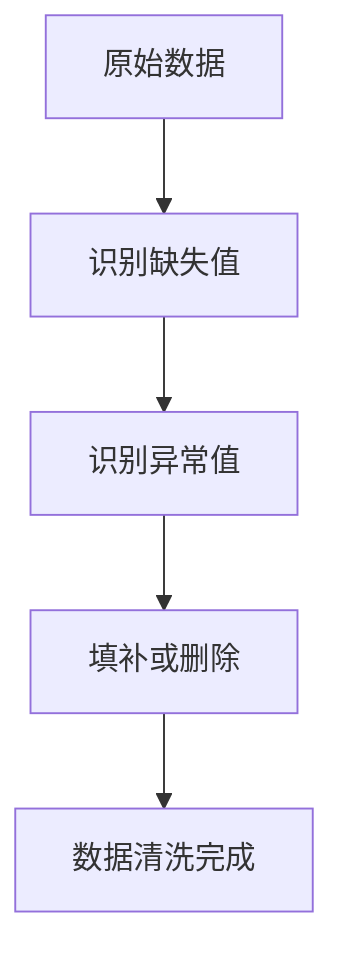
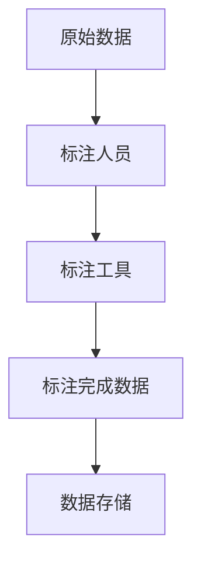
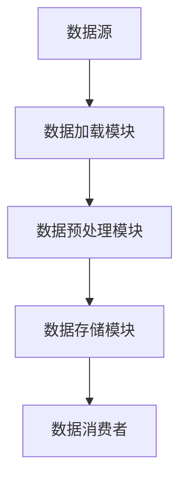
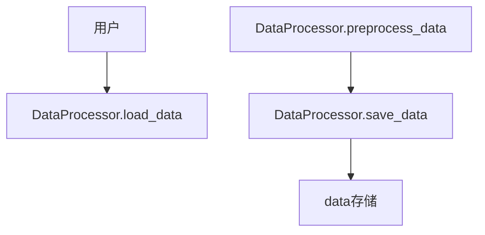

                 


```markdown
# AI模型训练数据收集与处理技巧

> 关键词：AI模型训练、数据收集、数据处理、数据预处理、数据清洗、数据标注

> 摘要：本文系统地探讨了AI模型训练中数据收集与处理的关键技巧，涵盖数据预处理、清洗、标注、增强等方面，结合实际案例和代码实现，帮助读者掌握高效的数据处理方法。

---

# 第一部分: 数据预处理与清洗的核心概念

# 第1章: 数据预处理与清洗的原理与方法

## 1.1 数据预处理的基本原理
### 1.1.1 数据预处理的目标与原则
- 数据预处理的目标是改善数据质量，使其适合模型训练。
- 原则包括完整性、一致性、准确性、及时性和最小冗余。

### 1.1.2 数据预处理的核心步骤
- 数据清洗：去除噪声数据，处理缺失值。
- 数据转换：标准化、归一化、特征提取。
- 数据增强：通过数据扩展技术增加数据多样性。

### 1.1.3 数据预处理的数学模型与公式
- 数据标准化公式：$X_{\text{norm}} = \frac{X - \mu}{\sigma}$，其中$\mu$是均值，$\sigma$是标准差。
- 数据归一化公式：$X_{\text{scaled}} = \frac{X - \min(X)}{\max(X) - \min(X)}$

## 1.2 数据清洗的常见方法
### 1.2.1 数据去重的原理与实现
- 数据去重：通过检查唯一性，使用集合或哈希表去重。
- 示例代码：
```python
import pandas as pd
data = pd.DataFrame(...)
data.drop_duplicates(subset=['column'], keep='first', inplace=True)
```

### 1.2.2 数据填补的策略与技巧
- 均值填补法：适用于数值型数据，公式为$\hat{x_i} = \mu$。
- 众数填补法：适用于分类变量，选择出现频率最高的类别。
- 最近邻填补法：基于KNN算法填补缺失值。

### 1.2.3 数据标准化与归一化的区别与联系
- 标准化：保持数据分布，适用于机器学习模型。
- 归一化：压缩数据到0-1范围，适用于神经网络模型。

## 1.3 数据清洗的流程与工具
### 1.3.1 数据清洗的流程图


### 1.3.2 数据清洗工具的优缺点对比
| 工具 | 优点 | 缺点 |
|------|------|------|
| Python | 灵活性高，库丰富 | 学习曲线陡峭 |
| SQL | 数据处理高效 | 功能有限 |
| R | 统计功能强大 | 生态不如Python |

### 1.3.3 数据清洗的代码实现示例
```python
import pandas as pd
import numpy as np

# 示例数据
data = pd.DataFrame({
    'id': [1, 2, 3, 4, 5],
    'age': [25, np.nan, 30, 35, 40],
    'income': [50000, 60000, np.nan, 70000, 80000]
})

# 去除缺失值
data.dropna()

# 均值填补
data['age'].fillna(data['age'].mean(), inplace=True)

# 删除重复数据
data.drop_duplicates(inplace=True)
```

## 1.4 本章小结
本章详细介绍了数据预处理和清洗的核心概念、方法和工具，强调了数据质量对模型性能的影响，并通过实际案例展示了数据清洗的流程。

---

# 第2章: 数据标注的原理与方法

## 2.1 数据标注的基本概念
### 2.1.1 数据标注的定义与作用
- 数据标注：为数据添加标签或注释，使其可被机器学习模型使用。
- 作用：提高模型训练效率，减少数据冗余。

### 2.1.2 数据标注的核心要素
- 标注规则：统一的标准和指南。
- 标注工具：如Label Studio、CVAT等。
- 标注流程：多人标注、审核、验证。

### 2.1.3 数据标注的流程与步骤


## 2.2 数据标注的常见方法
### 2.2.1 文本数据标注的技巧
- 实体识别：使用NER（Named Entity Recognition）技术。
- 情感分析：标注每条文本的情感倾向。

### 2.2.2 图像数据标注
- 图像分割：使用bounding boxes或pixel masks。
- 分类标注：为图像打上类别标签。

### 2.2.3 视频数据标注
- 时间戳标注：记录关键时间点的事件。
- 活动识别：标注视频中的动作序列。

## 2.3 数据标注的流程与工具
### 2.3.1 数据标注的流程
1. 数据分批：将数据分成多个批次进行标注。
2. 标注审核：由审核人员检查标注质量。
3. 数据验证：通过自动化工具验证标注准确性。

### 2.3.2 数据标注工具推荐
| 工具 | 优点 | 缺点 |
|------|------|------|
| Label Studio | 支持多种数据类型 | 界面较为基础 |
| CVAT | 高效的图像标注 | 学习曲线陡峭 |
| Amazon Mechanical Turk | 分布式标注 | 成本较高 |

### 2.3.3 数据标注的代码实现示例
```python
import label_studio_sdk as ls_sdk

# 初始化标注项目
client = ls_sdk.Client('http://localhost:8080')
project = client.create_project(name='Image Classification')

# 添加任务
task = ls_sdk.Task.create(
    data={
        'image': 'path/to/image.jpg',
        'width': 800,
        'height': 600
    },
    labels=['cat', 'dog']
)
```

## 2.4 本章小结
本章探讨了数据标注的原理、方法和工具，强调了标注质量和工具选择对数据处理效率的影响，并通过实际案例展示了标注流程。

---

# 第3章: 数据增强的原理与实践

## 3.1 数据增强的基本概念
### 3.1.1 数据增强的定义与作用
- 数据增强：通过技术手段增加数据多样性。
- 作用：提高模型泛化能力，防止过拟合。

### 3.1.2 数据增强的核心要素
- 变换类型：旋转、翻转、平移、缩放、剪切等。
- 变换参数：角度、概率、步长等。

## 3.2 数据增强的常见方法
### 3.2.1 图像数据增强
- 使用库：Keras图像预处理、OpenCV。
- 示例变换：随机裁剪、调整亮度、添加噪声。

### 3.2.2 文本数据增强
- 同义词替换：使用WordNet同义词库。
- 随机插入：在文本中插入无关词。
- 删除冗余：去除重复或不必要的词。

### 3.2.3 音频数据增强
- 增加噪声：添加白噪声或背景音。
- 时间变换：改变音频速度或剪切。

## 3.3 数据增强的流程与工具
### 3.3.1 数据增强的流程
1. 数据加载：读取原始数据。
2. 应用变换：使用预定义的变换函数。
3. 数据存储：保存增强后的数据。

### 3.3.2 数据增强的代码实现示例
```python
import keras.preprocessing.image as image_utils

# 加载图像
img = image_utils.load_img('path/to/image.jpg', target_size=(224, 224))

# 数据增强
datagen = image_utils.ImageDataGenerator(rotation_range=40, horizontal_flip=True)

# 生成增强数据
augmented_img = next(datagen.flow(img))
image_utils.save_img('augmented_image.jpg', augmented_img)
```

## 3.4 本章小结
本章详细讲解了数据增强的原理和常见方法，结合代码示例展示了如何通过数据增强提高数据多样性，进而提升模型性能。

---

# 第4章: 数据处理的系统架构与实现

## 4.1 数据处理系统的架构设计
### 4.1.1 系统功能模块
- 数据加载模块：从多种数据源加载数据。
- 数据预处理模块：执行清洗、转换和增强。
- 数据存储模块：将处理后的数据存储到数据库或文件系统。

### 4.1.2 系统架构图


## 4.2 数据处理的接口设计
### 4.2.1 接口定义
- 输入接口：接收原始数据和处理参数。
- 输出接口：返回处理后的数据或存储路径。

### 4.2.2 接口实现
```python
class DataProcessor:
    def __init__(self, data_source):
        self.data_source = data_source

    def load_data(self):
        # 加载数据
        pass

    def preprocess_data(self):
        # 数据预处理
        pass

    def save_data(self):
        # 保存数据
        pass
```

## 4.3 数据处理的交互流程
### 4.3.1 交互流程图


## 4.4 本章小结
本章从系统架构的角度探讨了数据处理的整体流程，展示了如何通过模块化设计实现高效的数据处理。

---

# 第5章: 数据处理的项目实战

## 5.1 项目背景与目标
### 5.1.1 项目背景
- 数据来源：公开数据集，如MNIST、COCO等。
- 项目目标：提高模型训练数据质量，优化模型性能。

## 5.2 项目实施步骤
### 5.2.1 数据加载与初步分析
- 使用Pandas加载数据，进行初步的探索性分析。

### 5.2.2 数据预处理与清洗
- 去除噪声数据，填补缺失值，标准化数据。

### 5.2.3 数据增强与标注
- 根据模型需求，对数据进行增强处理，并添加必要的标签。

## 5.3 项目代码实现
### 5.3.1 数据加载与分析
```python
import pandas as pd

# 加载数据
data = pd.read_csv('data.csv')

# 探索性分析
print(data.describe())
print(data.head())
print(data.isnull().sum())
```

### 5.3.2 数据预处理与清洗
```python
# 去除缺失值
data.dropna(inplace=True)

# 标准化处理
from sklearn.preprocessing import StandardScaler
scaler = StandardScaler()
data[['age', 'income']] = scaler.fit_transform(data[['age', 'income']])
```

### 5.3.3 数据增强与标注
```python
# 图像数据增强
from tensorflow.keras.preprocessing.image import ImageDataGenerator

datagen = ImageDataGenerator(rotation_range=40, horizontal_flip=True)
generator = datagen.flow_from_directory('images/', target_size=(224, 224), batch_size=32)

# 生成并保存增强数据
for batch in generator:
    images, labels = batch
    for i in range(len(images)):
        image_utils.save_img(f'augmented_images/{i}.jpg', images[i])
    break
```

## 5.4 项目小结
本章通过实际项目案例，展示了数据处理的完整流程，从数据加载到清洗，再到增强和标注，帮助读者掌握实际操作技巧。

---

# 第6章: 数据处理的最佳实践与注意事项

## 6.1 最佳实践 tips
### 6.1.1 数据处理的通用原则
- 保持数据一致性，避免格式错误。
- 定期备份数据，防止数据丢失。
- 使用版本控制工具管理数据变更。

### 6.1.2 数据处理的效率优化
- 并行处理：利用多线程或分布式计算加速数据处理。
- 批处理：批量处理数据，减少IO开销。

## 6.2 注意事项
### 6.2.1 数据隐私与安全
- 遵守数据隐私法规，如GDPR。
- 避免处理敏感数据，或进行匿名化处理。

### 6.2.2 数据处理的可重复性
- 记录处理步骤，确保处理过程可重复。
- 使用脚本或配置文件管理数据处理流程。

## 6.3 未来发展趋势
### 6.3.1 自动化数据处理工具
- 开发自动化数据处理平台，减少人工干预。
- 利用AI技术辅助数据处理，如自动标注、智能清洗。

### 6.3.2 数据处理的智能化
- 引入机器学习模型，自动识别和处理数据中的异常值。
- 使用NLP技术优化文本数据处理流程。

## 6.4 本章小结
本章总结了数据处理的最佳实践，提出了注意事项，并展望了未来的发展趋势，帮助读者在实际应用中避免常见错误，保持数据处理的高效和安全。

---

# 结语

数据收集与处理是AI模型训练的关键环节，直接影响模型的性能和效果。通过本文的系统讲解，读者可以掌握数据预处理、清洗、标注和增强的核心技巧，结合实际案例和代码实现，提升数据处理效率和质量。未来，随着技术的进步，数据处理将更加智能化和自动化，为AI模型的训练提供更强大的支持。

---

作者：AI天才研究院/AI Genius Institute & 禅与计算机程序设计艺术 /Zen And The Art of Computer Programming
```

