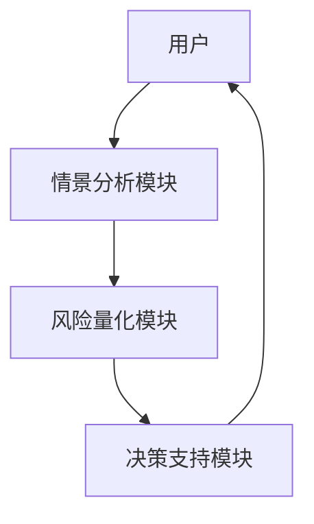
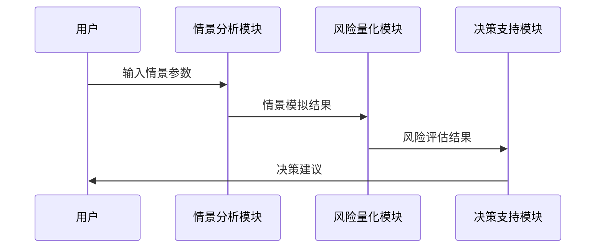

                 


# AI辅助企业战略决策：情景分析与风险量化模型

> 关键词：AI, 企业战略决策, 情景分析, 风险量化模型, 蒙特卡洛模拟, 决策树算法, 企业风险管理

> 摘要：本文详细探讨了人工智能在企业战略决策中的应用，特别是情景分析与风险量化模型的构建与实现。通过分析情景分析的核心原理、风险量化模型的数学基础，以及基于AI的算法实现，本文为读者提供了一套完整的理论与实践框架，帮助企业在复杂多变的商业环境中做出科学、高效的决策。

---

# 第一部分: AI辅助企业战略决策的背景与基础

## 第1章: 企业战略决策的挑战与AI的作用

### 1.1 企业战略决策的核心问题
#### 1.1.1 战略决策的复杂性
- 企业战略决策涉及多维度的变量，如市场环境、竞争对手、内部资源等。
- 决策的复杂性导致传统方法难以捕捉所有可能的影响因素。

#### 1.1.2 传统决策方法的局限性
- 基于经验的决策可能存在主观性，难以量化风险。
- 传统模型缺乏动态调整能力，难以应对快速变化的市场环境。

#### 1.1.3 AI技术的突破性作用
- AI技术能够处理海量数据，提取隐含规律。
- 通过机器学习算法，AI能够模拟多种情景，量化风险，为决策提供科学依据。

### 1.2 情景分析与风险量化模型的背景
#### 1.2.1 情景分析的定义与应用
- 情景分析是通过构建不同假设场景，评估其对企业战略的影响。
- 常见应用于市场预测、投资决策等领域。

#### 1.2.2 风险量化模型的定义与作用
- 风险量化模型通过数学方法，评估不同情景下的风险程度。
- 量化后的风险值为决策提供明确的参考依据。

#### 1.2.3 AI技术在情景分析与风险量化中的优势
- AI能够快速处理多维度数据，构建复杂的情景模型。
- 通过深度学习算法，AI能够发现数据中的非线性关系，提升模型的准确性。

### 1.3 本章小结
本章介绍了企业战略决策的复杂性及传统方法的局限性，阐述了AI技术在情景分析与风险量化中的重要作用，为后续内容奠定了基础。

---

# 第二部分: 情景分析与风险量化模型的核心概念

## 第2章: 情景分析的核心原理

### 2.1 情景分析的基本原理
#### 2.1.1 情景分析的三要素
- **假设条件**：情景分析的基础，包括市场环境、政策变化等。
- **关键变量**：影响企业战略的核心因素，如市场需求、成本变化等。
- **目标函数**：需要优化的决策变量，如利润最大化、风险最小化等。

#### 2.1.2 不同类型的情景分析方法
- **定量分析**：基于数据和模型，量化情景的影响。
- **定性分析**：基于专家经验，评估情景的可能性和影响。
- **混合分析**：结合定量和定性方法，综合评估情景。

#### 2.1.3 情景分析的步骤与流程
1. 确定分析目标。
2. 收集相关数据。
3. 构建情景模型。
4. 评估不同情景的影响。
5. 提出决策建议。

### 2.2 风险量化模型的构建逻辑
#### 2.2.1 风险量化模型的定义
- 风险量化模型是通过数学方法，评估不同情景下风险的大小和概率。

#### 2.2.2 风险量化模型的输入与输出
- **输入**：情景分析结果、历史数据、专家意见。
- **输出**：风险值、风险概率、风险影响程度。

#### 2.2.3 风险量化模型的评估标准
- 模型的准确性：预测结果与实际结果的吻合程度。
- 模型的稳定性：在不同数据集上的表现一致性。
- 模型的可解释性：模型结果是否易于理解和解释。

### 2.3 情景分析与风险量化模型的关系
#### 2.3.1 两者的核心联系
- 情景分析为风险量化模型提供输入，风险量化模型为情景分析提供反馈。
- 两者结合能够全面评估不同情景下的风险和收益。

#### 2.3.2 两者在企业战略决策中的协同作用
- 情景分析帮助企业识别可能的风险来源。
- 风险量化模型帮助企业评估不同风险的影响程度。
- 结合两者，企业能够制定更具前瞻性的战略决策。

#### 2.3.3 两者的区别与应用场景
- 情景分析更注重情景的构建和模拟。
- 风险量化模型更注重风险的度量和评估。
- 在实际应用中，两者需要有机结合，才能全面支持企业决策。

## 第3章: 情景分析与风险量化模型的数学基础

### 3.1 情景分析的数学模型
#### 3.1.1 情景分析的线性模型
- 线性回归模型：用于分析变量之间的线性关系。
- 适用于简单的情景分析，如单一变量对结果的影响。

#### 3.1.2 情景分析的非线性模型
- 非线性回归模型：用于分析变量之间的非线性关系。
- 适用于复杂的情景分析，如多个变量的交互作用。

#### 3.1.3 情景分析的优化模型
- 基于优化理论的模型，如线性规划、非线性规划。
- 用于在多种约束条件下，寻找最优解。

### 3.2 风险量化模型的数学公式
#### 3.2.1 风险值的计算公式
$$ \text{风险值} = \sum_{i=1}^{n} w_i \times r_i $$
其中，$w_i$是风险因素的权重，$r_i$是风险因素的影响程度。

#### 3.2.2 风险概率的计算公式
$$ P(r) = \prod_{i=1}^{n} P(r_i | r_{i-1}) $$
其中，$P(r_i | r_{i-1})$是第$i$个风险因素在第$i-1$个风险因素发生下的条件概率。

#### 3.2.3 风险影响的综合评估公式
$$ I = \sum_{i=1}^{m} \text{风险值}_i \times \text{概率}_i $$
其中，$m$是不同情景的数量。

### 3.3 本章小结
本章介绍了情景分析和风险量化模型的数学基础，包括线性模型、非线性模型和优化模型，以及风险量化模型的核心公式，为后续的算法实现奠定了理论基础。

---

# 第三部分: AI辅助情景分析与风险量化模型的算法原理

## 第4章: 基于AI的情景分析算法

### 4.1 蒙特卡洛模拟算法
#### 4.1.1 蒙特卡洛模拟的定义与原理
- 蒙特卡洛模拟是一种通过随机采样方法，模拟系统行为的算法。
- 适用于复杂系统的建模和预测。

#### 4.1.2 蒙特卡洛模拟的实现步骤
1. 确定系统的输入变量和分布。
2. 生成随机样本。
3. 计算系统的输出。
4. 统计输出结果，评估系统的特性。

#### 4.1.3 蒙特卡洛模拟的Python代码实现
```python
import numpy as np

def monte_carlo_simulation(parameters, num_samples=1000):
    # 生成随机样本
    samples = []
    for param in parameters:
        samples.append(np.random.normal(param['mean'], param['std'], num_samples))
    
    # 计算系统输出
    outputs = []
    for i in range(num_samples):
        output = 0
        for j in range(len(parameters)):
            output += samples[j][i] * parameters[j]['weight']
        outputs.append(output)
    
    return outputs
```

#### 4.1.4 蒙特卡洛模拟的数学公式
$$ E[X] = \frac{1}{N}\sum_{i=1}^{N}X_i $$
其中，$X_i$是第$i$次模拟的结果，$N$是模拟的总次数。

### 4.2 决策树算法
#### 4.2.1 决策树算法的定义与原理
- 决策树是一种树状结构，用于表示决策的流程。
- 适用于分类和回归问题。

#### 4.2.2 决策树算法的实现步骤
1. 选择最优特征进行分裂。
2. 递归构建子树。
3. 剪枝优化树的结构。

#### 4.2.3 决策树的Python代码实现
```python
from sklearn.tree import DecisionTreeClassifier
from sklearn.datasets import make_classification
from sklearn.model_selection import train_test_split

# 生成数据
X, y = make_classification(n_samples=100, n_features=2, n_classes=2, random_state=42)

# 划分训练集和测试集
X_train, X_test, y_train, y_test = train_test_split(X, y, test_size=0.2, random_state=42)

# 训练决策树模型
model = DecisionTreeClassifier()
model.fit(X_train, y_train)

# 预测结果
y_pred = model.predict(X_test)
```

#### 4.2.4 决策树的数学公式
$$ Gini指数 = \sum_{i=1}^{k} p_i (1 - p_i) $$
其中，$p_i$是第$i$个类别的概率。

### 4.3 本章小结
本章详细介绍了基于AI的情景分析算法，包括蒙特卡洛模拟和决策树算法的原理、实现步骤和代码示例，为后续的系统架构设计和项目实战奠定了基础。

---

## 第5章: 基于AI的风险量化模型

### 5.1 风险量化模型的AI算法
#### 5.1.1 基于机器学习的风险量化模型
- 使用随机森林、支持向量机等算法，提升模型的准确性和鲁棒性。

#### 5.1.2 基于深度学习的风险量化模型
- 使用神经网络模型，捕捉数据中的非线性关系。

### 5.2 风险量化模型的实现步骤
#### 5.2.1 数据预处理
- 数据清洗、特征选择、数据标准化。

#### 5.2.2 模型训练
- 使用训练数据训练风险量化模型。

#### 5.2.3 模型评估
- 使用测试数据评估模型的性能，如准确率、召回率等。

#### 5.2.4 模型优化
- 调整模型参数，提升模型的性能。

### 5.3 风险量化模型的Python代码实现
```python
from sklearn.ensemble import RandomForestClassifier
from sklearn.metrics import accuracy_score

# 数据预处理
X = ...  # 特征数据
y = ...  # 标签数据

# 划分训练集和测试集
X_train, X_test, y_train, y_test = train_test_split(X, y, test_size=0.2, random_state=42)

# 训练随机森林模型
model = RandomForestClassifier()
model.fit(X_train, y_train)

# 预测结果
y_pred = model.predict(X_test)

# 评估模型性能
accuracy = accuracy_score(y_test, y_pred)
print(f"Accuracy: {accuracy}")
```

### 5.4 本章小结
本章介绍了基于AI的风险量化模型的算法和实现步骤，通过具体的代码示例，展示了如何利用机器学习技术提升风险量化模型的性能。

---

# 第四部分: 企业战略决策支持系统的架构与实现

## 第6章: 企业战略决策支持系统的架构设计

### 6.1 系统功能设计
#### 6.1.1 功能模块划分
- 情景分析模块：构建和模拟不同情景。
- 风险量化模块：评估不同情景下的风险。
- 决策支持模块：提供决策建议和优化方案。

#### 6.1.2 功能模块的交互流程
1. 用户输入情景参数。
2. 系统进行情景模拟。
3. 系统量化风险。
4. 系统提供决策建议。

### 6.2 系统架构设计
#### 6.2.1 系统架构图


#### 6.2.2 接口设计
- 情景分析模块与风险量化模块之间的接口。
- 风险量化模块与决策支持模块之间的接口。

#### 6.2.3 系统交互流程


### 6.3 本章小结
本章详细设计了企业战略决策支持系统的架构，包括功能模块划分、系统架构图和系统交互流程，为后续的项目实战奠定了基础。

---

## 第7章: 企业战略决策支持系统的实现

### 7.1 项目实战：市场进入战略决策支持系统

#### 7.1.1 项目背景
- 某企业计划进入新市场，需要评估不同市场进入策略的风险和收益。

#### 7.1.2 项目需求
- 构建情景分析模型，模拟不同市场进入策略的效果。
- 量化不同策略下的风险和收益。

#### 7.1.3 项目实现
1. 数据收集：市场数据、竞争对手数据等。
2. 情景模拟：构建不同市场进入策略的情景。
3. 风险量化：评估不同情景下的风险和收益。
4. 决策支持：提供最优市场进入策略建议。

### 7.2 系统核心实现
#### 7.2.1 情景分析模块的实现
```python
def create_scenario(params):
    # params 包含市场进入策略的参数
    # 返回情景模拟结果
    pass
```

#### 7.2.2 风险量化模块的实现
```python
def quantify_risk(scenario_results):
    # 计算不同情景下的风险值
    pass
```

#### 7.2.3 决策支持模块的实现
```python
def provide_recommendation(risk_results):
    # 提供最优市场进入策略建议
    pass
```

### 7.3 项目案例分析
#### 7.3.1 案例分析
- 情景1：直接进入市场。
- 情景2：通过并购进入市场。
- 情景3：合作进入市场。

#### 7.3.2 案例结果
- 情景1的风险值最低，但收益也较低。
- 情景2的风险值较高，但收益较高。
- 情景3的风险值和收益介于两者之间。

### 7.4 本章小结
本章通过具体的项目案例，展示了企业战略决策支持系统的实现过程，包括情景分析、风险量化和决策支持三个模块的实现。

---

# 第五部分: 最佳实践与总结

## 第8章: 最佳实践与总结

### 8.1 最佳实践
#### 8.1.1 数据质量的重要性
- 数据的质量直接影响模型的准确性。
- 需要确保数据的完整性、准确性和一致性。

#### 8.1.2 模型的可解释性
- 模型的可解释性是企业决策的关键。
- 需要选择易于理解和解释的模型。

#### 8.1.3 模型的动态更新
- 市场环境不断变化，需要定期更新模型。
- 使用实时数据，提升模型的准确性和时效性。

### 8.2 小结
- 本文详细探讨了AI在企业战略决策中的应用，特别是情景分析与风险量化模型的构建与实现。
- 通过理论分析和项目实战，展示了如何利用AI技术提升企业决策的科学性和效率。

### 8.3 注意事项
- 在实际应用中，需要结合企业的具体需求和实际情况，灵活调整模型和算法。
- 需要关注数据隐私和安全问题，确保数据的合法性和合规性。

### 8.4 拓展阅读
- 《机器学习实战》：深入理解机器学习算法的实现和应用。
- 《风险管理与决策》：系统学习风险管理的理论和方法。

---

# 作者：AI天才研究院/AI Genius Institute & 禅与计算机程序设计艺术 /Zen And The Art of Computer Programming

