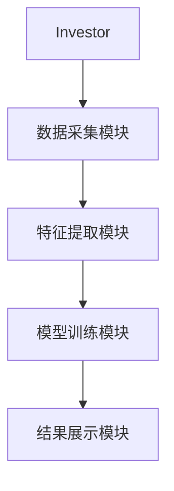

                 


# AI辅助的ESG投资影响评估

> 关键词：AI, ESG, 投资影响, 机器学习, 可持续投资

> 摘要：本文深入探讨了人工智能在ESG（环境、社会、治理）投资评估中的应用，从核心概念、算法原理到系统设计和项目实战，全面分析了AI辅助ESG评估的方法与实践。通过具体案例和代码实现，展示了如何利用AI技术提高ESG投资的准确性和效率，为投资者提供科学决策支持。

---

# 第一部分: ESG投资与AI辅助评估背景

## 第1章: ESG投资与AI辅助评估概述

### 1.1 ESG投资的基本概念

#### 1.1.1 环境（Environmental）因素
环境因素关注企业在资源利用、能源消耗、碳排放、污染等方面的表现，例如：
- CO2排放量
- 能源使用效率
- 环境合规性

#### 1.1.2 社会（Social）因素
社会因素关注企业在员工权益、社会责任、劳动条件等方面的表现，例如：
- 员工福利
- 社区贡献
- 产品安全

#### 1.1.3 治理（Governance）因素
治理因素关注企业在公司治理结构、董事会构成、管理层透明度等方面的表现，例如：
- 股权结构
- 董事会多样性
- 内部审计

### 1.2 AI在金融投资中的应用背景

#### 1.2.1 AI在金融分析中的作用
人工智能技术在金融领域的应用日益广泛，尤其是在数据处理、模式识别和预测分析方面具有显著优势。

#### 1.2.2 ESG投资的兴起与发展趋势
随着全球对可持续发展的关注，ESG投资逐渐成为主流。通过AI技术，可以更高效地分析和评估企业ESG表现。

#### 1.2.3 AI辅助ESG评估的必要性
传统ESG评估方法依赖人工分析，效率低且主观性强。AI技术可以显著提高评估的客观性和准确性。

### 1.3 本章小结

---

# 第二部分: AI辅助ESG评估的核心概念与联系

## 第2章: ESG评估的核心要素与数据结构

### 2.1 ESG评估的核心要素分析

#### 2.1.1 环境因素的关键指标
- CO2排放量
- 能源使用效率
- 环境合规性

#### 2.1.2 社会因素的关键指标
- 员工福利
- 社区贡献
- 产品安全

#### 2.1.3 治理因素的关键指标
- 股权结构
- 董事会多样性
- 内部审计

### 2.2 ESG数据的结构化与非结构化分析

#### 2.2.1 结构化数据的特征提取
- 结构化数据包括财务报表、公司公告等，可以通过统计方法提取特征。

#### 2.2.2 非结构化数据的处理方法
- 非结构化数据包括新闻、社交媒体信息，需要通过自然语言处理（NLP）提取情感和关键词。

#### 2.2.3 数据融合与关联分析
- 将结构化和非结构化数据融合，通过关联分析发现潜在关系。

### 2.3 ESG评估的核心概念ER实体关系图

```mermaid
er
actor: Investor
actor: ESG Data Provider
actor: AI Model
```

---

## 第3章: AI技术在ESG评估中的核心算法与流程

### 3.1 支持向量机（SVM）在ESG分类中的应用

#### 3.1.1 SVM算法的基本原理
支持向量机是一种监督学习算法，主要用于分类和回归问题。其核心思想是将数据映射到高维空间，找到一个超平面将数据分为两类。

#### 3.1.2 SVM在ESG评分中的应用流程
1. 数据预处理：标准化和归一化
2. 特征提取：选择关键ESG指标
3. 模型训练：使用SVM算法训练分类器
4. 结果评估：计算准确率、召回率和F1分数

#### 3.1.3 SVM算法的优缺点分析
- 优点：对小数据集表现优异，适合高维数据。
- 缺点：对大数据集性能下降，需要手动选择核函数和参数。

### 3.2 随机森林在ESG特征提取中的应用

#### 3.2.1 随机森林算法的基本原理
随机森林是一种集成学习算法，通过构建多个决策树并进行投票或平均来提高准确性和鲁棒性。

#### 3.2.2 随机森林在ESG数据中的特征重要性分析
1. 使用随机森林模型训练数据
2. 计算每个特征的重要性得分
3. 根据得分排序，筛选出最重要的特征

#### 3.2.3 随机森林算法的优缺点分析
- 优点：抗过拟合，适合高维数据。
- 缺点：计算复杂度较高，需要较多计算资源。

---

# 第三部分: 系统分析与架构设计

## 第4章: 系统功能设计与架构

### 4.1 问题场景介绍
- 数据来源：企业财报、新闻报道、社会责任报告
- 数据类型：结构化数据和非结构化数据
- 业务目标：通过AI模型评估企业的ESG表现

### 4.2 系统功能设计

#### 4.2.1 数据采集模块
- 功能：从多种数据源采集ESG相关数据
- 工具：网络爬虫、API接口

#### 4.2.2 特征提取模块
- 功能：对结构化和非结构化数据进行特征提取
- 工具：Python的scikit-learn库

#### 4.2.3 模型训练模块
- 功能：使用机器学习算法训练ESG评估模型
- 工具：随机森林、SVM等算法

#### 4.2.4 结果展示模块
- 功能：将模型评估结果以可视化形式展示
- 工具：数据可视化库（如Matplotlib、Seaborn）

### 4.3 系统架构设计



---

## 第5章: 项目实战

### 5.1 环境安装

```bash
pip install numpy
pip install pandas
pip install scikit-learn
pip install matplotlib
pip install seaborn
```

### 5.2 核心代码实现

```python
import numpy as np
import pandas as pd
from sklearn.model_selection import train_test_split
from sklearn.svm import SVC
from sklearn.ensemble import RandomForestClassifier
from sklearn.metrics import accuracy_score, recall_score, f1_score

# 数据加载
data = pd.read_csv('ESG_data.csv')

# 数据预处理
X = data.drop('label', axis=1)
y = data['label']

# 划分训练集和测试集
X_train, X_test, y_train, y_test = train_test_split(X, y, test_size=0.2, random_state=42)

# 模型训练
model_svm = SVC()
model_svm.fit(X_train, y_train)

model_rf = RandomForestClassifier()
model_rf.fit(X_train, y_train)

# 模型预测
y_pred_svm = model_svm.predict(X_test)
y_pred_rf = model_rf.predict(X_test)

# 模型评估
print("SVM Accuracy:", accuracy_score(y_test, y_pred_svm))
print("SVM Recall:", recall_score(y_test, y_pred_svm))
print("SVM F1:", f1_score(y_test, y_pred_svm))

print("RF Accuracy:", accuracy_score(y_test, y_pred_rf))
print("RF Recall:", recall_score(y_test, y_pred_rf))
print("RF F1:", f1_score(y_test, y_pred_rf))
```

---

## 第6章: 最佳实践与总结

### 6.1 小结
通过本文的介绍，我们详细探讨了AI技术在ESG投资评估中的应用，包括核心概念、算法原理和系统设计。通过具体案例和代码实现，展示了如何利用AI技术提高ESG投资的准确性和效率。

### 6.2 注意事项
- 数据质量：确保数据来源可靠，特征提取准确。
- 模型调优：通过交叉验证和网格搜索优化模型参数。
- 可解释性：关注模型的可解释性，避免“黑箱”问题。

### 6.3 未来展望
随着AI技术的不断发展，ESG投资评估将更加智能化和精准化。未来的研究方向包括：
- 更先进的模型算法
- 更高效的数据处理方法
- 更多的跨学科应用

---

# 作者：AI天才研究院/AI Genius Institute & 禅与计算机程序设计艺术 /Zen And The Art of Computer Programming

