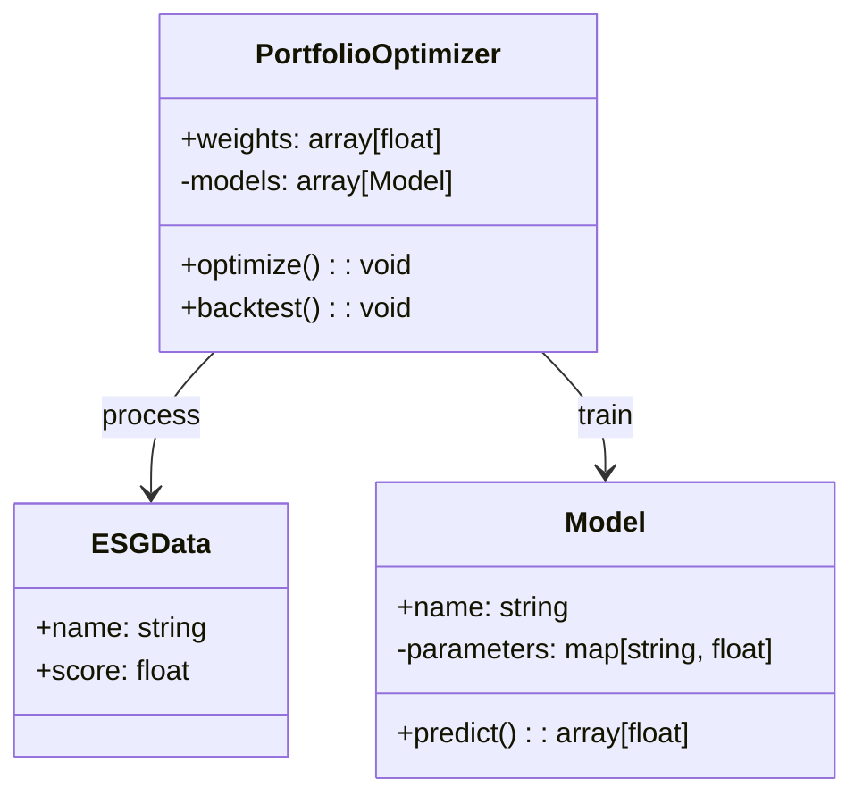
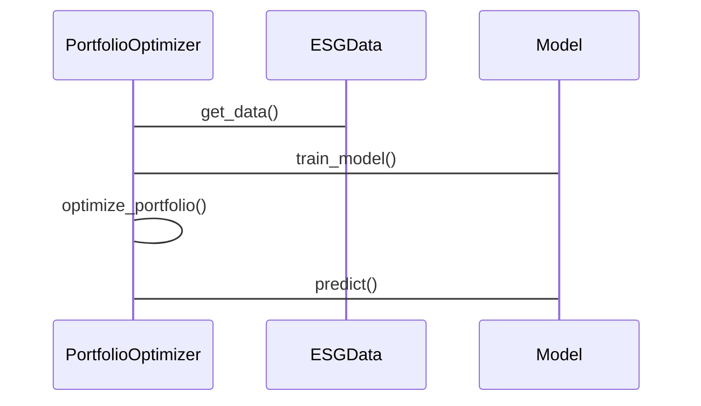

                 


# AI辅助的ESG投资组合优化与回测

---

## 关键词：
- ESG投资
- AI辅助
- 投资组合优化
- 数学模型
- 机器学习
- 强化学习
- 回测分析

---

## 摘要：
本文探讨了如何利用人工智能技术优化ESG投资组合，并通过回测验证其有效性和稳定性。首先，介绍了ESG投资的核心概念和AI在金融领域的应用潜力。其次，详细分析了ESG评分体系、投资组合优化的数学模型以及基于机器学习和强化学习的优化算法。然后，通过构建一个完整的AI辅助ESG投资系统，展示了系统架构设计、功能实现和实际案例分析。最后，总结了研究成果，并提出了未来的研究方向和实际应用建议。

---

## 第一部分: AI辅助的ESG投资组合优化与回测概述

---

## 第一章: ESG投资与AI辅助的背景

### 1.1 ESG投资的背景与意义

#### 1.1.1 ESG投资的定义与核心要素
ESG（Environmental, Social, Governance）投资是一种关注环境、社会和治理因素的可持续投资策略。其核心要素包括：
- **环境因素**：关注企业的碳排放、资源利用效率等。
- **社会因素**：关注企业的员工权益、社会责任等。
- **治理因素**：关注企业的公司治理结构、管理层透明度等。

ESG投资不仅关注财务回报，还关注企业的长期可持续发展能力。

#### 1.1.2 ESG投资的现状与发展趋势
随着全球对可持续发展的关注增加，ESG投资逐渐成为主流。根据相关数据显示，全球ESG投资规模在过去几年中快速增长，预计未来将继续保持增长趋势。

#### 1.1.3 AI技术在金融领域的应用潜力
人工智能技术在金融领域的应用广泛，包括股票预测、风险评估、投资组合优化等。AI技术的优势在于其强大的数据处理能力和自动化能力，能够帮助投资者更高效地优化投资组合。

---

### 1.2 AI辅助投资的基本概念

#### 1.2.1 AI在金融投资中的应用领域
- **股票预测**：利用机器学习模型预测股票价格走势。
- **风险评估**：通过AI技术评估投资组合的风险。
- **投资组合优化**：利用AI算法优化投资组合的收益与风险比。

#### 1.2.2 投资组合优化的数学模型与挑战
投资组合优化的核心目标是在给定风险水平下最大化收益，或者在给定收益下最小化风险。常见的优化模型包括均值-方差模型和均值-绝对偏差模型。

#### 1.2.3 ESG投资与传统投资的对比分析
与传统投资相比，ESG投资更加关注企业的长期可持续发展能力，而不仅仅是短期的财务回报。AI技术可以帮助投资者更好地平衡短期收益与长期可持续发展目标。

---

### 1.3 本章小结

#### 1.3.1 ESG投资的核心理念
ESG投资关注企业的环境、社会和治理因素，旨在实现长期可持续发展。

#### 1.3.2 AI辅助投资的主要优势
AI技术能够通过大数据分析和机器学习算法，帮助投资者更高效地优化投资组合。

#### 1.3.3 本书的研究目标与框架
本书旨在探讨如何利用AI技术优化ESG投资组合，并通过回测验证其有效性。文章结构包括背景介绍、核心概念、优化算法、系统架构和项目实战等内容。

---

## 第二部分: ESG投资组合优化的核心概念与模型

---

## 第二章: ESG评分与数据处理

### 2.1 ESG评分体系

#### 2.1.1 ESG评分的定义与计算方法
ESG评分是通过对企业环境、社会和治理表现的量化评估得出的。常见的评分方法包括加权平均法和因子分析法。

#### 2.1.2 主流ESG评分机构与标准对比
- **MSCI**：全球领先的ESG评分机构，提供详细的ESG评级报告。
- **Sustainalytics**：专注于企业可持续性分析，提供ESG评分和风险评估服务。
- **Dow Jones**：提供ESG指数和相关分析工具。

#### 2.1.3 数据清洗与预处理流程
- 数据清洗：去除缺失值、异常值和重复值。
- 数据标准化：将不同来源的数据统一到相同的尺度。
- 数据特征提取：通过主成分分析（PCA）提取关键特征。

---

### 2.2 投资组合优化的数学模型

#### 2.2.1 Markowitz现代投资组合理论
Markowitz提出的均值-方差模型是投资组合优化的基础。目标函数为：
$$
\min_{w} \sigma^2 = w^T \Sigma w
$$
约束条件为：
$$
\sum_{i=1}^n w_i = 1
$$
其中，$w$为权重向量，$\Sigma$为资产间的协方差矩阵。

#### 2.2.2 基于ESG因子的优化模型
在传统投资组合优化模型的基础上，加入ESG因子作为约束条件：
$$
\max_{w} \mu^T w \\
\text{subject to} \\
\sum_{i=1}^n w_i = 1 \\
\sum_{i=1}^n w_i \cdot ESG_i = t
$$
其中，$\mu$为收益向量，$ESG_i$为第$i$个资产的ESG评分，$t$为目标ESG评分总和。

#### 2.2.3 数据特征与投资收益的关系
通过回归分析可以发现，较高的ESG评分通常与较低的波动性和较高的长期收益相关。

---

### 2.3 数据特征与属性分析

#### 2.3.1 ESG数据的特征提取方法
- **主成分分析（PCA）**：用于提取数据中的主要特征。
- **因子分析**：用于识别数据中的潜在因子。

#### 2.3.2 数据特征与投资收益的关系
通过统计分析发现，ESG评分较高的企业通常具有较低的财务风险和较高的长期收益。

#### 2.3.3 数据标准化与归一化处理
为了消除不同特征量纲的影响，需要对数据进行标准化或归一化处理。常用的标准化方法包括Z-score标准化和Min-Max归一化。

---

## 第三章: AI辅助的ESG投资组合优化算法

### 3.1 基于机器学习的优化方法

#### 3.1.1 线性回归与分类模型的应用
- **线性回归**：用于预测资产的未来收益。
- **分类模型**：用于预测资产的涨跌趋势。

#### 3.1.2 支持向量机在投资组合优化中的应用
支持向量机（SVM）可以用于分类和回归任务。在投资组合优化中，可以用于预测资产的收益和风险。

#### 3.1.3 集成学习算法的优化策略
集成学习通过组合多个模型的预测结果，可以提高预测的准确性和稳定性。

---

### 3.2 基于强化学习的优化方法

#### 3.2.1 强化学习的基本原理与框架
强化学习通过智能体与环境的交互，学习最优策略。在投资组合优化中，智能体可以根据当前的市场状态，选择最优的投资组合。

#### 3.2.2 在投资组合优化中的应用案例
通过强化学习算法，可以实现动态投资组合优化，适应市场的变化。

#### 3.2.3 策略优化与状态空间设计
- **状态空间**：包括当前的市场状态、资产价格等信息。
- **动作空间**：包括买入、卖出、持有等操作。

---

### 3.3 算法对比与选择策略

#### 3.3.1 不同算法的优缺点分析
- **机器学习**：适用于数据驱动的任务，但需要大量的数据支持。
- **强化学习**：适用于动态环境中的优化任务，但需要复杂的策略设计。

#### 3.3.2 算法选择的依据与标准
- **数据特性**：根据数据的特性和规模选择合适的算法。
- **任务需求**：根据优化目标和约束条件选择合适的算法。

#### 3.3.3 实际场景中的算法组合应用
通过组合不同的算法，可以实现更复杂的优化任务。

---

## 第四章: 投资组合优化的数学模型与公式

### 4.1 Markowitz现代投资组合理论

#### 4.1.1 均值-方差优化模型
$$
\min_{w} w^T \Sigma w \\
\text{subject to} \\
\sum_{i=1}^n w_i = 1
$$

### 4.2 基于ESG因子的优化模型

#### 4.2.1 带约束的优化模型
$$
\max_{w} \mu^T w \\
\text{subject to} \\
\sum_{i=1}^n w_i = 1 \\
\sum_{i=1}^n w_i \cdot ESG_i = t
$$

### 4.3 强化学习优化模型

#### 4.3.1 状态空间与动作空间定义
- **状态空间**：当前的市场状态，包括资产价格、市场趋势等。
- **动作空间**：包括买入、卖出、持有等操作。

---

## 第五章: 系统架构与实现

### 5.1 问题场景介绍

#### 5.1.1 投资组合优化的场景描述
投资者希望在考虑ESG因素的情况下，优化投资组合的收益与风险比。

#### 5.1.2 系统目标与功能需求
- **目标**：实现基于AI的ESG投资组合优化。
- **功能需求**：包括数据采集、模型训练、优化计算和结果展示。

---

### 5.2 系统功能设计

#### 5.2.1 领域模型（mermaid类图）


---

### 5.3 系统架构设计

#### 5.3.1 系统架构图（mermaid架构图）
```mermaid
container ESG Investment System {
    PortfolioOptimizer
    ESGData
    Model
}
PortfolioOptimizer --> ESGData: process
PortfolioOptimizer --> Model: train
```

---

### 5.4 系统接口设计

#### 5.4.1 API接口定义
- **数据接口**：用于获取ESG评分数据。
- **优化接口**：用于执行投资组合优化。
- **回测接口**：用于进行回测分析。

#### 5.4.2 接口交互流程（mermaid序列图）


---

## 第六章: 项目实战

### 6.1 环境安装与配置

#### 6.1.1 环境搭建
- **Python**：安装Python 3.8及以上版本。
- **库依赖**：安装numpy、pandas、scikit-learn、tensorflow等库。

#### 6.1.2 数据获取
从ESG评分机构获取相关数据，并进行清洗和预处理。

---

### 6.2 核心实现

#### 6.2.1 数据处理代码
```python
import pandas as pd
import numpy as np

# 数据清洗
data = pd.read_csv('esg_data.csv')
data = data.dropna().reset_index(drop=True)

# 数据标准化
from sklearn.preprocessing import StandardScaler
scaler = StandardScaler()
data_scaled = scaler.fit_transform(data)
```

#### 6.2.2 模型训练代码
```python
from sklearn.svm import SVC
from sklearn.model_selection import train_test_split

X_train, X_test, y_train, y_test = train_test_split(data_scaled, labels, test_size=0.2)
model = SVC()
model.fit(X_train, y_train)
```

---

### 6.3 案例分析与结果解读

#### 6.3.1 实际案例分析
通过具体案例分析，验证优化算法的有效性。

#### 6.3.2 结果解读
通过回测分析，验证优化后的投资组合是否实现了预期的收益和风险目标。

---

## 第七章: 总结与展望

### 7.1 总结

#### 7.1.1 核心观点回顾
- ESG投资关注企业的长期可持续发展。
- AI技术能够帮助投资者更高效地优化投资组合。

#### 7.1.2 研究成果与局限性
- 成功实现了一个基于AI的ESG投资组合优化系统。
- 当前算法在动态市场中的适应性仍需进一步研究。

---

### 7.2 展望

#### 7.2.1 未来研究方向
- 研究更复杂的强化学习算法。
- 探索多目标优化方法。

#### 7.2.2 实际应用建议
- 在实际应用中，建议结合市场环境和投资者风险偏好，灵活调整优化策略。

---

## 作者：AI天才研究院/AI Genius Institute & 禅与计算机程序设计艺术 /Zen And The Art of Computer Programming

