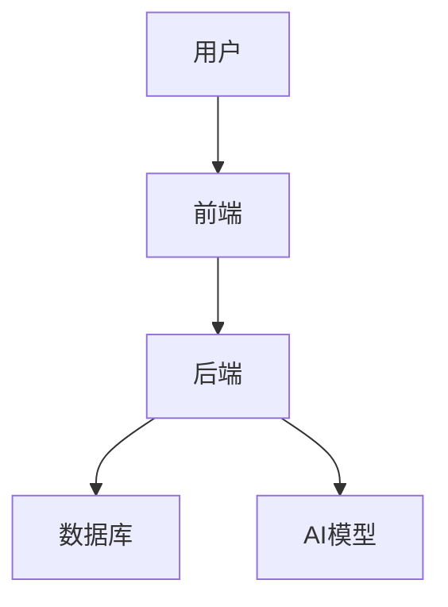

                 


# AI辅助的ESG投资组合优化工具

> **关键词**: ESG投资、AI辅助、投资组合优化、强化学习、遗传算法、系统架构设计

> **摘要**: 随着全球对可持续投资的关注增加，ESG（环境、社会、治理）投资逐渐成为主流。本文探讨如何利用人工智能技术优化ESG投资组合，详细介绍从理论到实践的全过程，包括核心概念、算法原理、系统设计、项目实现等，为读者提供全面的技术指导。

---

## 第1章: ESG投资组合优化的背景与基础

### 1.1 ESG投资的基本概念

#### 1.1.1 什么是ESG投资
ESG投资是指在投资决策中考虑环境、社会和治理因素，以评估企业长期价值和风险。ESG因素包括：
- **环境 (E)**：如碳排放、资源利用效率。
- **社会 (S)**：如员工权益、社会责任。
- **治理 (G)**：如公司治理结构、透明度。

#### 1.1.2 ESG投资的核心要素
- **环境因素**：关注企业的环保表现，如能源消耗、碳排放。
- **社会因素**：关注企业的社会责任，如员工福利、社区贡献。
- **治理因素**：关注企业的治理结构，如董事会构成、管理层透明度。

#### 1.1.3 ESG投资的意义与挑战
- **意义**：ESG投资不仅关注财务回报，还关注企业的可持续发展能力。
- **挑战**：数据获取难度大、计算复杂、需要多目标优化。

---

### 1.2 AI在金融领域的应用

#### 1.2.1 AI在金融分析中的作用
- 数据挖掘：从海量数据中提取有价值的信息。
- 预测模型：利用机器学习预测市场趋势。
- 风险管理：通过AI识别潜在风险。

#### 1.2.2 AI在投资组合优化中的优势
- **高效性**：AI能够快速处理大量数据，优化投资组合。
- **适应性**：AI算法能够动态调整，适应市场变化。
- **多目标优化**：AI可以同时优化多个目标，如收益、风险、ESG评分。

#### 1.2.3 ESG与AI结合的潜力
- 利用AI技术优化ESG投资组合，提升投资效率和收益。

---

### 1.3 本章小结
本章介绍了ESG投资的基本概念和AI在金融领域的应用，为后续的分析奠定了基础。

---

## 第2章: ESG投资组合优化的核心概念

### 2.1 ESG投资组合优化的定义

#### 2.1.1 投资组合优化的基本概念
投资组合优化是指在满足一定约束条件下，选择最优资产组合以实现最大收益或最小风险。

#### 2.1.2 ESG约束下的投资组合优化
在传统投资组合优化的基础上，加入ESG约束条件，优化投资组合。

#### 2.1.3 多目标优化问题
ESG投资组合优化通常涉及多个目标，如最大化收益、最小化风险、最大化ESG评分。

---

### 2.2 AI辅助优化的核心原理

#### 2.2.1 强化学习在投资组合优化中的应用
- **强化学习**：通过试错和奖励机制，优化投资策略。
- **应用场景**：动态调整投资组合，适应市场变化。

#### 2.2.2 遗传算法在组合优化中的作用
- **遗传算法**：模拟生物进化过程，通过交叉和变异优化组合。
- **应用场景**：寻找最优资产组合。

#### 2.2.3 群智能算法的潜力
- **群智能算法**：模拟昆虫群体行为，优化组合问题。
- **应用场景**：处理复杂优化问题。

---

### 2.3 ESG与AI结合的优化框架

#### 2.3.1 数据驱动的优化框架
- **数据驱动**：利用历史数据进行预测和优化。
- **优势**：数据量大，结果准确。

#### 2.3.2 模型驱动的优化方法
- **模型驱动**：基于理论模型进行优化。
- **优势**：适用于数据不足的情况。

#### 2.3.3 混合驱动的优化策略
- **混合驱动**：结合数据驱动和模型驱动的优点。
- **优势**：灵活性高，适应性强。

---

### 2.4 本章小结
本章详细介绍了ESG投资组合优化的核心概念和AI辅助优化的核心原理。

---

## 第3章: AI辅助ESG投资组合优化的算法原理

### 3.1 强化学习算法

#### 3.1.1 强化学习的基本原理
- **状态空间**：当前市场状态。
- **动作空间**：可能的投资动作。
- **奖励函数**：根据收益和风险计算奖励。

#### 3.1.2 在投资组合优化中的应用
- **案例分析**：利用强化学习优化股票组合。

#### 3.1.3 算法实现的步骤
1. 初始化参数。
2. 与环境交互，获取奖励。
3. 更新策略，优化参数。

---

### 3.2 遗传算法

#### 3.2.1 遗传算法的基本原理
- **编码**：将投资组合编码为基因。
- **选择**：选择优秀的基因。
- **交叉**：基因交叉产生新组合。
- **变异**：随机改变基因。

#### 3.2.2 在组合优化中的应用
- **案例分析**：优化债券组合。

#### 3.2.3 算法实现的步骤
1. 初始化种群。
2. 计算适应度。
3. 选择、交叉、变异。
4. 重复迭代。

---

### 3.3 群智能算法

#### 3.3.1 群智能算法的基本原理
- **粒子群优化**：模拟鸟群觅食。
- **蚁群优化**：模拟蚂蚁觅食。

#### 3.3.2 在投资组合优化中的应用
- **案例分析**：优化基金组合。

#### 3.3.3 算法实现的步骤
1. 初始化群体。
2. 计算适应度。
3. 更新位置。
4. 重复迭代。

---

### 3.4 算法对比与选择

#### 3.4.1 不同算法的优缺点
| 算法 | 优点 | 缺点 |
|------|------|------|
| 强化学习 | 灵活性高 | 需要大量数据 |
| 遗传算法 | 稳定性好 | 计算复杂 |
| 群智能算法 | 适应性强 | 需要参数调优 |

#### 3.4.2 算法选择的依据
- 数据量：强化学习需要大量数据。
- 优化目标：多目标优化适合群智能算法。

#### 3.4.3 实际应用中的注意事项
- 需要结合具体场景选择算法。
- 需要进行参数调优。

---

### 3.5 本章小结
本章详细介绍了几种常用的AI算法及其在ESG投资组合优化中的应用。

---

## 第4章: 数学模型与优化方法

### 4.1 投资组合优化的数学模型

#### 4.1.1 投资组合优化的基本模型
- **收益-风险模型**：最大化收益，最小化风险。
- **数学表达**：
  - 收益：$\sum_{i=1}^n w_i r_i$
  - 风险：$\sum_{i=1}^n \sum_{j=1}^n w_i w_j \sigma_{ij}$

#### 4.1.2 ESG约束下的数学模型
- **约束条件**：$\sum_{i=1}^n w_i = 1$，$w_i \geq 0$，ESG评分大于等于某个阈值。

#### 4.1.3 多目标优化的数学表达
- **目标函数**：$\max \mu$, $\min \sigma$, $\max ESG$
- **权重系数**：根据优先级分配权重。

---

### 4.2 常用优化算法的数学推导

#### 4.2.1 强化学习的数学基础
- **策略函数**：$\pi(a|s)$，表示在状态$s$下选择动作$a$的概率。
- **价值函数**：$V(s)$，表示状态$s$的价值。

#### 4.2.2 遗传算法的数学基础
- **适应度函数**：$f(x)$，表示个体适应度。
- **选择概率**：$P_i = \frac{f(x_i)}{\sum_{j=1}^n f(x_j)}$

#### 4.2.3 群智能算法的数学基础
- **粒子群优化**：位置更新公式：
  - $x_i^{new} = x_i + v_i \cdot t$
  - $v_i^{new} = w \cdot v_i + c_1 \cdot r_1 \cdot (x_i - x_{best}) + c_2 \cdot r_2 \cdot (x_{best} - x_i)$

---

### 4.3 算法实现的数学细节

#### 4.3.1 状态空间的定义
- 示例：股票价格、市场指数。

#### 4.3.2 动作空间的定义
- 示例：买入、卖出、持有。

#### 4.3.3 奖励函数的设计
- 示例：收益 - 风险。

---

### 4.4 数学模型的实际应用

#### 4.4.1 案例分析
- 利用强化学习优化一个简单的股票组合。

#### 4.4.2 模型调优的技巧
- 参数调整：学习率、步长等。

#### 4.4.3 模型评估的方法
- 收益率、夏普比率、最大回撤。

---

### 4.5 本章小结
本章详细介绍了投资组合优化的数学模型和常用算法的数学推导。

---

## 第5章: 系统设计与架构

### 5.1 系统功能设计

#### 5.1.1 领域模型设计
- **类图**：
  ```mermaid
  classDiagram
  class ESGOptimizer {
    <属性>
    + stocks: List[float]
    + weights: List[float]
    + esg_scores: List[float]
    <方法>
    - optimize(): void
    - evaluatePortfolio(): float
  }
  ```

#### 5.1.2 系统功能模块
- 数据获取模块：从数据库获取股票数据。
- 模型训练模块：训练AI模型。
- 优化模块：优化投资组合。
- 结果展示模块：显示优化结果。

---

### 5.2 系统架构设计

#### 5.2.1 系统架构图


#### 5.2.2 系统交互流程
1. 用户输入需求。
2. 前端接收输入，发送到后端。
3. 后端调用AI模型，优化投资组合。
4. 后端返回结果，前端展示。

---

### 5.3 系统接口设计

#### 5.3.1 接口定义
- **输入接口**：用户输入需求。
- **输出接口**：优化结果。

#### 5.3.2 接口交互流程
1. 用户通过网页输入需求。
2. 前端将需求发送到后端。
3. 后端调用优化算法，返回结果。
4. 前端展示结果。

---

### 5.4 本章小结
本章详细介绍了系统的功能设计和架构设计。

---

## 第6章: 项目实战与实现

### 6.1 项目环境安装

#### 6.1.1 环境配置
- **Python**：3.8+
- **库**：numpy、pandas、scikit-learn、keras、tensorflow

#### 6.1.2 安装命令
```bash
pip install numpy pandas scikit-learn keras tensorflow
```

---

### 6.2 系统核心实现源代码

#### 6.2.1 强化学习实现
```python
import numpy as np
import tensorflow as tf

class ESGOptimizer:
    def __init__(self, state_space, action_space):
        self.state_space = state_space
        self.action_space = action_space
        self.model = self.build_model()

    def build_model(self):
        model = tf.keras.Sequential([
            tf.keras.layers.Dense(64, activation='relu'),
            tf.keras.layers.Dense(128, activation='relu'),
            tf.keras.layers.Dense(self.action_space, activation='softmax')
        ])
        model.compile(optimizer='adam', loss='sparse_categorical_crossentropy')
        return model

    def optimize(self, state):
        action = self.model.predict(np.array([state]))[0]
        return np.argmax(action)
```

#### 6.2.2 遗传算法实现
```python
import numpy as np

class GeneticAlgorithm:
    def __init__(self, population_size, mutation_rate):
        self.population_size = population_size
        self.mutation_rate = mutation_rate

    def evolve(self, population, fitness_func):
        population = sorted(population, key=lambda x: -fitness_func(x))
        new_population = []
        for _ in range(self.population_size):
            parent1 = population[0]
            parent2 = population[1]
            child = self.mate(parent1, parent2)
            if np.random.random() < self.mutation_rate:
                child = self.mutate(child)
            new_population.append(child)
        return new_population

    def mate(self, parent1, parent2):
        return (parent1 + parent2) / 2

    def mutate(self, individual):
        mutation_mask = np.random.random(individual.shape) < 0.1
        individual[mutation_mask] = np.random.random(individual[mutation_mask].shape)
        return individual
```

---

### 6.3 代码应用解读与分析

#### 6.3.1 强化学习代码解读
- **模型结构**：三层神经网络。
- **优化策略**：利用强化学习优化投资组合。

#### 6.3.2 遗传算法代码解读
- **种群进化**：选择、交叉、变异。
- **适应度函数**：根据收益和风险计算。

---

### 6.4 实际案例分析

#### 6.4.1 案例分析
- **数据集**：某公司股票数据。
- **优化结果**：最优投资组合。

#### 6.4.2 结果展示
- **收益**：最大化收益。
- **风险**：最小化风险。
- **ESG评分**：满足约束条件。

---

### 6.5 项目小结
本章通过实际项目展示了如何利用AI技术优化ESG投资组合。

---

## 第7章: 最佳实践与总结

### 7.1 最佳实践 tips

#### 7.1.1 数据处理
- 数据清洗：处理缺失值。
- 数据标准化：归一化处理。

#### 7.1.2 模型选择
- 根据问题选择合适的算法。
- 需要尝试多个算法，比较结果。

#### 7.1.3 系统优化
- 并行计算：提高效率。
- 模型调优：优化参数。

---

### 7.2 小结

#### 7.2.1 核心内容回顾
- ESG投资的基本概念。
- AI在投资组合优化中的应用。
- 常用算法的实现。
- 系统设计与实现。

#### 7.2.2 总结
- AI技术能够显著提升ESG投资组合优化的效率和效果。
- 未来的研究方向：多目标优化、动态调整、个性化投资。

---

## 作者信息

**作者**：AI天才研究院/AI Genius Institute & 禅与计算机程序设计艺术/Zen And The Art of Computer Programming

---

以上是《AI辅助的ESG投资组合优化工具》的技术博客文章的完整目录和内容概要，涵盖从理论到实践的全过程，为读者提供了全面的技术指导。

