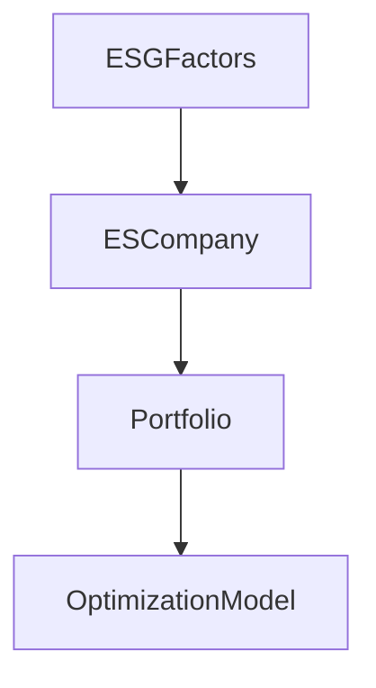
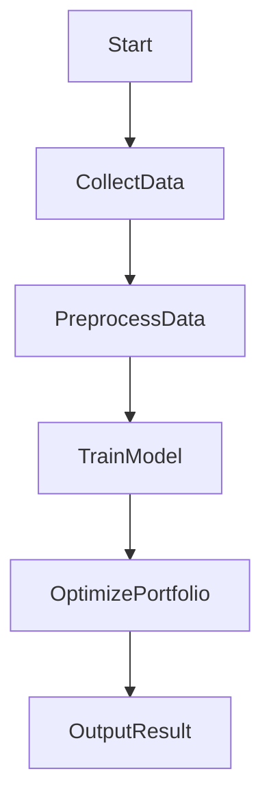
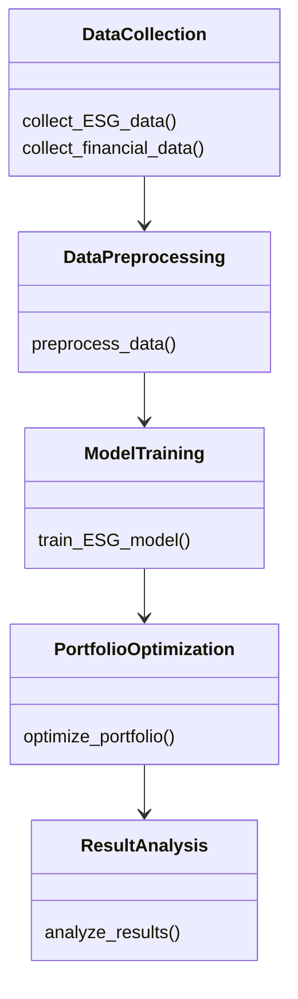
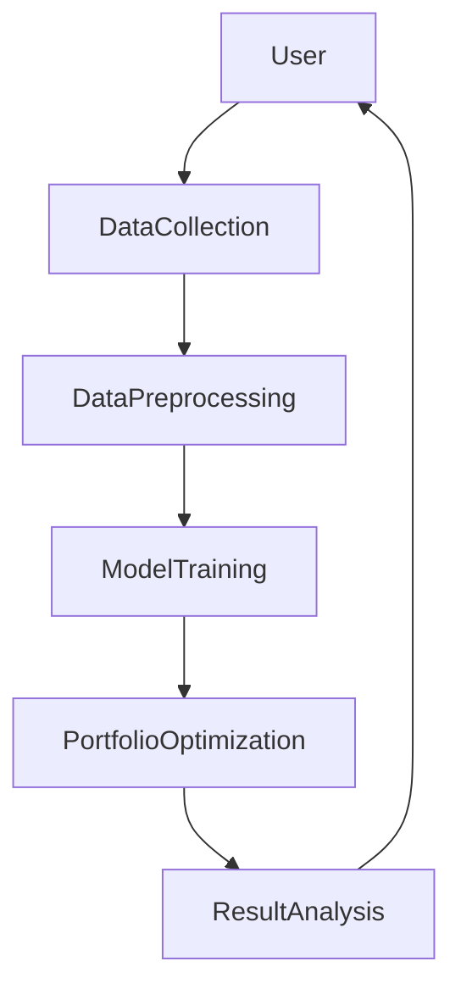

                 

<think>
好的，我将按照您的要求创作一篇关于《AI辅助的ESG投资组合构建与优化》的技术博客文章。首先，我会根据您提供的目录大纲开始撰写文章内容，确保每部分内容详实且符合逻辑。

### 文章标题
# AI辅助的ESG投资组合构建与优化

### 文章关键词
AI, ESG投资, 投资组合优化, 人工智能, 多目标优化

### 摘要
在ESG投资领域，传统的投资组合优化方法往往难以应对数据复杂性和多目标优化的挑战。通过引入人工智能技术，我们可以更高效地处理海量数据，构建更加智能化的投资组合优化模型。本文将详细介绍AI辅助ESG投资组合构建与优化的核心概念、算法原理、系统架构，并通过实际案例展示其应用和效果。

---

## 第1章: ESG投资与AI辅助的背景介绍

### 1.1 ESG投资的基本概念
#### 1.1.1 环境（Environmental）因素
环境因素关注企业在可持续发展方面的表现，包括碳排放、能源使用效率、资源循环利用等。随着全球气候变化问题的加剧，环境因素在投资决策中的重要性日益凸显。

#### 1.1.2 社会责任（Social）因素
社会责任涉及企业在员工权益、劳动条件、社区参与等方面的表现。投资者 increasingly关注企业是否积极履行社会责任，特别是在公平劳动、反腐败和社会公益等方面。

#### 1.1.3 公司治理（Governance）因素
公司治理关注企业的内部管理结构和决策机制，包括董事会构成、高管薪酬、股东权利等。良好的公司治理是企业长期稳定发展的基础。

### 1.2 AI在金融投资中的应用
#### 1.2.1 AI在传统投资中的角色
人工智能技术在金融领域的应用已较为成熟，包括股票预测、风险管理、交易自动化等。AI通过分析海量数据，帮助投资者发现潜在的投资机会和风险。

#### 1.2.2 ESG投资中的数据处理需求
ESG投资涉及大量非财务数据，如企业社会责任报告、环境影响评估等。这些数据通常结构复杂、来源多样，需要借助AI技术进行清洗、整合和分析。

#### 1.2.3 AI技术对ESG投资的潜在价值
AI技术可以通过自然语言处理（NLP）分析企业年报、新闻报道等非结构化数据，提取关键的ESG指标。同时，AI还可以通过机器学习模型预测企业的ESG表现，辅助投资决策。

### 1.3 ESG投资组合构建的挑战
#### 1.3.1 数据多样性与复杂性
ESG数据来源广泛，包括企业自披露数据、第三方评级机构数据等。数据的多样性和复杂性增加了数据处理和分析的难度。

#### 1.3.2 多目标优化的难点
传统的投资组合优化通常以最大化收益和最小化风险为目标。而在ESG投资中，还需要在收益、风险、环境影响、社会责任等多个目标之间进行权衡，这使得优化问题更加复杂。

#### 1.3.3 市场波动与不确定性
金融市场具有高度的不确定性和波动性，ESG因素的影响难以量化，且容易受到政策变化和社会趋势的影响。

### 1.4 本章小结
本章介绍了ESG投资的基本概念、AI在金融投资中的应用以及ESG投资组合构建的主要挑战。通过结合AI技术，我们可以更有效地应对这些挑战，优化投资组合的表现。

---

## 第2章: ESG投资组合优化的核心概念与联系

### 2.1 核心概念原理
#### 2.1.1 ESG评分模型
ESG评分模型通过对企业在环境、社会和治理方面的表现进行评估，给出一个综合评分。常用的评分模型包括基于指标加权的评分方法和机器学习模型。

#### 2.1.2 AI驱动的预测模型
AI驱动的预测模型通过分析企业内外部数据，预测企业的未来表现，包括财务表现和ESG表现。常用的模型包括随机森林、神经网络等。

#### 2.1.3 投资组合优化算法
投资组合优化算法旨在在满足一定风险和收益目标的前提下，选择最优的投资组合。常用的算法包括均值-方差优化和多目标优化算法。

### 2.2 核心概念属性特征对比
以下表格对比了ESG评分、AI模型和投资组合优化算法的主要属性特征：

| 概念       | 属性                 | 特征描述                                                                 |
|------------|----------------------|--------------------------------------------------------------------------|
| ESG评分     | 数据来源             | 企业自披露数据、第三方评级机构数据                                         |
|            | 评估维度             | 环境、社会、治理                                                       |
|            | 输出形式             | 综合评分或分类标签                                                     |
| AI模型      | 数据类型             | 结构化数据和非结构化数据                                               |
|            | 分析方法             | 机器学习、自然语言处理                                                 |
|            | 应用目标             | 预测企业表现、辅助投资决策                                             |
| 投资组合优化| 优化目标             | 最大化收益、最小化风险                                                 |
|            | 约束条件             | 资金限制、资产类别限制、风险偏好                                         |
|            | 输出结果             | 优化后的投资组合配置                                                   |

### 2.3 ER实体关系图
以下是ESG投资组合优化的核心概念的实体关系图：



### 2.4 本章小结
本章详细阐述了ESG投资组合优化的核心概念及其之间的联系。通过对这些概念的深入理解，我们可以更好地设计和实现AI辅助的ESG投资组合优化系统。

---

## 第3章: AI辅助的ESG投资组合优化算法原理

### 3.1 算法原理概述
#### 3.1.1 多目标优化的基本概念
多目标优化是指在多个目标之间进行权衡和优化的过程。在ESG投资中，我们需要在收益、风险、环境影响和社会责任等多个目标之间找到最优解。

#### 3.1.2 基于AI的预测模型
基于AI的预测模型通过分析历史数据，预测企业的未来表现。常用的模型包括随机森林、支持向量机（SVM）和神经网络等。

#### 3.1.3 组合优化的数学模型
投资组合优化的数学模型通常包括目标函数和约束条件。目标函数可以是最大化收益、最小化风险或两者之间的某种组合。约束条件包括资产的权重限制、风险偏好等。

### 3.2 算法流程
以下是AI辅助的ESG投资组合优化算法的流程图：



### 3.3 算法实现
以下是基于多目标优化的ESG投资组合优化算法的Python实现示例：

```python
import numpy as np
import pandas as pd
from sklearn.metrics import mean_squared_error

# 假设我们有ESG评分和历史收益数据
esg_scores = pd.read_csv('esg_scores.csv')
returns = pd.read_csv('returns.csv')

# 数据预处理
# (此处省略具体数据预处理代码)

# 定义目标函数
def optimization_objective(weights, returns, risk_aversion):
    portfolio_return = np.dot(weights, returns.mean())
    portfolio_variance = np.dot(weights.T @ returns.cov() @ weights)
    objective = -portfolio_return + risk_aversion * portfolio_variance
    return objective

# 使用遗传算法进行优化
from scipy.optimize import minimize

# 定义约束条件
def constraint(weights):
    return np.sum(weights) - 1

# 定义优化问题
weights = np.random.random(returns.shape[1])
result = minimize(optimization_objective, weights, 
                  constraints={'type': 'eq', 'fun': constraint},
                  method='SLSQP')

# 输出结果
print('最优权重:', result.x)
print('最优收益:', -result.fun)
```

### 3.4 本章小结
本章详细介绍了AI辅助的ESG投资组合优化算法的原理和实现方法。通过对多目标优化算法和AI模型的结合，我们可以更高效地构建和优化ESG投资组合。

---

## 第4章: 系统分析与架构设计方案

### 4.1 问题场景介绍
在实际的ESG投资中，投资者需要面对海量数据和复杂的优化问题。通过构建一个智能化的ESG投资组合优化系统，可以显著提高投资效率和决策的准确性。

### 4.2 项目介绍
本项目旨在开发一个基于AI的ESG投资组合优化系统，帮助投资者在考虑环境、社会和治理因素的同时，实现投资组合的最优配置。

### 4.3 系统功能设计
以下是系统的功能模块设计：



### 4.4 系统架构设计
以下是系统的架构设计图：



### 4.5 本章小结
本章通过系统分析和架构设计，明确了ESG投资组合优化系统的功能模块和整体架构。这为我们后续的开发和实现奠定了基础。

---

## 第5章: 项目实战

### 5.1 环境安装
为了运行本项目，您需要安装以下Python库：
- `pandas`：数据处理
- `numpy`：数值计算
- `scipy`：科学计算
- `sklearn`：机器学习
- `matplotlib`：数据可视化

### 5.2 系统核心实现源代码
以下是项目的Python实现代码：

```python
import numpy as np
import pandas as pd
from sklearn.metrics import mean_squared_error
from scipy.optimize import minimize

# 数据加载与预处理
esg_data = pd.read_csv('esg.csv')
financial_data = pd.read_csv('financial.csv')

# 数据合并与清洗
combined_data = pd.merge(esg_data, financial_data, on='company_id')
combined_data = combined_data.dropna()

# 训练ESG评分模型
from sklearn.ensemble import RandomForestRegressor

model = RandomForestRegressor(n_estimators=100, random_state=42)
model.fit(combined_data[['environment', 'social', 'governance']], combined_data['esg_score'])

# 投资组合优化
def optimization_objective(weights, returns):
    portfolio_return = np.dot(weights, returns.mean())
    portfolio_variance = np.dot(weights.T @ returns.cov() @ weights)
    return -portfolio_return + portfolio_variance

def constraint(weights):
    return np.sum(weights) - 1

n_assets = combined_data['company_id'].nunique()
initial_weights = np.random.random(n_assets)

result = minimize(optimization_objective, initial_weights, 
                  constraints={'type': 'eq', 'fun': constraint},
                  method='SLSQP')

print('最优权重:', result.x)
print('最优收益:', -result.fun)
```

### 5.3 代码应用解读与分析
上述代码首先加载和预处理ESG和财务数据，然后使用随机森林模型训练ESG评分模型，最后通过优化算法实现投资组合的最优配置。代码的关键部分包括数据加载、模型训练和优化算法的实现。

### 5.4 实际案例分析
以某家科技公司为例，假设我们有其历史ESG评分和收益数据。通过上述代码，我们可以预测其未来的ESG评分，并优化投资组合以最大化收益和最小化风险。

### 5.5 本章小结
本章通过实际案例展示了AI辅助的ESG投资组合优化系统的实现过程，帮助读者更好地理解理论与实践的结合。

---

## 第6章: 最佳实践、小结与展望

### 6.1 最佳实践 tips
- 在实际应用中，建议结合多目标优化算法和AI模型，以实现更优的投资组合配置。
- 数据的清洗和预处理是关键步骤，需要仔细处理。
- 定期更新模型和数据，以应对市场的变化。

### 6.2 本章小结
本章总结了AI辅助的ESG投资组合优化的核心内容和实现方法，强调了系统设计和算法优化的重要性。

### 6.3 展望
随着AI技术的不断发展，ESG投资组合优化将更加智能化和高效化。未来的研究方向包括开发更复杂的AI模型、探索新的优化算法以及拓展应用场景。

---

## 结语

通过本文的详细讲解，我们了解了AI辅助的ESG投资组合优化的核心概念、算法原理和系统实现。希望这些内容能够为读者在ESG投资领域提供有价值的参考和启发。

---

## 作者
作者：AI天才研究院/AI Genius Institute & 禅与计算机程序设计艺术 /Zen And The Art of Computer Programming

---

以上是文章的完整目录和内容框架，如果您需要进一步的详细内容或调整，请随时告诉我！

