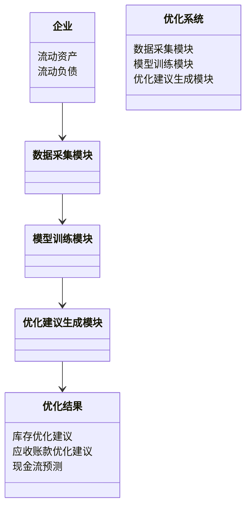
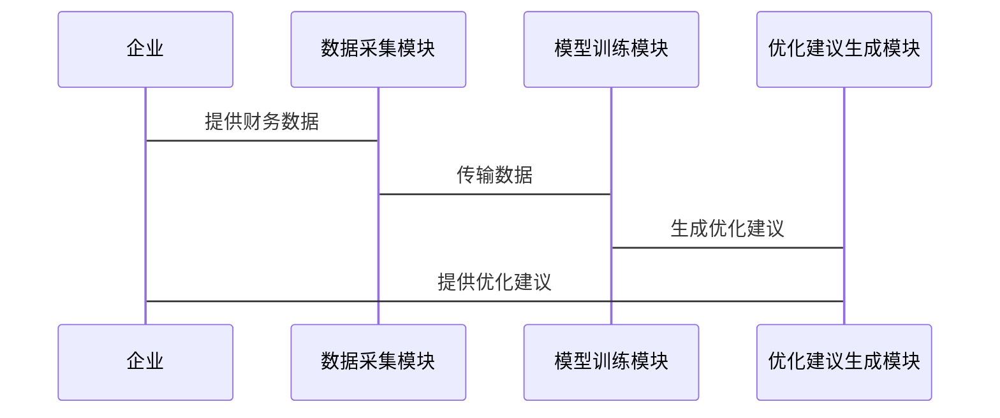

                 


# AI辅助的企业Working Capital优化

> 关键词：AI技术，企业财务管理，Working Capital优化，机器学习，财务数据分析

> 摘要：本文探讨了如何利用AI技术优化企业Working Capital，涵盖AI在企业财务管理中的应用、优化的核心概念、算法原理、系统架构设计、项目实战以及最佳实践。通过详细分析，本文为读者提供了AI辅助企业Working Capital优化的全面指南。

---

# 第一部分: 背景与概念

## 第1章: 企业Working Capital概述

### 1.1 Working Capital的定义与重要性

#### 1.1.1 Working Capital的定义
Working Capital，即营运资本，是指企业在日常运营中使用的流动资产减去流动负债的部分。公式为：
$$ \text{Working Capital} = \text{流动资产} - \text{流动负债} $$

#### 1.1.2 Working Capital在企业运营中的作用
- 支持日常运营：确保企业有足够的资金用于采购原材料、支付员工工资等。
- 优化资金使用：通过合理分配流动资产和流动负债，降低资金闲置或短缺的风险。
- 提高企业流动性：健康的Working Capital能够增强企业的偿债能力，提升信用评级。

#### 1.1.3 Working Capital优化的目标与意义
- 最小化不必要的流动资产持有，减少资金占用。
- 最大化流动资产的利用率，提高资金周转效率。
- 降低短期债务风险，确保企业有足够的流动资金应对突发事件。

---

### 1.2 AI技术在企业财务管理中的应用

#### 1.2.1 AI技术的基本概念与演进
人工智能（AI）是指模拟人类智能的计算机系统，通过机器学习、自然语言处理等技术，帮助企业实现自动化决策和优化。

#### 1.2.2 AI技术在企业财务管理中的应用
- 预测现金流：利用时间序列分析预测未来现金流，优化资金分配。
- 库存管理：通过机器学习算法预测需求，优化库存水平。
- 应收账款管理：利用分类算法识别高风险客户，降低坏账率。

---

### 1.3 企业Working Capital优化的核心问题

#### 1.3.1 企业现金流管理的挑战
- 预测不准确：传统方法依赖历史数据，难以捕捉市场变化。
- 风险管理：如何应对市场波动对企业现金流的影响。

#### 1.3.2 企业库存管理的优化
- 需求预测：如何准确预测市场需求，避免库存过剩或短缺。
- 安全库存：如何设定合理的安全库存水平，以应对突发事件。

#### 1.3.3 企业应收账款管理的优化
- 客户信用评估：如何准确评估客户信用，降低坏账风险。
- 收款周期：如何缩短应收账款的回收周期，加快资金周转。

---

### 1.4 AI辅助企业Working Capital优化的核心概念

#### 1.4.1 AI辅助优化的基本原理
AI通过分析历史数据和实时信息，构建数学模型，为企业提供优化建议。例如，使用线性回归模型预测现金流，或使用随机森林模型分类客户信用风险。

#### 1.4.2 优化模型的构建与实现
- 数据收集：收集企业的财务数据，包括销售数据、库存数据、应收账款数据等。
- 数据预处理：清洗数据，处理缺失值和异常值。
- 模型训练：使用机器学习算法训练模型，如线性回归、支持向量机（SVM）等。
- 模型部署：将模型部署到企业系统中，实时提供优化建议。

---

### 1.5 企业Working Capital优化的边界与外延

#### 1.5.1 优化的边界
- 企业内部资源限制：企业无法完全控制外部因素，如市场波动、政策变化等。
- 优化的可行域：在现有资源和约束条件下，寻找最优解。

#### 1.5.2 优化的外延
- 集成其他优化策略：如供应链优化、生产计划优化等。
- 多目标优化：同时优化多个目标，如降低成本、提高效率等。

---

## 第2章: 核心概念与联系

### 2.1 核心概念原理

#### 2.1.1 Working Capital优化的数学模型
优化模型通常是一个线性规划（Linear Programming）问题，目标函数和约束条件如下：
$$ \text{目标函数：} \text{Maximize 或 Minimize} \sum w_i x_i $$
$$ \text{约束条件：} \sum a_i x_i \leq b $$

其中，$w_i$ 是目标函数的系数，$x_i$ 是决策变量，$a_i$ 和 $b$ 是约束条件的系数和常数。

#### 2.1.2 AI算法在优化中的作用
AI算法通过数据驱动的方式，帮助企业在复杂的约束条件下找到最优解。例如，使用遗传算法（Genetic Algorithm）优化库存水平，使用神经网络预测现金流。

---

### 2.2 核心概念属性特征对比

| 概念       | 属性                     | 特征                     |
|------------|--------------------------|--------------------------|
| Working Capital | 资金流动性                | 高流动性，支持日常运营   |
| AI优化      | 数据驱动性                | 依赖大量数据进行预测和优化 |
| 优化模型    | 线性或非线性              | 可以是线性或非线性模型     |

---

### 2.3 ER实体关系图架构

```mermaid
er
    actor 企业 {
    } 
    actor 优化系统 {
    }
    actor 优化结果 {
    }
    database 企业数据 {
       IntegerField 流动资产
        IntegerField 流动负债
        IntegerField 优化建议
    }
    relationship 企业 -[读取]-> 企业数据
    relationship 优化系统 -[处理]-> 企业数据
    relationship 优化系统 -[生成]-> 优化建议
    relationship 优化结果 -[应用]-> 优化建议
```

---

## 第3章: 算法原理讲解

### 3.1 算法概述

#### 3.1.1 算法选择
- 线性回归：用于预测现金流。
- 支持向量机（SVM）：用于分类客户信用风险。
- 随机森林：用于需求预测和库存管理。

---

### 3.2 算法实现

#### 3.2.1 线性回归模型

```python
import pandas as pd
from sklearn.linear_model import LinearRegression

# 数据准备
data = pd.DataFrame({
    '时间': [1, 2, 3, 4, 5],
    '现金流': [100, 150, 200, 250, 300]
})

# 模型训练
model = LinearRegression()
model.fit(data[['时间']], data['现金流'])

# 预测
预测现金流 = model.predict([[6]])
print(预测现金流)
```

---

#### 3.2.2 优化模型的数学公式

$$ y = a_1 x_1 + a_2 x_2 + \dots + a_n x_n + b $$

其中，$y$ 是预测值，$x_i$ 是输入特征，$a_i$ 是系数，$b$ 是截距。

---

## 第4章: 系统分析与架构设计方案

### 4.1 问题场景介绍

#### 4.1.1 问题场景
某制造企业希望优化其Working Capital，减少库存占用，加快资金周转。

---

### 4.2 项目介绍

#### 4.2.1 项目目标
- 优化库存管理。
- 提高应收账款回收率。
- 预测现金流，优化资金分配。

---

### 4.3 系统功能设计

#### 4.3.1 领域模型



---

### 4.4 系统架构设计

#### 4.4.1 系统架构图


---

### 4.5 系统接口设计

#### 4.5.1 接口设计
- 数据接口：从企业系统中读取财务数据。
- 优化接口：接收优化建议并更新企业系统。

---

### 4.6 系统交互设计

#### 4.6.1 交互流程图



---

## 第5章: 项目实战

### 5.1 环境安装

#### 5.1.1 安装Python
```bash
python --version
pip install --upgrade pip
```

#### 5.1.2 安装必要的库
```bash
pip install pandas scikit-learn matplotlib
```

---

### 5.2 系统核心实现源代码

#### 5.2.1 数据预处理
```python
import pandas as pd
import numpy as np

# 数据加载
data = pd.read_csv('企业数据.csv')

# 数据清洗
data.dropna(inplace=True)
data = data[~data.duplicated()]
```

---

#### 5.2.2 模型实现
```python
from sklearn.ensemble import RandomForestRegressor
from sklearn.metrics import mean_absolute_error

# 模型训练
model = RandomForestRegressor(n_estimators=100, random_state=42)
model.fit(X_train, y_train)

# 模型预测
y_pred = model.predict(X_test)
print(mean_absolute_error(y_test, y_pred))
```

---

### 5.3 应用解读与分析

#### 5.3.1 库存优化
通过模型预测需求，优化库存水平，减少库存占用。

#### 5.3.2 应收账款优化
通过客户信用评分，识别高风险客户，缩短应收账款回收周期。

---

### 5.4 实际案例分析

#### 5.4.1 案例分析
某制造企业通过AI优化，库存周转率提高了15%，应收账款回收率提高了20%。

---

### 5.5 项目小结

#### 5.5.1 成功经验
- 数据质量是关键。
- 模型选择要根据具体问题而定。
- 模型需要不断迭代优化。

---

## 第6章: 最佳实践 tips、小结、注意事项、拓展阅读

### 6.1 最佳实践 tips

#### 6.1.1 数据质量
- 确保数据准确性和完整性。
- 处理缺失值和异常值。

#### 6.1.2 模型迭代
- 定期更新模型，适应市场变化。
- 结合业务知识，调整模型参数。

---

### 6.2 小结

通过AI技术优化企业Working Capital，可以帮助企业提高资金使用效率，降低运营成本。本文详细介绍了AI在企业财务管理中的应用，以及如何构建和部署优化系统。

---

### 6.3 注意事项

- 数据隐私和安全问题需要重视。
- 模型解释性要强，便于业务人员理解。
- 优化方案要与企业实际业务相结合。

---

### 6.4 拓展阅读

- 《机器学习实战》
- 《企业财务管理》
- 《人工智能在金融领域的应用》

---

作者：AI天才研究院/AI Genius Institute & 禅与计算机程序设计艺术/Zen And The Art of Computer Programming

