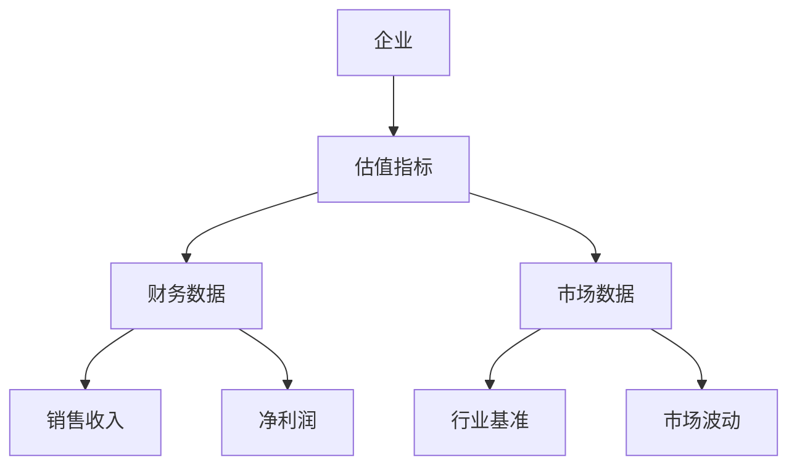
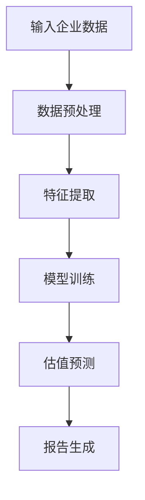
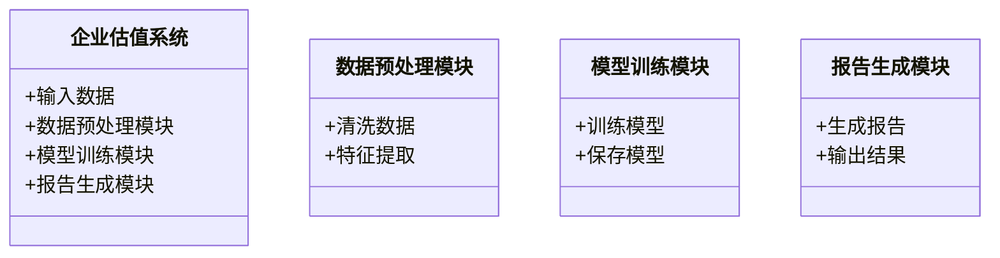
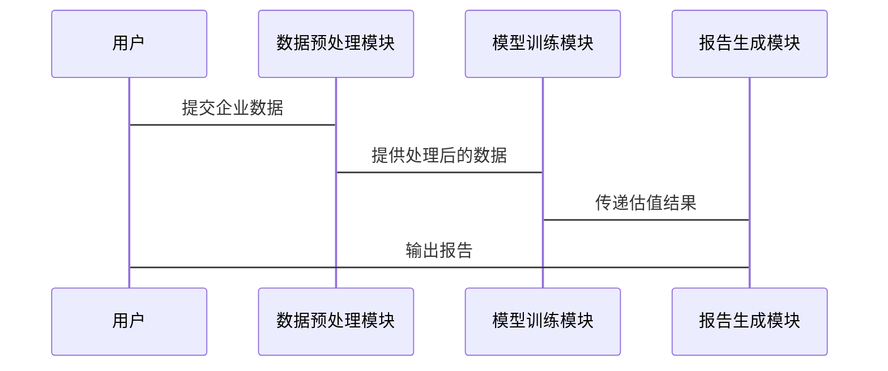

                 


# AI辅助的企业估值报告自动生成

> 关键词：AI，企业估值，报告自动生成，机器学习，数据驱动

> 摘要：本文详细探讨了AI技术在企业估值报告自动生成中的应用，分析了核心概念、算法原理、系统架构以及实际案例，为读者提供了一套完整的解决方案。

---

# 第1章: AI辅助的企业估值概述

## 1.1 企业估值的基本概念
### 1.1.1 企业估值的定义与重要性
企业估值是通过对企业的财务状况、市场表现、行业地位等因素进行综合分析，确定其市场价值的过程。准确的企业估值对于投资决策、并购交易、融资活动等具有重要意义。

### 1.1.2 传统企业估值方法的局限性
传统的估值方法（如DCF模型、可比交易法等）依赖于大量手动数据收集和复杂计算，耗时长、效率低，且容易受到人为因素的影响。

### 1.1.3 AI技术在企业估值中的潜力
AI技术可以通过自动化数据处理、模型优化和预测分析，显著提升企业估值的效率和准确性。

## 1.2 AI辅助企业估值的核心概念
### 1.2.1 AI辅助估值的定义
AI辅助企业估值是指利用人工智能技术（如机器学习、自然语言处理等）来辅助或替代传统估值方法，实现快速、准确的企业价值评估。

### 1.2.2 AI辅助估值的主要优势
1. **自动化数据处理**：AI能够快速从多种来源（财务报表、行业报告等）提取和整理数据。
2. **模型优化**：通过机器学习算法，AI可以构建更复杂的估值模型，捕捉更多影响企业价值的因素。
3. **实时更新**：AI系统可以实时跟踪市场变化，动态调整估值结果。

### 1.2.3 AI辅助估值的边界与外延
AI辅助估值主要用于企业价值的初步估算，适用于标准化程度较高的企业或行业。对于复杂或非标准化的企业，AI仍需要结合人工分析。

## 1.3 企业估值报告自动生成的背景与趋势
### 1.3.1 企业估值报告的需求分析
随着企业数量的激增和市场环境的复杂化，对实时、精准的估值报告需求日益增长。

### 1.3.2 AI技术在企业估值报告中的应用现状
当前，AI技术已应用于数据清洗、模型构建、报告生成等环节，显著提升了估值效率。

### 1.3.3 未来趋势与挑战
未来，AI辅助企业估值将更加智能化、个性化，但仍需解决数据隐私、模型解释性等挑战。

## 1.4 本章小结
本章从企业估值的基本概念出发，分析了传统估值方法的局限性，探讨了AI技术在企业估值中的潜力，为后续章节奠定了基础。

---

# 第2章: AI辅助企业估值的核心概念与联系

## 2.1 核心概念原理
### 2.1.1 数据驱动的估值模型
AI估值模型依赖于大量高质量的数据，通过分析历史数据和市场趋势，预测企业的未来价值。

### 2.1.2 AI算法在估值中的应用
常用的AI算法包括回归分析、随机森林、神经网络等，每种算法都有其适用场景和优缺点。

### 2.1.3 企业特征与估值指标的关系
企业的财务指标（如收入、利润）、市场指标（如市盈率、市净率）等特征与估值指标密切相关。

## 2.2 核心概念属性特征对比
### 2.2.1 传统估值方法与AI估值方法对比
| 特性 | 传统方法 | AI方法 |
|------|----------|--------|
| 数据来源 | 单一 | 多源 |
| 计算效率 | 低 | 高 |
| 精确度 | 有限 | 更高 |

### 2.2.2 数据质量与估值准确性分析
数据质量直接影响估值准确性，AI系统需要对数据进行清洗和特征工程，以提高模型性能。

### 2.2.3 不同行业对企业估值的影响
不同行业的估值模型和关键指标差异显著，AI系统需要针对不同行业进行定制化设计。

## 2.3 ER实体关系图


## 2.4 本章小结
本章通过对比传统方法与AI方法，分析了核心概念及其关系，为后续算法设计提供了理论基础。

---

# 第3章: AI辅助企业估值的算法原理

## 3.1 算法原理概述
### 3.1.1 基于大语言模型的文本生成
利用大语言模型（如GPT）生成结构化报告，提升报告的可读性和专业性。

### 3.1.2 基于机器学习的预测模型
通过训练数据，构建回归模型预测企业价值，常用的模型包括线性回归、随机森林等。

### 3.1.3 基于深度学习的特征提取
使用神经网络模型（如LSTM、BERT）提取文本和数值特征，捕捉数据中的深层信息。

## 3.2 算法流程图


## 3.3 算法数学模型与公式
### 3.3.1 线性回归模型
$$ y = \beta_0 + \beta_1x + \epsilon $$
其中，$y$为估值结果，$x$为输入特征，$\beta_0$和$\beta_1$为模型参数。

### 3.3.2 逻辑回归模型
$$ P(y=1|x) = \frac{e^{\beta_0 + \beta_1x}}{1 + e^{\beta_0 + \beta_1x}} $$
适用于二分类场景，如企业风险评级。

### 3.3.3 神经网络模型
```python
import tensorflow as tf
model = tf.keras.Sequential([
    tf.keras.layers.Dense(64, activation='relu'),
    tf.keras.layers.Dense(1, activation='sigmoid')
])
```

## 3.4 本章小结
本章详细介绍了AI辅助企业估值的算法原理，包括文本生成、预测模型和特征提取，为系统实现提供了技术支撑。

---

# 第4章: 系统分析与架构设计

## 4.1 问题场景介绍
企业估值报告自动生成系统需要处理大量异构数据，包括财务数据、市场数据等，要求系统具备高扩展性和灵活性。

## 4.2 项目介绍
### 4.2.1 项目目标
实现一个能够自动生成企业估值报告的系统，支持多种估值模型和数据源。

### 4.2.2 项目范围
涵盖数据采集、模型训练、报告生成等功能模块。

## 4.3 系统功能设计
### 4.3.1 领域模型（Mermaid类图）


### 4.3.2 系统架构设计（Mermaid架构图）
```mermaid
archi
    节点 计算机
    节点 数据源
    节点 数据预处理
    节点 模型训练
    节点 报告生成
    计算机 --> 数据源: 获取数据
    数据源 --> 数据预处理
    数据预处理 --> 模型训练
    模型训练 --> 报告生成
```

## 4.4 系统接口设计
### 4.4.1 数据接口
- 输入接口：支持多种数据格式（CSV、JSON等）。
- 输出接口：生成结构化的估值报告。

### 4.4.2 交互流程（Mermaid序列图）


## 4.5 本章小结
本章通过系统分析与架构设计，明确了系统的功能模块和交互流程，为后续的实现奠定了基础。

---

# 第5章: 项目实战

## 5.1 环境安装
### 5.1.1 安装Python和相关库
```bash
pip install numpy pandas scikit-learn tensorflow
```

## 5.2 核心代码实现
### 5.2.1 数据预处理代码
```python
import pandas as pd

def preprocess_data(data):
    # 数据清洗
    data = data.dropna()
    # 特征提取
    features = data[[' revenue', 'net_profit']]
    return features
```

### 5.2.2 模型训练代码
```python
from sklearn.linear_model import LinearRegression

def train_model(features, labels):
    model = LinearRegression()
    model.fit(features, labels)
    return model
```

### 5.2.3 报告生成代码
```python
import numpy as np

def generate_report(model, new_data):
    prediction = model.predict(new_data)
    report = f"预测企业价值：{np.mean(prediction)}亿元"
    return report
```

## 5.3 实际案例分析
### 5.3.1 数据来源与处理
以某行业的企业数据为例，经过清洗和特征提取后，输入模型训练。

### 5.3.2 模型训练与评估
通过交叉验证评估模型性能，调整模型参数以提高准确度。

## 5.4 本章小结
本章通过实际案例，展示了AI辅助企业估值系统的实现过程，验证了系统的可行性和有效性。

---

# 第6章: 总结与展望

## 6.1 总结
本文详细探讨了AI技术在企业估值报告自动生成中的应用，从核心概念到系统实现，为读者提供了一套完整的解决方案。

## 6.2 未来展望
随着AI技术的不断发展，企业估值系统将更加智能化、个性化。未来研究方向包括模型优化、数据隐私保护等。

## 6.3 最佳实践 tips
1. 数据质量是估值系统的核心，需加强数据清洗和特征工程。
2. 模型解释性是用户信任的关键，需注重模型可解释性设计。
3. 系统安全性是用户隐私的保障，需加强数据加密和访问控制。

---

# 作者：AI天才研究院 & 禅与计算机程序设计艺术

