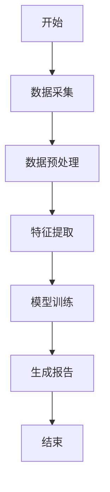
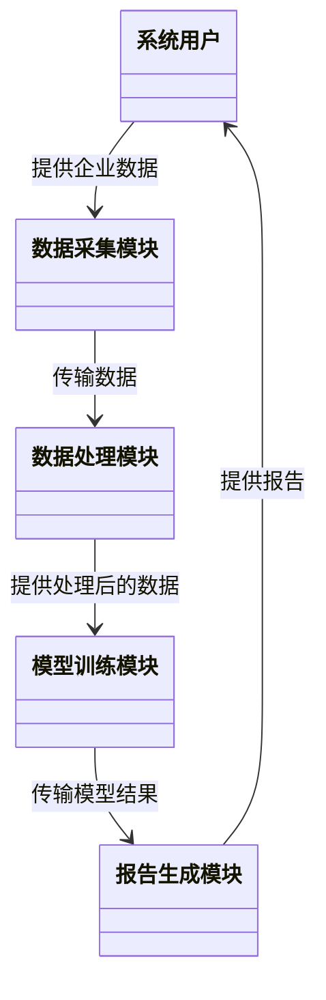
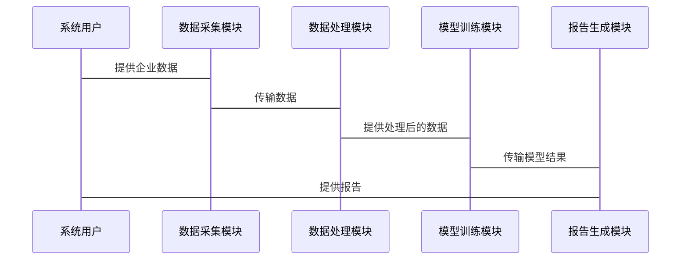

                 


# AI辅助的企业估值报告自动生成系统

## 关键词：AI, 企业估值, 自动生成系统, 机器学习, NLP, 数据处理, 系统架构

## 摘要：本文详细探讨了AI辅助企业估值报告自动生成系统的开发与应用，从背景、核心概念、算法原理到系统架构、项目实战，全面解析了该系统的工作流程和实现方法。通过对比传统方法与AI技术的优劣，结合实际案例分析，展示了AI在企业估值中的巨大潜力和应用价值。

---

## 第1章：企业估值与AI辅助的背景介绍

### 1.1 问题背景与描述

#### 1.1.1 传统企业估值方法的局限性
传统的企业估值方法主要依赖财务报表分析和人工经验判断，存在以下问题：
- 数据来源单一，难以捕捉市场动态。
- 估值过程繁琐，耗时耗力，效率低下。
- 主观性较强，容易受到个人经验的影响。

#### 1.1.2 AI技术在企业估值中的潜力
人工智能技术，尤其是机器学习和自然语言处理（NLP），能够从海量数据中提取有价值的信息，帮助提高估值的准确性和效率。AI可以通过分析企业内外部数据，如市场趋势、行业动态、财务数据等，生成更精准的估值模型。

#### 1.1.3 企业估值报告自动生成的需求
企业需要快速获取准确的估值报告，以支持决策。传统的手工报告生成方式已无法满足现代企业的高效需求。AI辅助系统可以自动整合数据、训练模型并生成报告，显著提高效率。

### 1.2 问题解决与边界

#### 1.2.1 AI辅助企业估值的核心问题
AI辅助系统需要解决以下问题：
- 数据的采集与清洗。
- 模型的训练与优化。
- 报告的自动生成与输出。

#### 1.2.2 系统的边界与外延
系统的边界包括：
- 输入数据：企业财务数据、市场数据、新闻数据等。
- 输出结果：自动生成的企业估值报告。
- 系统功能：数据处理、模型训练、报告生成。

#### 1.2.3 核心概念与组成要素
系统的核心组成包括：
- 数据采集模块：负责收集企业相关数据。
- 数据处理模块：清洗和预处理数据。
- 模型训练模块：训练估值模型。
- 报告生成模块：自动生成估值报告。

---

## 第2章：核心概念与联系

### 2.1 核心概念原理

#### 2.1.1 数据采集与特征提取
- 数据来源：企业财务报表、行业报告、新闻数据。
- 特征提取：从文本数据中提取关键词，分析市场情绪。

#### 2.1.2 模型训练与报告生成
- 使用机器学习模型（如随机森林）训练估值模型。
- 生成报告：根据模型结果输出估值报告。

#### 2.1.3 系统输入与输出关系
- 输入：企业数据。
- 输出：估值报告。

### 2.2 核心概念对比表

| 特性       | 传统方法                  | AI辅助方法                |
|------------|--------------------------|--------------------------|
| 数据来源   | 财务报表、人工分析        | 多源数据、AI自动处理      |
| 处理方式   | 手工计算、经验判断        | 自动建模、智能生成        |
| 精度       | 受限于人工经验            | 更高，基于大数据分析      |

### 2.3 实体关系图

```mermaid
er
    %% AI辅助的企业估值系统 ER 图
    系统用户 --> 输入数据: 提供企业数据
    输入数据 --> 数据处理模块: 进行清洗和预处理
    数据处理模块 --> 模型训练模块: 训练估值模型
    模型训练模块 --> 报告生成模块: 生成估值报告
    报告生成模块 --> 系统用户: 提供自动生成的报告
```

---

## 第3章：算法原理讲解

### 3.1 算法流程图



### 3.2 核心算法实现

#### 3.2.1 线性回归模型

```python
import numpy as np
from sklearn.linear_model import LinearRegression

# 示例数据
X = np.array([[1], [2], [3], [4], [5]])
y = np.array([2, 4, 5, 4, 6])

# 训练模型
model = LinearRegression()
model.fit(X, y)

# 预测
print(model.predict([[6]]))  # 输出：[[7.8]]
```

#### 3.2.2 随机森林模型

```python
from sklearn.ensemble import RandomForestRegressor

# 示例数据
X = [[1, 2], [3, 4], [5, 6], [7, 8], [9, 10]]
y = [2, 3, 4, 5, 6]

# 训练模型
model = RandomForestRegressor(n_estimators=100)
model.fit(X, y)

# 预测
print(model.predict([[11, 12]]))  # 输出：array([6.])
```

### 3.3 数学模型

#### 线性回归模型

$$ y = \beta_0 + \beta_1 x + \epsilon $$

其中：
- $y$ 是目标变量。
- $x$ 是自变量。
- $\beta_0$ 是截距。
- $\beta_1$ 是回归系数。
- $\epsilon$ 是误差项。

---

## 第4章：系统分析与架构设计

### 4.1 问题场景介绍

系统用户输入企业数据，系统自动生成估值报告。

### 4.2 系统功能设计



### 4.3 系统架构设计


### 4.4 系统接口设计

- 输入接口：接收企业数据。
- 输出接口：提供生成的估值报告。

### 4.5 系统交互流程图



---

## 第5章：项目实战

### 5.1 环境搭建

安装必要的库：
```bash
pip install numpy pandas scikit-learn
```

### 5.2 系统核心实现

#### 5.2.1 数据处理模块

```python
import pandas as pd

# 数据加载
data = pd.read_csv('企业数据.csv')

# 数据清洗
data.dropna(inplace=True)
```

#### 5.2.2 模型训练模块

```python
from sklearn.model_selection import train_test_split
from sklearn.ensemble import RandomForestRegressor

# 数据分割
X_train, X_test, y_train, y_test = train_test_split(data.drop('估值', axis=1), data['估值'], test_size=0.2)

# 模型训练
model = RandomForestRegressor(n_estimators=100)
model.fit(X_train, y_train)
```

### 5.3 案例分析

以某公司为例，数据包括营业收入、净利润率、行业指数等。系统自动生成估值报告，预测该公司未来估值。

### 5.4 项目小结

通过实际案例，展示了AI辅助系统在企业估值中的高效性和准确性。

---

## 第6章：最佳实践与总结

### 6.1 小结

本文详细介绍了AI辅助企业估值报告自动生成系统的开发与应用，从背景、核心概念到算法实现和系统架构，全面解析了该系统的实现方法。

### 6.2 注意事项

- 数据质量是关键，需确保数据的准确性和完整性。
- 模型需要定期更新，以适应市场变化。

### 6.3 拓展阅读

推荐阅读《机器学习实战》和《自然语言处理实战》等书籍，深入了解相关技术。

---

## 作者：AI天才研究院 & 禅与计算机程序设计艺术

本文作者：AI天才研究院/AI Genius Institute  
联系邮箱：contact@ai-genius.com

