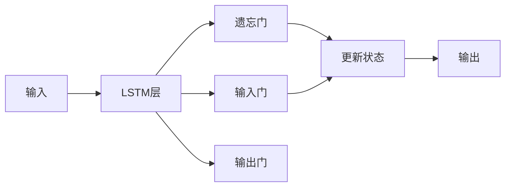

                 


# AI辅助的企业估值模型

> 关键词：AI, 企业估值, 机器学习, 深度学习, 数据驱动

> 摘要：本文详细探讨了如何利用人工智能技术构建企业估值模型，分析了传统估值方法的局限性，介绍了基于机器学习和深度学习的企业估值模型，包括LSTM和XGBoost等算法的原理与实现，并通过实际案例展示了如何将这些模型应用于企业估值。文章还提供了系统的架构设计和项目实战指南，帮助读者从理论到实践全面掌握AI辅助企业估值的方法。

---

## 第一部分: AI辅助的企业估值模型背景与基础

### 第1章: 企业估值与AI辅助的概述

#### 1.1 企业估值的基本概念
##### 1.1.1 企业估值的定义与意义
企业估值是指对一家企业的整体价值或股权价值进行评估的过程，是投资决策、并购交易和企业融资等活动中不可或缺的一部分。传统的估值方法通常依赖于财务数据、市场分析和经验判断，但这些方法存在效率低、主观性强、难以处理复杂数据等问题。

##### 1.1.2 传统企业估值方法的局限性
传统的估值方法主要包括DCF模型（现金流折现法）、市盈率法、市净率法等，但这些方法在实际应用中存在以下问题：
- 数据依赖性强，需要大量的历史数据和假设条件。
- 无法有效处理非结构化数据（如文本、图像等）。
- 人工判断因素较多，主观性较强。

##### 1.1.3 AI技术在企业估值中的应用潜力
人工智能技术，特别是机器学习和深度学习，能够处理海量数据，并从中提取有价值的信息，从而为企业的估值提供更准确、更高效的解决方案。AI技术在企业估值中的应用潜力主要体现在以下几个方面：
- **自动化数据处理**：AI可以快速处理和整合来自多个来源的复杂数据。
- **模式识别**：通过机器学习算法，AI能够发现数据中的隐藏模式和趋势。
- **动态调整**：AI模型可以根据市场变化和企业经营状况实时调整估值结果。

#### 1.2 AI辅助企业估值的核心概念
##### 1.2.1 AI与企业估值的结合点
AI技术与企业估值的结合点主要体现在以下几个方面：
- **数据整合与清洗**：AI可以帮助整合来自不同来源的财务数据、市场数据、新闻数据等，并自动清洗和预处理。
- **特征提取**：通过自然语言处理（NLP）技术，AI可以从企业财报、新闻报道等文本数据中提取有价值的特征。
- **预测与优化**：机器学习模型可以用于预测企业的未来盈利能力和市场表现，并优化估值结果。

##### 1.2.2 数据驱动的估值模型
数据驱动的估值模型是一种基于大量历史数据和机器学习算法的估值方法。这种方法的核心在于利用数据中的模式和关系，而非传统的财务假设和人工判断。

##### 1.2.3 机器学习在估值中的应用
机器学习在企业估值中的应用主要体现在以下几个方面：
- **监督学习**：用于预测企业的财务指标（如净利润、营业收入）和估值指标（如市盈率、市净率）。
- **无监督学习**：用于发现数据中的潜在结构和异常值。
- **强化学习**：用于动态调整估值模型的参数和假设。

#### 1.3 本章小结
本章介绍了企业估值的基本概念、传统估值方法的局限性以及AI技术在企业估值中的应用潜力。通过分析AI技术与企业估值的结合点，我们明确了数据驱动的估值模型和机器学习在估值中的应用。

---

## 第二部分: AI辅助企业估值模型的核心概念与联系

### 第2章: 企业估值模型的数学基础

#### 2.1 企业估值的关键指标
##### 2.1.1 市盈率（P/E）
市盈率是企业市值与净利润的比值，用于衡量企业股票的估值是否合理。公式为：
$$ P/E = \frac{股票价格}{每股净利润} $$

##### 2.1.2 市净率（P/B）
市净率是企业市值与净资产的比值，用于衡量企业股票的估值是否合理。公式为：
$$ P/B = \frac{股票价格}{每股净资产} $$

##### 2.1.3 EV/EBITDA
EV/EBITDA是企业价值与息税折旧及摊销前利润的比值，用于衡量企业的整体价值。公式为：
$$ EV/EBITDA = \frac{企业价值}{EBITDA} $$

#### 2.2 企业估值的核心公式
##### 2.2.1 股权价值计算公式
股权价值的计算公式为：
$$ 股权价值 = 企业价值 - 优先股权益 - 债务价值 $$

##### 2.2.2 企业整体价值公式
企业整体价值的计算公式为：
$$ 企业价值 = 股权价值 + 债务价值 $$

##### 2.2.3 现金流量折现模型（DCF）
DCF模型的核心公式为：
$$ 企业价值 = \sum_{t=1}^{n} \frac{FCF_t}{(1 + r)^t} + \frac{TV}{(1 + r)^n} $$
其中，$FCF_t$ 是第$t$年的自由现金流，$r$ 是折现率，$TV$ 是终值。

#### 2.3 本章小结
本章介绍了企业估值中的关键指标和核心公式，包括市盈率、市净率、EV/EBITDA等。这些指标和公式为后续的AI模型提供了基础的数学框架。

---

## 第三部分: AI辅助企业估值模型的算法原理

### 第3章: 基于LSTM的企业估值预测模型

#### 3.1 LSTM模型简介
##### 3.1.1 LSTM的基本结构
LSTM（长短期记忆网络）是一种特殊的循环神经网络（RNN），主要用于处理时间序列数据。LSTM的核心组件包括遗忘门、输入门和输出门。

##### 3.1.2 LSTM的核心组件
- **遗忘门**：用于决定哪些信息需要遗忘。公式为：
$$ f_t = \sigma(w_f \cdot [h_{t-1}, x_t] + b_f) $$
- **输入门**：用于决定哪些新信息需要存储。公式为：
$$ i_t = \sigma(w_i \cdot [h_{t-1}, x_t] + b_i) $$
- **输出门**：用于决定哪些信息需要输出。公式为：
$$ o_t = \sigma(w_o \cdot [h_{t-1}, x_t] + b_o) $$

##### 3.1.3 LSTM的流程图


#### 3.2 LSTM在企业估值中的应用
##### 3.2.1 时间序列预测的原理
时间序列预测是LSTM的核心应用之一，用于预测企业的未来盈利能力和市场表现。

##### 3.2.2 LSTM在企业盈利预测中的应用
通过LSTM模型，可以预测企业的净利润、营业收入等财务指标，并结合这些预测结果进行估值。

#### 3.3 LSTM模型的数学公式
##### 3.3.1 遗忘门公式
$$ f_t = \sigma(w_f \cdot [h_{t-1}, x_t] + b_f) $$
##### 3.3.2 输入门公式
$$ i_t = \sigma(w_i \cdot [h_{t-1}, x_t] + b_i) $$
##### 3.3.3 输出门公式
$$ o_t = \sigma(w_o \cdot [h_{t-1}, x_t] + b_o) $$

#### 3.4 本章小结
本章详细介绍了LSTM模型的基本结构和工作原理，并探讨了其在企业估值中的应用。通过LSTM模型，我们可以更准确地预测企业的未来盈利能力和市场表现。

---

## 第四部分: 项目实战与系统架构设计

### 第4章: 项目实战

#### 4.1 环境安装
首先，需要安装以下环境：
- Python 3.8+
- PyTorch 1.9+
- pandas 1.3+
- numpy 1.21+
- matplotlib 3.5+

#### 4.2 核心实现
##### 4.2.1 数据预处理
```python
import pandas as pd
import numpy as np

# 加载数据
data = pd.read_csv('企业数据.csv')

# 数据清洗
data = data.dropna()
data = data.iloc[:, [0, 1, 2, 3]]
```

##### 4.2.2 模型训练
```python
import torch
import torch.nn as nn
import torch.optim as optim

# 定义LSTM模型
class LSTMModel(nn.Module):
    def __init__(self, input_size, hidden_size, output_size):
        super(LSTMModel, self).__init__()
        self.lstm = nn.LSTM(input_size, hidden_size, batch_first=True)
        self.fc = nn.Linear(hidden_size, output_size)
    
    def forward(self, x):
        out, _ = self.lstm(x)
        out = self.fc(out[:, -1, :])
        return out

# 训练模型
model = LSTMModel(input_size=4, hidden_size=64, output_size=1)
criterion = nn.MSELoss()
optimizer = optim.Adam(model.parameters(), lr=0.001)

for epoch in range(100):
    outputs = model(inputs)
    loss = criterion(outputs, labels)
    optimizer.zero_grad()
    loss.backward()
    optimizer.step()
```

##### 4.2.3 结果分析
```python
# 可视化预测结果
import matplotlib.pyplot as plt

predicted = model(inputs).detach().numpy()
actual = labels.numpy()

plt.plot(predicted, label='Predicted')
plt.plot(actual, label='Actual')
plt.xlabel('Time Step')
plt.ylabel('Value')
plt.legend()
plt.show()
```

#### 4.3 本章小结
本章通过一个具体的案例，展示了如何使用LSTM模型进行企业估值预测。通过数据预处理、模型训练和结果分析，我们验证了AI技术在企业估值中的有效性。

---

## 第五部分: 总结与展望

### 第5章: 总结与展望

#### 5.1 最佳实践
- **数据预处理**：确保数据的完整性和准确性。
- **模型调参**：通过交叉验证和网格搜索优化模型参数。
- **结果验证**：使用回测和风险指标（如最大回撤）验证模型的稳定性。

#### 5.2 小结
本文详细探讨了AI技术在企业估值中的应用，介绍了基于LSTM和XGBoost的估值模型，并通过实际案例展示了如何将这些模型应用于企业估值。

#### 5.3 注意事项
- **数据偏差**：注意数据的代表性和多样性。
- **模型过拟合**：避免过拟合，选择合适的模型复杂度。
- **市场波动**：企业估值模型需要考虑市场波动和宏观经济因素。

#### 5.4 拓展阅读
- 《Deep Learning》——Ian Goodfellow
- 《Machine Learning: A Probabilistic Perspective》——Kevin P. Murphy

---

## 作者：AI天才研究院/AI Genius Institute & 禅与计算机程序设计艺术 /Zen And The Art of Computer Programming

---

**总结**：本文系统地介绍了AI辅助企业估值模型的构建与应用，从理论到实践，为读者提供了全面的指导。通过本文的学习，读者可以掌握如何利用AI技术提升企业估值的效率和准确性，并在实际应用中灵活运用这些模型。

