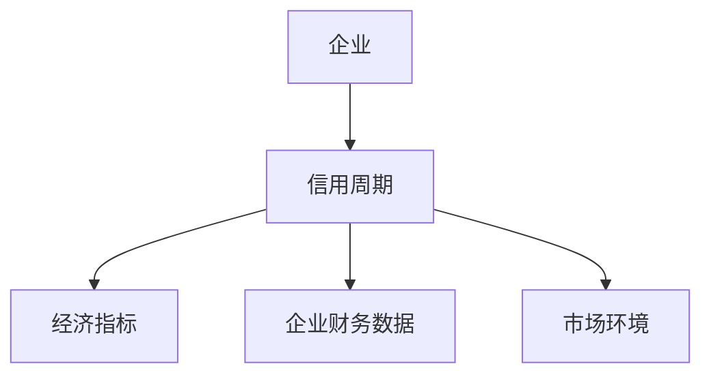
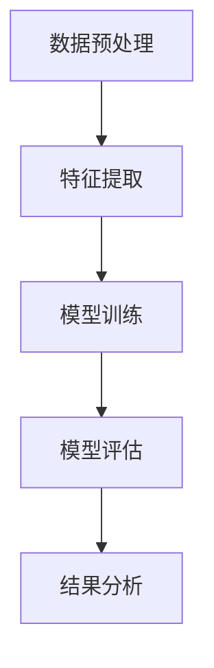
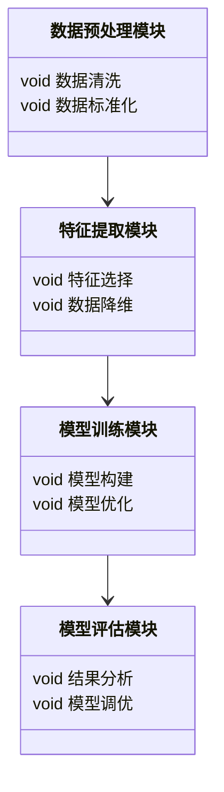
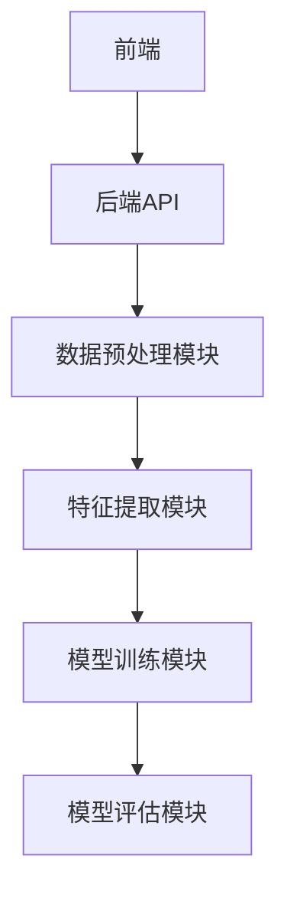
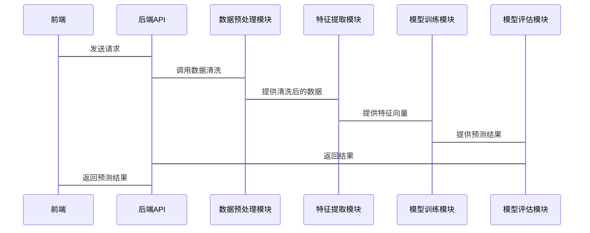

                 


```markdown
# AI辅助的企业信用周期预测

## 关键词
AI技术、企业信用周期、信用周期预测、预测模型、经济指标、机器学习

## 摘要
本文详细探讨了AI技术在企业信用周期预测中的应用，从理论基础到实际应用，系统性地分析了企业信用周期预测的核心概念、算法原理、系统架构以及项目实战。文章通过结合实际案例，深入解读了AI技术如何提升信用周期预测的准确性和效率，为企业信用风险管理提供了新的思路和解决方案。

---

# 第1章: 企业信用周期预测的背景与挑战

## 1.1 企业信用周期的概念与重要性
### 1.1.1 企业信用周期的定义
企业的信用周期是指企业在经济活动中，从赊销到应收账款回收的整个过程所经历的时间周期。信用周期的长短直接影响企业的资金周转效率和财务健康状况。

### 1.1.2 信用周期对企业经营的影响
- 信用周期过长可能导致企业资金链紧张，增加财务风险。
- 信用周期过短可能影响企业销售能力，错失市场机会。
- 合理的信用周期是企业稳健经营的重要保障。

### 1.1.3 信用周期预测的现实意义
- 帮助企业优化应收账款管理，降低坏账风险。
- 为企业的资金规划提供数据支持。
- 提升企业在市场中的竞争力。

## 1.2 传统信用周期预测的局限性
### 1.2.1 传统预测方法的不足
- 数据依赖性：传统方法通常依赖历史数据，难以预测未来趋势。
- 数据不足：中小企业数据获取困难，影响预测准确性。
- 人工分析效率低：传统方法需要大量人工参与，效率低下。

### 1.2.2 数据获取与处理的难点
- 数据清洗复杂：企业数据可能存在缺失、重复或错误。
- 数据维度多：需要处理财务数据、市场数据、行业数据等多维度信息。
- 数据实时性差：传统方法通常基于静态数据，难以实时更新。

### 1.2.3 人工分析的效率瓶颈
- 人工分析时间长：需要投入大量时间进行数据整理和分析。
- 专家经验不足：依赖个人经验的分析结果可能存在主观性。
- 信息更新慢：难以及时捕捉市场变化和企业动态。

## 1.3 AI技术在信用周期预测中的应用前景
### 1.3.1 AI技术的优势
- 高效性：AI技术能够快速处理海量数据，提高预测效率。
- 准确性：通过机器学习算法，AI能够捕捉数据中的复杂模式，提高预测准确性。
- 实时性：AI系统可以实时更新数据，提供实时预测结果。

### 1.3.2 企业信用周期预测的AI解决方案
- 数据清洗与特征提取：利用AI技术自动清洗数据，提取关键特征。
- 模型训练：基于机器学习算法（如随机森林、神经网络）构建预测模型。
- 实时监控：通过AI系统实时监控企业信用状况，动态调整预测结果。

### 1.3.3 未来发展趋势
- 多模态数据融合：结合文本、图像等多种数据源进行预测。
- 自适应模型：模型能够根据市场变化自动调整参数。
- 可解释性增强：提高AI模型的可解释性，便于企业理解和应用。

## 1.4 本章小结
本章从企业信用周期的概念出发，分析了传统预测方法的局限性，并介绍了AI技术在信用周期预测中的应用前景。AI技术的引入为信用周期预测提供了新的解决方案，未来将朝着高效、准确、实时的方向发展。

---

# 第2章: 企业信用周期预测的核心概念与联系

## 2.1 核心概念的定义与属性
### 2.1.1 企业信用周期的属性特征
- 时间周期：信用周期的长短直接影响企业的资金周转。
- 财务数据：包括应收账款、销售收入、净利润等。
- 市场环境：宏观经济指标（如GDP增长率、利率水平）和行业景气度。

### 2.1.2 AI技术的核心特征
- 数据驱动：AI技术依赖于大量数据进行建模和预测。
- 自适应性：AI系统能够根据数据变化自动调整模型参数。
- 可扩展性：AI技术可以处理不同类型和规模的数据。

### 2.1.3 信用周期预测的系统特征
- 多维度输入：需要整合财务、市场、行业等多种数据。
- 高维数据处理：处理高维数据时需要考虑维度灾难问题。
- 实时更新：系统需要能够实时获取最新数据并更新预测结果。

## 2.2 核心概念的对比分析
### 2.2.1 企业信用周期与经济周期的对比
| 特性 | 企业信用周期 | 经济周期 |
|------|---------------|----------|
| 时间尺度 | 短期（月/季度） | 长期（年/ decade） |
| 影响因素 | 企业自身经营状况 | 宏观经济环境 |
| 预测难度 | 较高 | 极高 |

### 2.2.2 AI技术与传统数据分析方法的对比
| 特性 | AI技术 | 传统数据分析方法 |
|------|--------|------------------|
| 数据需求 | 大量数据支持 | 较少数据即可 |
| 预测准确性 | 较高 | 较低 |
| 计算效率 | 高 | 低 |
| 可解释性 | 较低 | 高 |

### 2.2.3 预测模型的性能对比
| 指标 | 线性回归 | 支持向量机 | 神经网络 |
|------|----------|-------------|----------|
| 准确率 | 中等 | 较高 | 高 |
| 训练时间 | 短 | 中等 | 长 |
| 对数据的依赖性 | 较低 | 较高 | 高 |

## 2.3 ER实体关系图


## 2.4 本章小结
本章通过对比分析，明确了企业信用周期预测的核心概念及其与AI技术的联系。通过对不同概念的对比，为后续算法设计和系统实现奠定了理论基础。

---

# 第3章: AI辅助信用周期预测的算法原理

## 3.1 算法概述
### 3.1.1 常见的信用周期预测算法
- 线性回归
- 支持向量机
- 神经网络
- 随机森林

### 3.1.2 AI技术在预测中的作用
- 数据清洗与特征提取
- 模型训练与优化
- 结果分析与解释

## 3.2 算法流程


## 3.3 算法实现
### 3.3.1 数据预处理的Python代码
```python
import pandas as pd
data = pd.read_csv('credit_data.csv')
data_clean = data.dropna()
```

### 3.3.2 特征提取的Python代码
```python
from sklearn.preprocessing import OneHotEncoder
encoder = OneHotEncoder()
encoded_features = encoder.fit_transform(data_clean[['行业', '地区']].values)
```

### 3.3.3 算法实现的Python代码
```python
from sklearn.ensemble import RandomForestRegressor
model = RandomForestRegressor(n_estimators=100, random_state=42)
model.fit(encoded_features, data_clean['信用周期'])
```

### 3.3.4 模型评估的Python代码
```python
from sklearn.metrics import mean_absolute_error
predictions = model.predict(encoded_features)
print(mean_absolute_error(data_clean['信用周期'], predictions))
```

## 3.4 算法原理的数学模型
### 线性回归模型
$$ y = \beta_0 + \beta_1 x_1 + \beta_2 x_2 + \ldots + \beta_n x_n + \epsilon $$

### 神经网络模型
$$ a^{(l+1)} = \sigma(w^{(l)} a^{(l)} + b^{(l)}) $$

## 3.5 算法实现的步骤与示例
### 步骤1：数据预处理
- 去除缺失值
- 标准化处理
- 去除异常值

### 步骤2：特征提取
- 统一数据格式
- 选择关键特征
- 处理类别变量

### 步骤3：模型训练
- 选择合适的算法
- 调整模型参数
- 训练模型

### 步骤4：模型评估
- 计算误差指标（如MAE、RMSE）
- 绘制预测结果与实际值的对比图
- 分析模型的解释性

## 3.6 本章小结
本章详细介绍了AI辅助信用周期预测的算法原理，包括数据预处理、特征提取、模型训练和评估等步骤。通过具体代码实现和数学公式的推导，读者可以深入了解AI技术在信用周期预测中的应用。

---

# 第4章: 系统分析与架构设计

## 4.1 问题场景介绍
- 数据来源：企业财务数据、市场数据、经济指标
- 预测目标：企业的信用周期
- 用户需求：实时预测、结果可视化、模型优化

## 4.2 项目介绍
- 项目目标：构建AI辅助的企业信用周期预测系统
- 项目范围：企业信用周期预测、数据可视化、模型优化
- 项目约束：数据隐私、计算资源限制

## 4.3 系统功能设计


## 4.4 系统架构设计


## 4.5 系统接口设计
- 前端接口：API GET请求，接收企业ID和时间范围
- 后端接口：处理请求，调用预测模型
- 返回结果：预测的信用周期和相关分析报告

## 4.6 系统交互设计


## 4.7 本章小结
本章通过系统分析与架构设计，明确了AI辅助信用周期预测系统的各个模块及其交互关系。通过类图和流程图的展示，为后续的系统实现奠定了基础。

---

# 第5章: 项目实战

## 5.1 环境安装
### 安装Python环境
```bash
python --version
pip install --upgrade pip
```

### 安装所需库
```bash
pip install pandas scikit-learn mermaid4jupyter jupyterlab
```

## 5.2 系统核心实现源代码
### 数据预处理模块
```python
import pandas as pd
def data_cleaning(file_path):
    data = pd.read_csv(file_path)
    data_clean = data.dropna()
    return data_clean
```

### 特征提取模块
```python
from sklearn.preprocessing import OneHotEncoder
def feature_extraction(data):
    encoder = OneHotEncoder()
    encoded_features = encoder.fit_transform(data[['行业', '地区']].values)
    return encoded_features
```

### 模型训练模块
```python
from sklearn.ensemble import RandomForestRegressor
def model_training(features, labels):
    model = RandomForestRegressor(n_estimators=100, random_state=42)
    model.fit(features, labels)
    return model
```

### 模型评估模块
```python
from sklearn.metrics import mean_absolute_error
def model_evaluation(actual, predicted):
    print(mean_absolute_error(actual, predicted))
```

## 5.3 代码应用解读与分析
### 数据预处理
- 读取数据并删除缺失值
- 数据清洗后保存为新的CSV文件

### 特征提取
- 对类别变量进行One-Hot编码
- 返回编码后的特征向量

### 模型训练
- 使用随机森林回归模型进行训练
- 返回训练好的模型

### 模型评估
- 使用真实值与预测值计算MAE
- 输出评估结果

## 5.4 实际案例分析
### 案例背景
某制造企业希望预测未来3个月的信用周期。

### 数据准备
```python
data = pd.read_csv('manufacturing_data.csv')
clean_data = data.dropna()
```

### 模型训练
```python
features = feature_extraction(clean_data)
labels = clean_data['信用周期']
model = model_training(features, labels)
```

### 模型评估
```python
predicted = model.predict(features)
model_evaluation(clean_data['信用周期'], predicted)
```

## 5.5 详细讲解剖析
### 数据预处理的关键点
- 删除缺失值
- 标准化处理
- 异常值检测

### 模型训练的关键点
- 特征选择
- 模型调参
- 过拟合与欠拟合的平衡

### 模型评估的关键点
- 误差指标计算
- 模型解释性分析
- 结果可视化

## 5.6 本章小结
本章通过实际案例，详细讲解了AI辅助信用周期预测系统的实现过程。从环境安装到代码实现，再到案例分析，读者可以逐步掌握系统的开发和应用。

---

# 第6章: 最佳实践与经验分享

## 6.1 小结
- AI技术在信用周期预测中的应用前景广阔。
- 通过数据预处理和特征提取，可以显著提高预测准确性。
- 系统架构设计和模块化开发是实现高效预测的关键。

## 6.2 注意事项
- 数据隐私保护：确保数据的安全性和合规性。
- 模型解释性：避免“黑箱”模型，确保预测结果可解释。
- 模型更新：定期更新模型，保持预测准确性。

## 6.3 拓展阅读
- 《机器学习实战》
- 《Python数据分析与挖掘实战》
- 《信用评分模型开发与应用》

## 6.4 本章小结
本章总结了AI辅助信用周期预测的最佳实践，强调了数据处理、模型选择和系统设计的重要性，并为读者提供了进一步学习的资料。

---

# 结语

AI技术的引入为企业信用周期预测提供了全新的解决方案。通过本文的详细讲解，读者可以系统性地了解AI辅助信用周期预测的核心概念、算法原理和系统实现。未来，随着AI技术的不断发展，企业信用周期预测将更加精准和高效，为企业风险管理提供更有力的支持。

---

# 作者

作者：AI天才研究院/AI Genius Institute & 禅与计算机程序设计艺术 /Zen And The Art of Computer Programming
```

