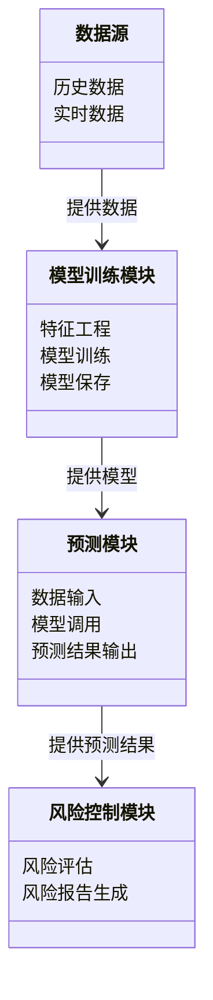
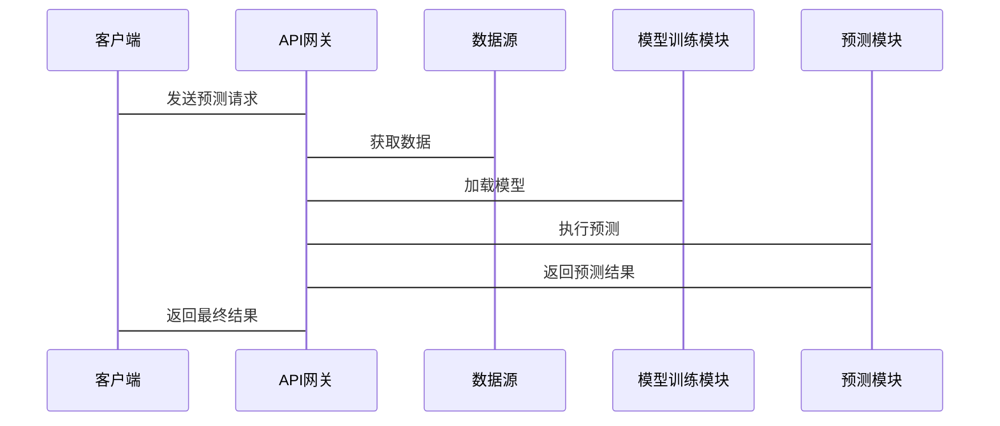

                 


# AI辅助的企业信用周期预测与风险管理

> 关键词：AI, 信用周期预测, 风险管理, 机器学习, 神经网络, 系统架构

> 摘要：本文深入探讨了AI技术在企业信用周期预测与风险管理中的应用。通过分析传统方法的局限性，结合现代AI算法的优势，详细讲解了如何利用机器学习和深度学习模型进行信用周期预测。文章从系统架构设计到具体项目实战，全面展示了AI在信用风险管理中的实践应用，为企业提供了有效的解决方案和实施策略。

---

## 第一章: 企业信用周期预测与风险管理的背景

### 1.1 企业信用周期的基本概念
企业信用周期是指企业在经济活动中，从获得资金或资源开始，到最终偿还债务或实现收益的时间段。这个周期的长短和稳定性直接关系到企业的财务健康状况和市场竞争力。

#### 1.1.1 信用周期的定义与特点
信用周期可以分为扩张期和收缩期。扩张期表现为资金充裕、投资增加、经济增长；收缩期则表现为资金紧张、投资减少、经济衰退。企业的信用周期受宏观经济环境、行业特性以及企业自身经营状况的影响。

#### 1.1.2 信用周期对企业的影响
良好的信用周期管理可以帮助企业优化资金使用效率，降低财务风险。反之，信用周期管理不当可能导致企业面临资金链断裂、债务违约等问题，严重时甚至引发企业破产。

#### 1.1.3 风险管理的核心目标
风险管理的核心目标是通过预测和监控信用周期的变化，提前采取应对措施，降低潜在风险，确保企业稳健经营。

### 1.2 AI在信用周期预测中的应用背景
#### 1.2.1 传统信用周期预测的局限性
传统信用周期预测方法主要依赖历史数据分析和统计模型，存在以下问题：
- 数据维度有限，难以捕捉复杂市场变化；
- 预测精度较低，尤其是在经济波动剧烈时；
- 需要大量人工干预，效率较低。

#### 1.2.2 AI技术的优势与潜力
AI技术，特别是机器学习和深度学习，能够处理海量数据，发现传统方法难以察觉的模式和趋势。AI在信用周期预测中的优势包括：
- 高精度预测：通过复杂算法建模，提升预测准确性；
- 实时监控：利用实时数据更新模型，实现动态预测；
- 自适应学习：模型能够自动调整以适应市场变化。

#### 1.2.3 企业风险管理的数字化转型
企业风险管理正在从传统的手工操作向数字化、智能化转型。AI技术的应用推动了风险管理的创新，使得企业能够更高效地识别和应对风险。

---

## 第二章: AI辅助信用周期预测的核心概念

### 2.1 信用周期预测的数学模型
#### 2.1.1 时间序列分析的基本原理
时间序列分析是一种通过历史数据预测未来趋势的方法。常用的模型包括ARIMA（自回归积分滑动平均模型）和GARCH（广义自回归条件异方差模型）。

#### 2.1.2 预测模型的分类与选择
根据数据特征和预测目标，选择合适的模型。例如：
- 线性回归模型适用于线性关系；
- 支持向量机（SVM）适用于非线性关系；
- 神经网络模型适用于复杂模式识别。

#### 2.1.3 模型评估指标与方法
常用的评估指标包括均方误差（MSE）、平均绝对误差（MAE）、R平方值（R²）等。

### 2.2 AI算法在信用周期预测中的应用
#### 2.2.1 机器学习算法的分类
机器学习算法可分为监督学习、无监督学习和半监督学习。在信用周期预测中，监督学习（如随机森林、神经网络）应用广泛。

#### 2.2.2 深度学习算法的原理
深度学习通过多层神经网络提取数据特征，能够捕捉复杂的非线性关系。常用模型包括LSTM（长短期记忆网络）和Transformer。

#### 2.2.3 算法选择的策略与优化
算法选择应基于数据特征、预测目标和计算资源。可以通过交叉验证和超参数调优优化模型性能。

### 2.3 数据特征与信用周期的关系
#### 2.3.1 数据特征的提取与选择
关键特征包括企业财务指标（如资产负债率、净利润率）、市场指标（如行业指数、宏观经济指标）等。

#### 2.3.2 数据预处理与清洗
数据清洗包括处理缺失值、异常值和重复值。特征工程通过标准化、归一化和特征组合提升模型性能。

#### 2.3.3 特征工程的优化策略
通过主成分分析（PCA）和特征重要性分析，筛选关键特征，降低维度，提升模型效率。

---

## 第三章: 基于机器学习的信用周期预测算法

### 3.1 逻辑回归模型
#### 3.1.1 模型原理与数学公式
逻辑回归通过sigmoid函数将线性回归结果映射到概率空间：
$$ P(y=1|x) = \frac{e^{\beta x}}{1+e^{\beta x}} $$

#### 3.1.2 模型训练与优化
通过最大似然估计求解参数，使用交叉验证评估模型性能。

#### 3.1.3 模型评估与调优
评估指标包括准确率、召回率和F1分数。通过网格搜索优化参数。

### 3.2 随机森林模型
#### 3.2.1 模型原理与优势
随机森林通过集成学习提升模型鲁棒性，避免过拟合问题。

#### 3.2.2 模型训练与特征重要性分析
使用特征重要性分数识别关键预测因子。

#### 3.2.3 模型调参与优化
通过调整树的深度和数量，优化模型性能。

### 3.3 神经网络模型
#### 3.3.1 基础神经网络的结构与原理
神经网络通过多层非线性变换，捕捉数据特征。

#### 3.3.2 LSTM网络在时间序列预测中的应用
LSTM通过门控机制解决传统RNN无法捕捉长期依赖的问题。

#### 3.3.3 模型训练与优化策略
使用反向传播算法和Adam优化器训练模型，通过早停法防止过拟合。

### 3.4 算法对比与选择
#### 3.4.1 不同算法的性能对比
通过实验对比模型的预测精度和计算效率。

#### 3.4.2 算法选择的依据与策略
根据数据特征、预测目标和计算资源选择最优算法。

#### 3.4.3 混合模型的应用与优势
通过集成学习结合多种算法，提升预测精度。

---

## 第四章: 系统架构与设计

### 4.1 项目背景与目标
本项目旨在构建一个基于AI的信用周期预测系统，帮助企业进行风险管理和投资决策。

### 4.2 系统功能设计
#### 4.2.1 领域模型设计
使用mermaid类图展示系统功能模块及其交互关系。



#### 4.2.2 系统架构设计
使用mermaid架构图展示系统整体架构。


### 4.3 系统接口设计
系统接口包括数据输入接口、模型调用接口和结果输出接口。

### 4.4 系统交互设计
使用mermaid序列图展示系统交互流程。



---

## 第五章: 项目实战

### 5.1 环境配置与安装
#### 5.1.1 安装Python环境
使用Anaconda或virtualenv管理Python环境。

#### 5.1.2 安装依赖库
安装numpy、pandas、scikit-learn、keras等库。

### 5.2 核心代码实现
#### 5.2.1 数据加载与预处理
```python
import pandas as pd
import numpy as np

# 加载数据
data = pd.read_csv('credit_cycle_data.csv')

# 数据清洗
data = data.dropna()
data = (data - data.mean()) / data.std()
```

#### 5.2.2 模型训练
```python
from sklearn.ensemble import RandomForestRegressor
from sklearn.metrics import mean_squared_error

# 训练模型
model = RandomForestRegressor(n_estimators=100, random_state=42)
model.fit(X_train, y_train)

# 评估模型
y_pred = model.predict(X_test)
print(mean_squared_error(y_test, y_pred))
```

#### 5.2.3 模型部署
使用Flask框架部署API服务，提供预测接口。

### 5.3 实际案例分析
通过具体案例展示模型预测效果和实际应用中的注意事项。

### 5.4 项目小结
总结项目实施过程中的经验教训，提出改进建议。

---

## 第六章: 最佳实践与小结

### 6.1 核心知识点总结
- 信用周期预测的数学模型
- 常用AI算法及其应用场景
- 系统架构设计与实现

### 6.2 小结
通过本文的讲解，读者可以掌握AI在企业信用周期预测与风险管理中的应用方法，为企业风险管理提供有效的技术支持。

### 6.3 注意事项
- 数据质量直接影响模型性能，需重视数据清洗和特征工程；
- 模型部署后需定期更新，以适应市场变化；
- 注意模型的可解释性，避免“黑箱”问题。

### 6.4 拓展阅读
推荐阅读以下书籍和论文：
- 《机器学习实战》
- 《深度学习》
- 计算机协会（ACM）相关论文

---

## 作者信息

作者：AI天才研究院/AI Genius Institute  
联系邮箱：contact@aigeniusinstitute.com  
GitHub：https://github.com/AI-Genius-Institute

---

通过以上内容，您可以系统地了解AI在企业信用周期预测与风险管理中的应用，掌握相关技术的核心概念和实现方法。

