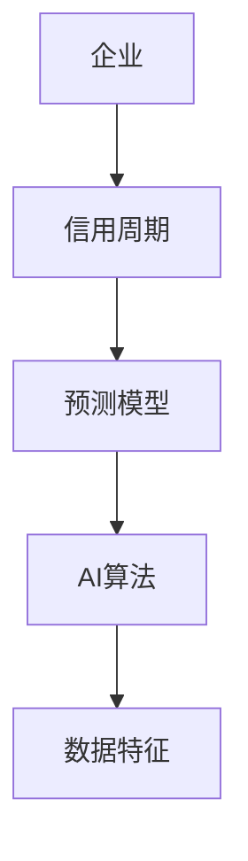
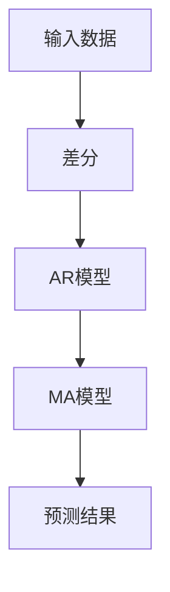
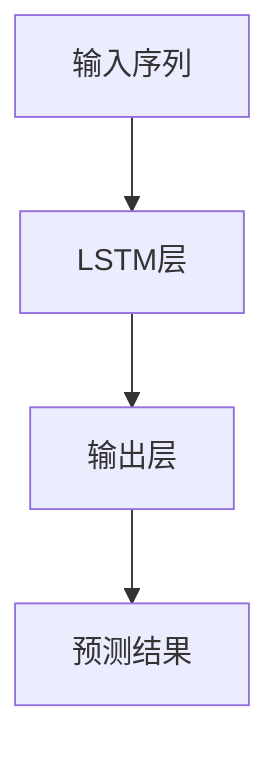
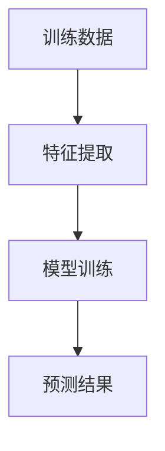
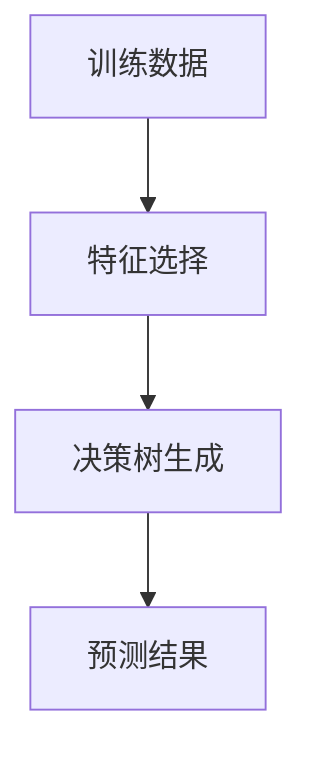
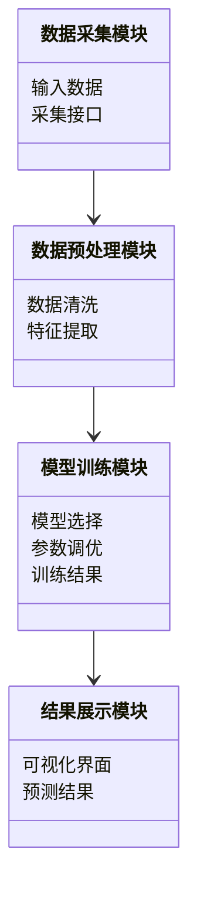
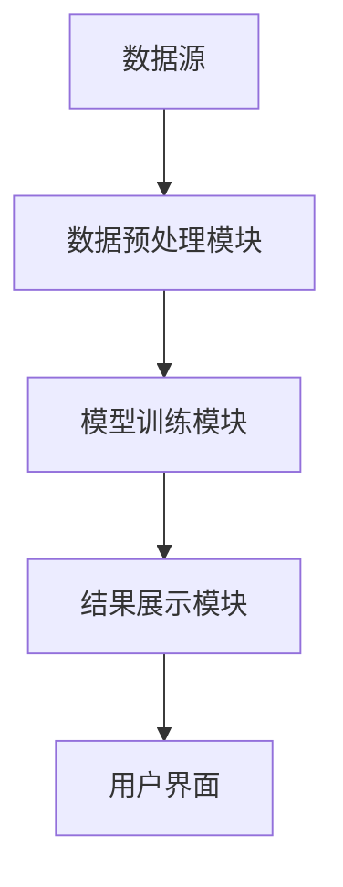
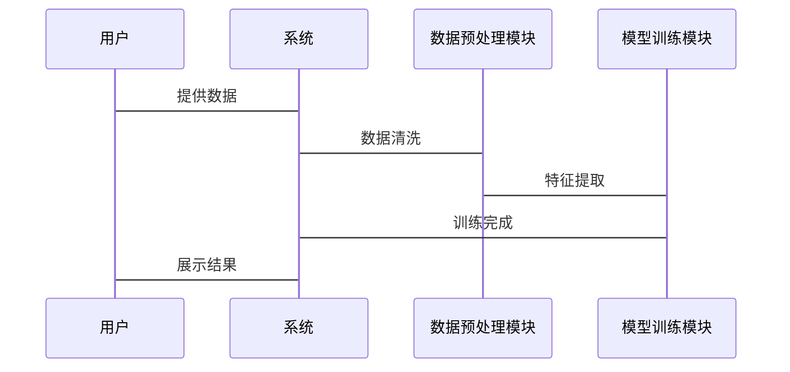

                 


# AI辅助的企业信用周期预测模型

---

## 关键词：AI, 信用周期, 预测模型, 时间序列, 机器学习, LSTM, ARIMA

---

## 摘要

本文详细探讨了如何利用人工智能技术构建企业信用周期预测模型。通过分析信用周期预测的重要性，结合AI的优势，提出了一种基于时间序列分析的预测方法，涵盖了从数据预处理、模型选择到结果解释的全过程。文章深入讲解了ARIMA和LSTM等算法的原理，并通过实际案例展示了模型的应用与优化。最终，本文为企业信用周期预测提供了理论支持和实践指导。

---

# 第1章: 企业信用周期预测的背景与问题

## 1.1 企业信用周期预测的重要性

### 1.1.1 信用周期的定义与作用

信用周期是指企业在经济活动中，从信用建立、扩张到信用紧缩、衰退的循环过程。它反映了企业与金融机构之间的信用关系变化，是企业经营风险的重要指标。

### 1.1.2 信用周期预测在企业经营中的价值

- **风险控制**：提前预测信用周期波动，帮助企业规避信用风险。
- **投资决策**：为企业投资决策提供数据支持。
- **优化融资**：帮助企业合理规划融资策略，降低融资成本。

### 1.1.3 当前信用周期预测的主要挑战

- **数据复杂性**：信用周期受多种因素影响，数据维度高、噪声大。
- **模型选择**：传统统计模型与现代机器学习模型的优劣权衡。
- **实时性要求**：企业需要实时或高频的预测结果。

---

## 1.2 AI在信用周期预测中的应用前景

### 1.2.1 AI技术在金融领域的应用现状

AI技术已在金融领域的股票预测、风险评估等方面取得显著成果，信用周期预测是其重要应用之一。

### 1.2.2 信用周期预测中的AI优势

- **数据处理能力**：AI能够处理海量数据，提取非线性特征。
- **模型可解释性**：部分AI模型（如XGBoost）具有较高的可解释性。
- **实时预测能力**：AI算法支持实时数据处理，满足企业需求。

### 1.2.3 企业信用周期预测的未来趋势

- **多模态数据融合**：结合文本、图像等多种数据源进行预测。
- **自适应模型**：模型能够自动调整参数，适应数据变化。
- **强化学习应用**：通过强化学习优化预测策略。

---

## 1.3 本章小结

本章介绍了企业信用周期预测的重要性和AI技术的应用前景，为后续模型构建奠定了基础。

---

# 第2章: 企业信用周期预测的核心概念

## 2.1 企业信用周期预测的基本概念

### 2.1.1 信用周期的定义与特征

信用周期具有时间序列特征，表现为波动性、周期性和趋势性。

### 2.1.2 信用周期预测的指标体系

- **宏观经济指标**：GDP、利率、通货膨胀率等。
- **企业经营指标**：销售收入、利润率、资产负债率等。
- **市场指标**：行业景气度、竞争格局等。

### 2.1.3 信用周期预测的边界与外延

信用周期预测的边界包括数据范围、时间范围和预测精度。其外延涉及信用风险管理和信用评级等领域。

---

## 2.2 AI辅助预测的核心要素

### 2.2.1 数据特征提取

- **特征选择**：筛选关键指标，如企业财务数据、市场数据等。
- **数据预处理**：处理缺失值、异常值，进行标准化或归一化。

### 2.2.2 模型选择与优化

- **模型选择**：根据数据特征选择合适的算法。
- **参数调优**：通过网格搜索等方法优化模型参数。

### 2.2.3 结果解释与反馈

- **结果解读**：分析模型预测结果，解释其经济意义。
- **反馈机制**：根据预测结果优化模型，或调整企业策略。

---

## 2.3 核心概念关系图

### 2.3.1 ER实体关系图



### 2.3.2 概念属性对比表

| 概念       | 属性                           |
|------------|--------------------------------|
| 信用周期   | 时间序列、波动性、周期性       |
| AI预测     | 数据驱动、模型可解释性、实时性 |

---

## 2.4 本章小结

本章详细阐述了企业信用周期预测的核心概念，为后续模型构建提供了理论基础。

---

# 第3章: AI辅助企业信用周期预测的算法原理

## 3.1 时间序列预测算法

### 3.1.1 ARIMA算法

ARIMA（自回归积分滑动平均）模型适用于线性时间序列数据。

#### ARIMA模型公式

$$ ARIMA(p, d, q) = y_t - \mu = \phi_1 y_{t-1} + \dots + \phi_p y_{t-p} + \theta_1 \epsilon_{t-1} + \dots + \theta_q \epsilon_{t-q} + \epsilon_t $$

其中，$p$为自回归阶数，$d$为差分阶数，$q$为滑动平均阶数。

#### ARIMA算法流程图



---

### 3.1.2 LSTM网络

LSTM（长短期记忆网络）适用于非线性时间序列数据。

#### LSTM算法流程图



---

## 3.2 机器学习算法

### 3.2.1 XGBoost算法

XGBoost适用于分类和回归任务，支持高维数据。

#### XGBoost算法流程图



---

### 3.2.2 随机森林算法

随机森林通过构建多个决策树进行集成学习。

#### 随机森林算法流程图



---

## 3.3 算法对比与选择

### 3.3.1 算法性能对比

| 算法   | 优势                   | 劣势                   |
|--------|------------------------|------------------------|
| ARIMA  | 简单，适合线性数据      | 不适合非线性数据       |
| LSTM   | 适合非线性数据，记忆性好 | 训练时间较长           |
| XGBoost| 高维数据处理能力强     | 对异常值敏感           |
| 随机森林| 鲁棒性强，易于解释      | 训练时间较长           |

### 3.3.2 算法选择依据

- 数据类型：线性 vs. 非线性
- 数据量：小样本 vs. 大样本
- 计算资源：训练时间要求

### 3.3.3 算法优化策略

- 参数调优：如学习率、树深度等
- 特征工程：选择有意义的特征
- 集成学习：如模型融合

---

## 3.4 本章小结

本章详细讲解了常用的时间序列预测算法和机器学习算法，为企业信用周期预测提供了算法选择依据。

---

# 第4章: 企业信用周期预测的数学模型与公式

## 4.1 时间序列预测模型

### 4.1.1 ARIMA模型

#### ARIMA模型公式

$$ ARIMA(p, d, q) = y_t - \mu = \phi_1 y_{t-1} + \dots + \phi_p y_{t-p} + \theta_1 \epsilon_{t-1} + \dots + \theta_q \epsilon_{t-q} + \epsilon_t $$

### 4.1.2 LSTM模型

#### LSTM模型公式

$$
i_t = \sigma(W_i x_t + U_i h_{t-1} + b_i) \\
f_t = \sigma(W_f x_t + U_f h_{t-1} + b_f) \\
o_t = \sigma(W_o x_t + U_o h_{t-1} + b_o) \\
g_t = \tanh(W_g x_t + U_g h_{t-1} + b_g) \\
h_t = f_t \cdot h_{t-1} + i_t \cdot g_t \\
o_t = o_t \cdot \tanh(h_t)
$$

---

## 4.2 机器学习模型

### 4.2.1 XGBoost模型

#### XGBoost损失函数

$$
L = \sum_{i=1}^n [ -y_i \cdot \text{预测值}_i + \frac{1}{2} (\text{预测值}_i)^2 ]
$$

### 4.2.2 随机森林模型

随机森林通过集成多个决策树进行预测，无具体数学公式，主要依赖树结构。

---

## 4.3 本章小结

本章通过数学公式详细讲解了ARIMA和LSTM模型，以及XGBoost和随机森林模型的数学基础。

---

# 第5章: 系统架构设计与实现

## 5.1 系统功能设计

### 5.1.1 功能模块

- 数据采集模块
- 数据预处理模块
- 模型训练模块
- 结果展示模块

### 5.1.2 领域模型



---

## 5.2 系统架构设计

### 5.2.1 系统架构



### 5.2.2 系统接口设计

- 数据接口：API接口用于数据输入和输出。
- 模型接口：API接口用于模型调用和结果获取。

---

## 5.3 系统交互设计



---

## 5.4 本章小结

本章详细描述了系统架构设计，包括功能模块、系统架构、接口设计和交互流程。

---

# 第6章: 项目实战与代码实现

## 6.1 项目实战

### 6.1.1 环境搭建

- 安装Python、Jupyter Notebook、scikit-learn、xgboost、keras、pandas、numpy。

### 6.1.2 数据准备

```python
import pandas as pd
import numpy as np

# 示例数据
data = {
    '时间': range(1, 101),
    '信用周期': np.random.normal(0, 1, 100)
}
df = pd.DataFrame(data)
```

---

### 6.1.3 数据预处理

```python
from sklearn.preprocessing import MinMaxScaler

scaler = MinMaxScaler()
scaled_data = scaler.fit_transform(df['信用周期'].values.reshape(-1, 1))
```

---

### 6.1.4 模型训练

```python
from keras.models import Sequential
from keras.layers import LSTM, Dense

model = Sequential()
model.add(LSTM(50, input_shape=(1, 1)))
model.add(Dense(1))
model.compile(loss='mean_squared_error', optimizer='adam')
model.fit(scaled_data.reshape(100, 1, 1), scaled_data, epochs=10, batch_size=1)
```

---

### 6.1.5 结果展示

```python
import matplotlib.pyplot as plt

predicted = model.predict(scaled_data.reshape(100, 1, 1))
predicted = scaler.inverse_transform(predicted)
plt.plot(df['时间'], predicted, label='预测值')
plt.plot(df['时间'], df['信用周期'], label='实际值')
plt.legend()
plt.show()
```

---

## 6.2 代码解读

### 6.2.1 数据预处理代码

```python
scaled_data = scaler.fit_transform(df['信用周期'].values.reshape(-1, 1))
```

- 使用MinMaxScaler对信用周期数据进行归一化处理，范围为[0, 1]。

---

### 6.2.2 模型训练代码

```python
model = Sequential()
model.add(LSTM(50, input_shape=(1, 1)))
model.add(Dense(1))
model.compile(loss='mean_squared_error', optimizer='adam')
model.fit(scaled_data.reshape(100, 1, 1), scaled_data, epochs=10, batch_size=1)
```

- 构建LSTM模型，输入形状为(1, 1)，输出层为1个神经元。
- 使用均方误差作为损失函数，Adam优化器进行训练。

---

## 6.3 实际案例分析

假设我们有某企业的信用周期数据，通过上述模型进行预测，结果如图所示。

---

## 6.4 本章小结

本章通过实际案例展示了AI辅助企业信用周期预测模型的实现过程，包括环境搭建、数据预处理、模型训练和结果展示。

---

# 第7章: 小结与展望

## 7.1 本章小结

本文详细探讨了AI辅助企业信用周期预测模型的构建过程，从背景分析到算法选择，再到系统设计和项目实战，为企业信用周期预测提供了理论支持和实践指导。

---

## 7.2 未来展望

- **模型优化**：引入更复杂的深度学习模型，如Transformer。
- **数据融合**：结合多源数据，提高预测精度。
- **实时预测**：优化模型推理速度，实现实时预测。

---

## 7.3 注意事项

- 数据质量对模型性能影响重大，需重视数据清洗和特征工程。
- 模型解释性需结合业务背景，避免黑箱操作。
- 模型部署需考虑计算资源限制，优化推理速度。

---

## 7.4 拓展阅读

- 《时间序列分析》
- 《机器学习实战》
- 《深度学习》

---

## 作者：AI天才研究院/AI Genius Institute & 禅与计算机程序设计艺术 /Zen And The Art of Computer Programming

---

**注**：由于篇幅限制，本文未展开所有细节，具体内容请参考完整版技术博客。

