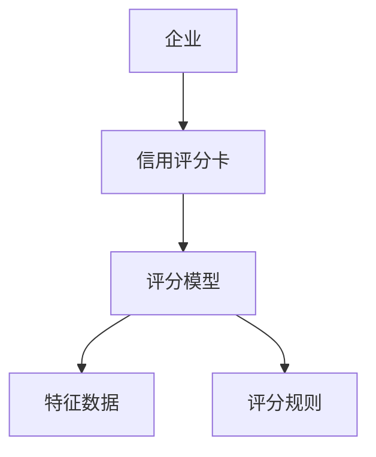
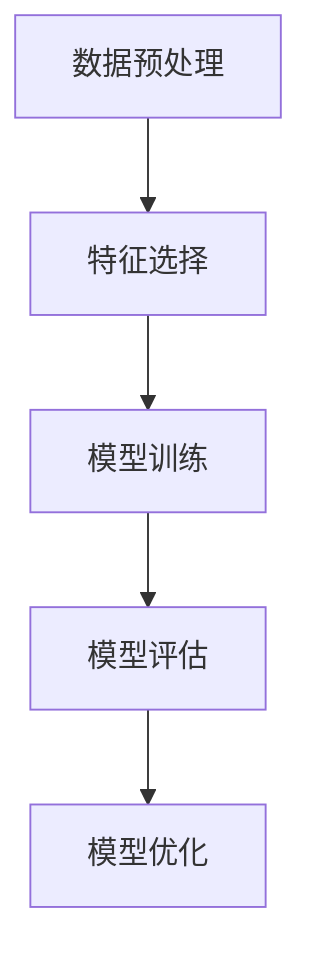
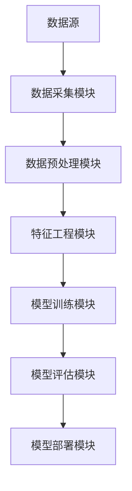

                 


# AI辅助的企业信用评分卡开发

> 关键词：AI，企业信用评分卡，机器学习，风险管理，评分模型，数据分析

> 摘要：本文详细探讨了AI技术在企业信用评分卡开发中的应用，从核心概念、算法原理到系统架构设计，再到项目实战，全面解析了如何利用AI技术提升企业信用评分的准确性和效率。文章结合实际案例，深入分析了AI在信用评分中的优势与挑战，为读者提供了从理论到实践的完整指南。

---

# 第1章: 企业信用评分卡概述

## 1.1 企业信用评分卡的定义与作用

企业信用评分卡是一种用于评估企业信用状况的工具，通过对企业的财务数据、经营状况、市场表现等多个维度的信息进行分析，生成一个量化评分，以反映企业的信用风险。信用评分卡在企业风险管理、贷款审批、供应链管理等领域具有重要的应用价值。

### 1.1.1 企业信用评分卡的定义
企业信用评分卡是基于企业历史数据和实时信息，通过特定的算法和模型计算出的信用评分。评分结果通常以分数形式呈现，分数越高表示企业的信用风险越低，反之亦然。

### 1.1.2 信用评分卡在企业风险管理中的作用
信用评分卡的主要作用包括：
- **信用风险评估**：帮助企业识别潜在的财务风险。
- **贷款审批决策**：银行或金融机构可以根据评分卡结果快速做出贷款审批决策。
- **供应链管理**：企业可以利用评分卡选择可靠的供应商和合作伙伴。
- **投资决策支持**：投资者可以通过评分卡评估企业的信用状况，做出投资决策。

### 1.1.3 信用评分卡的分类与应用场景
信用评分卡可以根据评分对象、评分方法、评分模型等进行分类。常见的应用场景包括：
- **银行贷款审批**：评估企业的还款能力。
- **供应链管理**：评估供应商的信用风险。
- **投资决策支持**：评估目标企业的信用状况。

## 1.2 AI技术在信用评分卡开发中的应用

AI技术的引入极大地提升了信用评分卡的开发效率和准确性。通过机器学习算法，AI可以从海量数据中提取特征，自动优化模型参数，从而提高评分的准确性。

### 1.2.1 AI技术在信用评分中的优势
- **数据处理能力**：AI能够处理大量非结构化数据，如文本、图像等，提取有用的特征信息。
- **模型优化**：AI可以通过自动化调参和模型优化算法，提升模型的性能。
- **实时更新**：AI可以实时更新模型，适应市场变化和企业经营状况的变化。

### 1.2.2 AI技术如何提升信用评分的准确性
AI技术通过以下方式提升信用评分的准确性：
- **特征工程**：利用机器学习算法自动提取特征，避免人工特征工程的主观性。
- **模型选择**：通过交叉验证和网格搜索选择最优模型。
- **模型融合**：将多个模型的预测结果进行融合，进一步提升评分的准确性。

### 1.2.3 AI技术在信用评分卡开发中的具体应用案例
例如，某银行利用AI技术开发了一款企业信用评分卡，通过对企业财务数据、市场表现、行业风险等多维度信息进行分析，生成企业信用评分。该评分卡帮助企业快速识别高风险客户，降低了不良贷款率。

---

# 第2章: 企业信用评分卡开发的背景与挑战

## 2.1 传统信用评分卡开发的局限性

传统信用评分卡开发过程中存在诸多问题，主要体现在数据处理、模型开发和模型维护三个方面。

### 2.1.1 数据获取与处理的难点
- **数据不完整**：企业财务数据可能存在缺失，导致模型无法准确评分。
- **数据异构性**：不同来源的数据格式和结构可能不同，增加了数据处理的难度。
- **数据噪声**：数据中可能包含大量噪声，影响模型的准确性。

### 2.1.2 模型开发的复杂性
- **特征选择**：传统方法需要手动选择特征，耗时且容易遗漏重要特征。
- **模型选择**：传统方法需要尝试多种模型，耗时且效率低下。
- **模型解释性**：传统模型（如线性回归）解释性较强，但复杂模型（如随机森林）解释性较差。

### 2.1.3 模型维护与更新的挑战
- **模型老化**：随着时间推移，模型可能因为数据分布的变化而失效，需要定期更新。
- **模型维护成本高**：传统模型维护需要大量人工干预，成本较高。

## 2.2 AI技术如何解决传统信用评分卡开发的痛点

AI技术的引入有效解决了传统信用评分卡开发中的诸多问题。

### 2.2.1 数据处理效率的提升
- **自动化数据清洗**：AI技术可以通过自动化算法清洗数据，减少人工干预。
- **特征工程自动化**：利用机器学习算法自动提取特征，提升数据处理效率。

### 2.2.2 模型开发与优化的自动化
- **自动化特征选择**：AI技术可以通过自动化算法选择最优特征，提高模型性能。
- **自动化模型选择**：通过交叉验证和网格搜索选择最优模型，减少人工干预。
- **自动化模型优化**：利用超参数优化算法（如随机搜索、网格搜索）自动优化模型参数。

### 2.2.3 模型维护与更新的智能化
- **实时更新**：AI技术可以通过在线学习算法实时更新模型，适应数据变化。
- **自动化监控**：通过自动化监控系统，及时发现模型性能下降的问题，进行模型更新。

---

# 第3章: 企业信用评分卡开发的核心概念与联系

## 3.1 核心概念原理

企业信用评分卡开发的核心概念包括信用评分、AI技术、评分模型等。

### 3.1.1 企业信用评分的核心要素
- **企业财务数据**：包括收入、利润、资产负债率等。
- **企业市场表现**：包括市场占有率、行业排名等。
- **企业经营状况**：包括经营稳定性、管理团队等。
- **外部信用评级**：包括第三方机构的信用评级。

### 3.1.2 AI技术在评分卡开发中的关键作用
- **数据处理**：AI技术可以处理大量复杂数据，提取有用特征。
- **模型开发**：AI技术可以通过机器学习算法构建评分模型。
- **模型优化**：AI技术可以通过自动化算法优化模型参数，提升模型性能。

### 3.1.3 评分卡开发的流程与阶段
评分卡开发通常包括以下几个阶段：
1. **数据收集**：收集企业的财务数据、市场数据等。
2. **数据预处理**：清洗数据，处理缺失值、异常值等。
3. **特征工程**：提取特征，选择重要特征。
4. **模型训练**：选择合适的模型，进行模型训练。
5. **模型评估**：评估模型性能，调整模型参数。
6. **模型部署**：将模型部署到实际应用场景中。

## 3.2 核心概念属性特征对比表格

表3-1：不同评分模型的特征对比

| 特征                | 传统评分模型           | AI评分模型            |
|---------------------|-----------------------|-----------------------|
| 数据处理能力        | 较低，依赖人工处理      | 高，自动化处理         |
| 模型复杂性          | 较低，模型简单         | 较高，模型复杂         |
| 模型解释性          | 较高，模型易于解释     | 较低，模型复杂难解释   |
| 模型性能            | 较低，准确率有限       | 较高，准确率较高        |
| 模型维护成本        | 较高，需要人工干预     | 较低，自动化维护        |

## 3.3 ER实体关系图架构



---

# 第4章: 企业信用评分卡开发的算法原理

## 4.1 常见算法概述

在企业信用评分卡开发中，常用的算法包括逻辑回归、支持向量机（SVM）、随机森林和神经网络。

### 4.1.1 逻辑回归
逻辑回归是一种常用的分类算法，常用于信用评分卡开发中的二分类问题（如违约与非违约）。

#### 4.1.1.1 逻辑回归的数学模型
$$ P(y=1|x) = \frac{e^{\beta_0 + \beta_1 x_1 + \beta_2 x_2 + \dots + \beta_n x_n}}{1 + e^{\beta_0 + \beta_1 x_1 + \beta_2 x_2 + \dots + \beta_n x_n}} $$

#### 4.1.1.2 逻辑回归的优点
- 模型解释性强。
- 实现简单，易于部署。

#### 4.1.1.3 逻辑回归的缺点
- 对非线性关系的拟合能力较弱。
- 对异常值敏感。

### 4.1.2 支持向量机（SVM）
SVM是一种基于统计学习理论的分类算法，适用于小样本、高维数据的分类问题。

#### 4.1.2.1 SVM的数学模型
$$ \text{目标函数} = \frac{1}{2}||\mathbf{w}||^2 + C \sum_{i=1}^{n} \xi_i $$
$$ \text{约束条件} = y_i (\mathbf{w} \cdot \mathbf{x_i} + b) \geq 1 - \xi_i $$
$$ \xi_i \geq 0 $$

#### 4.1.2.2 SVM的优点
- 对高维数据的处理能力强。
- 对噪声数据的鲁棒性较好。

#### 4.1.2.3 SVM的缺点
- 参数选择较多，调参复杂。
- 对数据分布敏感。

### 4.1.3 随机森林
随机森林是一种基于决策树的集成算法，适用于特征工程和模型解释性要求较高的场景。

#### 4.1.3.1 随机森林的数学模型
随机森林通过构建多棵决策树，并将每棵决策树的结果进行投票或平均，最终得到预测结果。

#### 4.1.3.2 随机森林的优点
- 模型解释性较好。
- 对异常值的鲁棒性较强。

#### 4.1.3.3 随机森林的缺点
- 计算复杂度较高。
- 对特征选择敏感。

### 4.1.4 神经网络
神经网络是一种基于深度学习的算法，适用于复杂非线性关系的建模。

#### 4.1.4.1 神经网络的数学模型
$$ y = \sigma(w_1 x_1 + w_2 x_2 + \dots + w_n x_n + b) $$
其中，$\sigma$ 是激活函数（如sigmoid函数）。

#### 4.1.4.2 神经网络的优点
- 对复杂非线性关系的拟合能力强。
- 可以自动提取特征。

#### 4.1.4.3 神经网络的缺点
- 模型解释性较差。
- 对计算资源需求较高。

## 4.2 算法流程图



## 4.3 算法实现代码

以下是基于逻辑回归算法的企业信用评分卡开发代码示例：

```python
import pandas as pd
from sklearn.linear_model import LogisticRegression
from sklearn.metrics import accuracy_score

# 数据预处理
data = pd.read_csv('credit_data.csv')
X = data.drop('target', axis=1)
y = data['target']

# 模型训练
model = LogisticRegression()
model.fit(X, y)

# 模型评估
y_pred = model.predict(X)
print("准确率：", accuracy_score(y, y_pred))
```

---

# 第5章: 企业信用评分卡开发的系统架构设计

## 5.1 系统功能设计

企业信用评分卡开发系统需要具备以下功能模块：
1. **数据采集**：从企业数据库中采集数据。
2. **数据预处理**：清洗数据，处理缺失值、异常值等。
3. **特征工程**：提取特征，选择重要特征。
4. **模型训练**：选择合适的模型，进行模型训练。
5. **模型评估**：评估模型性能，调整模型参数。
6. **模型部署**：将模型部署到实际应用场景中。

## 5.2 系统架构设计

### 5.2.1 系统架构图



### 5.2.2 系统功能模块

1. **数据采集模块**：负责从企业数据库中采集数据。
2. **数据预处理模块**：负责清洗数据，处理缺失值、异常值等。
3. **特征工程模块**：负责提取特征，选择重要特征。
4. **模型训练模块**：负责选择合适的模型，进行模型训练。
5. **模型评估模块**：负责评估模型性能，调整模型参数。
6. **模型部署模块**：负责将模型部署到实际应用场景中。

---

# 第6章: 企业信用评分卡开发的项目实战

## 6.1 项目环境安装

以下是开发企业信用评分卡所需的环境配置：

```bash
Python 3.8+
Scikit-learn
Pandas
NumPy
```

## 6.2 核心实现代码

以下是基于逻辑回归算法的企业信用评分卡开发代码示例：

```python
import pandas as pd
from sklearn.linear_model import LogisticRegression
from sklearn.metrics import accuracy_score

# 数据预处理
data = pd.read_csv('credit_data.csv')
X = data.drop('target', axis=1)
y = data['target']

# 模型训练
model = LogisticRegression()
model.fit(X, y)

# 模型评估
y_pred = model.predict(X)
print("准确率：", accuracy_score(y, y_pred))
```

## 6.3 代码应用解读与分析

上述代码实现了基于逻辑回归算法的企业信用评分卡开发。通过数据预处理、模型训练和模型评估三个步骤，最终得到了模型的准确率。

## 6.4 案例分析与详细讲解

以某银行为例，该银行希望通过开发企业信用评分卡来评估客户的信用风险。通过上述代码，该银行可以快速开发出一个基于逻辑回归算法的信用评分卡，评估客户的信用风险，从而做出贷款审批决策。

## 6.5 项目小结

通过本项目，我们可以看到AI技术在企业信用评分卡开发中的巨大优势。通过自动化数据处理、特征工程和模型优化，AI技术显著提升了信用评分的准确性和效率。

---

# 第7章: 最佳实践与小结

## 7.1 最佳实践 tips

- **数据处理**：在数据预处理阶段，建议对缺失值、异常值进行合理的处理。
- **模型选择**：在模型选择阶段，建议通过交叉验证选择最优模型。
- **模型优化**：在模型优化阶段，建议通过超参数优化算法自动优化模型参数。
- **模型部署**：在模型部署阶段，建议通过API接口将模型集成到实际应用场景中。

## 7.2 小结

本文详细探讨了AI技术在企业信用评分卡开发中的应用，从核心概念、算法原理到系统架构设计，再到项目实战，全面解析了如何利用AI技术提升企业信用评分的准确性和效率。通过自动化数据处理、特征工程和模型优化，AI技术显著提升了信用评分卡的开发效率和性能。

---

# 作者：AI天才研究院/AI Genius Institute & 禅与计算机程序设计艺术 /Zen And The Art of Computer Programming

---

感谢您的阅读！如果需要进一步了解相关内容，欢迎关注我们的技术博客或联系我们。

