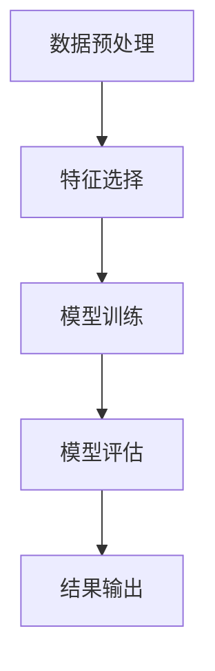
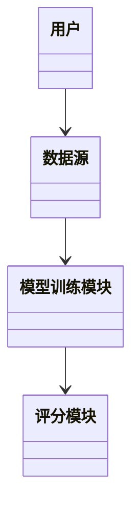
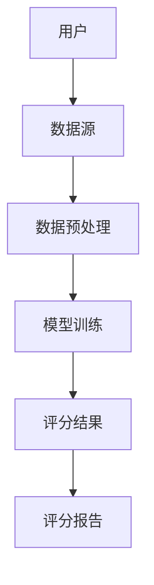
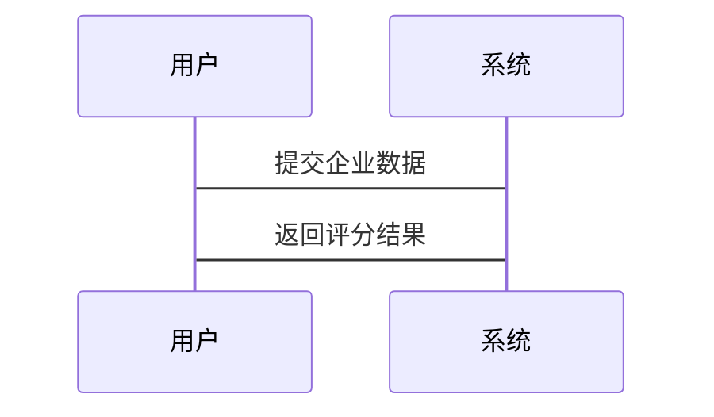

                 


# AI辅助的企业信用评分卡验证

## 关键词：企业信用评分卡, AI技术, 机器学习, 评分模型, 风险管理

## 摘要：  
随着人工智能技术的迅速发展，AI在企业信用评分卡验证中的应用越来越广泛。本文深入探讨了企业信用评分卡的核心概念、AI技术在评分中的应用原理，以及系统设计与实现。通过分析传统信用评分卡的局限性，本文提出了基于AI的解决方案，并详细介绍了逻辑回归、决策树和神经网络等算法的原理和实现。最后，通过实际案例分析，展示了AI辅助的企业信用评分卡验证的效果，并总结了最佳实践和未来发展趋势。

---

## 第1章: 企业信用评分卡的背景与问题背景

### 1.1 企业信用评分卡的定义与作用

#### 1.1.1 信用评分卡的基本概念
企业信用评分卡是一种用于评估企业信用状况的工具，通过对企业的财务数据、经营状况、市场表现等多个维度进行分析，生成一个综合评分，帮助金融机构或合作伙伴评估企业的信用风险。

#### 1.1.2 信用评分卡在企业中的作用
- **风险控制**：通过评分卡，金融机构可以识别高风险企业，降低坏账率。
- **决策支持**：评分卡为信贷审批、投资决策提供数据支持。
- **优化流程**：自动化评分卡可以提高评估效率，减少人为错误。

#### 1.1.3 信用评分卡的分类与应用场景
- **按行业分类**：如银行、供应链金融等。
- **按评分标准分类**：如基于财务数据、基于市场表现等。

### 1.2 传统信用评分卡的局限性

#### 1.2.1 传统评分方法的不足
传统评分卡通常基于简单的财务指标，难以捕捉企业的复杂风险因素。

#### 1.2.2 数据量与复杂性带来的挑战
随着企业规模的扩大，数据维度增加，传统模型难以处理高维数据。

#### 1.2.3 传统模型的可解释性问题
复杂的模型可能导致评分结果缺乏透明性，影响决策者的信任。

### 1.3 AI技术在信用评分中的应用前景

#### 1.3.1 AI技术如何提升信用评分的准确性
通过机器学习算法，AI能够挖掘数据中的非线性关系，提高评分的准确性。

#### 1.3.2 AI在信用评分中的优势
- **数据处理能力强**：能够处理大量非结构化数据。
- **实时性高**：可以快速响应企业信用变化。
- **可解释性增强**：通过模型解释技术，提升决策透明性。

#### 1.3.3 未来发展趋势与挑战
AI技术将推动信用评分卡向智能化、个性化方向发展，但数据隐私和模型解释性仍需进一步解决。

---

## 第2章: 企业信用评分卡的核心概念与联系

### 2.1 核心概念的定义与属性特征对比

#### 2.1.1 信用评分卡的构成要素
- **企业信息**：包括注册资本、成立时间等。
- **财务数据**：如资产负债表、利润表。
- **市场表现**：包括市场份额、行业排名等。

#### 2.1.2 各要素的属性特征对比
| 要素 | 属性 | 描述 |
|------|------|------|
| 企业信息 | 数量型 | 如注册资本大小 |
| 财务数据 | 比率型 | 如资产负债率 |
| 市场表现 | 类型型 | 如行业排名 |

#### 2.1.3 ER实体关系图的构建
```mermaid
erd
entity 企业 {
    key 企业ID
    属性 企业名称、注册资本、成立时间
}
entity 财务数据 {
    key 财务ID
    属性 资产、负债、利润
}
entity 市场表现 {
    key 市场ID
    属性 市场份额、行业排名
}
企业 -[1:N]-> 财务数据
企业 -[1:N]-> 市场表现
```

### 2.2 核心概念的原理与联系

#### 2.2.1 信用评分卡的评分逻辑
评分卡通过加权计算各要素的分数，得出综合评分，通常采用线性回归模型。

#### 2.2.2 AI技术在评分中的应用原理
AI通过特征工程、模型训练和结果优化，提升评分的准确性和鲁棒性。

#### 2.2.3 各要素之间的关系分析
企业信息和财务数据直接影响信用评分，而市场表现则间接影响评分结果。

---

## 第3章: AI辅助信用评分卡的算法原理

### 3.1 常用算法介绍

#### 3.1.1 逻辑回归模型
逻辑回归通过sigmoid函数将线性回归的结果映射到概率空间。

#### 3.1.2 决策树与随机森林
决策树通过树状结构进行分类，随机森林则通过集成多个决策树提升准确率。

#### 3.1.3 神经网络模型
神经网络通过多层感知机模拟非线性关系，适用于复杂数据的处理。

### 3.2 算法流程图



### 3.3 算法实现

#### 3.3.1 逻辑回归模型的数学公式
$$ P(y=1|x) = \frac{1}{1 + e^{-\beta x}} $$

#### 3.3.2 决策树的分类原理
通过特征分裂构建树状结构，最终预测类别。

#### 3.3.3 神经网络的结构与训练过程
神经网络通过反向传播算法优化权重，提升模型性能。

---

## 第4章: 系统分析与架构设计

### 4.1 项目背景与目标

#### 4.1.1 项目背景介绍
本项目旨在通过AI技术优化企业信用评分卡的验证流程。

#### 4.1.2 项目目标设定
开发一个基于机器学习的企业信用评分系统，提升评分的准确性和效率。

### 4.2 系统功能设计

#### 4.2.1 领域模型设计


### 4.3 系统架构设计



### 4.4 系统接口设计

#### 4.4.1 API接口定义
- **输入接口**：企业数据输入。
- **输出接口**：评分结果输出。

#### 4.4.2 接口交互流程


---

## 第5章: 项目实战

### 5.1 环境安装

#### 5.1.1 安装Python
安装Python 3.x版本，建议使用Anaconda。

#### 5.1.2 安装依赖库
安装pandas、scikit-learn、xgboost等库。

### 5.2 核心代码实现

#### 5.2.1 数据预处理
```python
import pandas as pd
data = pd.read_csv('企业数据.csv')
```

#### 5.2.2 特征选择
```python
from sklearn.feature_selection import SelectKBest
selector = SelectKBest(k=10)
selected_features = selector.fit_transform(data, target)
```

#### 5.2.3 模型训练
```python
from sklearn.ensemble import RandomForestClassifier
model = RandomForestClassifier(n_estimators=100)
model.fit(selected_features, target)
```

### 5.3 案例分析

#### 5.3.1 数据分析与结果解读
通过对企业的财务数据和市场表现进行分析，得出评分结果。

#### 5.3.2 模型优化与调参
调整模型参数，提升评分准确率。

### 5.4 项目小结
通过实际案例分析，验证了AI技术在企业信用评分中的有效性。

---

## 第6章: 最佳实践

### 6.1 小结与经验总结

#### 6.1.1 核心经验总结
- 数据预处理是关键。
- 模型选择需结合实际场景。
- 模型解释性需重点关注。

### 6.2 注意事项

#### 6.2.1 数据隐私保护
确保数据处理过程中的隐私保护。

#### 6.2.2 模型解释性
确保评分结果的透明性，便于决策者理解。

### 6.3 拓展阅读

#### 6.3.1 推荐书籍
- 《机器学习实战》
- 《Python机器学习》

#### 6.3.2 推荐博客
- Towards Data Science
- Analytics Vidhya

---

## 附录

### 附录A: 数据集说明
数据集包括企业财务数据、市场表现等多维度信息。

### 附录B: 工具安装指南
详细说明如何安装Python和相关库。

### 附录C: 核心代码参考
提供完整的代码示例，方便读者参考。

---

## 作者：AI天才研究院 & 禅与计算机程序设计艺术  
通过本文的详细讲解，读者可以系统地了解AI辅助的企业信用评分卡验证的理论与实践。如需进一步探讨或交流，欢迎关注我们的博客或社交媒体账号。

