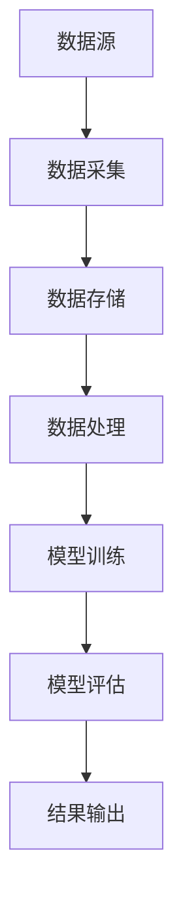

                 


# AI辅助的企业信用评级模型校准

> **关键词**：AI辅助、企业信用评级、模型校准、机器学习、深度学习、特征工程  
> **摘要**：随着人工智能技术的快速发展，企业信用评级模型的校准变得越来越重要。本文将从企业信用评级的基本概念出发，探讨AI在模型校准中的应用，详细分析模型校准的核心原理、算法选择、特征工程等关键环节，结合实际案例和代码实现，为企业信用评级模型的优化提供有价值的参考。

---

# 第一部分: AI辅助的企业信用评级模型校准概述

## 第1章: 企业信用评级与AI辅助的背景介绍

### 1.1 企业信用评级的基本概念

#### 1.1.1 信用评级的定义与作用
企业信用评级是通过对企业的财务状况、经营能力、市场表现等多方面因素的综合评估，确定企业在一定期限内履行债务能力的等级。信用评级不仅帮助企业获得融资，还能为投资者、银行等机构提供重要的决策依据。

#### 1.1.2 企业信用评级的核心要素
- **财务状况**：包括资产负债表、利润表、现金流等。
- **经营能力**：如收入增长率、利润率、市场占有率等。
- **信用历史**：企业的还款记录和违约情况。
- **行业风险**：所在行业的竞争状况、政策影响等。

#### 1.1.3 信用评级的分类与应用场景
企业信用评级通常分为内部评级和外部评级。内部评级由企业自行或委托第三方机构进行，而外部评级则由专业评级机构发布，如穆迪、标普等。应用场景包括贷款审批、投资决策、债券发行等。

### 1.2 传统企业信用评级的局限性

#### 1.2.1 传统评级方法的不足
传统信用评级主要依赖人工经验和简单的财务指标，存在以下问题：
- 数据维度有限，难以捕捉企业全貌。
- 人工经验主观性强，容易受个体偏见影响。
- 评级效率低，难以应对海量数据和实时需求。

#### 1.2.2 数据采集与处理的挑战
传统评级依赖财务报表，忽视了非财务数据，如社交媒体数据、供应链信息等。这些数据可能提供额外的风险信号，但传统方法难以整合。

#### 1.2.3 人工经验的局限性与主观性
人工评级依赖主观判断，可能导致评级结果的不一致性和偏差。特别是在面对复杂市场环境时，人工经验难以准确反映企业的真实信用状况。

### 1.3 AI辅助信用评级的变革

#### 1.3.1 AI在信用评级中的应用潜力
AI技术（如机器学习、深度学习）能够处理海量数据，发现隐藏的模式和关系，从而提高信用评级的准确性和效率。

#### 1.3.2 数据驱动与模型驱动的结合
AI通过数据驱动的方法，结合模型驱动的理论，能够更全面地分析企业的信用状况。例如，利用自然语言处理（NLP）分析企业新闻、社交媒体数据，提取情感指标作为信用评级的补充依据。

#### 1.3.3 企业信用评级AI化的未来趋势
随着大数据和AI技术的不断发展，信用评级将更加依赖数据驱动的模型。未来，实时监控、动态调整评级将成为可能。

---

## 第2章: 企业信用评级模型校准的核心概念

### 2.1 模型校准的基本原理

#### 2.1.1 模型校准的定义
模型校准是指通过调整模型参数或优化模型结构，使模型预测结果更接近实际值的过程。在企业信用评级中，校准的目标是提高模型的准确性和可靠性。

#### 2.1.2 校准的目标与意义
- **目标**：提高模型的预测精度，减少误判和漏判。
- **意义**：校准后的模型能够更好地反映企业的信用状况，为决策提供可靠依据。

#### 2.1.3 校准过程中的关键因素
- 数据质量：数据的完整性和准确性直接影响校准效果。
- 特征选择：选择合适的特征能够提高模型的解释力。
- 模型选择：不同模型适用于不同的场景。

### 2.2 企业信用评级中的特征工程

#### 2.2.1 数据特征的分类与选择
企业信用评级的特征可以分为财务特征、非财务特征和文本特征：
- **财务特征**：收入、利润、负债等。
- **非财务特征**：市场占有率、行业风险等。
- **文本特征**：新闻、公告中的关键词。

#### 2.2.2 数据预处理与特征提取
- 数据清洗：处理缺失值、异常值。
- 特征提取：利用NLP技术提取文本特征。
- 标准化：对数值特征进行标准化或归一化处理。

#### 2.2.3 特征的重要性评估
通过特征重要性分析（如随机森林的特征重要性得分），确定哪些特征对信用评级影响最大。

### 2.3 常见的信用评级模型算法

#### 2.3.1 逻辑回归模型
逻辑回归适用于二分类问题，常用于预测企业违约概率。模型公式：
$$ P(y=1|x) = \frac{1}{1 + e^{-\beta x}} $$

#### 2.3.2 支持向量机（SVM）
SVM适用于小样本数据，能够处理非线性问题。模型公式：
$$ \text{maximize} \quad \frac{1}{2}\|w\|^2 $$
$$ \text{subject to} \quad y_i(w \cdot x_i + b) \geq 1 $$

#### 2.3.3 随机森林与梯度提升树
随机森林和梯度提升树（如XGBoost）是集成学习方法，能够处理高维数据，适合企业信用评级。

#### 2.3.4 神经网络与深度学习模型
深度学习模型（如LSTM、Transformer）能够捕捉复杂的数据模式，适用于处理时间序列数据或文本数据。

---

## 第3章: AI辅助模型校准的核心原理

### 3.1 数据驱动的校准方法

#### 3.1.1 数据清洗与特征工程
- 数据清洗：处理缺失值、异常值。
- 特征工程：提取关键特征，如财务指标、文本情感得分。

#### 3.1.2 基于机器学习的模型训练
选择合适的算法（如逻辑回归、XGBoost）进行模型训练，并通过交叉验证优化模型参数。

#### 3.1.3 模型评估与调优
使用ROC曲线、AUC值等指标评估模型性能，并通过网格搜索等方法调优参数。

### 3.2 常见模型校准算法对比

#### 3.2.1 算法对比表格
| 算法       | 优点                          | 缺点                          |
|------------|-------------------------------|-------------------------------|
| 逻辑回归   | 简单、解释性强                 | 非线性关系处理能力有限         |
| SVM         | 适用于小样本数据               | 调参复杂                      |
| 随机森林   | 高维数据表现好                 | 易受噪声影响                   |
| XGBoost     | 高效、准确                     | 易过拟合                      |

#### 3.2.2 算法优缺点分析
- 逻辑回归适合线性关系，但处理非线性问题时表现不佳。
- SVM适用于小样本，但在大数据场景下效率较低。
- 随机森林和XGBoost适合高维数据，但需要处理超参数调优。

### 3.3 基于AI的模型校准流程

#### 3.3.1 数据采集与预处理
- 数据来源：企业财务报表、新闻数据、行业报告等。
- 数据预处理：清洗、标准化、特征提取。

#### 3.3.2 模型选择与训练
- 选择合适的算法，进行模型训练。
- 使用交叉验证评估模型性能。

#### 3.3.3 模型评估与优化
- 使用ROC曲线、混淆矩阵等指标评估模型。
- 调整模型参数，优化性能。

#### 3.3.4 模型部署与应用
- 将模型部署到生产环境，实时预测企业信用风险。
- 监控模型性能，定期重新训练和优化。

---

# 第二部分: 企业信用评级模型校准的数学基础

## 第4章: 企业信用评级模型校准的数学基础

### 4.1 常见模型的数学公式

#### 4.1.1 逻辑回归模型公式
$$ P(y=1|x) = \frac{1}{1 + e^{-\beta x}} $$

#### 4.1.2 支持向量机（SVM）公式
$$ \text{maximize} \quad \frac{1}{2}\|w\|^2 $$
$$ \text{subject to} \quad y_i(w \cdot x_i + b) \geq 1 $$

#### 4.1.3 随机森林算法原理
随机森林通过构建多棵决策树，并行投票决定最终预测结果。

### 4.2 模型评估

---

# 第三部分: 系统分析与架构设计方案

## 第5章: 企业信用评级模型校准的系统架构设计

### 5.1 问题场景介绍
企业信用评级模型需要处理大量数据，包括财务数据、文本数据等，并实时更新模型。

### 5.2 系统功能设计

#### 5.2.1 数据采集模块
- 数据来源：企业财务报表、新闻数据等。
- 数据格式：结构化数据和非结构化数据。

#### 5.2.2 数据处理模块
- 数据清洗：处理缺失值、异常值。
- 特征提取：提取关键特征。

#### 5.2.3 模型训练模块
- 算法选择：逻辑回归、XGBoost等。
- 模型调优：交叉验证、参数优化。

#### 5.2.4 模型评估模块
- 评估指标：ROC曲线、AUC值等。
- 结果输出：信用评级结果、模型性能报告。

### 5.3 系统架构设计

#### 5.3.1 系统架构图


#### 5.3.2 系统接口设计
- 数据接口：数据输入和输出接口。
- 模型接口：模型训练和预测接口。

#### 5.3.3 系统交互图
```mermaid
sequenceDiagram
    actor 用户
    节点 数据采集
    节点 数据处理
    节点 模型训练
    节点 模型评估
    用户 -> 数据采集: 提供数据源
    数据采集 -> 数据处理: 数据预处理
    数据处理 -> 模型训练: 训练模型
    模型训练 -> 模型评估: 评估模型性能
    模型评估 -> 用户: 返回信用评级结果
```

---

# 第四部分: 项目实战

## 第6章: 企业信用评级模型校准的实战案例

### 6.1 项目环境安装

#### 6.1.1 安装Python和相关库
```bash
pip install numpy pandas scikit-learn xgboost
```

#### 6.1.2 数据集准备
使用公开数据集（如Kaggle上的企业信用数据）或自建数据集。

### 6.2 系统核心实现源代码

#### 6.2.1 数据预处理代码
```python
import pandas as pd
from sklearn.preprocessing import StandardScaler

# 数据加载
df = pd.read_csv('企业信用数据.csv')

# 数据清洗
df.dropna(inplace=True)
df['标签'] = df['标签'].astype('int')

# 特征提取
features = df.drop('标签', axis=1)
target = df['标签']

# 特征标准化
scaler = StandardScaler()
features_scaled = scaler.fit_transform(features)
```

#### 6.2.2 模型训练代码
```python
from sklearn.model_selection import train_test_split
from xgboost import XGBClassifier
from sklearn.metrics import accuracy_score, roc_auc_score

# 数据分割
X_train, X_test, y_train, y_test = train_test_split(features_scaled, target, test_size=0.2, random_state=42)

# 模型训练
model = XGBClassifier(n_estimators=100, learning_rate=0.1, max_depth=3)
model.fit(X_train, y_train)

# 模型预测
y_pred = model.predict(X_test)
print("准确率:", accuracy_score(y_test, y_pred))
print("AUC值:", roc_auc_score(y_test, y_pred))
```

#### 6.2.3 模型优化代码
```python
from sklearn.model_selection import GridSearchCV

# 超参数搜索
param_grid = {
    'n_estimators': [50, 100, 150],
    'learning_rate': [0.05, 0.1, 0.15],
    'max_depth': [2, 3, 4]
}

grid_search = GridSearchCV(model, param_grid, cv=5)
grid_search.fit(X_train, y_train)

print("最佳参数:", grid_search.best_params_)
print("最佳模型准确率:", grid_search.best_score_)
```

### 6.3 实际案例分析

#### 6.3.1 数据分析与预处理
分析数据分布，处理缺失值和异常值。

#### 6.3.2 模型训练与评估
通过训练和测试数据，评估模型性能，并进行参数调优。

#### 6.3.3 结果解读
解释模型预测结果，分析误判原因，并提出改进建议。

### 6.4 项目小结
总结项目实施过程中的经验教训，提出改进建议。

---

# 第五部分: 最佳实践与未来展望

## 第7章: 企业信用评级模型校准的最佳实践

### 7.1 关键成功因素
- 数据质量：确保数据的完整性和准确性。
- 模型选择：根据数据特点选择合适的算法。
- 模型解释性：确保模型结果可解释。

### 7.2 需要注意的事项
- 数据隐私与安全：保护企业数据不被泄露。
- 模型更新：定期更新模型，适应市场变化。
- 模型解释性：避免“黑箱”模型，确保结果可解释。

### 7.3 未来展望
- 结合更多数据源：如社交媒体数据、供应链数据。
- 利用深度学习：捕捉更复杂的数据模式。
- 实时监控：动态调整信用评级。

---

# 第六部分: 总结

## 第8章: 总结

### 8.1 核心内容回顾
本文从企业信用评级的基本概念出发，探讨了AI在模型校准中的应用，详细分析了模型校准的核心原理、算法选择、特征工程等关键环节，并结合实际案例和代码实现，为企业信用评级模型的优化提供了有价值的参考。

### 8.2 未来研究方向
未来，随着AI技术的不断发展，企业信用评级模型将更加依赖数据驱动的模型。实时监控、动态调整评级将成为可能。

---

**作者：AI天才研究院/AI Genius Institute & 禅与计算机程序设计艺术/Zen And The Art of Computer Programming**

