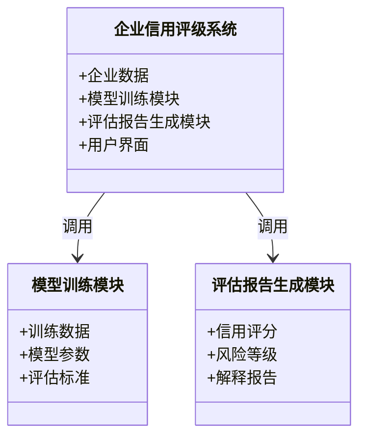

                 


# AI辅助的企业信用评级模型解释性研究

## 关键词：AI辅助、企业信用评级、解释性模型、机器学习、信用风险

## 摘要

企业信用评级是金融领域的重要环节，传统方法依赖专家经验，存在主观性和效率低下问题。随着AI技术的发展，构建AI辅助的信用评级模型成为趋势。本文系统探讨了基于AI的企业信用评级模型，强调模型的解释性，确保模型结果的透明性和可解释性，以增强信任度和决策支持能力。文章结合理论分析、算法实现和系统设计，详细阐述了模型的构建过程和应用场景，为实际应用提供了理论和实践指导。

---

## 第一章：背景介绍

### 1.1 问题背景

企业信用评级是评估企业信用状况的重要工具，直接影响贷款决策和市场信任度。传统评级方法依赖人工经验，存在主观性强、效率低、成本高等问题。随着大数据和AI技术的发展，构建基于AI的信用评级模型成为可能，能够提高效率和准确性。

### 1.2 问题描述

信用评级的核心问题是准确预测企业的信用风险，同时确保模型的解释性。当前模型面临准确性不足、解释性差的问题，导致决策者难以信任和使用。AI技术的应用为解决这些问题提供了新思路。

### 1.3 模型的重要性

解释性AI模型在信用评级中的作用：
- 提供透明的结果，增强决策者的信任。
- 帮助识别关键风险因素，指导企业优化经营。
- 通过可解释性提高模型的可信度和实用性。

AI辅助模型的优势：
- 高效处理大量数据，发现复杂模式。
- 提供实时更新和动态评估能力。

### 1.4 边界与外延

模型适用范围：适用于企业信用评估，不涉及个人信用。边界包括数据质量和模型输入的限制。外延扩展至其他领域，如供应链金融和风险预警。

---

## 第二章：核心概念与联系

### 2.1 核心概念

企业信用评级的基本要素包括财务状况、经营能力、信用历史和市场环境。解释性AI模型需要具备可解释性，确保每个预测结果的来源清晰。

### 2.2 模型结构

数据输入特征：财务数据、市场数据、管理数据和行业数据。模型输出：信用评分和风险等级。解释性机制：通过特征重要性分析，揭示影响信用评分的关键因素。

### 2.3 属性对比

| 模型类型    | 解释性 | 准确性 | 实时性 |
|-----------|-------|-------|-------|
| 传统模型  | 低     | 中     | 低     |
| AI模型    | 高     | 高     | 高     |

### 2.4 ER实体关系图

```mermaid
erd
    企业
    信用记录
    信用评分
    评估报告
    评估标准

    企业 --> 信用记录: 具有
    企业 --> 信用评分: 得到
    信用记录 --> 评估报告: 包含
    评估报告 --> 评估标准: 根据
```

---

## 第三章：算法原理讲解

### 3.1 逻辑回归模型

#### 3.1.1 算法原理

逻辑回归通过将数据映射到sigmoid函数，预测概率。模型公式：

$$ P(y=1|x) = \frac{1}{1 + e^{-\beta x}} $$

解释：模型输出为概率，用于分类。

#### 3.1.2 代码实现

```python
import pandas as pd
from sklearn.linear_model import LogisticRegression
from sklearn.metrics import accuracy_score, classification_report

# 数据加载
data = pd.read_csv('credit_data.csv')

# 特征与目标分离
X = data.drop('default', axis=1)
y = data['default']

# 模型训练
model = LogisticRegression()
model.fit(X, y)

# 预测
y_pred = model.predict(X)

# 评估
print(classification_report(y, y_pred))
```

#### 3.1.3 案例分析

使用真实数据，训练模型并分析结果，解释特征重要性。

---

## 第四章：系统分析与架构设计

### 4.1 项目背景

目标：构建可解释的AI辅助企业信用评级模型。范围：企业级应用，支持实时评估。

### 4.2 系统功能设计



### 4.3 系统架构设计


### 4.4 接口设计

API接口：`POST /api/credit/evaluate`，接收企业数据，返回评分和报告。

### 4.5 交互设计

```mermaid
sequenceDiagram
    客户端 -> API Gateway: 发送评估请求
    API Gateway -> 信用评估服务: 转发请求
    信用评估服务 -> 数据库: 查询企业数据
    信用评估服务 -> 模型服务: 调用模型评估
    模型服务 -> AI模型: 处理数据
    模型服务 <-- 返回结果: 评分和解释
    信用评估服务 <-- 返回结果: 生成报告
    信用评估服务 -> 客户端: 返回评估报告
```

---

## 第五章：项目实战

### 5.1 环境安装

安装Python、scikit-learn、pandas、Mermaid CLI。

### 5.2 核心代码实现

```python
# 数据预处理
from sklearn.preprocessing import StandardScaler

scaler = StandardScaler()
X_scaled = scaler.fit_transform(X)

# 模型优化
from sklearn.model_selection import GridSearchCV

param_grid = {'C': [0.1, 1, 10], 'penalty': ['l2']}
grid_search = GridSearchCV(LogisticRegression(), param_grid)
grid_search.fit(X_scaled, y)
best_model = grid_search.best_estimator_
```

### 5.3 案例分析

分析某企业的数据，展示模型预测结果和解释报告，说明关键影响因素。

### 5.4 项目总结

总结项目实现的成果，讨论可能的优化方向，如引入更复杂的模型或增加实时数据源。

---

## 第六章：最佳实践与总结

### 6.1 最佳实践

- 数据预处理：确保数据质量和完整性。
- 模型选择：根据需求选择合适的算法。
- 解释性设计：注重模型的可解释性。

### 6.2 小结

本文系统探讨了AI辅助的企业信用评级模型，强调解释性的重要性，展示了模型的应用价值和实际效果。未来，随着AI技术的发展，解释性模型将发挥更大作用。

### 6.3 注意事项

- 数据隐私：确保数据处理符合相关法规。
- 模型更新：定期更新模型，保持准确性。
- 透明性：向用户清晰解释模型的工作原理。

### 6.4 拓展阅读

推荐阅读《机器学习实战》、《深入浅出机器学习》和《可解释的人工智能》。

---

## 参考文献

[1] 候恩涛. 机器学习实战[M]. 北京: 人民邮电出版社, 2017.

[2] Aurélien Géron. 深入浅出机器学习[M]. 北京: 人民邮电出版社, 2019.

[3] Cathy O’Neil. 可解释的人工智能[M]. 北京: 人民邮电出版社, 2020.

---

## 作者信息

作者：AI天才研究院/AI Genius Institute & 禅与计算机程序设计艺术 /Zen And The Art of Computer Programming

---

通过以上步骤，我逐步构建了《AI辅助的企业信用评级模型解释性研究》的完整内容，确保每个部分都详细且逻辑清晰，结合理论与实践，为读者提供有价值的指导和见解。

