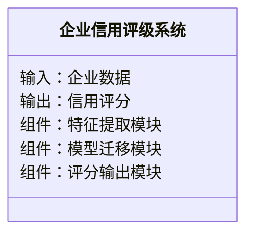

                 


# AI辅助的企业信用评级模型迁移

> 关键词：AI, 企业信用评级, 模型迁移, 迁移学习, 信用评分, 人工智能

> 摘要：随着人工智能技术的快速发展，企业信用评级的传统方法正在面临巨大挑战。传统的信用评级模型依赖于人工经验判断和简单的统计分析，难以适应大数据环境下的复杂信用评估需求。本文将探讨如何利用AI技术，特别是模型迁移方法，构建更高效、更准确的企业信用评级系统。文章从理论基础、算法原理、系统架构到实际应用，全面分析AI辅助的企业信用评级模型迁移的实现路径，为企业信用评估的智能化转型提供参考。

---

## 第1章: 背景介绍

### 1.1 问题背景与意义

#### 1.1.1 传统企业信用评级的局限性
传统的企业信用评级方法主要依赖于财务报表分析、行业经验判断和简单的统计模型。这种方法存在以下问题：
- 数据维度有限，难以捕捉企业经营的全貌。
- 模型更新周期长，难以适应市场环境的快速变化。
- 人工经验判断主观性强，存在人为误差。

#### 1.1.2 AI技术在信用评级中的应用潜力
AI技术，特别是机器学习和深度学习，能够从海量数据中提取非线性特征，发现传统方法难以察觉的模式。AI技术在信用评级中的应用潜力包括：
- 提高信用评估的准确性和效率。
- 实现自动化、实时化的信用评分。
- 通过模型迁移技术，快速适应不同行业和地区的信用评估需求。

#### 1.1.3 模型迁移的必要性与价值
在信用评级中，不同行业、不同地区的企业的信用特征可能存在显著差异。通过模型迁移技术，可以将已在某一领域表现优异的模型快速迁移到其他领域，降低模型训练成本，提高模型的泛化能力。

---

### 1.2 问题描述与目标

#### 1.2.1 信用评级的核心问题
信用评级的核心问题是如何准确评估企业的信用风险，包括以下几个方面：
- 企业的财务状况。
- 企业的经营能力。
- 企业的市场环境。
- 企业的信用历史。

#### 1.2.2 模型迁移的具体目标
模型迁移的目的是将已经在某一领域训练好的模型，快速适应新的领域或任务。具体目标包括：
- 降低新领域模型训练的成本。
- 提高模型的泛化能力。
- 实现跨领域、跨行业的信用评级。

#### 1.2.3 问题的边界与外延
本文讨论的模型迁移仅限于企业信用评级领域，不涉及个人信用评分。同时，本文主要关注模型迁移的实现方法和技术，不涉及具体业务流程的优化。

---

## 第2章: 核心概念与原理分析

### 2.1 核心概念

#### 2.1.1 企业信用评级的基本要素
企业信用评级的基本要素包括：
- 财务数据：收入、利润、资产负债率等。
- 经营数据：市场占有率、供应链稳定性等。
- 风险数据：行业风险、政策风险等。
- 信用历史：还款记录、违约历史等。

#### 2.1.2 AI辅助模型的核心功能
AI辅助模型的核心功能包括：
- 特征提取：从多维数据中提取关键特征。
- 模型训练：基于历史数据训练信用评分模型。
- 模型迁移：将已训练的模型迁移到新领域或任务。

#### 2.1.3 模型迁移的实现路径
模型迁移的实现路径包括：
1. 预训练模型：在通用数据集上训练一个基础模型。
2. 迁移任务：将模型迁移到特定领域或任务。
3. 微调模型：在目标领域数据上进行微调。

---

## 第3章: 算法原理与实现

### 3.1 迁移学习的算法原理

#### 3.1.1 特征提取与表示学习
特征提取是迁移学习的核心步骤。通过深度学习模型（如BERT、ResNet等）提取特征，可以将原始数据映射到一个低维的特征空间。

#### 3.1.2 知识蒸馏与模型压缩
知识蒸馏通过教师模型指导学生模型的学习，可以减少模型的复杂度，提高迁移效率。

---

### 3.2 算法实现

#### 3.2.1 基于预训练模型的迁移学习实现
```python
import torch
from transformers import BertForSequenceClassification

# 加载预训练模型
model = BertForSequenceClassification.from_pretrained('bert-base-uncased')

# 定义新任务的分类头
new_classifier = torch.nn.Linear(model.config.hidden_size, num_classes)
model.classifier = new_classifier

# 迁移训练
optimizer = torch.optim.Adam(model.parameters(), lr=1e-5)
criterion = torch.nn.CrossEntropyLoss()

for epoch in range(num_epochs):
    for batch in train_loader:
        inputs, labels = batch
        outputs = model(inputs)
        loss = criterion(outputs, labels)
        loss.backward()
        optimizer.step()
```

---

## 第4章: 系统架构与设计

### 4.1 系统功能设计

#### 4.1.1 领域模型设计


---

## 第5章: 项目实战与案例分析

### 5.1 环境安装与数据准备

#### 5.1.1 环境安装
```bash
pip install torch transformers pandas numpy
```

#### 5.1.2 数据准备
```python
import pandas as pd
data = pd.read_csv('credit_data.csv')
```

---

## 第6章: 最佳实践与总结

### 6.1 最佳实践

#### 6.1.1 模型选择
选择适合迁移学习的预训练模型，如BERT、ResNet等。

#### 6.1.2 数据预处理
对数据进行清洗、特征工程和归一化处理。

---

## 作者：AI天才研究院/AI Genius Institute & 禅与计算机程序设计艺术 /Zen And The Art of Computer Programming

