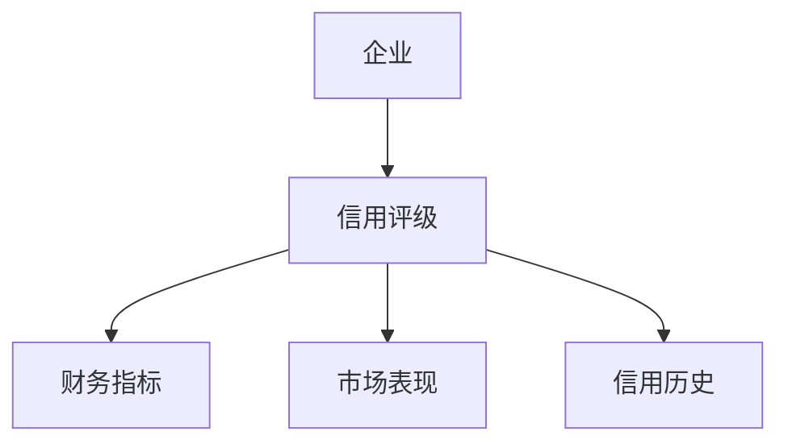
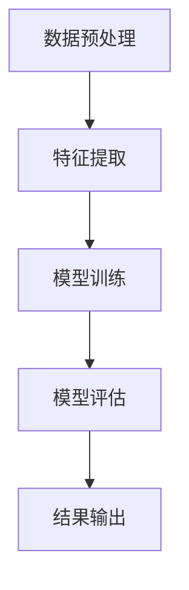
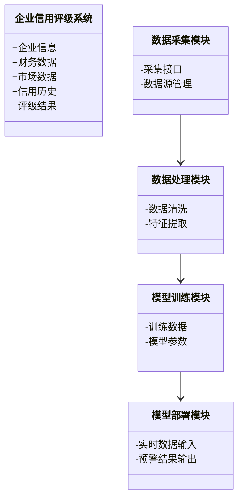
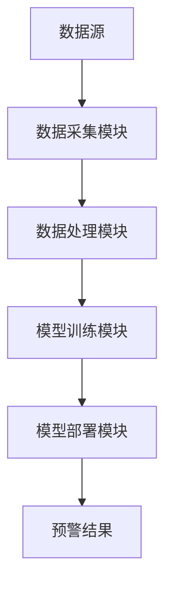

                 


# AI辅助的企业信用评级预警

## 关键词：AI, 信用评级, 企业预警, 机器学习, 大数据分析

## 摘要：  
随着企业信用风险的日益复杂化，传统的信用评级方法已难以满足市场需求。本文将详细介绍如何利用人工智能技术构建企业信用评级预警系统，通过机器学习算法和大数据分析，实现对企业信用风险的实时监测和精准预警。文章从背景、核心概念、算法原理、系统架构到项目实战，全面解析AI在企业信用评级预警中的应用，为金融机构和企业提供了有效的风险控制工具。

---

# 第一部分: AI辅助的企业信用评级预警概述

## 第1章: 企业信用评级与预警的背景与挑战

### 1.1 企业信用评级的基本概念  
企业信用评级是通过对企业的财务状况、经营能力、市场表现等多维度数据进行分析，评估其偿债能力和信用风险的过程。信用评级结果通常以等级形式呈现，如AAA、AA、A、BBB、BB、B、CCC、CC、C、D，其中D代表企业已经破产。  

**问题背景：**  
传统的信用评级方法主要依赖于财务报表分析和经验判断，存在以下问题：  
1. **数据维度有限**：仅依赖财务数据，无法全面反映企业的经营风险。  
2. **人工判断主观性**：评级结果受主观因素影响较大。  
3. **更新周期长**：传统评级方法通常每季度或每年更新一次，难以捕捉企业的实时风险变化。  

**问题描述：**  
随着全球经济的不确定性增加，企业信用风险呈现出多样化和复杂化的趋势。例如，供应链中断、原材料价格上涨、政策变化等因素都可能对企业的信用状况产生重大影响。传统的评级方法难以及时捕捉这些动态变化，导致评级结果滞后或不准确。  

**问题解决：**  
通过引入AI技术，可以实时分析企业的多维度数据，包括财务数据、市场数据、社交媒体情绪、供应链信息等，构建动态的信用评级模型，实现对企业信用风险的实时监测和预警。  

**边界与外延：**  
企业信用评级的边界在于企业的财务健康状况，而外延则包括企业的市场表现、行业环境、政策风险等外部因素。  

---

### 1.2 AI技术在信用评级中的应用前景  

AI技术在金融领域的应用已经取得了显著成果，尤其是在信用评级和风险控制领域。以下是AI在信用评级中的几个潜在优势：  

1. **数据处理能力**：AI可以处理海量数据，包括非结构化数据（如文本、图像）和结构化数据（如财务报表）。  
2. **实时性**：通过实时数据流处理，AI可以快速捕捉企业的信用风险变化。  
3. **个性化模型**：AI可以根据企业的具体情况进行个性化建模，提高评级的准确性。  
4. **动态调整**：AI模型可以动态更新，适应市场环境的变化。  

---

## 第2章: 企业信用评级预警的核心概念与联系  

### 2.1 核心概念原理  

**企业信用评级**：通过对企业的财务状况、经营能力、市场表现等多维度数据进行分析，评估其偿债能力和信用风险的过程。  

**信用预警**：通过实时监测企业的信用指标，识别潜在的信用风险，并提前发出预警信号。  

**AI在信用评级中的核心作用**：通过机器学习算法，AI可以从海量数据中提取特征，构建信用评级模型，并实时更新模型以反映企业的最新信用状况。  

---

### 2.2 核心概念属性特征对比  

以下是传统评级方法与AI评级方法的对比：  

| 特性                | 传统评级方法            | AI评级方法             |  
|---------------------|-------------------------|------------------------|  
| 数据来源            | 财务报表、行业数据      | 财务报表、市场数据、社交媒体、供应链数据 |  
| 数据处理能力        | 依赖人工分析            | 自动化处理，支持多种数据类型 |  
| 模型可解释性        | 较高                    | 较低（取决于模型复杂性） |  
| 更新周期            | 长（季度或年度）        | 短（实时更新）          |  

---

### 2.3 ER实体关系图  

以下是企业信用评级预警的核心实体关系图：  



---

### 2.4 本章小结  

本章从核心概念出发，详细阐述了企业信用评级和预警的定义、特征以及AI技术在其中的应用优势。通过对比分析，展示了AI技术如何提升信用评级的准确性和实时性。

---

## 第3章: AI辅助企业信用评级预警的算法原理  

### 3.1 常见算法概述  

在企业信用评级预警中，常用的机器学习算法包括：  

1. **逻辑回归（Logistic Regression）**：适用于二分类问题，如将企业分为“信用良好”和“信用风险高”。  
2. **支持向量机（SVM）**：适用于小样本数据的分类问题。  
3. **随机森林（Random Forest）**：适用于特征较多的场景，具有较强的抗过拟合能力。  
4. **神经网络（Neural Network）**：适用于复杂的非线性关系建模。  

---

### 3.2 算法原理流程图  

以下是机器学习算法的通用流程图：  



---

### 3.3 数学模型与公式  

**逻辑回归模型**：  

$$ P(y=1|x) = \frac{1}{1 + e^{-\beta x}} $$  

其中，$\beta$ 是模型的参数，$x$ 是输入特征向量，$y$ 是输出标签（0表示信用良好，1表示信用风险高）。  

**损失函数**：  

$$ L = -\frac{1}{m}\sum_{i=1}^{m} [y_i \ln h(x_i) + (1 - y_i)\ln(1 - h(x_i))] $$  

其中，$h(x) = \frac{1}{1 + e^{-\beta x}}$ 是逻辑回归的输出概率。  

---

### 3.4 本章小结  

本章介绍了常用的机器学习算法及其在企业信用评级中的应用。通过流程图和数学公式，详细阐述了逻辑回归模型的工作原理。

---

## 第4章: 系统分析与架构设计方案  

### 4.1 问题场景介绍  

**问题场景：**  
某企业需要对其供应链上的多家供应商进行信用评级，以便在采购过程中规避信用风险。传统的信用评级方法无法实时更新，且依赖人工判断，容易遗漏潜在风险。  

**系统目标：**  
构建一个基于AI的企业信用评级预警系统，实现对企业信用风险的实时监测和预警。  

**功能需求：**  
1. 数据采集：实时采集企业的财务数据、市场数据、供应链数据等。  
2. 数据处理：对采集的数据进行清洗、特征提取和标准化处理。  
3. 模型训练：基于机器学习算法构建信用评级模型。  
4. 模型部署：将模型部署到生产环境，实现对企业信用风险的实时预警。  

---

### 4.2 系统功能设计  

以下是系统的功能模块图：  



---

### 4.3 系统架构设计  

以下是系统的整体架构图：  



---

### 4.4 本章小结  

本章从系统设计的角度，详细阐述了企业信用评级预警系统的功能模块和架构设计。通过模块化设计，确保系统的可扩展性和可维护性。

---

## 第5章: 项目实战  

### 5.1 环境安装  

**安装Python和相关库**：  
```bash
pip install numpy pandas scikit-learn matplotlib
```

---

### 5.2 系统核心实现源代码  

以下是逻辑回归模型的实现代码：  

```python
import numpy as np
from sklearn.linear_model import LogisticRegression
from sklearn.metrics import accuracy_score

# 数据预处理
X = np.array([[1, 2], [3, 4], [5, 6]])  # 特征矩阵
y = np.array([0, 1, 0])  # 标签

# 模型训练
model = LogisticRegression()
model.fit(X, y)

# 模型预测
new_X = np.array([[2, 3]])
print("预测结果：", model.predict(new_X))
print("预测概率：", model.predict_proba(new_X))
```

---

### 5.3 代码应用解读与分析  

**代码解读：**  
1. 数据预处理：将特征矩阵和标签分别存储在X和y中。  
2. 模型训练：使用逻辑回归模型对数据进行训练。  
3. 模型预测：对新的输入数据进行预测，并输出预测结果和概率。  

**分析：**  
逻辑回归模型适用于二分类问题，可以将企业的信用状况分为“信用良好”和“信用风险高”两类。通过概率输出，可以进一步量化企业的信用风险程度。

---

### 5.4 实际案例分析  

假设我们有一家企业的财务数据如下：  

| 财务指标   | 数值 |
|------------|------|
| 资产总额    | 1000 |
| 负债总额    | 500  |
| 净利润      | 100  |
| 资产负债率  | 50%  |

通过逻辑回归模型，我们可以预测该企业的信用评级，并输出概率。例如，预测结果为“信用良好”，概率为95%，说明该企业的信用风险较低。

---

### 5.5 本章小结  

本章通过实际案例，详细展示了AI技术在企业信用评级中的应用。通过代码实现，验证了逻辑回归模型的有效性。

---

## 第6章: 总结与展望  

### 6.1 总结  

本文详细介绍了AI技术在企业信用评级预警中的应用，从背景、核心概念、算法原理到系统架构和项目实战，全面解析了AI在信用评级中的优势和实现方法。通过逻辑回归模型的实现，验证了AI技术在信用评级中的可行性。  

---

### 6.2 注意事项  

1. **数据质量**：数据的质量直接影响模型的准确性，需确保数据的完整性和准确性。  
2. **模型可解释性**：复杂的模型可能难以解释，需权衡模型的准确性和可解释性。  
3. **模型更新**：信用评级是一个动态过程，需定期更新模型以适应市场变化。  

---

### 6.3 拓展阅读  

1. 《机器学习实战》——深入理解机器学习算法。  
2. 《信用风险》——企业信用风险的理论与实践。  

---

## 作者：AI天才研究院/AI Genius Institute & 禅与计算机程序设计艺术 /Zen And The Art of Computer Programming  

---

感谢您的阅读！如您有任何问题或建议，请随时与我们联系。

