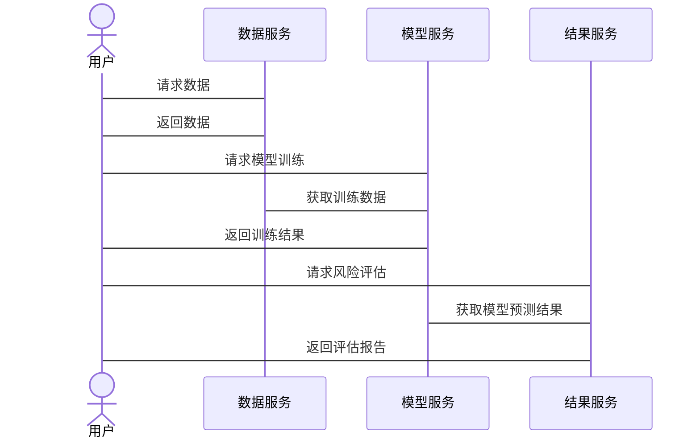

                 


# AI辅助的企业信用风险评估

> 关键词：AI，信用风险评估，企业信用，机器学习，风险管理，金融模型

> 摘要：本文深入探讨了AI技术在企业信用风险评估中的应用，分析了传统评估方法的局限性，介绍了基于机器学习的信用风险评估模型，详细讲解了核心算法及其数学原理，并通过实际案例展示了AI辅助信用风险评估的优势与挑战。

---

## 第1章: 企业信用风险评估概述

### 1.1 企业信用风险的基本概念
企业信用风险是指企业在履行其财务义务时发生违约的可能性。这种风险在金融领域尤为重要，因为企业违约可能导致债权人或投资者的重大损失。信用风险评估的核心目标是通过分析企业的财务状况、经营状况和信用历史，预测其违约的可能性。

#### 1.1.1 信用风险的定义
信用风险是指在信用交易中，债务人未能履行其债务义务而给债权人带来的损失风险。在企业信用风险评估中，我们需要关注企业的还款能力和还款意愿。

#### 1.1.2 信用风险的分类
企业信用风险可以分为系统性风险和非系统性风险。系统性风险是由宏观经济因素引起的，影响整个市场的风险；而非系统性风险则是由企业自身经营状况引起的，具有较高的可预测性。

#### 1.1.3 信用风险评估的重要性
信用风险评估是企业融资、投资决策和风险管理的重要组成部分。准确的信用风险评估可以帮助金融机构和投资者做出更明智的决策，降低潜在损失。

---

### 1.2 传统信用风险评估方法
传统的信用风险评估方法主要包括信用评分模型和专家评估法。

#### 1.2.1 信用评分模型
信用评分模型是通过对企业财务数据的分析，计算出一个信用评分，进而判断企业的信用风险等级。常用的信用评分模型包括Z分数模型和Altman模型。

#### 1.2.2 专家评估法
专家评估法依赖于经验丰富的专家对企业的经营状况、财务状况和行业环境进行主观判断。这种方法虽然灵活，但容易受到专家主观因素的影响。

#### 1.2.3 传统方法的优缺点
传统信用风险评估方法的优点是简单易懂，成本较低；缺点是评估结果可能存在较大的主观性，难以捕捉复杂的市场变化。

---

### 1.3 AI技术在信用风险评估中的应用背景
随着人工智能技术的发展，机器学习算法在金融领域的应用越来越广泛。AI技术能够通过大量的数据和复杂的模型，捕捉传统方法难以发现的信用风险因素。

#### 1.3.1 AI技术的发展与进步
近年来，深度学习、自然语言处理和强化学习等技术的快速发展，为信用风险评估提供了新的工具和方法。

#### 1.3.2 AI在金融领域的应用现状
AI技术已经在金融领域的信用评分、欺诈检测、市场预测等方面得到了广泛应用。

#### 1.3.3 信用风险评估中的AI优势
AI技术可以通过大数据分析和复杂的模型，提高信用风险评估的准确性和效率。同时，AI能够实时捕捉市场变化，帮助企业做出更及时的风险管理决策。

---

### 1.4 本章小结
本章介绍了企业信用风险的基本概念、传统评估方法及其优缺点，并探讨了AI技术在信用风险评估中的应用背景和优势。接下来，我们将深入分析企业信用风险的核心要素和关键指标。

---

## 第2章: 企业信用风险的核心要素

### 2.1 企业信用风险的核心要素
企业信用风险的核心要素包括企业的财务状况、经营状况和信用历史。

#### 2.1.1 企业财务状况
企业的财务状况是信用风险评估的重要依据。主要包括资产负债表、利润表和现金流量表等财务数据。

#### 2.1.2 企业经营状况
企业经营状况包括企业的行业地位、市场份额、管理团队和创新能力等。这些因素直接影响企业的经营能力和还款能力。

#### 2.1.3 企业信用历史
企业信用历史是衡量企业信用风险的重要指标。通过分析企业的信用记录，可以判断企业的还款意愿和信用可靠性。

---

### 2.2 信用风险评估的关键指标
信用风险评估的关键指标包括财务比率、信用评分指标和市场风险指标。

#### 2.2.1 财务比率分析
财务比率分析是通过对企业财务数据的计算和比较，评估企业的财务健康状况。常用的财务比率包括流动性比率、偿债能力比率和营运能力比率。

#### 2.2.2 信用评分指标
信用评分指标是通过对企业信用数据的分析，计算出一个信用评分，用以衡量企业的信用风险等级。

#### 2.2.3 市场风险指标
市场风险指标用于衡量企业所面临的外部市场风险，如行业风险和宏观经济风险。

---

### 2.3 信用风险评估的边界与外延
信用风险评估的边界是指评估的范围和限制，而外延则是指评估的扩展和延伸。

#### 2.3.1 信用风险的边界
信用风险的边界包括企业的财务数据、市场数据和信用历史等。这些数据是信用风险评估的基础。

#### 2.3.2 信用风险的外延
信用风险的外延包括企业的经营环境、行业风险和宏观经济因素等。这些因素虽然不在信用风险的直接评估范围内，但对企业的信用风险有重要影响。

#### 2.3.3 信用风险与其他金融风险的关系
信用风险与其他金融风险（如市场风险和操作风险）密切相关。例如，市场风险可能影响企业的财务状况，从而影响信用风险。

---

### 2.4 核心概念的ER实体关系图
以下是一个简单的ER实体关系图，展示了企业信用风险评估的核心要素。

```mermaid
erDiagram
    customer[客户]
    credit_record[信用记录]
    financial_data[财务数据]
    market_data[市场数据]
    risk_assessment[风险评估]
    customer --> credit_record : 具有
    customer --> financial_data : 包含
    customer --> market_data : 受影响
    credit_record --> risk_assessment : 影响
    financial_data --> risk_assessment : 影响
    market_data --> risk_assessment : 影响
```

---

### 2.5 本章小结
本章分析了企业信用风险的核心要素，包括财务状况、经营状况和信用历史，并介绍了信用风险评估的关键指标和边界。同时，通过ER实体关系图展示了核心概念之间的关系。接下来，我们将探讨AI技术在信用风险评估中的具体应用。

---

## 第3章: 常见AI算法在信用风险评估中的应用

### 3.1 逻辑回归模型
逻辑回归是一种常用的分类算法，广泛应用于信用风险评估。

#### 3.1.1 逻辑回归的原理
逻辑回归通过构建一个线性回归模型，将输入特征映射到一个概率空间，进而进行分类。

#### 3.1.2 逻辑回归的数学公式
逻辑回归的损失函数为对数似然函数：
$$ L(\theta) = -\sum_{i=1}^{n} [y_i \ln p_i + (1-y_i) \ln (1-p_i)] $$
其中，$p_i$ 是第i个样本的违约概率，$\theta$ 是模型参数。

#### 3.1.3 逻辑回归的实现步骤
1. 数据预处理：清洗数据，处理缺失值和异常值。
2. 特征选择：选择与信用风险相关的特征。
3. 模型训练：使用训练数据训练逻辑回归模型。
4. 模型评估：使用测试数据评估模型的性能。

#### 3.1.4 逻辑回归的优势与不足
逻辑回归的优势在于模型简单、易于解释；不足之处是对于非线性关系的处理能力较弱。

---

### 3.2 随机森林模型
随机森林是一种基于决策树的集成算法，具有较强的鲁棒性和泛化能力。

#### 3.2.1 随机森林的原理
随机森林通过构建多棵决策树，并对结果进行投票或平均，提高模型的准确性和稳定性。

#### 3.2.2 随机森林的实现步骤
1. 数据预处理：清洗数据，处理缺失值和异常值。
2. 特征选择：选择与信用风险相关的特征。
3. 模型训练：使用训练数据训练随机森林模型。
4. 模型评估：使用测试数据评估模型的性能。

---

### 3.3 支持向量机模型
支持向量机（SVM）是一种常用的分类算法，适用于高维数据的分类问题。

#### 3.3.1 SVM的原理
SVM通过构建一个超平面，将数据分成两类，使两类数据的间隔最大化。

#### 3.3.2 SVM的数学公式
SVM的目标是最小化以下目标函数：
$$ \frac{1}{2} \|w\|^2 + C \sum_{i=1}^{n} \xi_i $$
其中，$w$ 是模型参数，$C$ 是惩罚系数，$\xi_i$ 是松弛变量。

---

### 3.4 神经网络模型
神经网络是一种模拟人脑神经网络的深度学习模型，具有较强的非线性拟合能力。

#### 3.4.1 神经网络的原理
神经网络通过多层神经元网络，提取数据的特征，并进行分类或回归。

#### 3.4.2 神经网络的数学公式
神经网络的前向传播过程可以用以下公式表示：
$$ a^{(l+1)} = \sigma(w^{(l)} a^{(l)} + b^{(l)}) $$
其中，$a^{(l)}$ 是第l层的激活值，$w^{(l)}$ 是权重矩阵，$b^{(l)}$ 是偏置项，$\sigma$ 是激活函数。

---

### 3.5 本章小结
本章介绍了几种常用的AI算法在信用风险评估中的应用，包括逻辑回归、随机森林、支持向量机和神经网络模型。这些算法各有优缺点，适用于不同的数据特征和业务场景。

---

## 第4章: 系统分析与架构设计

### 4.1 问题场景介绍
信用风险评估系统需要处理大量的企业数据，包括财务数据、市场数据和信用历史等。

---

### 4.2 系统功能设计
系统功能设计包括数据采集、特征提取、模型训练、风险评估和结果输出。

#### 4.2.1 数据采集模块
数据采集模块负责从企业数据库中获取企业的财务数据、市场数据和信用历史等。

#### 4.2.2 特征提取模块
特征提取模块通过对数据的分析，提取与信用风险相关的特征，如财务比率和信用评分指标。

#### 4.2.3 模型训练模块
模型训练模块使用训练数据训练AI模型，生成信用风险评估模型。

#### 4.2.4 风险评估模块
风险评估模块使用测试数据评估模型的性能，并生成信用风险评估报告。

---

### 4.3 系统架构设计
系统架构设计采用微服务架构，主要包括数据服务、模型服务和结果服务。

#### 4.3.1 数据服务
数据服务负责数据的存储和管理，支持多种数据源的接入。

#### 4.3.2 模型服务
模型服务负责AI模型的训练和部署，支持多种算法的灵活配置。

#### 4.3.3 结果服务
结果服务负责信用风险评估结果的输出和展示，支持多种格式的报告生成。

---

### 4.4 系统接口设计
系统接口设计包括数据接口、模型接口和结果接口。

#### 4.4.1 数据接口
数据接口用于数据的输入和输出，支持多种数据格式的读取和写入。

#### 4.4.2 模型接口
模型接口用于AI模型的训练和预测，支持多种算法的调用和配置。

#### 4.4.3 结果接口
结果接口用于信用风险评估结果的输出和展示，支持多种格式的报告生成。

---

### 4.5 系统交互流程图
以下是一个简单的系统交互流程图。



---

### 4.6 本章小结
本章分析了信用风险评估系统的应用场景，设计了系统的功能模块和架构，并通过流程图展示了系统的交互过程。

---

## 第5章: 项目实战

### 5.1 环境配置
项目实战需要安装Python、Scikit-learn和XGBoost等Python库。

---

### 5.2 核心代码实现

#### 5.2.1 数据预处理
```python
import pandas as pd
import numpy as np

# 读取数据
data = pd.read_csv('企业信用数据.csv')

# 处理缺失值
data = data.dropna()

# 处理异常值
data = data[~(data['收入'] < 0)]
```

#### 5.2.2 特征选择
```python
# 选择特征
features = ['收入', '利润', '资产', '负债']
X = data[features]
y = data['违约标记']
```

#### 5.2.3 模型训练
```python
from sklearn.model_selection import train_test_split
from sklearn.linear_model import LogisticRegression
from sklearn.metrics import accuracy_score

# 划分训练集和测试集
X_train, X_test, y_train, y_test = train_test_split(X, y, test_size=0.2, random_state=42)

# 训练逻辑回归模型
model = LogisticRegression()
model.fit(X_train, y_train)

# 预测测试集
y_pred = model.predict(X_test)

# 评估模型性能
print('准确率:', accuracy_score(y_test, y_pred))
```

---

### 5.3 案例分析
以下是一个具体的案例分析，展示了如何使用逻辑回归模型进行信用风险评估。

#### 5.3.1 数据分析
分析企业的财务数据，计算企业的Z分数，判断企业的信用风险等级。

#### 5.3.2 模型训练
使用训练数据训练逻辑回归模型，生成信用风险评估模型。

#### 5.3.3 模型评估
使用测试数据评估模型的性能，计算准确率、召回率和F1分数。

#### 5.3.4 结果分析
分析模型的预测结果，判断企业的信用风险等级，并提出相应的风险管理建议。

---

### 5.4 本章小结
本章通过具体的案例分析，展示了如何使用AI技术进行信用风险评估。通过项目的实战，读者可以更好地理解信用风险评估的核心流程和关键技术。

---

## 第6章: 最佳实践与注意事项

### 6.1 最佳实践
在信用风险评估中，需要注意以下几点：

#### 6.1.1 数据质量
数据质量是信用风险评估的关键，需要确保数据的完整性、准确性和一致性。

#### 6.1.2 模型选择
选择合适的AI算法，根据数据特征和业务需求进行模型选择。

#### 6.1.3 模型调优
通过参数优化和特征工程，提高模型的准确性和稳定性。

#### 6.1.4 模型解释性
模型的解释性是信用风险评估的重要因素，需要确保模型的可解释性，以便更好地理解和应用模型。

---

### 6.2 小结
信用风险评估是一个复杂的过程，需要结合企业的财务状况、经营状况和信用历史，选择合适的AI算法进行模型训练和评估。

---

### 6.3 注意事项
在实际应用中，需要注意以下几点：

#### 6.3.1 数据隐私
保护企业的数据隐私，遵守相关法律法规。

#### 6.3.2 模型更新
定期更新模型，确保模型的准确性和及时性。

#### 6.3.3 风险管理
结合模型的预测结果，制定相应的风险管理策略。

---

### 6.4 拓展阅读
读者可以进一步阅读以下资料：

- 《信用风险评估与管理》
- 《机器学习实战》
- 《Python机器学习》

---

## 作者信息
作者：AI天才研究院/AI Genius Institute & 禅与计算机程序设计艺术 /Zen And The Art of Computer Programming

---

本文通过系统的分析和具体的案例，深入探讨了AI技术在企业信用风险评估中的应用。从传统的信用风险评估方法到现代的AI算法，再到系统的架构设计和项目实战，为读者提供了一个全面的视角。希望本文能够为信用风险评估领域的研究和实践提供有价值的参考。

