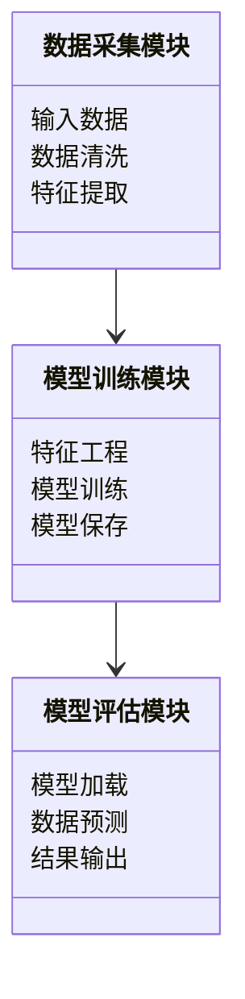

                 


# AI辅助的企业并购协同效应量化模型

## 关键词：企业并购、协同效应、AI辅助、量化模型、算法实现

## 摘要：  
企业并购是企业战略发展的重要手段，而协同效应是决定并购成功与否的关键因素。本文提出了一种基于人工智能的协同效应量化模型，通过数据分析和算法优化，帮助企业精准评估并购后的协同效应，降低并购风险，提升企业价值。

---

## 第1章: 企业并购与协同效应概述

### 1.1 企业并购的基本概念

#### 1.1.1 企业并购的定义与类型  
企业并购是指一家企业收购或合并另一家企业，以实现资源优化配置和战略目标。常见的并购类型包括：  
- **横向并购**：同一行业内的并购，旨在扩大市场份额。  
- **纵向并购**：上下游产业的并购，优化供应链。  
- **混合并购**：跨界并购，进入新领域或多元化发展。  

#### 1.1.2 并购的动机与目标  
企业进行并购的主要动机包括：  
1. **扩大市场份额**：通过并购快速进入新市场或区域。  
2. **获取技术或资源**：通过并购获得关键技术、专利或优质资产。  
3. **降低成本**：通过规模效应或协同效应降低运营成本。  
4. **多元化经营**：通过并购分散风险，增强企业抗风险能力。  

#### 1.1.3 协同效应的定义与分类  
协同效应是指企业在并购后通过整合资源、优化流程、共享能力和经验而产生的额外价值。协同效应的分类包括：  
- **成本协同效应**：通过整合供应链、共享资源降低成本。  
- **收入协同效应**：通过市场协同、产品互补提升收入。  
- **创新协同效应**：通过技术共享和知识整合提升创新能力。  

---

### 1.2 协同效应的重要性

#### 1.2.1 协同效应在企业并购中的作用  
协同效应是企业并购成功的核心驱动力，它直接影响并购后的企业价值和股东回报。  

#### 1.2.2 协同效应的衡量标准  
常用的衡量标准包括：  
- **协同效应的量化指标**：如协同效应比例（协同价值占并购交易额的比例）。  
- **协同效应的实现时间**：短期协同效应 vs 长期协同效应。  

#### 1.2.3 协同效应的实现路径  
实现协同效应的关键路径包括：  
1. **战略规划**：明确并购目标和协同效应的具体方向。  
2. **组织整合**：优化组织架构，确保资源整合高效。  
3. **文化融合**：促进企业文化的融合，减少内部冲突。  

---

### 1.3 AI技术在企业并购中的应用背景

#### 1.3.1 AI技术对企业并购的影响  
人工智能技术的应用为企业的并购决策提供了数据支持和预测能力，能够帮助企业更精准地评估并购价值和风险。  

#### 1.3.2 AI在协同效应量化中的优势  
AI技术在协同效应量化中的优势包括：  
- **数据处理能力**：AI能够快速处理海量数据，提取关键特征。  
- **预测准确性**：通过机器学习算法，AI可以更准确地预测协同效应的实现情况。  
- **动态调整能力**：AI能够根据市场变化实时调整协同效应的评估模型。  

#### 1.3.3 当前AI辅助企业并购的现状与挑战  
当前，AI技术在企业并购中的应用还处于初级阶段，主要挑战包括：  
- 数据隐私和安全性问题。  
- 模型的泛化能力不足，难以适应不同行业和场景。  

---

### 1.4 本书的研究意义与目标

#### 1.4.1 研究背景与问题提出  
随着企业并购的复杂化，传统的协同效应评估方法已难以满足需求，亟需引入AI技术提升评估的精准性和效率。  

#### 1.4.2 研究目标与意义  
本文旨在构建一种基于AI的协同效应量化模型，为企业并购提供科学的决策支持，降低并购风险，提升企业价值。  

---

## 第2章: 协同效应量化模型的核心概念

### 2.1 协同效应的定义与分类

#### 2.1.1 协同效应的定义  
协同效应是指企业在并购后通过资源整合、优化流程和共享能力而产生的额外价值。  

#### 2.1.2 协同效应的分类  
协同效应可以分为以下几类：  
1. **成本协同效应**：通过整合供应链降低成本。  
2. **收入协同效应**：通过市场协同提升收入。  
3. **创新协同效应**：通过技术共享提升创新能力。  

---

### 2.2 协同效应量化模型的基本原理

#### 2.2.1 模型的输入与输出  
- **输入**：并购双方的财务数据、市场数据、技术数据等。  
- **输出**：协同效应的量化结果，包括协同效应的大小、实现时间等。  

#### 2.2.2 模型的假设与限制条件  
- 假设：并购双方资源整合充分，市场环境稳定。  
- 限制条件：模型仅适用于同行业或相关行业的并购。  

#### 2.2.3 模型的核心算法与实现步骤  
- 核心算法：基于机器学习的回归算法（如随机森林）。  
- 实现步骤：  
  1. 数据采集与预处理。  
  2. 特征工程：提取关键特征变量。  
  3. 模型训练与优化。  
  4. 模型验证与评估。  

---

### 2.3 协同效应量化模型的构建逻辑

#### 2.3.1 数据采集与预处理  
- 数据来源：并购双方的财务报表、市场数据、技术专利等。  
- 数据预处理：数据清洗、特征提取、数据归一化等。  

#### 2.3.2 模型训练与优化  
- 算法选择：随机森林、支持向量回归（SVR）等。  
- 模型优化：通过交叉验证调整模型参数。  

#### 2.3.3 模型验证与评估  
- 评估指标：均方误差（MSE）、R²值等。  
- 案例分析：以某企业并购案例为例，验证模型的准确性。  

---

## 第3章: 协同效应量化模型的算法原理

### 3.1 协同效应量化模型的数学模型

#### 3.1.1 协同效应的数学表达式  
$$ \text{协同效应} = f(\text{财务数据}, \text{市场数据}, \text{技术数据}) $$  

#### 3.1.2 机器学习算法的数学模型  
随机森林算法的数学模型可以表示为：  
$$ y = \sum_{i=1}^{n} w_i x_i + b $$  
其中，$w_i$ 是特征权重，$x_i$ 是特征变量，$b$ 是偏置项。  

---

### 3.2 协同效应量化模型的算法实现

#### 3.2.1 数据预处理与特征工程  
- 数据清洗：处理缺失值、异常值。  
- 特征提取：从原始数据中提取关键特征。  
- 数据归一化：将数据标准化，便于模型训练。  

#### 3.2.2 算法选择与实现  
- 算法选择：随机森林算法。  
- 代码实现：  
  ```python
  import pandas as pd
  from sklearn.ensemble import RandomForestRegressor
  from sklearn.model_selection import train_test_split
  from sklearn.metrics import mean_squared_error

  # 数据加载
  df = pd.read_csv('data.csv')
  X = df.drop('协同效应', axis=1)
  y = df['协同效应']

  # 数据分割
  X_train, X_test, y_train, y_test = train_test_split(X, y, test_size=0.2, random_state=42)

  # 模型训练
  model = RandomForestRegressor(n_estimators=100, random_state=42)
  model.fit(X_train, y_train)

  # 模型预测
  y_pred = model.predict(X_test)

  # 模型评估
  mse = mean_squared_error(y_test, y_pred)
  print(f"均方误差：{mse}")
  ```

---

## 第4章: 协同效应量化模型的系统架构设计

### 4.1 系统功能设计

#### 4.1.1 领域模型（类图）  


---

## 第5章: 项目实战

### 5.1 环境安装

#### 5.1.1 安装Python环境  
- 安装Python 3.8及以上版本。  
- 安装必要的库：`pandas`, `scikit-learn`, `mermaid`, `matplotlib`。  

#### 5.1.2 数据集准备  
- 数据集格式：CSV格式，包含并购双方的财务数据、市场数据和技术数据。  

---

### 5.2 系统核心实现

#### 5.2.1 核心代码实现  
```python
import pandas as pd
from sklearn.ensemble import RandomForestRegressor
from sklearn.model_selection import train_test_split
from sklearn.metrics import mean_squared_error

# 数据加载
df = pd.read_csv('data.csv')
X = df.drop('协同效应', axis=1)
y = df['协同效应']

# 数据分割
X_train, X_test, y_train, y_test = train_test_split(X, y, test_size=0.2, random_state=42)

# 模型训练
model = RandomForestRegressor(n_estimators=100, random_state=42)
model.fit(X_train, y_train)

# 模型预测
y_pred = model.predict(X_test)

# 模型评估
mse = mean_squared_error(y_test, y_pred)
print(f"均方误差：{mse}")
```

---

## 第6章: 总结与展望

### 6.1 总结  
本文提出了一种基于AI的企业并购协同效应量化模型，通过数据分析和算法优化，帮助企业精准评估并购后的协同效应，降低并购风险，提升企业价值。  

### 6.2 展望  
未来，随着AI技术的不断发展，协同效应量化模型将更加智能化和精准化，为企业并购提供更强大的决策支持。

---

## 作者：AI天才研究院 & 禅与计算机程序设计艺术

---

以上是《AI辅助的企业并购协同效应量化模型》的技术博客文章的详细内容，涵盖了从理论到实践的各个方面，希望对您有所帮助！

