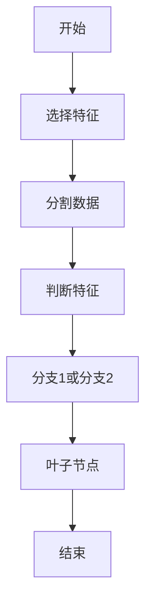
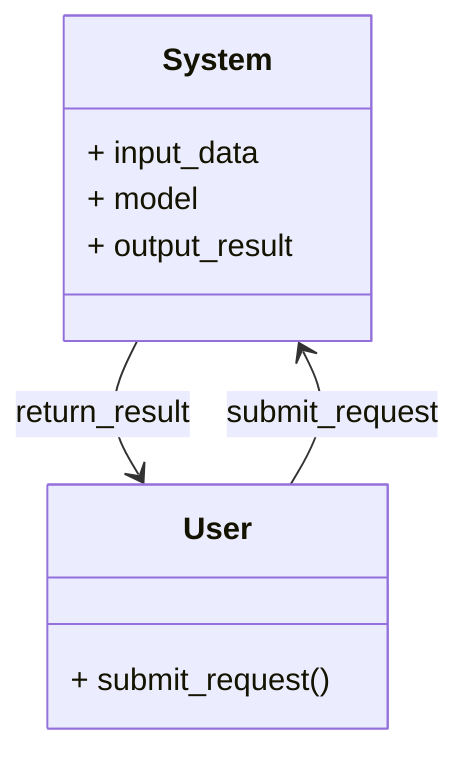

                 


# AI辅助的企业并购整合效果评估

## 关键词：企业并购、AI技术、整合效果评估、机器学习、数据分析

## 摘要：  
随着企业并购活动的日益频繁，如何有效评估并购整合的效果成为企业决策中的关键问题。本文将系统地探讨AI技术在企业并购整合效果评估中的应用，从核心概念、算法原理到系统架构，再到项目实战，全面分析如何利用AI技术优化企业并购整合的评估过程。通过本文的阐述，读者将能够深入了解AI在企业并购中的潜力，并掌握实际应用的方法。

---

# 第一部分: AI辅助的企业并购整合效果评估背景介绍

## 第1章: 企业并购整合概述

### 1.1 企业并购的基本概念

#### 1.1.1 企业并购的定义与类型  
企业并购是指一家企业通过购买其他企业的股权或资产，以实现资源整合和战略目标的过程。常见的并购类型包括：  
- **横向并购**：同一行业内的企业并购，旨在扩大市场份额。  
- **纵向并购**：产业链上下游企业的并购，以增强垂直整合能力。  
- **混合并购**：与企业主业无直接关联的并购，通常用于多元化发展。  

#### 1.1.2 并购整合的必要性与挑战  
并购整合的目的是为了实现资源优化配置、提高效率和竞争力。然而，整合过程中常常面临以下挑战：  
- 文化冲突与管理协调。  
- 人力资源整合与团队融合。  
- 业务流程的无缝对接。  

#### 1.1.3 并购整合效果评估的重要性  
评估并购整合的效果是衡量并购成功与否的关键标准。有效的整合能够提升企业的整体价值，反之则可能导致资源浪费和财务损失。因此，科学的评估方法是并购决策的重要依据。

### 1.2 AI技术在企业并购中的应用  

#### 1.2.1 AI技术的基本概念  
人工智能（AI）是指模拟人类智能的计算机系统，涵盖机器学习、自然语言处理、计算机视觉等领域。AI技术能够通过数据分析、模式识别和自动化决策，为企业提供智能化支持。

#### 1.2.2 并购整合中的AI优势  
AI技术在企业并购中的优势主要体现在以下方面：  
- **数据驱动的决策支持**：通过分析历史数据和市场趋势，AI能够提供精准的并购建议。  
- **风险预测与评估**：利用机器学习模型预测整合过程中的潜在风险。  
- **效率提升**：自动化处理复杂的整合流程，节省时间和成本。  

---

## 第2章: 并购整合效果评估的核心要素  

### 2.1 并购整合的评估指标  

#### 2.1.1 财务指标  
财务指标是评估并购整合效果的重要依据，包括：  
- **净利润率**：整合后的净利润与收入的比例。  
- **投资回报率（ROI）**：并购带来的投资收益。  
- **资产负债率**：评估整合后的财务健康状况。  

#### 2.1.2 经营指标  
经营指标关注企业的运营效率，包括：  
- **市场份额**：整合后在市场中的占有率。  
- **客户满意度**：客户对整合后企业服务的满意度。  
- **运营成本**：整合后的成本控制效果。  

#### 2.1.3 战略指标  
战略指标关注并购的长期目标，包括：  
- **战略协同效应**：整合是否实现了战略目标。  
- **核心竞争力提升**：整合是否增强了企业的核心能力。  
- **未来增长潜力**：整合是否为企业的未来发展奠定了基础。  

### 2.2 AI辅助评估的关键因素  

#### 2.2.1 数据质量与完整性  
AI模型的准确性依赖于高质量的数据。整合数据来源、消除数据偏差是确保评估结果准确性的关键。  

#### 2.2.2 模型选择与优化  
选择合适的机器学习模型，并对其进行优化，能够提高评估的准确性。常用模型包括决策树、随机森林和神经网络等。  

#### 2.2.3 专家知识的结合  
AI模型需要结合行业专家的知识，才能更好地适应具体场景。例如，专家可以提供领域知识，帮助模型理解特定的业务逻辑。

---

# 第二部分: AI辅助企业并购整合效果评估的核心概念与联系

## 第3章: AI技术与企业并购整合的核心概念  

### 3.1 数据挖掘与分析  

#### 3.1.1 数据预处理  
数据预处理是AI模型训练的基础，包括数据清洗、特征提取和标准化等步骤。  

#### 3.1.2 数据特征提取  
通过特征工程提取关键特征，例如收入增长率、员工满意度等，能够提高模型的预测能力。  

#### 3.1.3 数据建模  
基于特征数据，选择合适的模型进行训练，例如线性回归或支持向量机（SVM）。  

### 3.2 机器学习模型在并购评估中的应用  

#### 3.2.1 监督学习模型  
监督学习模型通过标记数据进行训练，适用于分类和回归问题。例如，可以使用随机森林模型预测并购后的财务表现。  

#### 3.2.2 非监督学习模型  
非监督学习模型适用于无标记数据的聚类分析，例如将企业分成不同的风险等级。  

#### 3.2.3 强化学习模型  
强化学习模型通过试错机制优化决策，适用于动态环境下的并购策略选择。

---

## 第4章: 核心概念的属性特征对比  

### 4.1 AI技术与传统评估方法的对比  

| 对比维度 | AI技术 | 传统方法 |  
|----------|---------|-----------|  
| 数据需求 | 高 | 低 |  
| 处理效率 | 高 | 低 |  
| 可扩展性 | 高 | 低 |  

### 4.2 ER实体关系图架构  

```mermaid
erDiagram
    customer[CUSTOMER] {
        code : string
        name : string
    }
    employee[EMPLOYEE] {
        id : integer
        name : string
    }
    sale[Sale] {
        id : integer
        date : date
        amount : float
    }
    customer-|{many} sale
    employee-|{many} sale
```

---

# 第三部分: 算法原理讲解  

## 第5章: 机器学习算法在并购评估中的应用  

### 5.1 算法原理概述  

#### 5.1.1 决策树算法  



#### 5.1.2 随机森林算法  

```python
import pandas as pd
from sklearn.ensemble import RandomForestRegressor

# 数据加载与预处理
data = pd.read_csv('merger_data.csv')
X = data.drop('target', axis=1)
y = data['target']

# 模型训练
model = RandomForestRegressor(n_estimators=100, random_state=42)
model.fit(X, y)

# 预测与评估
y_pred = model.predict(X)
print('预测值:', y_pred[:5])
print('真实值:', y[:5])
```

---

## 第6章: 数学模型与公式  

### 6.1 回归分析模型  

$$ y = \beta_0 + \beta_1x_1 + \beta_2x_2 + \ldots + \beta_nx_n + \epsilon $$  

### 6.2 聚类分析模型  

$$ d(x, y) = \sqrt{\sum_{i=1}^{n}(x_i - y_i)^2} $$  

---

# 第四部分: 系统分析与架构设计方案  

## 第7章: 系统架构设计  

### 7.1 问题场景介绍  
本文设计的系统旨在通过AI技术辅助企业并购整合效果评估，解决传统评估方法效率低、准确性差的问题。  

### 7.2 系统功能设计  



### 7.3 系统架构设计  


---

## 第8章: 项目实战  

### 8.1 环境安装  

```bash
pip install numpy pandas scikit-learn
```

### 8.2 核心实现  

```python
import numpy as np
from sklearn.model_selection import train_test_split
from sklearn.metrics import accuracy_score

# 数据加载
data = np.loadtxt('merger_data.csv', delimiter=',')
X = data[:, :-1]
y = data[:, -1]

# 数据分割
X_train, X_test, y_train, y_test = train_test_split(X, y, test_size=0.2)

# 模型训练
from sklearn.svm import SVC
model = SVC()
model.fit(X_train, y_train)

# 模型评估
y_pred = model.predict(X_test)
print('准确率:', accuracy_score(y_test, y_pred))
```

---

## 第9章: 总结与展望  

### 9.1 最佳实践 Tips  
- 数据质量是AI评估的基础，确保数据的完整性和准确性。  
- 结合行业专家知识，优化AI模型的表现。  

### 9.2 项目小结  
本文通过系统化的分析和实践，展示了AI技术在企业并购整合效果评估中的巨大潜力。通过合理的模型选择和系统设计，AI能够显著提升评估的效率和准确性。  

### 9.3 注意事项  
- AI模型需要不断优化和更新，以适应市场变化。  
- 数据隐私和安全问题是实施过程中需要重点关注的内容。  

### 9.4 拓展阅读  
- 《机器学习实战》  
- 《企业并购与整合管理》  

---

# 作者：AI天才研究院 & 禅与计算机程序设计艺术

---

以上是《AI辅助的企业并购整合效果评估》的技术博客文章大纲，涵盖了从背景介绍到系统架构设计的全过程，结合理论与实践，帮助读者全面理解AI在企业并购整合中的应用。

